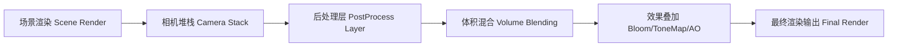
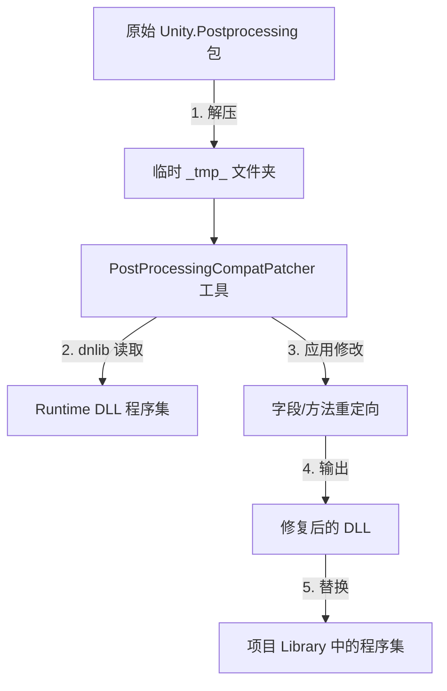

本页面详细说明了项目中 `后处理` 系统的架构、自定义补丁机制以及版本管理流程。项目采用了 Unity 的 Post-Processing Stack，并通过一套基于 `dnlib`（Mono Cecil）的自定义补丁工具来修改标准运行时程序集，以实现更深度的功能集成或内部访问。

## 系统架构概览

后处理系统作为渲染管线的最终阶段，负责在场景渲染完成后应用全屏效果。本项目通过本地化的补丁系统对标准后处理流程进行了扩展，以满足特定的性能或功能需求。

下图展示了后处理渲染管线在项目中的位置：

项目通过 `Tools/PostProcessingMigration` 目录下的工具集来管理和定制这一过程。

| 组件 | 描述 | 位置 |
| :--- | :--- | :--- |
| Patch-UnityPostProcessingDll.ps1 | 自动化补丁脚本 | `Tools/PostProcessingMigration/` |
| PostProcessingCompatPatcher | 基于 dnlib 的补丁器核心 | `Tools/PostProcessingMigration/PostProcessingCompatPatcher/` |
| pp_tags/ | 不同版本的 Post-Processing 压缩包缓存 | `Tools/PostProcessingMigration/pp_tags/` |

Sources: [Patch-UnityPostProcessingDll.ps1](Tools/PostProcessingMigration/Patch-UnityPostProcessingDll.ps1)

## PostProcessingCompatPatcher 机制

项目包含一个专门的补丁工具 `PostProcessingCompatPatcher`，这是一个控制台应用程序，用于修改 `Unity.Postprocessing.Runtime.dll`。这种做法通常用于访问未公开的 API、修复上游包中的特定 Bug，或者确保与项目自定义的渲染管线（可能与 BlackJack.AnimGraph 相关）的兼容性。

补丁流程的逻辑结构如下：

该补丁器是一个标准的 C# 解决方案，具备独立的编译配置和调试设置，允许开发者迭代式地测试对运行时 DLL 的修改。

| 文件 | 作用 |
| :--- | :--- |
| Program.cs | 补丁器入口点，使用 `dnlib` 执行 IL 注入或重定向。 |
| Assembly-CSharp.csproj | 编译项目配置。 |
| Properties/launchSettings.json | 调试启动配置。 |

Sources: [Program.cs](Tools/PostProcessingMigration/PostProcessingCompatPatcher/Program.cs)

## 版本管理与迁移流程

为了控制补丁的适用性和稳定性，项目在本地维护了多个版本的 Post-Processing 包。开发者通过手动或脚本化的方式下载、解压并修补特定版本。

下表列出了项目中存储的 Post-Processing 版本存档：

| 版本 | 文件名 | 格式 | 备注 |
| :--- | :--- | :--- | :--- |
| 2.0.20-preview | com.unity.postprocessing-2.0.20-preview.zip | Zip | 早期预览版 |
| 2.1.7 | com.unity.postprocessing-2.1.7.tgz | Tgz | 稳定版 |
| 2.2.2 | com.unity.postprocessing-2.2.2.tgz | Tgz | 2.2.x 系列补丁版 |
| 2.3.0 | com.unity.postprocessing-2.3.0.tgz | Tgz | 最新功能版 |

*注：文件存档位于 `Tools/PostProcessingMigration/pp_tags/` 目录下。*

迁移工作流通常遵循以下步骤，以确保补丁正确应用到新版本上：

1.  **获取包**: 从 `pp_tags/` 提取目标版本的压缩包。
2.  **解压**: 解压 `Unity.Postprocessing.Runtime.dll` 到临时目录（如 `_tmp_Unity.Postprocessing.Runtime.dll`）。
3.  **执行补丁**: 运行 `PostProcessingCompatPatcher` 或 `Patch-UnityPostProcessingDll.ps1` 脚本。
4.  **集成**: 将生成的 DLL 部署到项目的 Library 或 Plugins 目录中，替换原有的程序集。

通过这种本地化控制，项目可以在 Unity 官方包更新导致内部逻辑变动时，快速调整补丁策略，保证渲染效果的一致性。