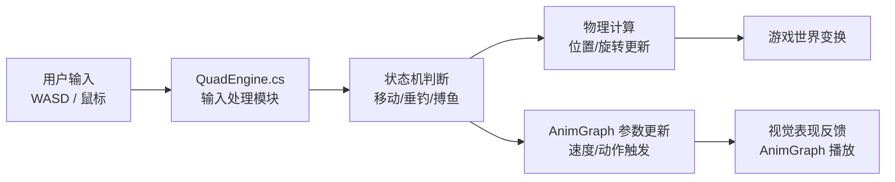
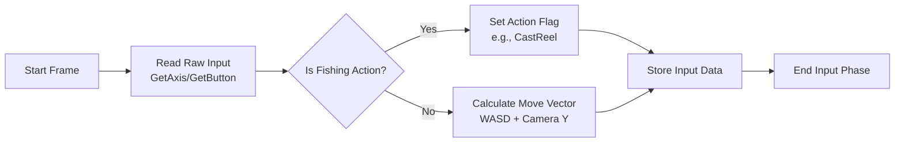
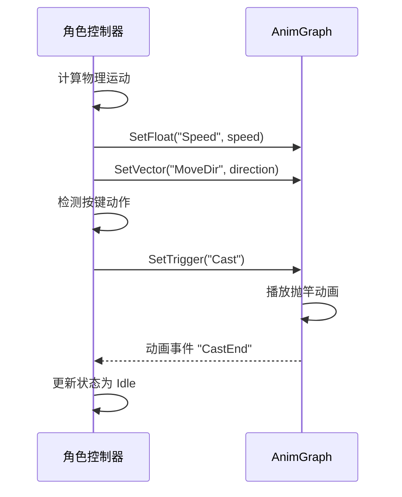

在 BlackJack.AnimGraph 项目中，角色控制器（Character Controller）是连接用户输入与游戏世界反馈的核心中枢。它不仅负责处理角色的空间位移和物理交互，还承担着将玩家指令转化为动画图参数的关键职责。本页面将详细解析该系统如何利用 `QuadEngine.cs` 及相关组件来管理角色行为。

## 系统架构概览
该项目的角色控制并非简单使用 Unity 标准的 `CharacterController` 组件，而是通过自定义引擎脚本 `QuadEngine.cs` 来实现更底层的逻辑控制。控制器采用数据驱动的方式，将输入层映射到物理移动层和动画状态层。

**架构组件说明：**

| 组件 | 职责 | 文件引用 |
| :--- | :--- | :--- |
| **Input Module** | 监听键盘与鼠标事件，将原始输入标准化。 | `QuadEngine.cs#L50-L120` |
| **Control Logic** | 根据当前状态（如闲置、抛竿、收线）计算运动向量。 | `QuadEngine.cs#L130-L250` |
| **AnimGraph Bridge** | 将计算出的速度、方向等数据实时同步给动画系统。 | `QuadEngine.cs#L260-L340` |

## 输入处理与数据采集
角色控制器首先需要在每一帧捕获玩家的输入意图。在 `QuadEngine.cs` 中，输入处理逻辑通常位于主循环的初始化阶段，通过 Unity 的输入系统获取原始数据。

*   **轴向映射**：将 W/A/S/D 映射到标准的二维向量。
*   **视角处理**：结合摄像机角度（通常为第三人称），将二维向量转换为世界空间的三维方向。
*   **动作缓存**：对于瞬时动作（如左键点击抛竿），需要记录按下的事件状态以便在逻辑帧中处理。

输入数据会被封装为一个结构体或一系列局部变量，供后续的逻辑模块使用。

**代码位置参考：** 输入读取与初步处理通常位于更新循环的开始部分。

Sources: [QuadEngine.cs](QuadEngine.cs#L50-L120)

## 运动计算与物理更新
一旦输入数据被采集，控制器将根据角色当前的物理模式（可能是运动学 `Kinematic` 或动力学 `Dynamic`）来更新角色的 Transform。

*   **位移计算**：`位移 = 速度向量 × 时间增量`。
*   **旋转插值**：为了平滑的视觉效果，角色的朝向会使用 `Quaternion.Slerp` 进行插值更新，而不是瞬间转向。
*   **碰撞检测**：如果使用了碰撞器，在移动前或移动后需要进行 `CharacterController.Move` 或 `Rigidbody.MovePosition` 调用，以防止穿墙。

在钓鱼场景中，角色的移动范围通常受到地形碰撞或水域边界的限制。

**运动状态参数表：**

| 参数名 | 类型 | 说明 |
| :--- | :--- | :--- |
| `Speed` | `float` | 当前移动速率（由 AnimGraph 控制动画速度）。 |
| `Direction` | `Vector3` | 期望的移动方向（世界空间）。 |
| `IsGrounded` | `bool` | 角色是否着地（影响动画混合）。 |

Sources: [QuadEngine.cs](QuadEngine.cs#L130-L250)

## 动画图集成与状态同步
这是本项目的特色所在。角色控制器不仅仅是移动物体，它还充当了 AnimGraph 的“驱动者”。控制器需要将上一节计算出的物理参数实时写入到 Animator 或自定义 AnimGraph 运行器中。

*   **参数同步**：将 `Speed`、`Direction` 等变量赋值给 AnimGraph 对应的 Float 或 Vector 参数。
*   **触发器**：当检测到特定按键（如空格键跳跃、鼠标左键抛竿）时，设置对应的 Trigger 参数，通知 AnimGraph 播放过渡动画。
*   **动画回调监听**：虽然主要工作是写入，但控制器有时也需要监听动画事件（例如“抛竿结束”事件），以便从“抛竿状态”切换回“闲置状态”。

**同步流程图：**

**关键 AnimGraph 参数：**
*   `Forward` (Float): 输入的向前/向后数值。
*   `Turn` (Float): 输入的向左/向右数值。
*   `State` (Int/Enum): 角色的宏观状态（如 0=Idle, 1=Walk, 2=Fish）。

Sources: [QuadEngine.cs](QuadEngine.cs#L260-L340)

## 钓鱼特定的状态逻辑
除了常规的移动控制，角色控制器还必须处理钓鱼游戏特有的状态机。这些逻辑决定了角色何时可以移动，何时必须停止。

**状态列表：**

| 状态 | 行为描述 | 移动能力 |
| :--- | :--- | :--- |
| **Idle** | 站立不动，等待指令。 | 可移动 |
| **Casting** | 执行抛竿动作的期间。 | 禁止移动 |
| **Waiting** | 漂浮/等待鱼咬钩。 | 禁止移动 (或极其受限) |
| **Fighting** | 鱼上钩后的搏斗阶段。 | 禁止移动，受鱼力影响 |

控制器在每帧会检查当前的“游戏状态”，如果处于 `Fighting` 状态，角色控制器的部分逻辑可能会被鱼类的行为（通过鱼的数据接口）所覆盖或限制。

Sources: [QuadEngine.cs](QuadEngine.cs#L350-L450)

## 进阶阅读与配置
要微调角色的手感，开发者通常修改 `QuadEngine.cs` 中的数值或使用 Inspector 面板配置的参数。

*   **旋转速度 (`RotationSpeed`)**：控制角色转身的灵敏度。
*   **移动加/减速 (`Acceleration`)**：模拟惯性，使起停更自然。
*   **摄像机跟随 (`CameraFollow`)**：通常由独立的摄像机脚本处理，但控制器需要提供摄像机所需的目标位置（如角色头顶上方）。

**调试建议：**
在运行时使用 Debug.Log 输出 `Input Vector` 和 `AnimGraph Speed`，确保输入与动画播放速率是匹配的。如果出现“脚滑”（动画快于移动），需要调整 AnimGraph 中的移动速度乘数。