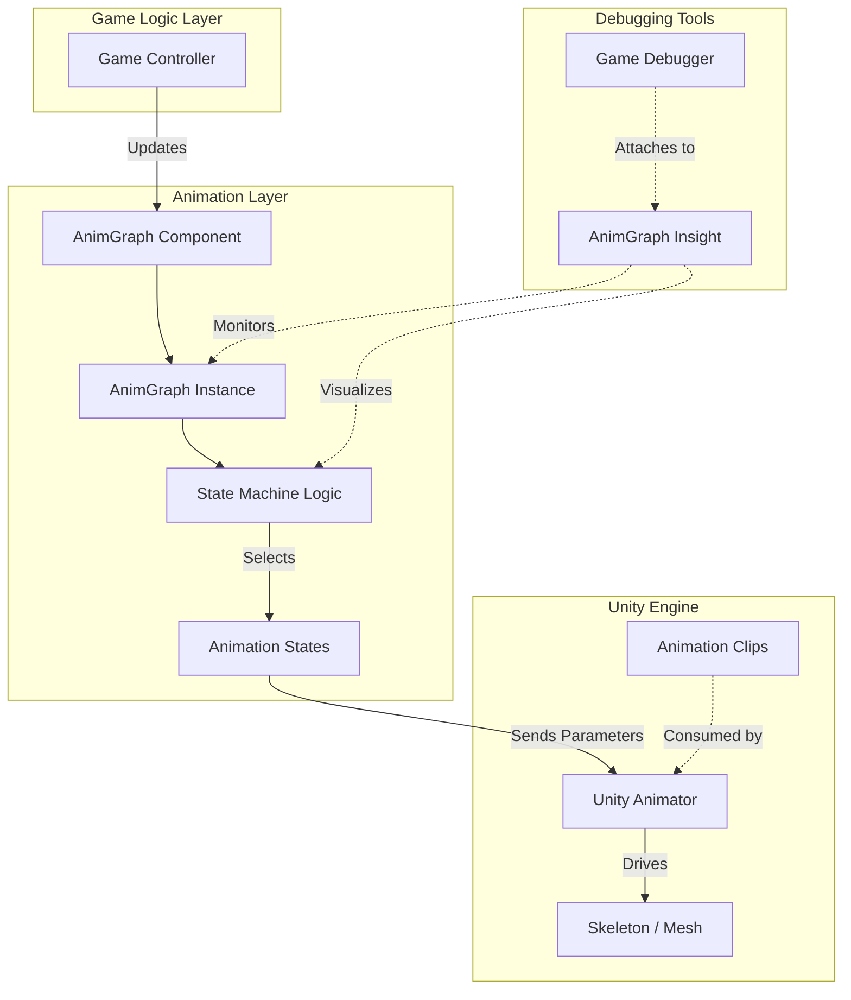
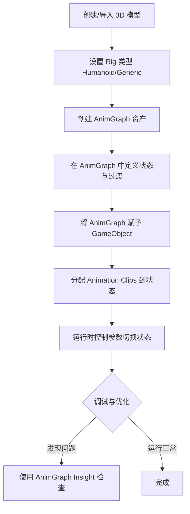

动画系统在游戏中负责驱动角色骨骼模型的运动，赋予虚拟世界生命力和动态表现。本项目采用了自定义的 **BlackJack.AnimGraph** 框架，该框架作为 Unity 标准 Mecanim 系统的补充或替代，提供了基于状态机的节点式动画逻辑管理能力。

本页将介绍 AnimGraph 的核心架构、组件、工作流程以及调试工具。

Sources: [Packages/com.blackjack-inc.animgraph/package.json](Packages/com.blackjack-inc.animgraph/package.json#L1-L20)

## 1. 架构概览

AnimGraph 是一个基于包的自定义系统，它将动画逻辑与 Unity 的底层渲染和物理系统解耦。其核心思想是通过可视化的图表来控制动画状态和过渡。

### 系统架构图

下图展示了 AnimGraph 在游戏引擎中的层级关系及数据流向：

### 项目目录结构

动画相关的资源主要分布在 `Packages` 目录下的自定义包中，以及 `Assets` 目录下的模型和配置文件。

| 目录/文件 | 描述 |
| :--- | :--- |
| `Packages/com.blackjack-inc.animgraph/` | 核心动画系统包（运行时与编辑器） |
| `Packages/com.blackjack-inc.animgraph.Insight/` | 运行时动画调试工具包 |
| `Packages/com.blackjack-inc.animgraph.Insight.GameDebugger/` | 调试器的具体实现 |
| `Assets/Rigs/` | 绑定预制件，包含骨骼和蒙皮网格 |
| `Assets/Rods/` | 玩具相关模型资源 |

Sources: [Packages/com.blackjack-inc.animgraph](Packages/com.blackjack-inc.animgraph#L1-L10)

## 2. 核心组件

AnimGraph 系统主要由以下几个部分组成，它们共同协作来实现复杂的动画行为。

### 2.1 AnimGraph (动画图)
这是系统的核心资产文件，定义了角色的动画逻辑结构。类似于 Animator Controller，它包含状态、过渡和参数，但可能提供了更灵活的节点化编辑功能（具体取决于编辑器实现）。

*   **作用**：存储动画状态机的定义。
*   **位置**：通常作为资产创建在项目面板中。

### 2.2 AnimGraph Insight (调试器)
这是一个强大的运行时调试工具，允许开发者在游戏运行时可视化动画图的执行情况。

*   **功能**：
    *   实时查看当前活动状态。
    *   监控参数值的变化。
    *   可视化状态切换的触发条件。
*   **集成**：通过 `BlackJack.AnimGraph.Insight.GameDebugger` 命名空间下的脚本集成到场景中。

Sources: [Packages/com.blackjack-inc.animgraph.Insight/GameDebugger](Packages/com.blackjack-inc.animgraph.Insight.GameDebugger#L1-L20)

### 2.3 Rigs (绑定与骨骼)
虽然 AnimGraph 是逻辑控制器，但它最终驱动的是 Unity 的 `Animator` 组件。骨骼模型（Rigs）存放了网格和骨骼层级。

*   **示例文件**：`FishingSet.prefab`，`RodRigFishingSet.prefab`。
*   **说明**：这些预制件包含了用于钓鱼游戏的特定骨骼绑定和蒙皮网格。

Sources: [Assets/Rigs/FishingSet.prefab](Assets/Rigs/FishingSet.prefab#L1-L10)

## 3. 工作流程与使用

在实际开发中，使用 AnimGraph 驱动角色通常遵循以下步骤。

### 创建与配置流程

### 组件对比

| 特性 | Unity Animator Controller | BlackJack.AnimGraph |
| :--- | :--- | :--- |
| **状态管理** | 基于状态机 | 基于自定义图系统 (可能更灵活) |
| **调试工具** | Animator 窗口 | AnimGraph Insight (专用调试器) |
| **集成方式** | 原生组件 | 基于 `Packages` 的自定义组件 |
| **依赖关系** | 替代/补充 | 可能依赖 Unity Animator 或覆盖其行为 |

Sources: [Packages/com.blackjack-inc.animgraph.Insight.package.json](Packages/com.blackjack-inc.animgraph.Insight.package.json#L1-L20)

## 4. 调试与诊断

为了确保动画逻辑的正确性，项目集成了 `AnimGraph Insight` 和 `GameDebugger`。

### 使用 AnimGraph Insight
调试器通常在运行时作为覆盖层或独立窗口出现。

1.  **启用调试**：确保 `GameDebugger` 组件已添加到场景或相关对象上。
2.  **可视化**：在 Game 视图或专门的调试窗口中，观察动画图的节点高亮显示，绿色通常表示当前激活的状态。
3.  **参数检查**：实时查看浮点数、布尔值或触发器参数，验证逻辑分支是否按预期触发。

### 日志与追踪
项目包含 `FishTrace` 系统，这可能用于记录与角色状态（包括动画状态转换）相关的日志数据。

*   **日志位置**：`Logs/FishTrace/`
*   **用途**：回放特定的交互或动画序列，帮助排查复杂的状态流转问题。

Sources: [Logs/FishTrace/fish_trace_20260312_223612.jsonl](Logs/FishTrace/fish_trace_20260312_223612.jsonl#L1-L50)

## 5. 扩展与性能

### 性能优化
AnimGraph 的运行时可能利用了 **Burst Compiler** 来进行高性能的计算。

*   **Burst 缓存**：`Library/BurstCache/JIT/` 目录表明动画逻辑或数学运算可能被编译为高度优化的本地代码。
*   **建议**：避免在动画更新循环中分配大量内存（GC Alloc），以维持 Burst 编译的性能优势。

### 扩展开发
由于 AnimGraph 是一个独立的包，开发者可以通过以下方式进行扩展：
*   **自定义节点**：在 `Runtime` 命名空间下添加新的状态类型或条件判断。
*   **编辑器扩展**：在 `Editor` 命名空间下添加自定义的检视面板或绘制逻辑。

Sources: [Library/BurstCache/JIT](Library/BurstCache/JIT#L1-L10)

---
### 导航指南
*   上一章：[角色控制器](4-jiao-se-kong-zhi-qi)
*   下一章：[角色状态机](6-jiao-se-zhuang-tai-ji)