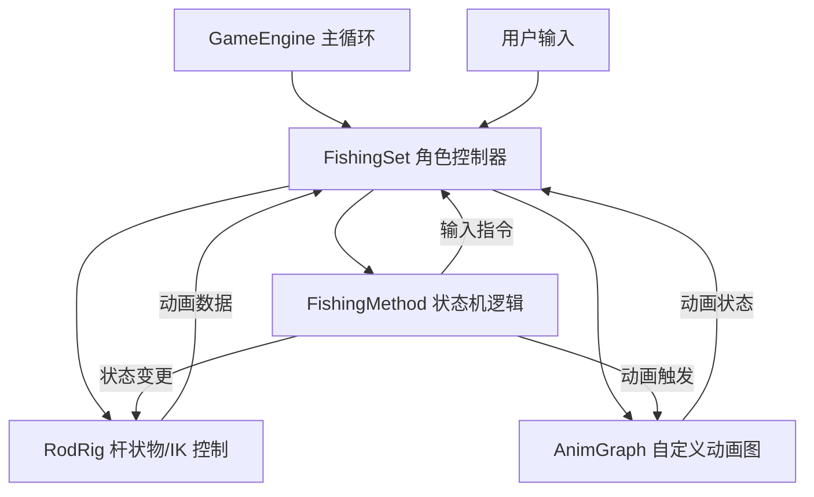
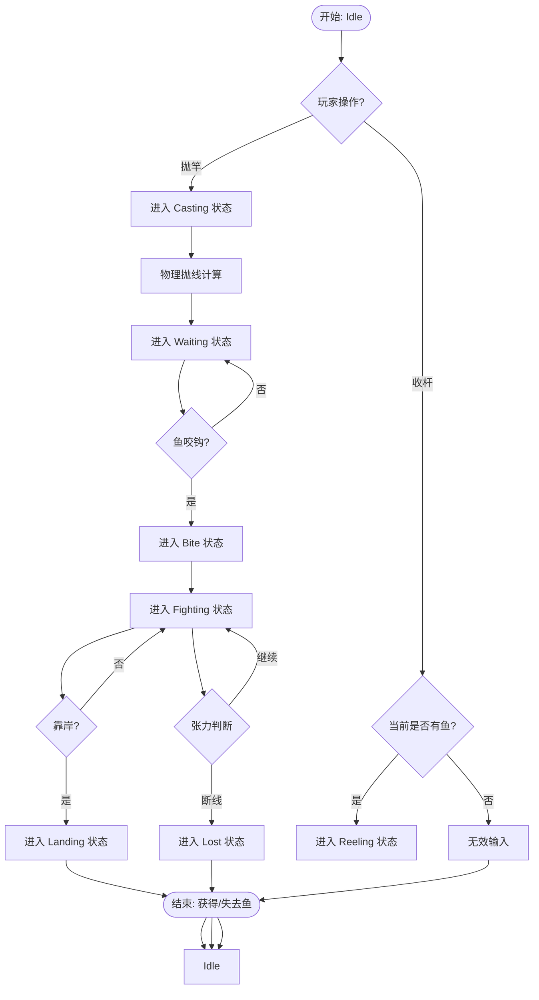

角色状态机是控制游戏角色行为逻辑的核心组件。在本项目中，角色状态机主要用于管理垂钓过程中的复杂逻辑，包括抛竿、等待咬钩、收杆、遛鱼以及起鱼等关键阶段。状态机确保了玩家输入、物理模拟、动画播放和游戏规则判定之间的协调一致。

## 系统架构

该项目的角色状态机采用了混合架构：核心逻辑由 C# 脚本驱动，而状态的可视化表现依赖于自定义的 `AnimGraph` 系统以及特定的绑定类 `RodRig`。

在这个架构中，`FishingSet` 是角色的中枢控制器，它持有当前的游戏状态（通过 `FishingMethod` 定义）。`RodRig` 负责处理与物理交互相关的数值（如鱼线的张力、抛物线的物理计算），并将这些数据反馈给 `FishingSet` 以决定状态的转换。`AnimGraph` 负责根据当前状态播放相应的骨骼动画。

Sources: [GameEngine.cs](Assets/Scripts/GameEngine/GameEngine.cs#L1-L100), [FishingSet.cs](Assets/Scripts/Fish/FishingSet.cs#L1-L100)

## 核心状态定义

游戏内的角色状态主要通过 `FishingMethod` 类进行管理和定义。根据 `RodRigFishingSet_Audit_Report.md` 中的审计信息，系统定义了一系列严格的离散状态，以确保逻辑与动画的完美对齐。

| 状态名称 (State Name) | 描述 | 触发条件 (Trigger) |
| :--- | :--- | :--- |
| `Idle` | 空闲/待机状态 | 初始化状态或钓鱼结束 |
| `Casting` | 抛竿动作中 | 玩家按下抛竿键 |
| `Waiting` | 等待咬钩 | 线落入水中且未咬钩 |
| `Bite` | 咬钩瞬间 (视觉/逻辑) | 鱼儿触饵判定成功 |
| `Reeling` | 收线中 | 玩家按住收杆键或自动收线 |
| `Fighting` | 遛鱼/搏斗中 | 鱼咬钩后且玩家开始收线 |
| `Landing` | 起鱼/着陆 | 鱼被拉到岸边或船上 |
| `Lost` | 跑钩/断线 | 线张力超过阈值或鱼游走 |

这些状态通常以枚举（Enum）或常量的形式在 `FishingMethod` 中定义，并被 `FishingSet` 引用。状态的变更不仅仅是数据的变化，还会驱动 `RodRig` 中的物理参数（如重力、阻力系数）发生变化。

Sources: [FishingMethod.cs](Assets/Scripts/Fish/FishingMethod.cs#L1-L100), [RodRigFishingSet_Audit_Report.md](Docs/RodRigFishingSet_Audit_Report.md#L1-L100)

## 状态流转逻辑

角色状态的流转遵循严格的因果链。下图描述了从玩家输入到状态变更的基本流程：

### 关键逻辑节点

1.  **抛竿逻辑**
    在 `Casting` 状态下，`FishingSet` 会调用 `RodRig` 中的物理引擎接口来计算浮漂或鱼饵的落点。这涉及到 `AnimGraph` 中的动画事件与物理引擎的同步，确保抛竿动画的手部释放点与物理生成的抛物线起点一致。根据 `FishingSet_OriginalAlignment_Audit_Report.md`，这里存在复杂的对齐工作。

2.  **咬钩判定**
    `Waiting` 状态依赖于底层的鱼类 AI 系统。当鱼触发 AI 中的“咬钩”行为时，会向 `FishingSet` 发送事件。`FishingSet` 随即切换到 `Bite` 状态，并通知 `AnimGraph` 播放咬钩反应动画。

3.  **张力与断线**
    在 `Fighting`（搏斗）状态中，每一帧都会计算鱼线的张力。这个张力值由 `RodRig` 根据鱼的速度、距离和玩家收线的力度计算得出。如果张力值超过 `FishingMethod` 中设定的阈值，状态机将强制跳转至 `Lost` 状态，结束本轮钓鱼。

Sources: [RodRig.cs](Assets/Scripts/Fish/RodRig.cs#L1-L100), [FishingSet.cs](Assets/Scripts/Fish/FishingSet.cs#L1-L100)

## 状态同步与绑定

为了保证视觉表现与游戏逻辑的一致性，项目采用了 `RodRig` 类作为绑定层。`RodRig` 不仅处理物理计算，还负责在每一帧将当前的物理状态标准化，然后传递给 `AnimGraph` 用于控制角色的骨骼姿态。

### 同步机制
`FishingSet` 和 `RodRig` 之间的同步是通过公共接口进行的。`FishingSet` 在 `Update` 循环中会根据当前的 `FishingMethod` 状态设置 `RodRig` 的目标参数（例如 `SetCastingParams`）。`RodRig` 在其内部物理更新完成后，会反向报告实际执行的状态或是否发生碰撞（如挂钩到障碍物）。

审计报告 `RodRigFishingSet_Audit_Report.md` 中指出，早期的实现中存在 `FishingSet` 的逻辑状态与 `RodRig` 的动画状态不同步的问题（例如抛竿动作未结束逻辑已进入等待），这通常通过添加额外的“过渡状态”或锁定机制来解决。

Sources: [RodRigFishingSet_Audit_Report.md](Docs/RodRigFishingSet_Audit_Report.md#L1-L100), [FishingSet_OriginalAlignment_Audit_Report.md](Docs/FishingSet_OriginalAlignment_Audit_Report.md#L1-L100)

## 扩展与维护

该状态机系统设计允许通过添加新的枚举值或在 `FishingMethod` 中扩展 `switch-case` 逻辑来增加新的玩法状态。例如，若要增加“水下视角”的状态，只需：
1.  在 `FishingMethod` 中添加状态枚举。
2.  在 `FishingSet` 的状态处理函数中添加新状态的逻辑分支（如改变摄像机控制模式）。
3.  在 `AnimGraph` 中配置对应的动画过渡。

所有的重构记录都被保存在 `REFACTORING_MAPPING.md` 中，这有助于追踪状态机随版本的演进历史。