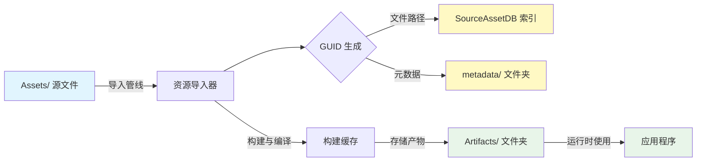

资产数据库是 Unity 引擎的后端核心系统，负责管理项目中所有资源的索引、GUID（全局唯一标识符）映射以及依赖关系。在本项目（BlackJack.AnimGraph / FishingPlanet）中，资产数据库不仅驱动着编辑器的资源加载，还通过自定义脚本和工具链支持复杂的“钓具套件”审计与迁移工作。

## 架构概览

资产数据库的工作流是一个从“源资源”到“构建产物”的转换过程。下图展示了资源从 `Assets/` 文件夹被导入、索引，最终存储在 `Library/` 中的完整生命周期。

### 核心组件说明

| 组件 | 路径 | 功能描述 | 维护建议 |
| :--- | :--- | :--- | :--- |
| **源资源数据库** | `Library/SourceAssetDB` | 存储资源文件名与 GUID 的双向映射，是查找资源的第一站。 | 自动生成，勿手动修改。 |
| **元数据** | `Library/metadata/` | 存储所有资源的 `.meta` 文件（以 GUID 命名），包含资源的序列化配置。 | 与版本控制同步 `.meta` 文件。 |
| **构建产物** | `Library/Artifacts/` | 存储资源导入后的二进制数据（如压缩纹理、着色器变体），由 Bee 构建系统管理。 | 可定期清理以释放空间。 |
| **资源导入状态** | `Library/AssetImportState` | 记录每个资源的最后导入时间，用于增量导入判断。 | 自动管理。 |

Sources: [ExportedProject.sln](../ExportedProject.sln), [ProjectSettings.asset](../ProjectSettings/ProjectSettings.asset)

## 数据存储机制

### GUID 与 Metadata
Unity 不使用文件路径来引用资源，而是使用 128 位的 GUID。这种机制允许在不破坏引用的情况下移动或重命名文件。本项目在 `Library/metadata/` 中存储了这些元数据文件，通常使用文件夹结构进行分片存储以提高性能。

*   **数据流**：当检测到 `Assets/` 中的文件时，Unity 会读取其关联的 `.meta` 文件（如果没有则创建），解析 GUID，并写入 `Library/SourceAssetDB`。
*   **目录结构**：根据 `Library/metadata/` 列表来看，项目包含了大量资源（`00` 到 `ff` 哈希分片），这意味着数据库具有较高的并发读写需求。

### 构建缓存
`Library/Artifacts/` 目录包含了资源处理后的最终形式。例如，导入一张 4K 贴图后，压缩后的纹理数据会存储在此。

*   **目录结构**：项目使用了深度分片（如 `Library/Artifacts/00/` 到 `ff/`），这表明使用了 Bee 构建系统的高速缓存机制。
*   **依赖处理**：修改一个源文件（如 `.fbx` 或着色器）只会使关联的特定产物失效，而不会触发全量重建。

Sources: [Library/SourceAssetDB](../Library/SourceAssetDB), [Library/metadata](../Library/metadata)

## 自定义审计与修复工具

鉴于项目包含大量复杂的钓鱼装备和动画资产，团队开发了一套 Python 脚本工具来辅助资产数据库的管理、审计和修复。这些工具位于 `scripts/` 和 `Tools/` 目录下。

### 核心脚本分析

| 脚本文件 | 推测功能 | 技术栈 |
| :--- | :--- | :--- |
| `fisher_method_full_audit.py` | 针对钓具方法的完整审计，可能扫描 Prefab 或 ScriptableObject 的配置是否符合数据库规范。 | Python |
| `fix_waypoint.py` | 修复或更新航点的资产引用，处理 GUID 重定向或丢失引用的修复。 | Python |
| `fix_context.py` | 修复资产上下文，可能处理序列化数据损坏或版本兼容性问题。 | Python |

这些脚本通常通过解析 Unity 的 YAML 格式 Meta 文件或源文件来与资产数据库进行交互。

Sources: [scripts/fisher_method_full_audit.py](../scripts/fisher_method_full_audit.py), [scripts/fix_waypoint.py](../scripts/fix_waypoint.py)

### 版本控制与库管理
`Tools/PostProcessingMigration/` 目录下包含针对后处理效果包的迁移脚本（`Patch-UnityPostProcessingDll.ps1`）。这表明项目在 Unity 版本升级或后处理包更新时，需要自定义的资产数据库操作流程，以确保旧资产能够正确映射到新的 API。

Sources: [Tools/PostProcessingMigration/Patch-UnityPostProcessingDll.ps1](../Tools/PostProcessingMigration/Patch-UnityPostProcessingDll.ps1)

## 性能优化与维护

针对本项目规模，资产数据库的优化至关重要。

### 增量导入与缓存
Unity 使用 `Library/AssetImportState` 来判断文件是否被修改。
*   **策略**：只有在 `mtime`（修改时间）变化时才重新导入。
*   **注意**：通过外部工具修改文件可能会导致不同步。建议通过 Unity Editor 进行资源修改。

### 强制刷新与重建
在遇到资产损坏或 GUID 冲突时，可能需要重建资产数据库。
*   **操作**：删除 `Library/` 文件夹（`Library/metadata/` 和 `Library/Artifacts/` 除外，通常直接删除整个 Library 文件夹最彻底），然后重启 Unity。这会强制重新导入所有资源，耗时会较长，但能解决大部分由缓存引起的诡异问题。

### 垃圾回收
`Library/Bee/` 和 `Library/ShaderCache/` 会随着项目迭代积累大量不再使用的旧产物。
*   **建议**：在切换开发分支或进行长时间开发后，可使用 Unity 的 `Assets -> Reimport All` 或直接删除 Library 文件夹来清理冗余数据。

Sources: [Library/AssetImportState](../Library/AssetImportState), [Library/Bee](../Library/Bee)

## 常见问题与故障排查

### 缺失脚本
如果脚本被重命名或删除，但 `Assets/` 中的 `.meta` 文件仍然保留 GUID，引用该脚本的 Prefab 会在 Inspector 中显示“Missing Script”。
*   **排查**：查看 `Console` 中的报错信息，通常伴随 `The referenced script (MonoBehaviour) on this Behaviour is missing!`。
*   **修复**：恢复脚本文件名，或在 Inspector 中重新赋值正确的脚本组件。

### 元文件冲突
多人协作时，如果两名开发者同时创建同名文件，可能会发生 GUID 冲突（Git Merge 冲突）。
*   **修复**：保留一个 GUID 的 `.meta` 文件，删除另一个，并在 Unity 中重新定位另一个资源，这将生成新的 GUID。