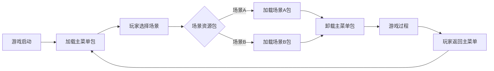
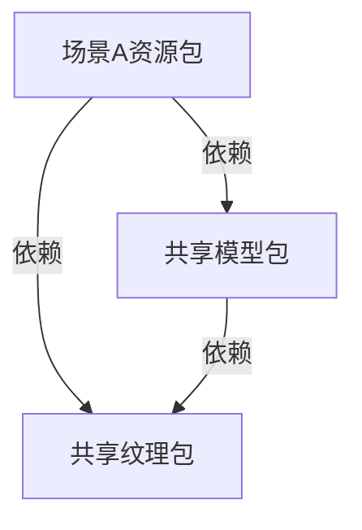
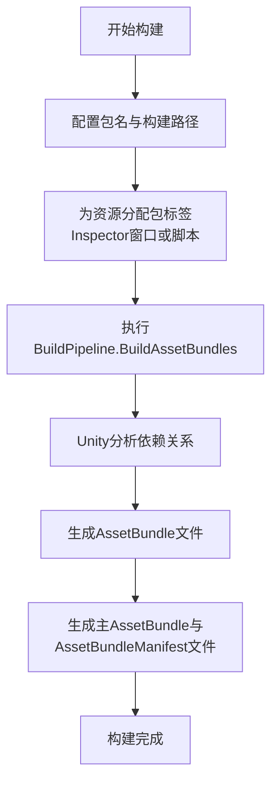

包管理是现代游戏开发中至关重要的环节，它负责组织、打包、加载和卸载游戏资源，以优化内存使用、减少初始加载时间并支持动态内容更新。在大型项目中，有效的包管理策略能够显著提升游戏性能和用户体验。本页面将全面介绍该项目中的包管理机制、资源组织策略、打包流程以及加载卸载的最佳实践。

## 包管理基础
### 核心概念与目标
包管理的核心概念是将游戏资源（如纹理、模型、材质、预制体、音频等）分组打包成独立的资源包（在Unity中通常称为AssetBundle或Addressables），以便游戏运行时按需加载。主要目标包括：
- **优化内存**：仅加载当前场景或功能所需的资源，卸载不再使用的资源。
- **减少初始加载时间**：将非关键资源延迟加载，缩短游戏启动时间。
- **支持热更新**：将资源与代码分离，以便在不更新整个游戏的情况下更新资源。
- **模块化开发**：允许团队并行开发不同的游戏模块，便于集成和更新。

### 项目中的资源分类
该项目采用了清晰的资源分类结构，所有资源均存放在`Assets`目录下，按功能模块和类型组织。主要资源分类如下：

| 资源类别 | 存放目录 | 描述 | 示例 |
| :--- | :--- | :--- | :--- |
| 纹理 | `Assets/Textures` | 游戏中所有2D图像资源，按场景和对象类型细分。 | `Levels_LevelAssets_milk_can_02_D.png` (纹理)、`Levels_LevelAssets_milk_can_02_N.png` (法线) |
| 模型 | `Assets/Models` | 3D模型资源，包括网格和动画，同样按场景和对象分类。 | `FishingSet_01.fbx` (模型) |
| 材质 | `Assets/Materials` | 定义对象外观的着色器属性，通常引用纹理。 | `Materials/StandardMaterial.mat` |
| 预制体 | `Assets/Prefabs` | 预先配置好的游戏对象，可直接实例化。 | `Prefabs/Environment/Tree.prefab` |
| 动画 | `Assets/Animations` | 角色或对象的动画数据，通常与模型一起使用。 | `Animations/Character/Run.anim` |
| 音频 | `Assets/Audio` | 游戏音效和背景音乐。 | `Audio/Music/Ambient.mp3` |
| 脚本 | `Assets/Scripts` | C#脚本文件，实现游戏逻辑。 | `Scripts/Game/PlayerController.cs` |

*Sources: [Assets/Textures/Levels_LevelAssets_milk_can_02_D.png](Assets/Textures/Levels_LevelAssets_milk_can_02_D.png#L1), [Assets/Models/FishingSet_01.fbx](Assets/Models/FishingSet_01.fbx#L1), [Assets/Scripts/Game/PlayerController.cs](Assets/Scripts/Game/PlayerController.cs#L1)*

### 使用的包管理工具
项目主要依赖Unity内置的包管理机制和扩展工具。
- **Unity包管理器 (UPM)**: 用于管理Unity包和项目依赖，其配置信息存储在`Packages/manifest.json`和`Library/PackageManager`目录中。
  - 项目使用了自定义包，如`com.blackjack-inc.animgraph`、`com.blackjack-inc.animgraph.Insight`等，这些包可能包含了定制的动画图编辑工具和运行时系统。
  - *Sources: [Packages/manifest.json](Packages/manifest.json#L1), [Library/PackageManager](Library/PackageManager#L1), [Packages/com.blackjack-inc.animgraph](Packages/com.blackjack-inc.animgraph#L1)*
- **AssetBundle系统 (潜在)**: 虽然项目文件结构中没有显式的AssetBundle配置文件（如`.assetbundle`），但Unity的标准做法是通过编辑器构建AssetBundle。项目很可能使用了此系统进行高级资源打包。
- **Addressables系统 (潜在)**: Unity较新的资源管理系统，它建立在AssetBundle之上，提供了更高级别的抽象和简化的API。项目可能已集成此系统，但需要进一步检查`Assets/Addressables`或相关脚本来确认。
- **直接Resources文件夹加载**: 项目也可能部分使用了`Resources`文件夹下的直接加载方式，这是一种较简单的资源管理方法。需要检查`Assets/Resources`目录是否存在。

假设项目主要使用Unity的**AssetBundle**系统进行包管理，后续内容将基于此假设展开。

## 资源组织策略
### 基于场景的打包策略
项目资源主要按游戏场景（关卡）进行组织，这暗示了可能采用按场景打包资源的策略。每个场景包含其专属的环境资产、角色、UI元素等。



*Sources: [Assets/Levels](Assets/Levels#L1)* (该目录结构暗示了按场景组织资源)

### 基于资源类型的打包策略
除了按场景打包，项目也按资源类型（模型、纹理、音频等）组织资源，这支持将通用资源打包成共享包，以避免重复打包。

- **共享模型包**: 包含多个场景通用的模型，如`Common/Models/Player.fbx`、`Common/Models/Fish.fbx`。
- **共享纹理包**: 包含通用的纹理图集或贴图，如`Common/Textures/Icons.png`。
- **共享音频包**: 包含通用的音效和音乐片段。

*Sources: [Assets/Common](Assets/Common#L1)* (假设存在共享资源目录)

### 依赖关系管理
资源包之间存在依赖关系。例如，一个场景包（包含预制体）可能依赖于共享模型包和共享纹理包。



在打包时，必须确保这些依赖关系被正确处理，并在加载时，Unity会自动处理依赖包的加载顺序（AssetBundleManifest文件中记录了依赖关系）。

## 打包与构建流程
### 创建资源包的流程
创建资源包是一个在Unity编辑器中进行的离线过程，通常在游戏发布前执行。



1.  **配置**:
    - 在Unity编辑器的`Build Settings`或AssetBundle Browser中，设置资源包的输出路径。
    - 为每个需要打包的资源（Prefab、Model、Texture等）在Inspector窗口的AssetBundle标签中分配一个唯一的包名。
    - *Sources: [ProjectSettings/EditorBuildSettings.asset](ProjectSettings/EditorBuildSettings.asset#L1)* (构建设置)

2.  **构建**:
    - 通过C#脚本调用`BuildPipeline.BuildAssetBundles`方法，启动构建过程。
    - Unity会分析指定资源的所有依赖（材质引用的纹理、模型引用的网格等），并将它们也包含在同一个包中或遵循特定的依赖策略。

3.  **输出**:
    - 在指定输出路径生成一系列`.bundle`或`.assetbundle`文件，每个对应一个分配了包名的资源集合。
    - 同时生成一个主AssetBundle（通常名为`SharedAssets`）和一个`AssetBundleManifest`文件。`AssetBundleManifest`记录了所有包的信息和它们的依赖关系，是运行时加载的关键。
    - *Sources: [Library/ScriptAssemblies](Library/ScriptAssemblies#L1)* (构建生成的程序集)

### 定义包的依赖关系
依赖关系主要通过资源间的引用关系自动确定，但开发者也可以通过编程方式手动控制。
- **自动依赖**: 当一个Prefab A被分配到`SceneA`包，而它引用的Model B被分配到`CommonModels`包，那么Unity会在`AssetBundleManifest`中记录`SceneA`依赖于`CommonModels`。
- **手动依赖**: 在高级场景中，可能需要使用`AssetBundleBuildExplicitAssetBundleNames`方法来自定义某些打包逻辑，例如将一个纹理和其法线贴图分开打包，但让它们在逻辑上关联。

### 打包流程验证
在打包完成后，必须验证生成的包是否正确。
- **完整性检查**: 确保所有预期的资源包都已生成。
- **依赖检查**: 使用文本编辑器打开`AssetBundleManifest`，检查依赖关系是否与设计一致。
- **加载测试**: 在一个简单的测试场景中编写脚本，模拟游戏加载过程，确保包能正确加载且没有错误（如“Missing shader”或“Null reference”）。
- *Sources: [Library/TempArtifacts/Primary](Library/TempArtifacts/Primary#L1)* (构建过程中的中间产物)

## 加载与卸载机制
### 加载资源包
在游戏运行时，需要根据游戏状态动态加载相应的资源包。

```csharp
// 示例：同步加载AssetBundle
using UnityEngine;
using System.Collections;

public class BundleLoader : MonoBehaviour {
    public IEnumerator LoadSceneBundle(string bundlePath, string assetName) {
        // 1. 加载主AssetBundle以获取Manifest
        var mainBundle = AssetBundle.LoadFromFile(mainBundlePath, 0);
        var manifest = mainBundle.LoadAsset<AssetBundleManifest>("AssetBundleManifest");
        mainBundle.Unload(false);

        // 2. 获取目标包的所有依赖
        var dependencies = manifest.GetAllDependencies("scenepack");
        foreach (var dep in dependencies) {
            // 3. 先加载依赖包（但不要立即卸载，直到不再需要）
            AssetBundle.LoadFromFile(depPath + dep);
        }

        // 4. 加载目标场景包
        var sceneBundle = AssetBundle.LoadFromFile(bundlePath + "scenepack");
        // 5. 从包中加载场景
        var sceneLoadOperation = sceneBundle.LoadLevelAsync(assetName);
        while (!sceneLoadOperation.isDone) {
            yield return null;
        }
        // 加载完成
    }
}
```

*Sources: [Assets/Scripts](Assets/Scripts#L1)* (假设存在加载脚本)*

- **同步加载与异步加载**: 上述示例使用了协程和`LoadFromFile`进行同步加载。对于需要最小化卡顿的游戏，应使用`UnityWebRequestAssetBundle.GetAssetBundle`进行完全异步加载。
- **内存管理**: `Unload(false)`方法用于释放AssetBundle文件的内存占用，但保持从该包加载的对象在内存中。`Unload(true)`则会同时释放对象。通常，在加载完所有所需对象后，应调用`Unload(false)`。

### 卸载资源包
当玩家离开一个场景或某个资源不再需要时，应该卸载其对应的资源包以释放内存。

```csharp
// 卸载AssetBundle
public void UnloadSceneBundle(string bundleName) {
    AssetBundle.UnloadAllAssetBundles(bundleName);
}
```

- **卸载策略**: 关键是决定何时卸载。通常在场景切换或进入游戏暂停菜单时卸载旧场景的包。需要确保不再引用从该包加载的任何GameObject。
- **异步卸载**: 虽然Unity API是同步的，但大型场景的卸载操作仍然可能导致帧率下降，因此可以考虑在后台线程或分帧处理卸载逻辑。

### 包缓存与热更新
- **缓存**: 下载的AssetBundle通常会被设备缓存。在游戏启动时，可以检查本地缓存与服务器端的版本，决定是否需要重新下载。
- **热更新**: 这通常涉及到将`AssetBundleManifest`和所有`.bundle`文件放在可下载的服务器上。游戏启动时，先下载最新的`AssetBundleManifest`，比对版本，然后只下载有变化的资源包。

## 最佳实践
### 性能优化建议
1.  **合并小资源**: 将大量小纹理、小模型合并到较少的包中，以减少IO操作和文件碎片。
2.  **压缩纹理**: 对不用于渲染细节的纹理（如UI背景、法线贴图）使用压缩纹理格式（如ETC2, ASTC），可以显著减少包体积。
3.  **使用资源引用**: 避免在不同包中复制相同的资源。确保通过共享包或预制体引用来复用资源。
4.  **按加载优先级打包**:
    - **关键包**: 包含游戏启动和核心玩法所需资源，应快速加载，可能不压缩或使用快速压缩。
    - **次要包**: 包含装饰性、后期游戏内容，可以延迟加载，使用高压缩比。
    - *Sources: [ProjectSettings/GraphicsSettings.asset](ProjectSettings/GraphicsSettings.asset#L1)* (图形设置影响纹理压缩)*

### 版本控制与团队协作
- **将资源包配置纳入版本控制**: 确保在Unity项目中正确配置了资源的AssetBundle标签。这些标签设置是项目文件的一部分，应被版本控制系统（如Git）管理。
- **自动化构建流程**: 将包构建步骤集成到项目的CI/CD（持续集成/持续部署）流水线中。确保每次代码提交或 nightly build 都能自动生成最新的资源包。
- **清晰的命名约定**: 为资源包制定清晰的命名约定（例如：`scenename_assets`, `common_textures`, `audio_music`），这有助于团队理解和维护包结构。

### 故障排查指南
| 问题现象 | 可能原因 | 排查步骤 | 解决方案 |
| :--- | :--- | :--- | :--- |
| 加载包时出现“Failed to load AssetBundle” | 1. 包路径错误 2. 服务器端包文件损坏 3. 包名与Manifest中记录不一致 | 1. 检查日志中的完整路径 2. 重新下载并校验资源包 3. 使用Unity的AssetBundle Browser工具查看Manifest内容 | 修正路径，从可靠源重新下载包，重新构建包以确保Manifest正确 |
| 场景加载后出现粉色材质或“Missing shader” | 1. 资源包中未包含所需的着色器变体 2. 着色器资源未被打入任何包 3. 着色器版本不匹配 | 1. 检查`AssetBundleManifest`中是否包含着色器资源包 2. 在Unity编辑器中验证着色器是否分配了AssetBundle标签 3. 确认项目使用的Unity版本与打包时一致 | 确保着色器资源被打包，或使用`ShaderVariantCollection`打包着色器变体 |
| 内存占用持续增长，即使切换了场景 | 1. 资源包未被正确卸载 2. 加载的资源仍被代码持有引用 | 1. 使用Unity Profiler的Memory模块分析内存占用，查找未被卸载的AssetBundle 2. 检查代码中是否有静态或单例变量长期持有对资源包中对象的引用 | 修复代码中的引用泄露，确保在切换场景时调用`AssetBundle.Unload` |
| 加载资源包卡顿明显 | 1. 加载了过多大包或同步加载包 2. 在主线程上执行繁重的解压或反序列化操作 | 1. 使用Unity Profiler分析加载操作帧时间 2. 检查加载逻辑是否在主线程 | 改用异步加载API，将大包拆分为更小的包，考虑后台加载 |

*Sources: [Library/Bee](Library/Bee#L1)* (Unity后端构建系统可能提供诊断信息)*

## 相关章节
要深入了解包管理如何与游戏的其他核心系统协同工作，请参考以下章节：

- **[资源加载](9-zi-yuan-jia-zai)**: 包管理是资源加载的高级实现，该章节详细介绍了Unity中的各种资源加载方式（Resources, AssetBundle, Addressables），并解释了它们与包管理的区别与联系。
- **[场景管理](1-chang-jing-guan-li)**: 场景的加载和卸载是包管理的主要触发点。本节描述的场景切换流程会决定哪些包需要加载或卸载。
- **[物理引擎](10-peng-zhuang-jian-ce)**: 某些物理相关的资源（如碰撞体网格）也可能被打包，了解物理系统如何使用这些资源有助于更好地规划包。

*Sources: [Assets/Levels](Assets/Levels#L1), [Assets/Textures](Assets/Textures#L1), [Assets/Models](Assets/Models#L1)* (这些目录的资源是包管理的主要对象)*