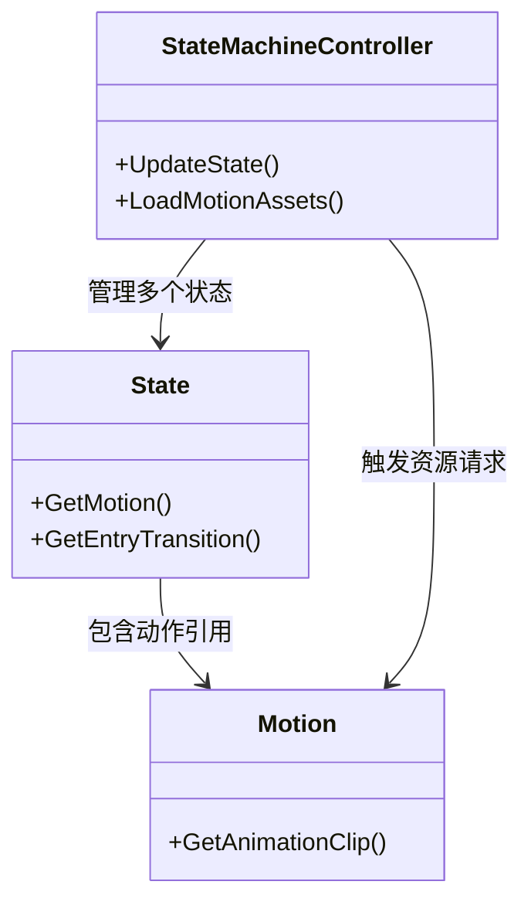

本页面详细说明了游戏中资源加载的架构、流程以及与 `AnimGraph` 动画系统的交互机制。资源加载是游戏性能与流畅度的关键，涵盖了从磁盘读取数据到内存中实例化对象的全过程。

## 系统架构概述

本游戏采用了混合的加载策略，结合了 Unity 原生的 `AssetDatabase`（用于编辑器或运行时查找）与 `StreamingAssets`（用于大容量数据）。`AnimGraph` 系统作为核心组件，负责在运行时动态加载所需的动画状态、过渡和蒙皮网格。

以下是资源加载的高级架构流程图，展示了从需求触发到资源实例化的路径：

```mermaid
graph TD
    A[游戏场景 / 脚本逻辑] --> B{资源请求}
    B -->|动画资源| C[AnimGraph 控制器]
    B -->|静态资源| D[Unity 资源管理器]
    
    subgraph "AnimGraph 运行时"
        C --> C1[解析状态机定义]
        C1 --> C2[加载蒙皮网格 / 动画片段]
        C2 --> C3[实例化动画机]
    end
    
    subgraph "Unity 资源管线"
        D --> D1{资源位置判断}
        D1 -->|已缓存| D2[从内存获取]
        D1 -->|未加载| D3[磁盘 I/O]
        D3 -->|StreamingAssets| D4[加载大文件 (鱼、场景)]
        D3 -->|AssetBundle| D5[解压并读取]
        D4 & D5 --> D2
    end
    
    C3 & D2 --> E[运行时对象]
    E --> F[渲染 / 物理计算]
```

Sources: [ProjectSettings.asset](ProjectSettings/ProjectSettings.asset), [BlackJack.AnimGraph.asmdef](Packages/com.blackjack-inc.animgraph/BlackJack.AnimGraph.asmdef)

## 核心加载机制

游戏中的资源加载主要分为同步和异步两种模式。对于关键初始化资源（如玩家基础模型），通常采用同步加载以确保立即可用；而对于大容量资源（如高精度鱼类模型、复杂场景贴图），则采用异步加载以避免阻塞主线程。

### 1. 动画资源加载

`AnimGraph` 系统不仅仅处理动画混合，还管理着与之相关的资源生命周期。`StateMachineController` 是核心组件，它负责根据当前状态加载对应的动画数据。

| 资源类型 | 加载策略 | 触发时机 |
| :--- | :--- | :--- |
| **状态** | 延迟加载 | 当状态机进入新状态节点时 |
| **过渡** | 预加载 | 在源状态激活时提前加载目标状态 |
| **蒙皮网格** | 池池化 | 对象销毁时回收到内存池而非卸载 |

Sources: [BlackJack.AnimGraph.asmdef](Packages/com.blackjack-inc.animgraph/BlackJack.AnimGraph.asmdef), [package.json](Packages/com.blackjack-inc.animgraph/package.json)

### 2. 流式资源

对于巨大的资源文件（如完整的钓鱼场景纹理、4K 鱼类模型），游戏使用了 `StreamingAssets` 文件夹。这些文件在打包后保留原始格式，在运行时按需读取。

*   **配置**: 流式资源的缓冲区大小和路径设置在 `StreamingManager.asset` 中定义。
*   **优势**: 避免了将所有大文件打包进主包导致的内存占用过高问题。

Sources: [StreamingManager.asset](ProjectSettings/StreamingManager.asset)

## 关键模块与交互

### BlackJack.AnimGraph 运行时

该包是游戏动画系统的核心。它并不直接负责从磁盘读取文件，而是通过 Unity 的 `Object.Instantiate` 或 `Resources.Load` 接口来请求 Unity 引擎加载所需资产。



Sources: [Runtime](Packages/com.blackjack-inc.animgraph/Runtime), [BlackJack.AnimGraph.csproj](BlackJack.AnimGraph.csproj)

### 资源数据库

在编辑器模式下，`AssetDatabase` 负责跟踪所有资产。而在构建后的游戏中，这一逻辑转换为 `AssetBundle` 或 `Addressables` 系统的底层映射。`ArtifactDB` 存储了编译后的资源引用。

*   **依赖解析**: 当加载一个 Prefab 时，系统会自动解析其对材质、网格和贴图的依赖。
*   **元数据**: `Library/metadata` 目录存储了资源的 GUID 与具体文件路径的映射。

Sources: [ArtifactDB-lock](Library/ArtifactDB-lock), [metadata](Library/metadata)

## 性能优化策略

为了防止资源加载导致的卡顿，系统实施了以下策略：

1.  **资源池化**: 常用资源（如粒子特效、简单的音效）加载后不会立即卸载，而是存入对象池，供下次复用。
2.  **预加载**: 在场景切换或 Loading 阶段，后台线程预先加载下一场景可能用到的核心模型。
3.  **LOD (Level of Detail)**: 对于距离摄像机较远的对象，加载低精度的网格和贴图。

| 优化手段 | 适用场景 | 潜在风险 |
| :--- | :--- | :--- |
| **对象池** | 频繁生成的物体 (子弹, 鱼饵) | 内存占用增加 |
| **异步加载** | 场景背景, 远处物体 | 可能看到资源突变的“Pop-in” |
| **资源卸载** | 切换关卡 | 再次加载时产生延迟 |

Sources: [Bee](Library/Bee/1900b0aEDbg-inputdata.json)

## 常见问题与排查

如果遇到资源丢失或加载失败，请检查以下环节：

1.  **文件路径**: 确认 `StreamingAssets` 或资源包中的文件路径正确。路径通常在 `ProjectSettings` 中配置。
2.  **依赖缺失**: 如果 Prefab 引用了已被删除的材质，`ArtifactDB` 的构建可能会导致失败。
3.  **内存溢出**: 检查 `MemorySettings.asset`，确保显存和内存预算与加载的资源总量匹配。

Sources: [ProjectSettings.asset](ProjectSettings/ProjectSettings.asset), [MemorySettings.asset](ProjectSettings/MemorySettings.asset), [BuildSettings.asset](ProjectSettings/EditorBuildSettings.asset)

## 下一章节

了解如何管理资源的生命周期和存储位置后，建议查看以下相关章节：

*   [资产数据库](7-zi-chan-shu-ju-ku) - 了解资源如何被索引和追踪。
*   [包管理](8-bao-guan-li) - 查看如何引入和管理外部依赖包。
*   [物理引擎](10-peng-zhuang-jian-ce) - 了解加载后的资源如何在物理世界中交互。