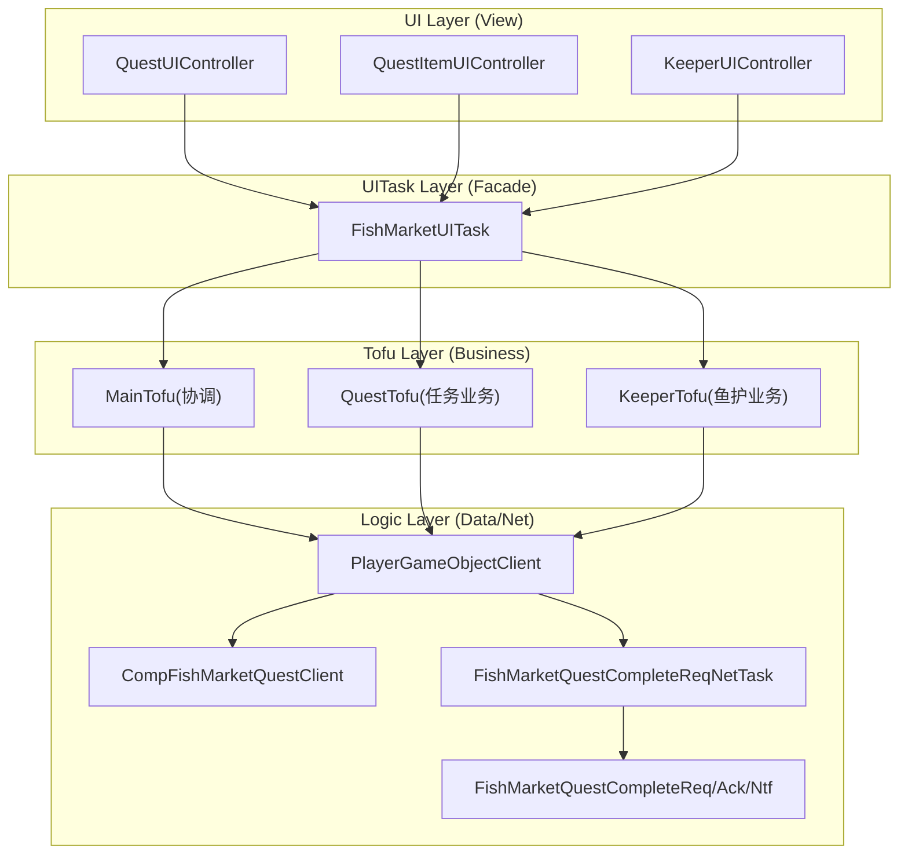
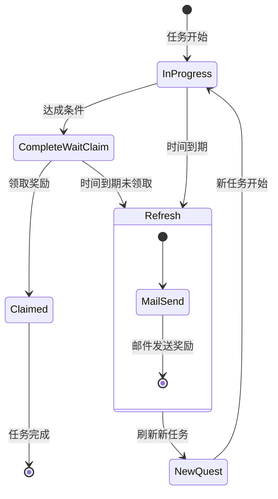
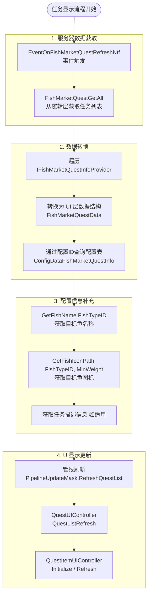

# 鱼市二期开发设计方案文档

**版本**: v1.0  
**日期**: 2026-02-03  
**项目**: Project EF - 鱼市任务系统  
**文档类型**: 技术开发设计方案  

---

## 1. 方案概述

### 1.1 项目背景

鱼市一期已完成基础的鱼护展示、售卖功能。鱼市二期需完成**鱼市任务系统**的全部功能，包括：
- 8个限时任务栏位的展示与管理
- 任务进度追踪与完成判定
- 任务奖励领取
- 任务倒计时与自动刷新
- 任务鱼标记与排序

### 1.2 核心目标

| 目标 | 描述 | 优先级 |
|------|------|--------|
| 功能完整 | 实现PRD中定义的所有任务功能 | P0 |
| 架构合规 | 严格遵循BJFramework分层架构 | P0 |
| 数据同步 | 正确处理服务器推送与客户端同步 | P0 |
| 性能优化 | 倒计时、列表刷新性能达标 | P1 |

### 1.3 开发范围

**包含**: 
- 任务数据结构与DC同步
- 任务UI展示与交互
- 任务进度计算与完成判定
- 奖励领取流程
- 倒计时系统
- 任务刷新机制

**不包含**:
- 待解锁任务栏位(Alpha1不做)
- 任务配置表填表(仅实现读取)
- 跨关卡售卖检测(已在一期完成)

---

## 2. 架构设计

### 2.1 分层架构



### 2.2 模块职责

| 模块 | 职责 | 关键方法 |
|------|------|----------|
| **QuestTofu** | 任务数据缓存、进度管理、倒计时、领取逻辑 | QuestDataUpdate, ClaimQuestReward, OnQuestFishSold |
| **KeeperTofu** | 鱼护数据、任务鱼标记、排序逻辑 | QuestFishMarkUpdate, SortTypeSet |
| **MainTofu** | 跨区域协调、网络请求发起、流程编排 | HandleSellFishRequest, HandleQuestFishSortRequest |
| **QuestUIController** | 任务列表UI、倒计时显示、状态切换 | RefreshQuestList, QuestTimerDisplay |

### 2.3 接口定义

```csharp
// 逻辑层接口 (已存在)
public interface IPlayerGameObjectFishMarketQuestClient
{
    IReadOnlyList<IFishMarketQuestInfoProvider> FishMarketQuestGetAll(int fishingLevelConfId);
    bool IsFishRequiredByProgressingQuests(int fishLevelConfId, KeepnetFishSellInfo keepnetFishSellInfo);
    void OnFishMarketQuestRefresh(int fishingLevelConfId, int index, FishMarketQuestInfo fishMarketQuestInfo);
    bool FishMarketQuestComplete(int fishingLevelConfId, int index, CurrencyUpdateCtxInfo currencyUpdateCtxInfo, out int errCode);
}

// QuestTofu对外接口
public interface IFishMarketUITaskCompQuestTofu
{
    void ClaimQuestReward(int questIndex);
    List<FishMarketQuestData> QuestDataListGet();
    HashSet<int> GetQuestFishIds();
    void OnQuestFishSold(List<int> fishIds);
    event Action<int> EventOnQuestFishSortRequest;
}
```

---

## 3. 数据设计

### 3.1 数据结构

#### 3.1.1 FishMarketQuestData (UI层数据结构)

```csharp
public class FishMarketQuestData
{
    public int m_questIndex;                    // 任务索引(0-7)
    public int m_confId;                        // 配置ID
    public QuestState m_state;                  // 任务状态
    
    // 任务条件
    public int m_targetFishId;                  // 目标鱼ID
    public string m_targetFishName;             // 目标鱼名称
    public string m_targetFishIconPath;         // 目标鱼图标路径
    public int m_targetCount;                   // 目标数量
    public int m_minWeightRequired;             // 最小重量要求(克,0=无要求)
    
    // 进度
    public int m_currentProgress;               // 当前进度
    public bool m_isReachCondition;             // 是否达成条件
    
    // 时间
    public DateTime m_endTime;                  // 结束时间(服务器时间)
    public TimeSpan m_remainingTime;            // 剩余时间(客户端计算)
    
    // 奖励
    public int m_rewardSilverCoin;              // 奖励银币
    public int m_rewardGoldCoin;                // 奖励金币
}
```

#### 3.1.2 任务状态枚举

```csharp
public enum QuestState
{
    InProgress,         // 任务进行中
    CompleteWaitClaim,  // 任务完成待领取
    Claimed,            // 任务已领取
    Locked              // 任务栏待解锁 (Alpha1暂时不做)
}
```

### 3.2 数据流向

```
配置表(ConfigDataFishMarketQuestInfo)
    ↓
服务器数据(DC: FishMarketQuestInfo) ← 网络协议(FishMarketQuestRefreshNtf)
    ↓
逻辑层(FishMarketQuest) → IFishMarketQuestInfoProvider
    ↓
QuestTofu数据缓存(List<FishMarketQuestData>)
    ↓
UIController显示
```

### 3.3 数据转换流程

```csharp
// QuestTofu.DataCacheUpdate()
private void QuestDataCacheUpdate()
{
    m_questDataList.Clear();
    
    var playerGO = PlayerCtx?.PlayerGameObjectGet();
    if (playerGO == null) return;
    
    // 获取当前关卡ID
    int fishingLevelConfId = GetCurrentFishingLevelConfId();
    
    // 从逻辑层获取所有任务
    var questProviders = playerGO.FishMarketQuestGetAll(fishingLevelConfId);
    
    foreach (var provider in questProviders)
    {
        var questData = ConvertProviderToQuestData(provider);
        m_questDataList.Add(questData);
    }
}

private FishMarketQuestData ConvertProviderToQuestData(IFishMarketQuestInfoProvider provider)
{
    var conf = provider.ConfGet();
    var questInfo = GetQuestInfoFromDC(provider);
    
    return new FishMarketQuestData
    {
        m_questIndex = provider.IndexGet(),
        m_confId = conf.ID,
        m_state = DetermineQuestState(provider),
        m_targetFishId = conf.FishTypeID,
        m_targetFishName = GetFishName(conf.FishTypeID),
        m_targetFishIconPath = GetFishIconPath(conf.FishTypeID, conf.MinWeight),
        m_targetCount = conf.CountCond,
        m_minWeightRequired = conf.MinWeight,
        m_currentProgress = provider.CompletedCountGet(),
        m_isReachCondition = provider.IsReachCondition(),
        m_endTime = questInfo.m_endTime,
        m_remainingTime = provider.LeftTimeGet(),
        m_rewardSilverCoin = conf.SilverReward,
        m_rewardGoldCoin = conf.GoldReward
    };
}
```

---

## 4. 业务流程设计

### 4.1 任务状态流转



### 4.2 奖励领取流程

```csharp
// QuestTofu中实现
private void OnClaimButtonClick(int questIndex)
{
    // 1. 前置检查
    var questData = GetQuestData(questIndex);
    if (questData == null || questData.m_state != QuestState.CompleteWaitClaim)
    {
        ShowError("任务状态异常，无法领取");
        return;
    }
    
    // 2. 发送网络请求
    var netTask = new FishMarketQuestCompleteReqNetTask(
        fishingLevelConfId: GetCurrentLevelId(),
        index: questIndex
    );
    
    netTask.EventOnStop += task =>
    {
        var ackTask = task as FishMarketQuestCompleteReqNetTask;
        if (ackTask == null || ackTask.IsNetworkError || ackTask.Result != 0)
        {
            ShowError($"领取失败: {ackTask?.Result}");
            return;
        }
        
        // 3. 逻辑层更新
        var playerGO = PlayerCtx?.PlayerGameObjectGet();
        if (playerGO != null)
        {
            playerGO.FishMarketQuestComplete(
                GetCurrentLevelId(), 
                questIndex, 
                ackTask.CurrencyUpdateCtxInfo,
                out var errCode
            );
        }
        
        // 4. 启动管线刷新
        LaunchPipelineWithMask(PipelineUpdateMask.RefreshQuestList);
        
        // 5. 播放领取动画
        PlayClaimRewardAnimation(questIndex, questData.m_rewardSilverCoin);
    };
    
    netTask.Start();
}
```

### 4.3 售卖时任务进度更新

```csharp
// MainTofu中在售卖成功后调用
private void OnFishSoldSuccess(List<int> soldFishIndices)
{
    // 通知QuestTofu检查任务进度
    m_compQuestTofu?.OnQuestFishSold(soldFishIndices);
}

// QuestTofu.OnQuestFishSold()
public void OnQuestFishSold(List<int> fishIds)
{
    bool hasProgressUpdate = false;
    var playerGO = PlayerCtx?.PlayerGameObjectGet();
    
    foreach (var questData in m_questDataList)
    {
        if (questData.m_state != QuestState.InProgress) continue;
        
        // 重新从逻辑层获取最新进度
        var provider = GetQuestProvider(questData.m_questIndex);
        int newProgress = provider.CompletedCountGet();
        
        if (newProgress != questData.m_currentProgress)
        {
            questData.m_currentProgress = newProgress;
            questData.m_isReachCondition = provider.IsReachCondition();
            
            // 检查是否完成任务
            if (questData.m_isReachCondition)
            {
                questData.m_state = QuestState.CompleteWaitClaim;
                PlayQuestCompleteAnimation(questData.m_questIndex);
            }
            
            hasProgressUpdate = true;
        }
    }
    
    if (hasProgressUpdate)
    {
        // 刷新任务列表显示
        LaunchPipelineWithMask(PipelineUpdateMask.RefreshQuestList);
    }
}
```

### 4.4 任务鱼排序

当玩家点击任务栏的悬浮态时，需要根据当前状态执行不同的操作逻辑。

#### 4.4.1 任务点击的三种场景

**场景1：未进入多选态**
```csharp
// QuestTofu中处理任务点击
private void OnQuestClick(int questIndex)
{
    // 获取任务数据
    var questData = m_questDataList[questIndex];
    if (questData.m_state != QuestState.InProgress)
    {
        return;
    }

    // 检查当前鱼护是否已进入多选态
    bool isInMultiSelectMode = m_compKeeperTofu?.IsInMultiSelectMode() ?? false;

    if (!isInMultiSelectMode)
    {
        // 场景1：未进入多选态
        // 1. 自动进入多选状态
        m_compKeeperTofu?.MultiSelectModeEnter();

        // 2. 切换到任务排序
        m_compKeeperTofu?.SortTypeSet(FishSortType.Quest);

        // 3. 自动选中满足条件的鱼
        AutoSelectQuestFish(questData);
    }
    else
    {
        // 已进入多选态的处理逻辑（见场景2和3）
        OnQuestClickInMultiSelectMode(questIndex, questData);
    }
}
```

**场景2：已进入多选态 + 已选中某些鱼**
```csharp
// QuestTofu中处理已进入多选态的任务点击
private void OnQuestClickInMultiSelectMode(int questIndex, FishMarketQuestData questData)
{
    // 获取当前已选中的鱼
    var selectedFishList = m_compKeeperTofu?.SelectedFishListGet() ?? new List<FishingBagItemInfo>();

    if (selectedFishList.Count == 0)
    {
        // 场景3：没有选中任何鱼
        return; // 不做任何操作
    }

    // 检查是否有命中任务条件的鱼
    bool hasQuestFishMatch = CheckHasQuestFishMatch(selectedFishList, questData);

    if (hasQuestFishMatch)
    {
        // 场景2：有命中任务鱼
        // 1. 切换到任务排序
        m_compKeeperTofu?.SortTypeSet(FishSortType.Quest);

        // 2. 取消非任务鱼的选中状态
        ClearNonQuestFishSelection(selectedFishList, questData);

        // 3. 选中对应点击的任务鱼
        SelectQuestFish(questData);
    }
    else
    {
        // 场景3：没有命中任务鱼
        // 不做任何操作
    }
}

// 检查是否有命中任务条件的鱼
private bool CheckHasQuestFishMatch(List<FishingBagItemInfo> selectedFishList, FishMarketQuestData questData)
{
    foreach (var fish in selectedFishList)
    {
        if (IsQuestFishConditionMet(fish, questData))
        {
            return true;
        }
    }
    return false;
}

// 取消非任务鱼的选中状态
private void ClearNonQuestFishSelection(List<FishingBagItemInfo> selectedFishList, FishMarketQuestData questData)
{
    foreach (var fish in selectedFishList)
    {
        if (!IsQuestFishConditionMet(fish, questData))
        {
            m_compKeeperTofu?.FishSelectionToggle(fish, false);
        }
    }
}
```

**场景3：已进入多选态 + 没有命中任务鱼**
- 直接返回，不做任何操作

#### 4.4.2 任务排序实现

```csharp
// KeeperTofu中实现任务排序

// KeeperTofu中实现任务排序
private void FishListSort()
{
    switch (m_currentSortType)
    {
        case FishSortType.Quest:
            // 任务鱼优先，任务鱼之间按默认（时间）降序排列
            m_fishItemInfoList.Sort((a, b) =>
            {
                if (a.m_isTaskFish != b.m_isTaskFish)
                {
                    return b.m_isTaskFish.CompareTo(a.m_isTaskFish); // 任务鱼在前
                }
                // 任务鱼之间或非任务鱼之间，按时间降序
                return b.m_pushDateTime.CompareTo(a.m_pushDateTime);
            });
            break;
        // ... 其他排序类型
    }
}
```

#### 排序规则说明

| 排序类型 | 规则 | 优先级 |
|---------|------|--------|
| **任务排序** | 满足条件的鱼排在最前；同为任务鱼时按时间倒序 | 最高 |
| 获得时间 | 默认排序，按捕获时间倒序 | 默认 |
| 其他 | 稀有度、重量、价格 | 普通 |

### 4.5 任务刷新流程

任务结束时间必须为现实世界的**整点**。UI层监听服务器刷新事件 `EventOnFishMarketQuestRefreshNtf`，触发管线刷新获取最新任务列表。

#### 4.5.1 事件监听机制

```csharp
// QuestTofu中监听任务刷新事件
public partial class FishMarketUITaskCompQuestTofu
{
    // 在 OnEventUIControllerLoadCompleted 中注册事件
    protected override void OnEventUIControllerLoadCompleted(string uiCtrlName)
    {
        base.OnEventUIControllerLoadCompleted(uiCtrlName);

        if (uiCtrlName == nameof(FishMarketQuestUIController))
        {
            m_questUICtrl = GetUIController<FishMarketQuestUIController>(uiCtrlName);

            // 监听任务刷新事件
            PlayerCtx.PlayerGameObjectGet().EventOnFishMarketQuestRefreshNtf += OnQuestRefreshNtf;
        }
    }

    // 任务刷新事件处理
    private void OnQuestRefreshNtf(FishMarketQuestRefreshNtf ntf)
    {
        // 收到服务器通知，触发管线刷新
        var pipelineInitInfo = m_owner.CompUpdatePipelineManager.Get().UpdatePipelineInitInfoAlloc();
        pipelineInitInfo.m_customParamDict.SetParam(
            ParamKeyPipelineUpdateMask,
            PipelineUpdateMask.RefreshQuestList | PipelineUpdateMask.PlayQuestRefreshAnim);
        m_compUpdatePipelineManager.UpdatePipelineLaunch(pipelineInitInfo);
    }

    // 在 OnUITaskPause/Stop 中取消事件监听
    public override void OnUITaskPause()
    {
        PlayerCtx.PlayerGameObjectGet().EventOnFishMarketQuestRefreshNtf -= OnQuestRefreshNtf;
        base.OnUITaskPause();
    }
}
```

#### 刷新规则

1. **整点结束**: 即使开服时间非整点，任务逻辑也必须保证在现实整点结束（如14:00, 15:00）。
2. **服务器驱动**: 客户端不再主动轮询刷新，由服务器通过 `EventOnFishMarketQuestRefreshNtf` 事件通知。
3. **悬浮态继承**: 刷新后若任务仍存在且处于悬浮选中状态，需保持选中表现。
4. **未领取处理**: 任务到期后若奖励未领取，通过邮件系统补发。

---

## 5. 倒计时系统设计

### 5.1 设计方案

采用**服务器事件驱动 + UI层本地更新**方案:
- UI层监听服务器刷新事件 `EventOnFishMarketQuestRefreshNtf`，触发管线刷新获取任务列表
- 倒计时显示在 `UIController.Update` 中直接更新，从 `FishMarketQuestInfo.m_endTime` 计算剩余时间
- 不再使用 Tofu 层的 Tick 机制每分钟主动刷新

#### 5.1.1 任务刷新事件监听

```csharp
public partial class FishMarketUITaskCompQuestTofu
{
    // 在 OnEventUIControllerLoadCompleted 中注册事件
    protected override void OnEventUIControllerLoadCompleted(string uiCtrlName)
    {
        base.OnEventUIControllerLoadCompleted(uiCtrlName);

        if (uiCtrlName == nameof(FishMarketQuestUIController))
        {
            m_questUICtrl = GetUIController<FishMarketQuestUIController>(uiCtrlName);

            // 监听任务刷新事件
            PlayerCtx.PlayerGameObjectGet().EventOnFishMarketQuestRefreshNtf += OnQuestRefreshNtf;
        }
    }

    // 任务刷新事件处理
    private void OnQuestRefreshNtf(FishMarketQuestRefreshNtf ntf)
    {
        // 收到服务器通知，触发管线刷新
        var pipelineInitInfo = m_owner.CompUpdatePipelineManagerGet().UpdatePipelineInitInfoAlloc();
        pipelineInitInfo.m_customParamDict.SetParam(
            ParamKeyPipelineUpdateMask,
            PipelineUpdateMask.RefreshQuestList | PipelineUpdateMask.PlayQuestRefreshAnim);
        m_compUpdatePipelineManager.UpdatePipelineLaunch(pipelineInitInfo);
    }
}
```

#### 5.1.2 倒计时显示更新（UIController层）

```csharp
public class FishMarketQuestItemUIController : UIControllerBase
{
    private FishMarketQuestData m_questData;
    private DateTime m_endTime;

    // 初始化时记录任务结束时间
    public void Initialize(FishMarketQuestData questData, Dictionary<string, object> resourceCache)
    {
        m_questData = questData;
        m_endTime = questData.m_endTime;

        // ... 其他初始化代码
    }

    // 在 Update 中更新倒计时显示
    protected override void Update()
    {
        base.Update();

        // 计算倒计时（使用服务器时间）
        var currentTime = GetCurrentGameTime();
        var remaining = m_endTime - currentTime;
        int remainingSec = (int)remaining.TotalSeconds;

        // 更新倒计时显示文本
        UpdateCountdownDisplay(remainingSec);

        // 检查是否需要变红（最后30分钟）
        bool shouldBeRed = remainingSec <= 30 * 60 && remainingSec > 0;
        if (shouldBeRed != m_isCountdownRed)
        {
            m_isCountdownRed = shouldBeRed;
            SetCountdownRedColor(shouldBeRed);
        }
    }

    private void UpdateCountdownDisplay(int remainingSec)
    {
        string timeText;

        if (remainingSec < 0)
        {
            timeText = "已结束";
        }
        else if (remainingSec < 60)
        {
            timeText = $"{remainingSec}秒";
        }
        else if (remainingSec < 3600)
        {
            int min = remainingSec / 60;
            int sec = remainingSec % 60;
            timeText = $"{min}分{sec}秒";
        }
        else if (remainingSec < 86400)
        {
            int hour = remainingSec / 3600;
            int min = (remainingSec % 3600) / 60;
            timeText = $"{hour}小时{min}分";
        }
        else
        {
            int day = remainingSec / 86400;
            int hour = (remainingSec % 86400) / 3600;
            timeText = $"{day}天{hour}小时";
        }

        m_countdownText.text = timeText;
    }

    private void SetCountdownRedColor(bool isRed)
    {
        m_countdownText.color = isRed ? Color.red : m_normalTextColor;
    }

    // 服务器时间获取
    private DateTime GetCurrentGameTime()
    {
        return (GameManager.Instance?.PlayerContext as ProjectEFPlayerContext)?.PlayerGameObjectGet()?.ServerTimeAsDateTimeGet() ?? Timer.s_currTime;
    }

    private bool m_isCountdownRed = false;
    private Color m_normalTextColor = Color.white;
}
```

#### 5.1.3 设计优势

| 优势 | 说明 |
|------|------|
| **服务器驱动** | 服务器主动通知刷新，确保任务数据准确性 |
| **减少请求** | 不再需要客户端每分钟主动检查刷新 |
| **简单高效** | UI层直接在Update中更新倒计时，无需协程管理 |
| **解耦清晰** | Tofu层负责事件处理，Controller层负责UI更新 |

### 5.2 时间同步策略

```csharp
// 服务器时间获取（Tofu层或UI层通用方法）
private DateTime GetCurrentGameTime()
{
    return (GameManager.Instance?.PlayerContext as ProjectEFPlayerContext)?.PlayerGameObjectGet()?.ServerTimeAsDateTimeGet() ?? Timer.s_currTime;
}
```

**时间获取说明**：
- 优先使用服务器时间：`ServerTimeAsDateTimeGet()`
- 如果无法获取服务器时间，则回退到本地时间：`Timer.s_currTime`
- 确保所有时间计算都基于此方法，保证时间一致性

---

## 6. 鱼市任务显示流程

### 6.1 任务显示流程概述

鱼市任务系统的显示流程分为以下几个关键步骤：



### 6.2 服务器数据获取

#### 6.2.1 事件监听与数据拉取

```csharp
// QuestTofu中监听任务刷新事件
private void OnQuestRefreshNtf(FishMarketQuestRefreshNtf ntf)
{
    // 1. 触发管线刷新获取最新数据
    var pipelineInitInfo = m_owner.CompUpdatePipelineManager.Get().UpdatePipelineInitInfoAlloc();
    pipelineInitInfo.m_customParamDict.SetParam(
        ParamKeyPipelineUpdateMask,
        PipelineUpdateMask.RefreshQuestList | PipelineUpdateMask.PlayQuestRefreshAnim);
    m_compUpdatePipelineManager.UpdatePipelineLaunch(pipelineInitInfo);
}

// QuestTofu.DataCacheUpdate() 中拉取数据
private void QuestDataCacheUpdate()
{
    m_questDataList.Clear();

    var playerGO = PlayerCtx?.PlayerGameObjectGet();
    if (playerGO == null) return;

    // 获取当前关卡ID
    int fishingLevelConfId = GetCurrentFishingLevelConfId();

    // 2. 从逻辑层获取所有任务 (IPlayerGameObjectFishMarketQuestClient接口)
    var questProviders = playerGO.FishMarketQuestGetAll(fishingLevelConfId);

    // 3. 转换为 UI 数据结构
    foreach (var provider in questProviders)
    {
        var questData = ConvertProviderToQuestData(provider);
        m_questDataList.Add(questData);
    }

    // 4. 收集动态资源
    CollectQuestResources(m_questDataList);
}
```

#### 6.2.2 数据转换详细流程

```csharp
private FishMarketQuestData ConvertProviderToQuestData(IFishMarketQuestInfoProvider provider)
{
    // 1. 获取配置表数据
    var conf = provider.ConfGet();

    // 2. 通过配置ID获取任务描述信息
    var questDescription = GetQuestDescription(conf.ID);

    // 3. 获取目标鱼信息
    var fishName = GetFishName(conf.FishTypeID);
    var fishIconPath = GetFishIconPath(conf.FishTypeID, conf.MinWeight);

    // 4. 计算任务状态
    var state = DetermineQuestState(provider);

    // 5. 构造 UI 数据
    return new FishMarketQuestData
    {
        m_questIndex = provider.IndexGet(),
        m_confId = conf.ID,

        // 任务条件
        m_targetFishId = conf.FishTypeID,
        m_targetFishName = fishName,
        m_targetFishIconPath = fishIconPath,
        m_targetCount = conf.CountCond,
        m_minWeightRequired = conf.MinWeight,

        // 进度
        m_currentProgress = provider.CompletedCountGet(),
        m_isReachCondition = provider.IsReachCondition(),

        // 时间
        m_endTime = GetCurrentGameTime().AddHours(conf.RefreshHour),

        // 奖励
        m_rewardSilverCoin = conf.SilverReward,
        m_rewardGoldCoin = conf.GoldReward,
    };
}
```

### 6.3 配置表查询与信息获取

#### 6.3.1 配置表结构

```csharp
// 配置表定义
public class ConfigDataFishMarketQuestInfo
{
    public int ID;              // 任务配置ID
    public int FishTypeID;      // 目标鱼种ID
    public int CountCond;        // 目标数量
    public int MinWeight;        // 最小重量要求(克，0=无要求）
    public int SilverReward;    // 银币奖励
    public int GoldReward;       // 金币奖励
    public int RefreshHour;     // 刷新时间(小时，如14表示14:00)
    public int QuestGroup;       // 任务组别(0-7，对应8个任务栏)

    // 其他配置字段...
}
```


### 6.5 阶段1已完成功能回顾

#### 6.5.1 FishMarketUITaskCompKeeperTofu.cs 已完成功能

- ✅ 鱼护数据缓存：从逻辑层获取鱼护数据
- ✅ 鱼护列表刷新：支持全量刷新和位置保持刷新
- ✅ 鱼护排序：支持时间、稀有度、重量、价格、任务排序
- ✅ 鱼护多选/全选：多选状态管理和选中状态同步
- ✅ 任务鱼标记：标记满足任务条件的鱼
- ✅ 任务鱼排序：任务鱼优先排到最前

#### 6.5.2 PlayerGameObjectCompFishMarketQuestClient.cs 已完成功能

- ✅ 任务列表获取：`FishMarketQuestGetAll(int fishingLevelConfId)`
- ✅ 任务进度检查：`IsFishRequiredByProgressingQuests()`
- ✅ 任务刷新通知：`OnFishMarketQuestRefresh()`
- ✅ 任务完成领取：`FishMarketQuestComplete()`
- ✅ 配置表访问：`IFishMarketQuestInfoProvider` 接口

#### 6.5.3 二期新增功能需求

基于阶段1已完成的功能，二期需要新增或增强以下功能：

| 功能模块 | 阶段1状态 | 二期需求 | 开发内容 |
|---------|-----------|---------|---------|
| **任务数据获取** | 已有基础接口 | 支持任务刷新事件监听 | 实现 `EventOnFishMarketQuestRefreshNtf` 事件监听 |
| **配置表查询** | 已有 `IFishMarketQuestInfoProvider` | 需要通过配置ID获取完整配置信息 | 实现 `GetQuestConfig()` 查询配置表 |
| **任务描述获取** | 无 | 需要根据配置获取任务描述 | 实现 `GetQuestDescription()` 获取任务描述 |
| **目标鱼信息** | 已有基础信息 | 需要精确的鱼图标选择逻辑 | 实现根据重量选择最小体型或成年体图标 |
| **任务倒计时** | 无 | UIController.Update中直接更新 | 实现倒计时显示和变红逻辑 |
| **任务刷新动效** | 无 | 刷新时播放动画 | 实现 `PlayQuestRefreshAnim` |
| **任务状态管理** | 已有基础状态 | 增加 Locked 状态（Alpha1暂不做） | 更新 QuestState 枚举 |

---

## 7. UI设计

### 6.1 QuestItemUIController接口

```csharp
public class FishMarketQuestItemUIController : UIControllerBase
{
    // 初始化
    public void Initialize(FishMarketQuestData questData, Dictionary<string, object> resourceCache);

    // 刷新显示
    public void Refresh(FishMarketQuestData questData);

    // 进度更新
    public void UpdateProgress(int current, int target);

    // 状态切换
    public void SetState(QuestState state);

    // 播放完成动画
    public UIProcess PlayCompleteAnimation();

    // 播放领取动画
    public UIProcess PlayClaimAnimation(int rewardAmount);

    // 事件
    public event Action<int> EventOnClick;      // 点击任务
    public event Action<int> EventOnClaimClick; // 点击领取

    // 内部Update实现倒计时显示
    protected override void Update(); // 倒计时在此方法中更新
}
```

**注意**: 倒计时显示更新在 `Update()` 方法中直接实现，不再通过 Tofu 层驱动。

### 6.2 QuestUIController接口

```csharp
public class FishMarketQuestUIController : UIControllerBase
{
    // 初始化任务列表
    public void Initialize(List<FishMarketQuestData> questList, Dictionary<string, object> resourceCache);
    
    // 刷新整个列表
    public void RefreshQuestList(List<FishMarketQuestData> questList);
    
    // 刷新单个任务
    public void RefreshQuest(int questIndex, FishMarketQuestData questData);
    
    // 事件
    public event Action<int> EventOnQuestClick;
    public event Action<int> EventOnUnlockClick;
    public event Action<int> EventOnClaimClick;
}
```

---

## 7. PipelineUpdateMask设计

### 7.1 Mask定义(扩展)

```csharp
[Flags]
public enum PipelineUpdateMask
{
    None = 0,

    // 鱼护刷新(已有)
    RefreshKeepnetFishList = 1 << 0,

    // 任务刷新(二期新增)
    RefreshQuestList = 1 << 1,
    RefreshQuestProgress = 1 << 2,      // 仅刷新任务进度状态

    // 顶部刷新(已有)
    RefreshMain = 1 << 3,

    // 动画播放
    PlayQuestCompleteAnim = 1 << 4,
    PlayQuestClaimAnim = 1 << 5,
    PlayConfirmSellUIProcess = 1 << 6,
    PlayQuestRefreshAnim = 1 << 7,
    SellFinish = 1 << 8,

    // 综合
    RefreshAll = RefreshKeepnetFishList | RefreshQuestList | RefreshMain,
}
```

### 7.2 管线触发时机

| 场景     | Mask                               | 说明                       |
| ------ | ---------------------------------- | ------------------------ |
| 进入鱼市   | RefreshAll                         | 初始化所有数据                  |
| 卖鱼完成   | SellFinish \| RefreshQuestProgress | 刷新鱼护+任务进度                |
| 领取奖励   | RefreshQuestList                   | 刷新任务状态                   |
| 任务到期   | RefreshQuestList                   | 刷新任务列表                   |
| 点击任务排序 | RefreshKeepnetFishList             | 重新排序鱼护                   |
| 倒计时显示  | 无需Mask                             | UIController.Update中直接更新 |

---

## 8. 网络协议集成

### 8.1 已有协议

```csharp
// 请求
FishMarketQuestCompleteReq
{
    int FishingLevelConfId;  // 关卡ID
    int Index;               // 任务索引(0-7)
}

// 响应
FishMarketQuestCompleteAck
{
    int Result;                    // 结果码
    int FishingLevelConfId;        // 关卡ID
    int Index;                     // 任务索引
    ProCurrencyUpdateCtxInfo CurrencyUpdateCtxInfo; // 货币更新信息
}

// 通知
FishMarketQuestRefreshNtf
{
    int FishingLevelConfId;        // 关卡ID
    int Index;                     // 任务索引
    ProFishMarketQuestInfo FishMarketQuestInfo; // 新任务信息
}
```

### 8.2 NetTask封装

```csharp
public class FishMarketQuestCompleteReqNetTask : NetTaskBase
{
    private int m_fishingLevelConfId;
    private int m_index;
    
    public FishMarketQuestCompleteReqNetTask(int fishingLevelConfId, int index)
    {
        m_fishingLevelConfId = fishingLevelConfId;
        m_index = index;
    }
    
    protected override void OnStart()
    {
        var req = new FishMarketQuestCompleteReq
        {
            FishingLevelConfId = m_fishingLevelConfId,
            Index = m_index
        };
        
        SendMessage(req, typeof(FishMarketQuestCompleteAck));
    }
    
    public int Result { get; private set; }
    public ProCurrencyUpdateCtxInfo CurrencyUpdateCtxInfo { get; private set; }
    
    protected override void OnReceiveAckMessage(IMessage ackMsg)
    {
        var ack = ackMsg as FishMarketQuestCompleteAck;
        Result = ack.Result;
        CurrencyUpdateCtxInfo = ack.CurrencyUpdateCtxInfo;
    }
}
```

---

## 9. 关键实现细节

### 9.1 任务鱼标记逻辑

```csharp
【初始化管线】
管线启动（paramDict 无任务条件）
    ↓
QuestTofu.DataCacheUpdate() 
    → 从服务器加载任务数据到 m_questDataList
    ↓
KeeperTofu.DataCacheUpdate()
    → QuestFishMarkUpdate()
    → m_questFishConditions == null（paramDict 中没有）
    → 调用 questTofu.QuestFishConditionListGet() 获取
    → 标记任务鱼

【部分刷新管线（点击任务）】
QuestTofu.OnQuestClick()
    → 构造 FishFilterCondition + QuestFishConditionList
    → 设置到 pipelineInitInfo.m_customParamDict
    ↓
KeeperTofu.UpdateContextSetup()
    → m_questFishConditions = paramDict.GetClassParam<>() ✓
    ↓
KeeperTofu.DataCacheUpdate()
    → QuestFishMarkUpdate()
    → 使用 m_questFishConditions（来自 paramDict）

// KeeperTofu.QuestFishMarkUpdate()
private void QuestFishMarkUpdate()
{
    if (m_currentKeeperMode != KeeperModeName4FishMarket) return;
    
    // 从QuestTofu获取活跃任务鱼ID
    var questTofu = (m_owner as IFishMarketUITaskCompOwner)?.CompQuestTofuGet();
    var activeQuestFishIds = questTofu?.GetQuestFishIds() ?? new HashSet<int>();
    
    // 标记鱼护中的任务鱼
    for (int i = 0; i < m_fishItemInfoList.Count; i++)
    {
        var fishInfo = m_fishItemInfoList[i];
        bool isTaskFish = activeQuestFishIds.Contains(fishInfo.m_fishInfoConfId);
        
        // 检查重量条件
        if (isTaskFish && HasWeightRequirement(fishInfo.m_fishInfoConfId))
        {
            isTaskFish = CheckWeightCondition(fishInfo);
        }
        
        fishInfo.m_isTaskFish = isTaskFish;
        m_fishItemInfoList[i] = fishInfo;
    }
}


```

### 9.2 条件判定逻辑 (巨物 vs 重量)

任务条件支持**巨物判定**或**重量判定**（二选一）。

```csharp
private bool IsFishMatchQuest(FishMarketFishItemInfo fishInfo, FishMarketQuestData questData)
{
    // 1. 基础检查：品种匹配
    if (fishInfo.m_fishInfoConfId != questData.m_targetFishId) return false;
    
    // 2. 巨物条件检查 (优先)
    if (questData.m_isGiantRequired)
    {
        return fishInfo.m_fishInvadeProtectType == FishInvadeProtectType.Giant;
    }
    
    // 3. 重量条件检查
    if (questData.m_minWeightRequired > 0)
    {
        return fishInfo.m_weight * 1000 >= questData.m_minWeightRequired;
    }
    
    return true; // 无特殊条件，品种匹配即可
}
```

### 9.3 任务图标选择
... (保持原内容)

```csharp
// 根据重量条件选择图标
private string GetTaskFishIconPath(int fishTypeId, int minWeightRequired)
{
    if (minWeightRequired <= 0)
    {
        // 无重量要求，使用成年体图标
        return GetAdultFishIconPath(fishTypeId);
    }
    else
    {
        // 有重量要求，使用满足条件的最小体型图标
        return GetMinSizeIconForWeight(fishTypeId, minWeightRequired);
    }
}
```

---

## 10. 文件清单

### 10.1 需要修改的文件

| 文件路径 | 修改内容 |
|----------|----------|
| FishMarketUITaskCompQuestTofu.cs | 实现真实数据加载、倒计时、领取逻辑 |
| FishMarketQuestUIController.cs | 实现任务列表刷新、交互事件 |
| FishMarketQuestItemUIController.cs | 实现单个任务项UI更新、动画 |
| FishMarketUITaskCompKeeperTofu.cs | 集成任务鱼标记与真实逻辑层接口 |
| FishMarketUITaskCompMainTofu.cs | 协调售卖后任务更新流程 |

### 10.2 需要新增的文件

| 文件路径 | 说明 |
|----------|------|
| NetTask/FishMarketQuestCompleteReqNetTask.cs | 任务完成领取网络请求 |

### 10.3 已有基础(无需修改)

| 文件路径 | 说明 |
|----------|------|
| PlayerGameObjectCompFishMarketQuestClient.cs | 逻辑层接口已实现 |
| FishMarketQuestProtocol.cs | 网络协议已定义 |
| CommonDefine_FishMarketQuest.cs | 数据结构已定义 |
| FishMarketUITaskDataStructures.cs | UI数据结构已定义 |

---

## 11. 开发排期

### 11.1 阶段划分

| 阶段 | 任务 | 工期 | 依赖 |
|------|------|------|------|
| **Phase 1** | QuestTofu数据层实现 | 2天 | 逻辑层接口 |
| **Phase 2** | QuestUIController实现 | 2天 | Phase 1 |
| **Phase 3** | 倒计时与刷新机制 | 1天 | Phase 1 |
| **Phase 4** | 奖励领取流程 | 1天 | Phase 1, NetTask |
| **Phase 5** | 任务鱼标记与排序 | 1天 | Phase 1, KeeperTofu |
| **Phase 6** | 动画与UIProcess | 1天 | Phase 2 |
| **Phase 7** | 联调测试 | 2天 | 所有Phase |

### 11.2 关键里程碑

- **M1**: QuestTofu能从逻辑层读取真实数据并显示(第2天)
- **M2**: 倒计时功能正常，变红提示正确(第5天)
- **M3**: 奖励领取流程打通，网络通信正常(第6天)
- **M4**: 任务鱼标记、排序功能完成(第7天)
- **M5**: 所有动画表现完成，性能达标(第8天)
- **M6**: 联调通过，无阻塞性bug(第10天)

---

## 12. 风险与对策

### 12.1 技术风险

| 风险 | 影响 | 对策 |
|------|------|------|
| 服务器事件未触发 | 任务刷新不及时 | 确保事件监听正确注册，网络断线时重连后重新注册 |
| 倒计时不准确 | 用户体验差 | 服务器时间校准，本地只做显示 |
| 任务进度计算错误 | 任务无法完成 | 完全依赖逻辑层计算，UI只展示 |
| 网络领取失败 | 玩家无法获得奖励 | 失败提示清晰，支持重试 |

### 12.2 性能风险

| 风险 | 影响 | 对策 |
|------|------|------|
| 8个倒计时同时更新 | 每帧8次UI更新 | UIController.Update中统一处理，秒级精度 |
| 频繁刷新任务列表 | 列表重建开销 | 区分RefreshQuestList(重建)和RefreshQuestProgress(仅刷新进度) |
| 任务鱼标记遍历 | 鱼多时性能差 | O(n)复杂度，鱼护容量有限(一般<50) |

---

## 13. 验收标准

### 13.1 功能验收

- [ ] 8个任务栏位正确显示
- [ ] 任务状态(进行中/待领取/已领取)切换正确
- [ ] 倒计时显示准确，最后30分钟变红
- [ ] 任务鱼标记正确(满足条件的鱼显示标记)
- [ ] 任务排序后任务鱼排在前列
- [ ] 售卖任务鱼后进度正确更新
- [ ] 任务完成后可领取奖励
- [ ] 领取奖励后货币正确增加
- [ ] 任务到期后自动刷新

### 13.2 性能验收

- [ ] 8个倒计时同时运行帧率>50fps
- [ ] 任务列表刷新<100ms
- [ ] 内存无泄漏

### 13.3 代码质量验收

- [ ] 符合BJFramework架构规范
- [ ] 无直接访问其他UITask内部组件
- [ ] 所有网络请求走Check->NetTask->Mask->Pipeline流程
- [ ] 事件订阅与注销成对出现

---

## 14. 附录

### 14.1 参考资料

1. PRD: `Doc/10_Projects/PRD/FishmarketUITask_PRD.md`
2. 设计文档: `Doc/10_Projects/Design/FishMarketUITask_设计文档.md`
3. 逻辑层接口: `PlayerGameObjectClient_FishMarketQuest.cs`
4. 一期代码: `GameProject/Scripts/Runtime/GameView/UI/FishMarketUITask/`


---

**文档结束**

*本文档为鱼市二期开发的技术设计方案，所有实现必须遵循本文档定义。*
