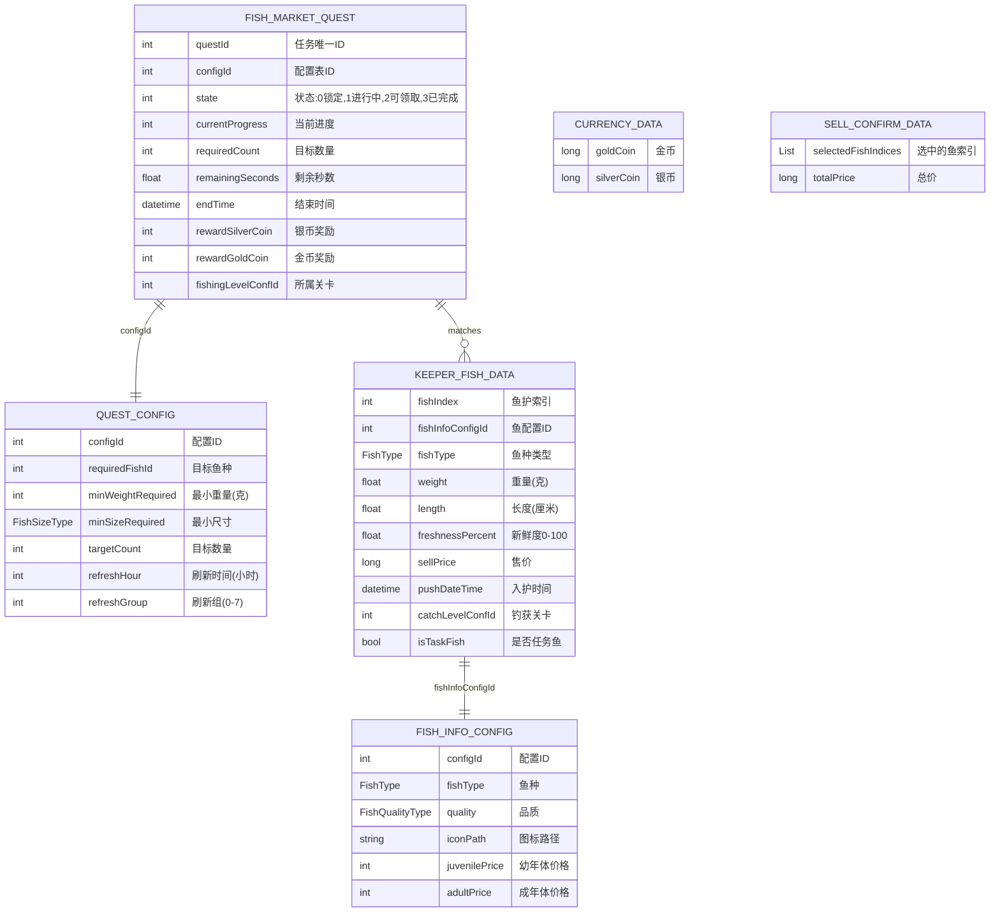
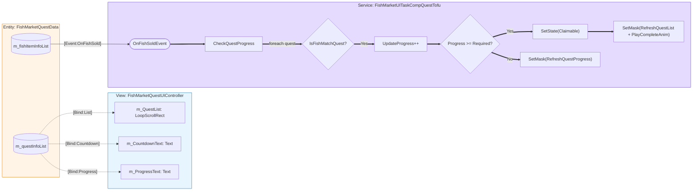
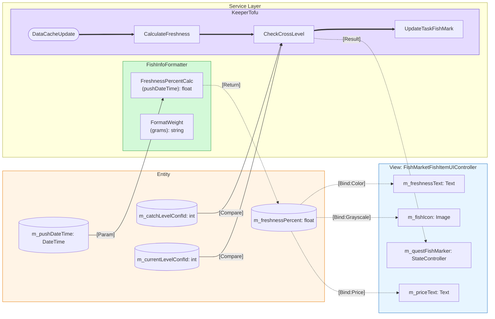
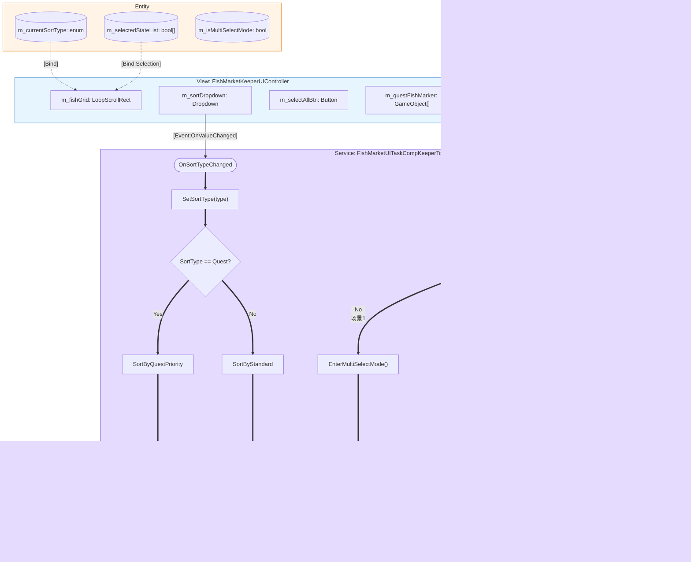
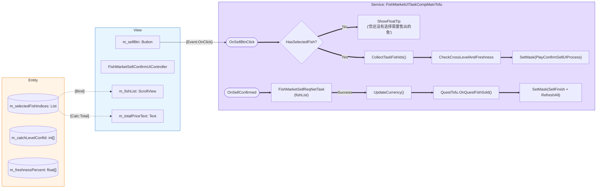
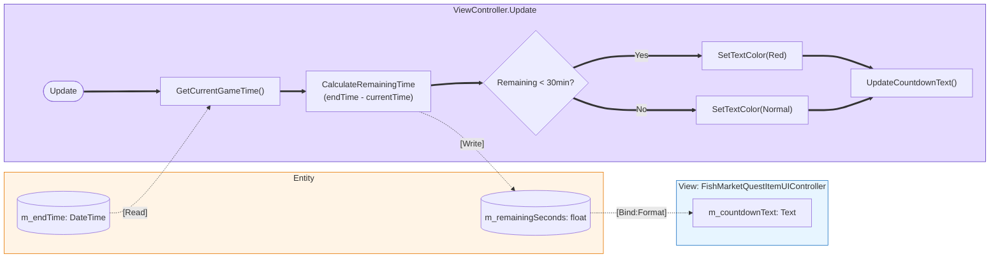
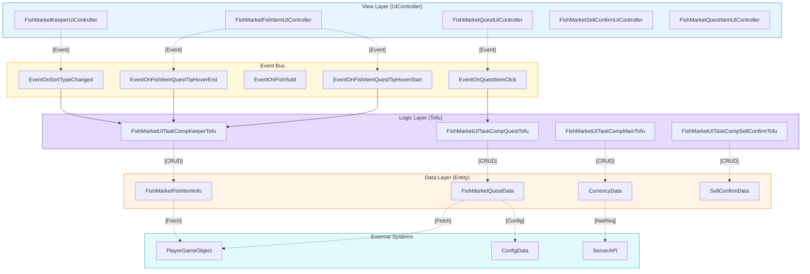

# FishMarketUITask - BJFramework 蓝图语义解析

## 1. 语义提取清单

### 1.1 名词 (Entities) - 纯数据层
| 实体名称 | 核心属性 | 数据来源 |
|---------|---------|---------|
| FishMarketQuestInfo | questId, configId, state, progress, endTime, reward | Server + Config |
| KeeperFishData | fishId, weight, freshness, price, quality, catchTime | PlayerGameObject |
| CurrencyData | goldCoin, silverCoin | PlayerGameObject |
| SellConfirmData | selectedFishList, totalPrice | KeeperTofu缓存 |

### 1.2 动词 (Actions) - 业务逻辑层
| 服务名称 | 输入 | 输出 | 所属Tofu |
|---------|------|------|---------|
| QuestProgressTrack | soldFishIdList | updatedQuestList | QuestTofu |
| CrossLevelValidate | fish.catchLevelConfId | bool isValid | KeeperTofu |
| FreshnessCalc | pushDateTime | freshnessPercent | FishInfoFormatter |
| FishSort | fishList, sortType | sortedFishList | KeeperTofu |
| MultiSelectToggle | fishIndex | newSelectState | KeeperTofu |

### 1.3 反馈 (View/Feedback) - 表现层
| 视图组件 | 类型 | 更新方式 |
|---------|------|---------|
| QuestListView | LoopScrollRect | PipelineRefresh |
| FishGridView | LoopScrollRect | PipelineRefresh |
| CountdownText | Text | UIController.Update |
| TaskFishMarker | StateController | PipelineRefresh |
| FreshnessText | Text | PipelineRefresh |

---

## 2. ER模型 (Entity-Relationship)

---

## 3. 蓝图拓扑 - 核心执行流

### 3.1 任务进度追踪流

### 3.2 跨关卡验证 + 新鲜度计算流

### 3.3 任务鱼排序 + 三场景点击流

### 3.4 售卖确认 + 跨关卡验证流

### 3.5 倒计时实时更新流

---

## 4. 分层架构总览

---

## 5. 质量检查清单

- [x] 所有subgraph都有明确的框架角色标注 (View/Logic/Data)
- [x] 连线标签包含代码生成所需的参数类型 (如 `fishIndex: int`)
- [x] 节点ID为合法的C#变量名 (无空格，无特殊字符)
- [x] 执行流 (`==>`) 逻辑闭环
- [x] 数据流 (`-.->`) 明确标注了 `[Bind]` 或 `[Read]`/`[Write]`
- [x] 事件流使用 `[Event:Type]` 标注
- [x] 使用了规定的颜色方案
  - Logic/Service: 紫色 (#e5dbff)
  - Entity/Data: 黄色 (#fff4e6)
  - View/UI: 蓝色 (#e7f5ff)

---

**文档生成时间:** 2026-02-06  
**解析工具:** BJFramework Blueprint Compiler  
**基于PRD:** FishmarketUITask_PRD_标注版.md
