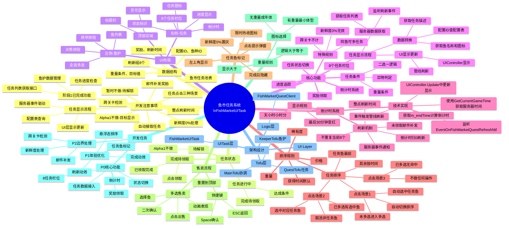

# 鱼市任务系统 - 思维导图

---

## 快速导航

### 核心开发文档
- [[FishMarketPhase2_开发设计方案]] - 完整技术设计方案
- [[FishmarketUITask_PRD_标注版]] - 标注版PRD文档

### 关键实现模块
1. [[FishMarketPhase2_开发设计方案#6. 鱼市任务显示流程|任务显示流程]]
2. [[FishMarketPhase2_开发设计方案#6.3 配置表查询与信息获取|配置表查询与信息获取]]
3. [[FishMarketPhase2_开发设计方案#4.1 任务状态流转|任务状态机实现]]
4. [[FishMarketPhase2_开发设计方案#5. 倒计时系统设计|倒计时系统]]
5. [[FishMarketPhase2_开发设计方案#4.2 奖励领取流程|奖励领取流程]]
6. [[FishMarketPhase2_开发设计方案#4.5 任务刷新流程|任务刷新机制]]
7. [[FishMarketPhase2_开发设计方案#4.4 任务鱼排序|任务鱼排序]]
8. [[FishMarketPhase2_开发设计方案#6.5 阶段1已完成功能回顾|阶段1已完成功能]]

### 相关代码文件
- `FishMarketUITaskCompQuestTofu.cs` - 任务Tofu组件
- `FishMarketUITaskCompKeeperTofu.cs` - 鱼护Tofu组件
- `FishMarketUITaskCompMainTofu.cs` - 主Tofu组件
- `PlayerGameObjectCompFishMarketQuestClient.cs` - 逻辑层接口

---

*此思维导图对应文件: [[FishmarketUITask_PRD_思维导图.canvas]]*
