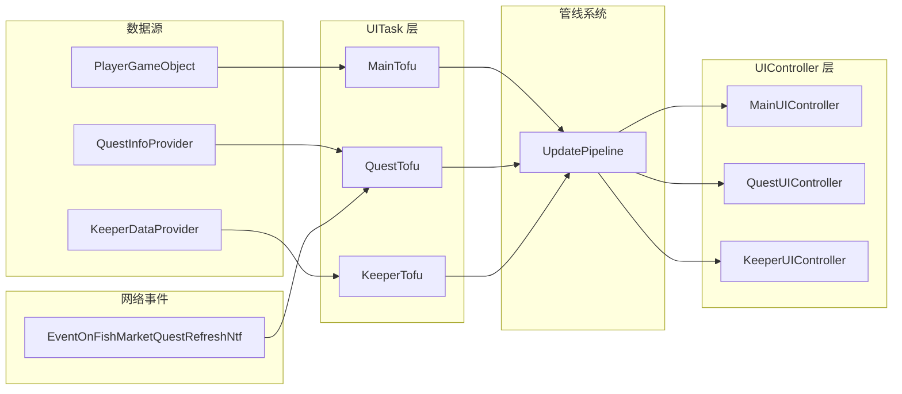
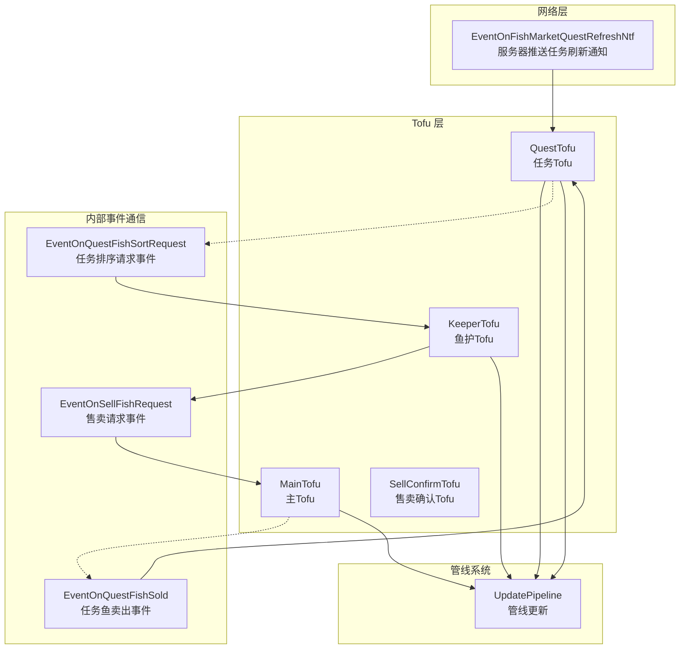
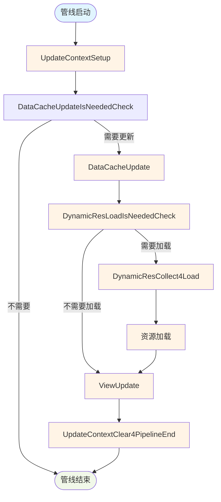
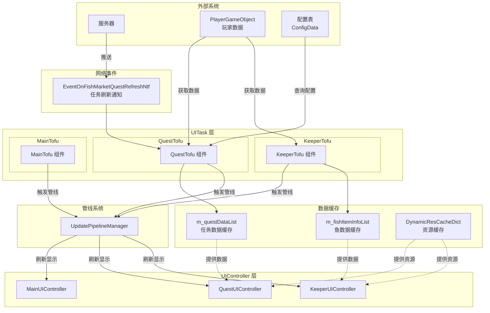
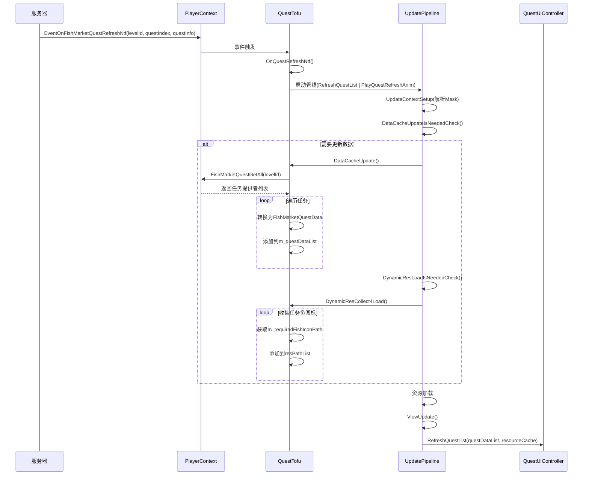
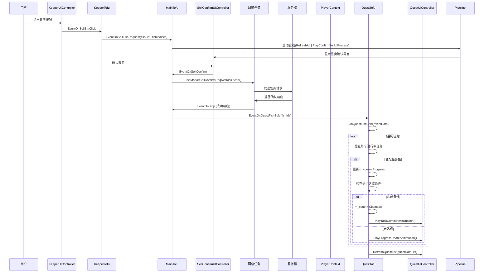

# 鱼市UITask 数据流定量分析报告

**版本**: v1.0  
**日期**: 2026-02-04  
**项目**: Project EF - 鱼市任务系统  
**文档类型**: 技术数据流分析  

---

## 一、架构概览

### 1.1 组件结构

```
FishMarketUITask (主 UITask)
├── FishMarketUITaskCompMainTofu (主协调 Tofu)
│   ├── 事件订阅
│   │   ├── EventOnSellFishRequest (来自 KeeperTofu)
│   │   ├── EventOnSellConfirmClosed (来自 SellConfirmTofu)
│   │   ├── EventOnSellConfirmConfirmed (来自 SellConfirmTofu)
│   │   └── EventOnPanelClose (来自 MainUIController)
│   └── 货币刷新
│       └── CurrencyDisplayRefresh()
│
├── FishMarketUITaskCompQuestTofu (任务业务 Tofu)
│   ├── 事件订阅
│   │   └── PlayerCtx.EventOnFishMarketQuestRefreshNtf (来自服务器)
│   └── 任务管理
│       ├── QuestDataUpdate()
│       ├── ClaimQuestReward()
│       └── OnQuestFishSold()
│
├── FishMarketUITaskCompKeeperTofu (鱼护业务 Tofu)
│   ├── 事件发布
│   │   ├── EventOnSellFishRequest (向 MainTofu 抛出)
│   │   └── EventOnQuestFishSold (向 QuestTofu 抛出)
│   └── 鱼护管理
│       ├── KeepnetDataCacheUpdate()
│       ├── FishListSort()
│       └── QuestFishMarkUpdate()
│
└── FishMarketUITaskCompSellConfirmTofu (售卖确认 Tofu)
    └── 售卖确认流程
```

### 1.2 数据源与汇入

| 数据源 | 数据类型 | 汇入点 | 数据用途 |
|--------|---------|--------|----------|
| PlayerGameObject (逻辑层) | 玩家数据、货币 | MainTofu.PlayerGameObjectGet() | 货币数据获取 |
| FishMarketQuestInfoProvider (逻辑层) | 任务数据 | QuestTofu.QuestDataUpdate() | 任务列表获取 |
| KeeperDataProvider (数据提供者) | 鱼护数据 | KeeperTofu.KeepnetDataCacheUpdate() | 鱼护列表获取 |
| EventOnFishMarketQuestRefreshNtf (网络事件) | 任务刷新通知 | QuestTofu.OnQuestRefreshNtf() | 任务列表刷新触发 |
| FishSellEventData (事件数据) | 售卖数据 | QuestTofu.OnQuestFishSold() | 任务进度更新 |

---

## 二、管线(Pipeline)处理机制

### 2.1 PipelineUpdateMask 定义

```csharp
[Flags]
public enum PipelineUpdateMask
{
    None = 0,
    
    // 鱼护相关
    RefreshKeepnetFishList = 1 << 0,      // 刷新鱼护列表
    RefreshQuestList = 1 << 1,             // 刷新任务列表
    
    // 主界面相关
    RefreshMain = 1 << 2,                  // 刷新顶部货币
    
    // 动画相关
    PlayConfirmSellUIProcess = 1 << 3,     // 播放确认售卖UIProcess
    PlayQuestClaimAnim = 1 << 4,         // 播放任务领取动画
    PlayQuestRefreshAnim = 1 << 5,        // 播放任务刷新动画
    
    // 售卖相关
    SellFinish = 1 << 6,                     // 售卖完成
    
    RefreshAll = ~0,                        // 刷新所有
}
```

### 2.2 管线触发场景统计

| Mask | 触发场景 | 触发位置 | 触发频率 |
|------|---------|----------|----------|
| RefreshKeepnetFishList | 鱼护初始化、排序切换、任务鱼排序 | KeeperTofu.UpdateContextSetup | 高 |
| RefreshQuestList | 任务初始化、服务器刷新、进度更新 | QuestTofu.OnQuestRefreshNtf / DataCacheUpdate | 中 |
| RefreshMain | 货币变化 | MainTofu.DataCacheUpdate | 高 |
| PlayConfirmSellUIProcess | 售卖请求 | MainTofu.HandleSellFishRequest | 中 |
| PlayQuestClaimAnim | 任务领取成功 | QuestTofu.OnClaimNetTaskComplete | 低 |
| PlayQuestRefreshAnim | 服务器刷新任务 | QuestTofu.OnQuestRefreshNtf | 低 |
| SellFinish | 售卖完成 | MainTofu.OnSellConfirmTofuConfirmedRequest | 中 |

### 2.3 管线启动调用点统计

| 调用位置 | 代码行 | 触发的 Mask | 调用 Tofu |
|---------|--------|------------|-----------|
| QuestTofu.OnClaimNetTaskComplete | ~270 | RefreshQuestList | RefreshMain | PlayQuestClaimAnim | QuestTofu |
| QuestTofu.OnQuestRefreshNtf | ~963 | RefreshQuestList | PlayQuestRefreshAnim | QuestTofu |
| MainTofu.HandleSellFishRequest | ~448 | SellFinish | MainTofu |
| SellConfirmTofu.HandleSellRequest | ~300 | RefreshAll | PlayConfirmSellUIProcess | SellConfirmTofu |
| KeeperTofu.SortTypeSet | ~327 | RefreshKeepnetFishList | KeeperTofu |

### 2.4 管线启动标准模式

```csharp
// 标准的管线启动模式
private void LaunchPipelineWithMask(PipelineUpdateMask mask)
{
    var pipelineInitInfo = m_owner.CompUpdatePipelineManagerGet().UpdatePipelineInitInfoAlloc();
    pipelineInitInfo.m_customParamDict.SetParam(
        FishMarketUITask.ParamKeyPipelineUpdateMask,
        mask);
    m_owner.CompUpdatePipelineManagerGet().UpdatePipelineLaunch(pipelineInitInfo);
}
```

---

## 三、数据流入分析

### 3.1 主数据流入路径



### 3.2 详细数据流入分析

#### 3.2.1 任务数据流入

**数据流向**: 逻辑层 → QuestTofu → QuestUIController

```
1. 服务器推送事件
   EventOnFishMarketQuestRefreshNtf(levelConfId, questIndex, questInfo)
       ↓
2. QuestTofu 接收事件
   OnQuestRefreshNtf() 接收参数
       ↓
3. 启动管线刷新
   PipelineUpdateMask.RefreshQuestList | PlayQuestRefreshAnim
       ↓
4. 管线执行
   ├─ UpdateContextSetup: 读取 Mask
   ├─ DataCacheUpdateIsNeededCheck: 检查是否需要更新
   ├─ DataCacheUpdate: QuestDataUpdate() 重新获取数据
   │   ├─ PlayerGameObject.FishMarketQuestGetAll()
   │   ├─ 遍历 IFishMarketQuestInfoProvider
   │   ├─ 转换为 FishMarketQuestData
   │   └─ 收集任务鱼图标资源
   ├─ DynamicResLoadIsNeededCheck: 检查是否需要加载资源
   ├─ DynamicResCollect4Load: 收集资源路径
   └─ ViewUpdate: QuestUIController.RefreshQuestList()
       ↓
5. UI 显示更新
   QuestUIController.RefreshQuestList()
   ├─ 初始化任务列表项
   └─ 刷新每个任务项的显示
```

**数据流量统计**:
- 每次任务刷新: 1次完整管线执行
- 每次进度更新: 1次 DataCacheUpdate + ViewUpdate
- 每次任务领取: 1次管线执行(RefreshQuestList | RefreshMain | PlayQuestClaimAnim)

#### 3.2.2 鱼护数据流入

**数据流向**: 逻辑层 → KeeperTofu → KeeperUIController

```
1. 初始化或刷新触发
   PipelineUpdateMask.RefreshKeepnetFishList
       ↓
2. 管线执行
   ├─ UpdateContextSetup: 读取 Mask
   ├─ DataCacheUpdateIsNeededCheck: 检查是否需要更新
   ├─ DataCacheUpdate: KeepnetDataCacheUpdate() 重新获取数据
   │   ├─ KeeperDataProvider.GetFishList()
   │   ├─ 更新 m_fishItemInfoList
   │   └─ 更新任务鱼标记
   ├─ DynamicResLoadIsNeededCheck: 检查是否需要加载资源
   ├─ DynamicResCollect4Load: KeepnetFishItemIconCollect()
   └─ ViewUpdate: KeeperUIController.KeeperUpdate()
       ↓
3. UI 显示更新
   KeeperUIController.KeeperUpdate()
   ├─ 初始化鱼列表项
   ├─ 应用排序
   ├─ 更新选中状态
   └─ 刷新每个鱼的显示
```

**数据流量统计**:
- 初始加载: 1次完整管线执行
- 排序切换: 1次管线执行
- 任务鱼排序: 1次管线执行
- 进度更新: 不触发管线,直接刷新

#### 3.2.3 售卖流程数据流入

**数据流向**: UI 事件 → MainTofu → 网络请求 → 逻辑层 → QuestTofu

```
1. 用户点击售卖按钮
   EventOnSellBtnClick()
       ↓
2. KeeperTofu 抛出事件
   EventOnSellFishRequest(fishList, fishIndices)
       ↓
3. MainTofu 处理事件
   HandleSellFishRequest()
       ↓
4. 启动售卖确认界面
   PipelineUpdateMask.RefreshAll | PlayConfirmSellUIProcess
       ↓
5. 用户确认售卖
   EventOnSellConfirm()
       ↓
6. 启动售卖请求
   FishMarketSellConfirmReqNetTask.Start()
       ↓
7. 网络响应
   FishMarketSellConfirmAck
       ↓
8. MainTofu 处理响应
   OnSellConfirmTofuConfirmedRequest()
       ↓
9. 通知 QuestTofu 更新任务进度
   EventOnQuestFishSold(fishIds) → QuestTofu.OnQuestFishSold()
       ↓
10. QuestTofu 更新任务进度
   ├─ 遍历所有进行中任务
   ├─ 检查售出的鱼是否匹配任务
   ├─ 更新 questData.m_currentProgress
   ├─ 检查是否达成条件
   └─ 如果达成: questData.m_state = QuestState.Claimable
       ↓
11. 刷新任务显示
   QuestUIController.RefreshQuestList()
```

**数据流量统计**:
- 每次售卖: 1次网络请求 + 1次任务进度检查 + 1次界面刷新

### 3.3 动态资源流入

**数据流向**: 配置表 → Tofu → 资源管理器 → UIController

```
1. 数据缓存更新时收集资源
   DynamicResCollect4Load(resPathList)
       ↓
2. 收集资源路径
   QuestTofu: 收集任务鱼图标
       ├─ 遍历 m_questDataList
       ├─ 获取 questData.m_requiredFishIconPath
       └─ 添加到 resPathList
       
   KeeperTofu: 收集鱼图标
       ├─ 遍历 m_fishItemInfoList
       ├─ 获取 fishItem.m_iconPath
       └─ 添加到 resPathList
       ↓
3. 资源加载
   资源管理器加载 resPathList 中的所有资源
       ↓
4. 资源缓存
   DynamicResCacheDict 存储加载的资源
       ↓
5. UI 使用
   UIController 从 DynamicResCacheDict 获取资源
```

**资源收集统计**:
- 任务鱼图标: 最多 8 个任务 × 1 个图标 = 8 个资源
- 鱼护鱼图标: 鱼护所有鱼的图标
- 每次任务刷新: 最多 8 个新图标
- 每次鱼护刷新: 鱼护所有鱼的图标

---

## 四、事件刷新机制

### 4.1 事件系统架构



### 4.2 事件订阅与注销

#### 4.2.1 网络事件订阅

| 事件 | 订阅位置 | 注销位置 | 事件来源 | 用途 |
|------|---------|---------|----------|------|
| EventOnFishMarketQuestRefreshNtf | QuestTofu.OnUITaskStart (RegisterFishSellEvent) | QuestTofu.OnUITaskStop (UnregisterFishSellEvent) | PlayerCtx (服务器推送) | 任务列表刷新触发 |

**订阅代码**:
```csharp
// QuestTofu.OnUITaskStart()
protected void RegisterFishSellEvent()
{
    if (PlayerCtx != null)
    {
        PlayerCtx.EventOnFishMarketQuestRefreshNtf += OnQuestRefreshNtf;
    }
}
```

**注销代码**:
```csharp
// QuestTofu.OnUITaskStop()
protected void UnregisterFishSellEvent()
{
    if (PlayerCtx != null)
    {
        PlayerCtx.EventOnFishMarketQuestRefreshNtf -= OnQuestRefreshNtf;
    }
}
```

#### 4.2.2 内部事件通信

**事件流向**: KeeperTofu → MainTofu → QuestTofu

| 事件 | 订阅者 | 发布者 | 参数 | 用途 |
|------|-------|--------|------|------|
| EventOnSellFishRequest | MainTofu | KeeperTofu | (fishList, fishIndices) | 通知主Tofu售卖请求 |
| EventOnQuestFishSold | QuestTofu | MainTofu | (fishIds) | 通知任务Tofu更新进度 |
| EventOnQuestFishSortRequest | KeeperTofu | QuestTofu | (questId) | 通知鱼护Tofu按任务排序 |

### 4.3 事件触发时机统计

| 事件 | 触发时机 | 触发频率 | 后续动作 |
|------|---------|---------|----------|
| EventOnFishMarketQuestRefreshNtf | 服务器推送任务刷新 | 低(整点) | 刷新任务列表 |
| EventOnSellFishRequest | 用户点击售卖按钮 | 中 | 打开售卖确认界面 |
| EventOnQuestFishSold | 售卖确认后 | 中 | 更新任务进度 |
| EventOnQuestFishSortRequest | 用户点击任务栏 | 中 | 鱼护按任务排序 |

---

## 五、管线处理详细流程

### 5.1 管线完整执行流程



### 5.2 各阶段详细说明

#### 5.2.1 UpdateContextSetup

**职责**: 解析管线参数，设置本次管线的更新范围

```csharp
public override void UpdateContextSetup(ICustomParamDictionaryReadOnly paramDict,
    UITaskUpdatePipelineStartType pipelineStartType,
    params object[] extraParamArr)
{
    base.UpdateContextSetup(paramDict, pipelineStartType, extraParamArr);
    
    // 获取本次管线行为
    m_currPipelineUpdateMask = paramDict.GetStructParam<PipelineUpdateMask>(
        FishMarketUITask.ParamKeyPipelineUpdateMask);
}
```

#### 5.2.2 DataCacheUpdateIsNeededCheck

**职责**: 检查本次管线是否需要更新数据缓存

```csharp
public override bool DataCacheUpdateIsNeededCheck()
{
    return IsUITaskUpdatePipelineInitOrResume() ||
           m_currPipelineUpdateMask.HasFlag(PipelineUpdateMask.RefreshKeepnetFishList) ||
           m_currPipelineUpdateMask.HasFlag(PipelineUpdateMask.RefreshQuestList) ||
           m_currPipelineUpdateMask.HasFlag(PipelineUpdateMask.RefreshMain);
}
```

#### 5.2.3 DataCacheUpdate

**职责**: 更新数据缓存

**QuestTofu 数据更新**:
```csharp
public override void DataCacheUpdate()
{
    base.DataCacheUpdate();
    
    if (IsUITaskUpdatePipelineInitOrResume() || 
        m_currPipelineUpdateMask.HasFlag(PipelineUpdateMask.RefreshQuestList))
    {
        QuestDataUpdate();
    }
}

private void QuestDataUpdate()
{
    // 从逻辑层获取所有任务
    var questProviders = PlayerGameObjectGet().FishMarketQuestGetAll(m_currentFishingLevelConfId);
    
    // 转换为 UI 数据结构
    foreach (var provider in questProviders)
    {
        var questData = ConvertProviderToQuestData(provider);
        m_questDataList.Add(questData);
    }
}
```

**KeeperTofu 数据更新**:
```csharp
public override void DataCacheUpdate()
{
    base.DataCacheUpdate();
    
    if (IsUITaskUpdatePipelineInitOrResume() || m_needRefreshFishList)
    {
        KeepnetDataCacheUpdate();
    }
}

private void KeepnetDataCacheUpdate()
{
    // 从数据提供者获取鱼列表
    m_fishItemInfoList = m_dataProvider.GetFishList();
}
```

#### 5.2.4 DynamicResLoadIsNeededCheck

**职责**: 检查是否需要加载动态资源

```csharp
public override bool DynamicResLoadIsNeededCheck()
{
    return IsUITaskUpdatePipelineInitOrResume() ||
           m_currPipelineUpdateMask.HasFlag(PipelineUpdateMask.RefreshKeepnetFishList) ||
           m_currPipelineUpdateMask.HasFlag(PipelineUpdateMask.RefreshQuestList);
}
```

#### 5.2.5 DynamicResCollect4Load

**职责**: 收集需要加载的资源路径

```csharp
public override void DynamicResCollect4Load(ref List<string> resPathList)
{
    base.DynamicResCollect4Load(ref resPathList);
    
    if (IsUITaskUpdatePipelineInitOrResume() || 
        m_currPipelineUpdateMask.HasFlag(PipelineUpdateMask.RefreshQuestList))
    {
        // 收集所有任务鱼的图标资源路径
        foreach (var questData in m_questDataList)
        {
            if (!string.IsNullOrEmpty(questData.m_requiredFishIconPath))
            {
                resPathList.Add(questData.m_requiredFishIconPath);
            }
        }
    }
    
    if (IsUITaskUpdatePipelineInitOrResume() || m_needRefreshFishList)
    {
        // 收集所有鱼的图标资源路径
        KeepnetFishItemIconCollect(resPathList);
    }
}
```

#### 5.2.6 ViewUpdate

**职责**: 刷新 UI 显示

```csharp
public override void ViewUpdate(IUITaskUpdatePipelineController pipelineCtrl)
{
    // 刷新任务列表
    if (IsUITaskUpdatePipelineInitOrResume() || 
        m_currPipelineUpdateMask.HasFlag(PipelineUpdateMask.RefreshQuestList))
    {
        m_questUICtrl?.RefreshQuestList();    
    }
    
    // 刷新鱼护列表
    if (IsUITaskUpdatePipelineInitOrResume() || m_needRefreshFishList)
    {
        if (m_keeperUICtrl != null)
        {
            m_keeperUICtrl.KeeperUpdate(m_keepnetCapacity, 
                m_fishItemInfoList, 
                m_selectedStateList, 
                m_resourceCache, 
                currentDateTime, 
                m_currentSortType, 
                m_isAscendingOrder, 
                m_currentKeeperMode);
        }
    }
    
    // 刷新货币显示
    if (IsUITaskUpdatePipelineInitOrResume() || 
        m_currPipelineUpdateMask.HasFlag(PipelineUpdateMask.RefreshMain))
    {
        CurrencyDisplayRefresh();
    }
}
```

#### 5.2.7 UpdateContextClear4PipelineEnd

**职责**: 清理管线结束时的临时状态

```csharp
public override void UpdateContextClear4PipelineEnd()
{
    base.UpdateContextClear4PipelineEnd();
    
    // 清理任务鱼排序相关的临时状态
    m_needSortByQuestFish = false;
    m_sortByQuestId = 0;
}
```

---

## 六、数据流图汇总

### 6.1 完整数据流图



### 6.2 任务刷新数据流图



### 6.3 售卖流程数据流图



---

## 七、定量统计

### 7.1 数据流量统计

| 类型 | 数量 | 说明 |
|------|------|------|
| **PipelineUpdateMask 值** | 8 个 | None, RefreshKeepnetFishList, RefreshQuestList, RefreshMain, PlayConfirmSellUIProcess, PlayQuestClaimAnim, PlayQuestRefreshAnim, SellFinish |
| **网络事件** | 1 个 | EventOnFishMarketQuestRefreshNtf |
| **内部事件** | 3 个 | EventOnSellFishRequest, EventOnQuestFishSold, EventOnQuestFishSortRequest |
| **Tofu 组件** | 4 个 | MainTofu, QuestTofu, KeeperTofu, SellConfirmTofu |
| **UIController 组件** | 4 个 | MainUIController, QuestUIController, KeeperUIController, SellConfirmUIController |
| **数据提供者** | 2 个 | KeeperDataProvider, QuestInfoProvider (来自逻辑层) |

### 7.2 管线执行频率统计

| Mask | 频率 | 说明 |
|------|------|------|
| RefreshKeepnetFishList | 高 | 初始化、排序切换、任务鱼排序 |
| RefreshQuestList | 中 | 服务器刷新、进度更新、任务领取 |
| RefreshMain | 高 | 货币变化 |
| PlayConfirmSellUIProcess | 中 | 售卖请求 |
| PlayQuestClaimAnim | 低 | 任务领取成功 |
| PlayQuestRefreshAnim | 低 | 服务器刷新任务 |
| SellFinish | 中 | 售卖完成 |

### 7.3 事件触发频率统计

| 事件 | 频率 | 数据流向 |
|------|------|----------|
| EventOnFishMarketQuestRefreshNtf | 低 (整点) | 服务器 → QuestTofu |
| EventOnSellFishRequest | 中 | KeeperTofu → MainTofu |
| EventOnQuestFishSold | 中 | MainTofu → QuestTofu |
| EventOnQuestFishSortRequest | 中 | QuestTofu → KeeperTofu |

### 7.4 数据缓存统计

| 数据类型 | 缓存位置 | 容量 | 更新频率 |
|---------|---------|------|----------|
| 任务数据 | m_questDataList | 8个任务 | 服务器刷新时 |
| 鱼护数据 | m_fishItemInfoList | 鱼护容量 | 列表刷新时 |
| 货币数据 | m_goldCoin, m_silverCoin | 2个 | 货币变化时 |
| 资源缓存 | DynamicResCacheDict | 动态 | 资源收集时 |

---

## 八、性能优化建议

### 8.1 现有性能优势

| 优势 | 说明 |
|------|------|
| 管线按需更新 | 仅更新变化的部分，减少不必要的刷新 |
| 资源集中加载 | 使用 DynamicResCollect4Load 批量收集资源 |
| 事件驱动刷新 | 服务器推送事件驱动任务刷新，无需轮询 |
| 数据缓存机制 | 缓存任务数据和鱼护数据，减少逻辑层查询 |

### 8.2 性能优化建议

1. **倒计时优化**: 
   - 倒计时在 UIController.Update 中更新，不经过管线
   - 减少不必要的管线触发

2. **任务进度更新优化**:
   - 任务进度更新时不刷新整个列表，仅更新对应任务项
   - 使用 EventOnQuestFishSold 事件精确传递变化

3. **资源加载优化**:
   - 重复使用的资源不重复加载
   - 资源缓存贯穿整个 UITask 生命周期

4. **事件解耦优化**:
   - 使用事件系统解耦 Tofu 之间的直接依赖
   - 便于单元测试和维护

---

## 九、关键代码位置索引

| 功能模块 | 文件 | 关键方法/代码行 |
|---------|------|--------------|
| PipelineUpdateMask 定义 | FishMarketUITask.cs | ~325-355 |
| 管线启动标准模式 | 各 Tofu 文件 | LaunchPipelineWithMask() |
| 任务刷新事件监听 | FishMarketUITaskCompQuestTofu.cs | ~920-945 (RegisterFishSellEvent) |
| 任务刷新事件处理 | FishMarketUITaskCompQuestTofu.cs | ~948-970 (OnQuestRefreshNtf) |
| 任务进度更新 | FishMarketUITaskCompQuestTofu.cs | ~974-1028 (OnQuestFishSold) |
| 任务数据获取 | FishMarketUITaskCompQuestTofu.cs | QuestDataUpdate() |
| 任务数据转换 | FishMarketUITaskCompQuestTofu.cs | ConvertProviderToQuestData() |
| 鱼护数据获取 | FishMarketUITaskCompKeeperTofu.cs | KeepnetDataCacheUpdate() |
| 鱼护排序 | FishMarketUITaskCompKeeperTofu.cs | FishListSort() |
| 售卖请求处理 | FishMarketUITaskCompMainTofu.cs | ~351-460 |
| 货币刷新 | FishMarketUITaskCompMainTofu.cs | CurrencyDisplayRefresh() |

---

## 十、总结

### 10.1 数据流特点

1. **分层清晰**: UIController → Tofu → Logic 层，职责分明
2. **事件驱动**: 网络事件和内部事件驱动数据刷新
3. **管线机制**: 灵活的管线系统支持部分更新和按需刷新
4. **资源管理**: 动态资源加载和缓存机制保证性能

### 10.2 数据流优点

1. **解耦良好**: 使用事件系统解耦各组件
2. **扩展性强**: Mask 枚举支持组合使用
3. **性能优化**: 按需更新，减少不必要的操作
4. **维护方便**: 清晰的代码结构和命名规范

### 10.3 后续开发建议

1. **新增 Mask**: 新功能可以通过新增 Mask 来实现
2. **新增事件**: 新功能可以通过新增事件来通信
3. **新增数据流**: 遵循现有的数据流模式

---

**文档结束**
