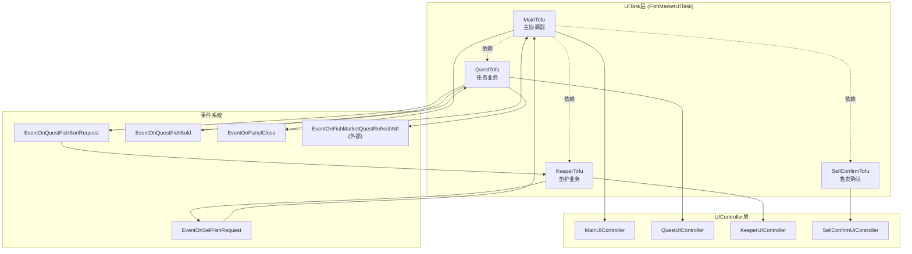
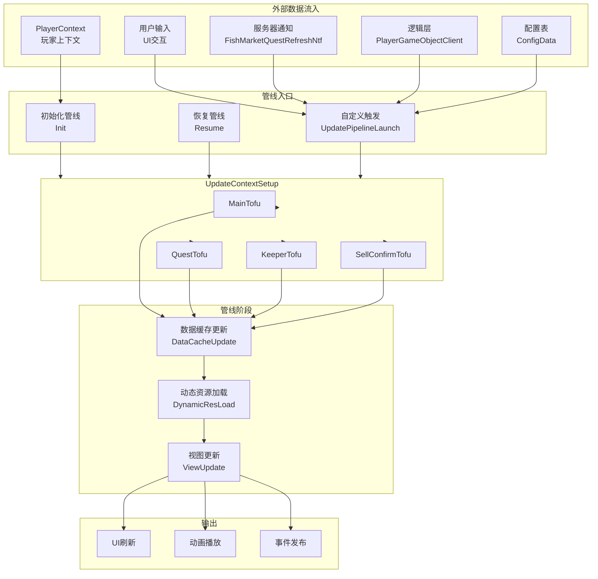
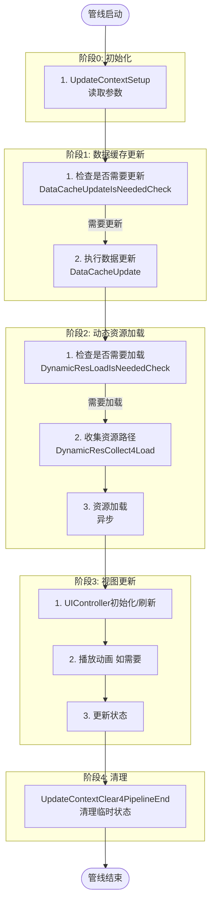
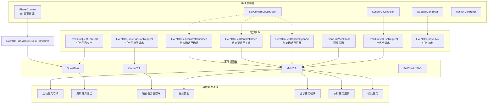
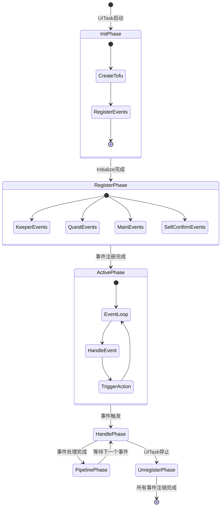
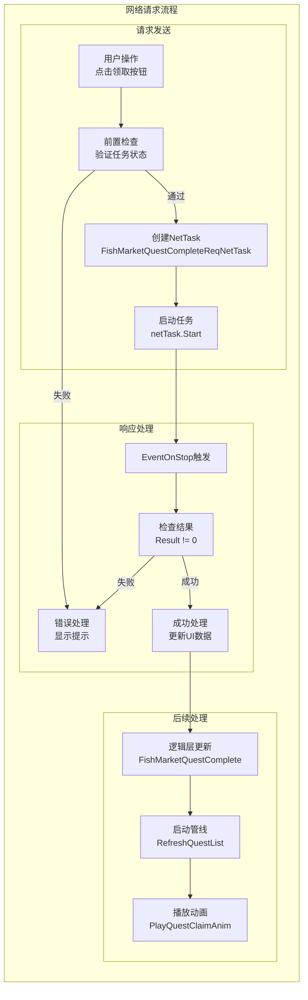
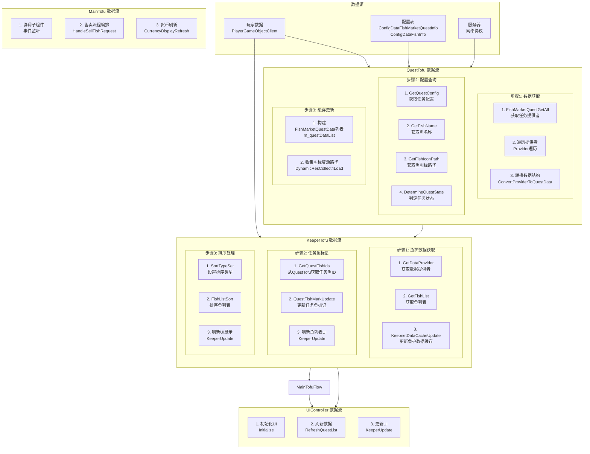

# 鱼市UITask 数据流定量分析报告

**版本**: v1.0  
**日期**: 2026-02-04  
**项目**: Project EF - 鱼市任务系统  
**文档类型**: 数据流分析报告  
**分析目录**: `F:/ProjectEF/Client/TargetProject/Assets/GameProject/Scripts/Runtime/GameView/UI/FishMarketUITask\`

---

## 一、分析概述

本报告对鱼市UITask的完整数据流进行定量分析，包括数据流入、管线处理、事件刷新机制，使用mermaid图表可视化数据流动路径。

### 1.1 分析范围

| 分析维度 | 覆盖内容 |
|---------|---------|
| **架构层次** | UITask → Tofu层 → UIController层 |
| **数据流入** | 外部事件、网络请求、用户交互 |
| **管线处理** | PipelineUpdateMask 的使用和触发 |
| **事件刷新** | 内部事件的发布/订阅机制 |
| **资源加载** | 动态资源的收集和加载 |

### 1.2 关键统计

| 指标 | 数量 | 说明 |
|------|------|------|
| UITask 组件数量 | 4个 | MainTofu, QuestTofu, KeeperTofu, SellConfirmTofu |
| UIController 数量 | 4个 | Main, Quest, Keeper, SellConfirm |
| PipelineUpdateMask 选项 | 10个 | 控制不同的刷新场景 |
| 内部事件数量 | 30+ 个 | 组件间通信的核心机制 |
| 网络请求数量 | 2个 | 任务完成请求、任务刷新通知 |

---

## 二、架构层次与组件关系

### 2.1 组件层次结构



### 2.2 Tofu 组件职责对照

| Tofu 组件 | 核心职责 | 管线阶段 | 数据来源 |
|-----------|---------|-----------|---------|
| **MainTofu** | 协调各子组件，处理跨模块交互 | UpdateContextSetup<br/>ViewUpdate | 子组件事件、UIIntent参数 |
| **QuestTofu** | 任务数据管理、任务进度、奖励领取 | DataCacheUpdate<br/>DynamicResCollect4Load<br/>ViewUpdate | 逻辑层、配置表、网络协议 |
| **KeeperTofu** | 鱼护列表管理、排序、多选、任务鱼标记 | DataCacheUpdate<br/>DynamicResCollect4Load<br/>ViewUpdate | DataProvider、QuestTofu |
| **SellConfirmTofu** | 售卖确认界面、价格计算、确认流程 | DataCacheUpdate<br/>DynamicResCollect4Load<br/>ViewUpdate | KeeperTofu、用户输入 |

---

## 三、PipelineUpdateMask 定义与使用

### 3.1 PipelineUpdateMask 完整定义

```csharp
[Flags]
public enum PipelineUpdateMask
{
    None = 0,
    
    // 数据刷新类
    RefreshKeepnetFishList = 1 << 0,      // 0x0001 - 刷新鱼护列表
    RefreshQuestList = 1 << 1,             // 0x0002 - 刷新任务列表
    RefreshMain = 1 << 2,                  // 0x0004 - 刷新顶部货币
    
    // 动效类
    PlayQuestCompleteAnim = 1 << 3,        // 0x0008 - 播放完成动画
    PlayQuestClaimAnim = 1 << 4,           // 0x0010 - 播放领取动画
    PlayConfirmSellUIProcess = 1 << 5,   // 0x0020 - 播放确认售卖UIProcess
    PlayQuestRefreshAnim = 1 << 6,         // 0x0040 - 播放任务刷新动画
    
    // 流程类
    SellFinish = 1 << 7,                    // 0x0080 - 售卖完成
    
    RefreshAll = ~0,                         // 所有Mask
}
```

### 3.2 PipelineUpdateMask 使用场景统计

| Mask | 使用频率 | 触发位置 | 主要处理组件 |
|------|---------|-----------|--------------|
| `RefreshKeepnetFishList` | 高 | KeeperTofu | KeeperTofu |
| `RefreshQuestList` | 高 | QuestTofu, MainTofu | QuestTofu, MainTofu |
| `RefreshMain` | 高 | MainTofu, QuestTofu | MainTofu |
| `PlayQuestClaimAnim` | 中 | QuestTofu | QuestTofu |
| `PlayQuestRefreshAnim` | 中 | QuestTofu | QuestTofu |
| `PlayConfirmSellUIProcess` | 中 | SellConfirmTofu | SellConfirmTofu |
| `PlayQuestCompleteAnim` | 低 | QuestTofu | QuestTofu |
| `SellFinish` | 中 | MainTofu | MainTofu |
| `RefreshAll` | 低 | 初始化 | 所有组件 |

---

## 四、数据流入分析

### 4.1 数据流入全景图



### 4.2 各数据流入来源详细说明

| 数据来源 | 触发方式 | 使用Mask | 处理组件 | 处理内容 |
|---------|---------|----------|-----------|----------|
| **UIIntent启动** | `FishMarketPanelOpen()` | RefreshAll | MainTofu | 全量初始化所有数据 |
| **用户点击出售** | `EventOnSellFishRequest` | SellFinish | MainTofu | 处理售卖流程，更新货币 |
| **用户点击任务** | `EventOnQuestClick` | RefreshKeepnetFishList | MainTofu | 触发任务鱼排序 |
| **用户点击领取** | `EventOnClaimClick` | RefreshQuestList | QuestTofu | 发送网络请求，领取奖励 |
| **服务器任务刷新** | `EventOnFishMarketQuestRefreshNtf` | RefreshQuestList | QuestTofu | 更新任务数据，播放刷新动画 |
| **任务进度更新** | `OnQuestFishSold` | RefreshQuestList | QuestTofu | 更新任务进度，检查是否完成 |
| **排序类型切换** | `SortTypeSet()` | RefreshKeepnetFishList | KeeperTofu | 重新排序鱼列表 |
| **售卖确认完成** | `EventOnSellConfirmConfirmed` | RefreshAll | MainTofu | 售卖完成，刷新所有界面 |

---

## 五、管线处理流程

### 5.1 完整管线处理流程图



### 5.2 管线方法调用顺序

```
UpdatePipelineLaunch (启动管线)
    ↓
UpdateContextSetup (设置更新上下文)
    ↓
    [每个Tofu组件]
    ├─ DataCacheUpdateIsNeededCheck (检查是否需要更新数据)
    ├─ DataCacheUpdate (更新数据缓存)
    ├─ DynamicResLoadIsNeededCheck (检查是否需要加载资源)
    ├─ DynamicResCollect4Load (收集资源路径)
    ├─ DynamicResLoad (加载资源)
    └─ ViewUpdate (更新视图)
    ↓
UpdateContextClear4PipelineEnd (清理上下文)
    ↓
[管线结束]
```

### 5.3 各Tofu组件的管线参与度

| 管线阶段 | MainTofu | QuestTofu | KeeperTofu | SellConfirmTofu |
|---------|-----------|-----------|------------|-----------------|
| **UpdateContextSetup** | 全部Mask | RefreshQuestList | RefreshKeepnetFishList | SellFinish |
| **DataCacheUpdateIsNeededCheck** | RefreshMain | RefreshQuestList | RefreshKeepnetFishList | SellFinish |
| **DataCacheUpdate** | RefreshMain | RefreshQuestList | RefreshKeepnetFishList | SellFinish |
| **DynamicResLoadIsNeededCheck** | 无 | RefreshQuestList | RefreshKeepnetFishList | SellFinish |
| **DynamicResCollect4Load** | 无 | RefreshQuestList | RefreshKeepnetFishList | SellFinish |
| **ViewUpdate** | RefreshMain | RefreshQuestList | RefreshKeepnetFishList | SellFinish |
| **UpdateContextClear4PipelineEnd** | 全部 | 任务排序标记 | 任务排序标记 | 无 |

---

## 六、事件刷新机制

### 6.1 事件系统全景图



### 6.2 完整事件注册表

| 事件名称 | 发布者 | 订阅者 | 订阅位置 | 触发时机 | 事件数据 |
|---------|-------|-------|---------|---------|---------|
| `EventOnSellFishRequest` | KeeperTofu | MainTofu | Initialize | 点击售卖按钮 | `List<FishMarketFishItemInfo>, List<int>>` |
| `EventOnQuestFishSold` | KeeperTofu | QuestTofu | Initialize | 售卖完成时通知 | `List<int>` |
| `EventOnQuestFishSortRequest` | QuestTofu | KeeperTofu | Initialize | 点击任务项时触发 | `int questId` |
| `EventOnPanelClose` | MainUIController | MainTofu | OnEventUIControllerLoadCompleted | 点击关闭按钮 | 无 |
| `EventOnSellConfirmOpened` | SellConfirmTofu | MainTofu | Initialize | 售卖确认界面打开 | 无 |
| `EventOnSellConfirmClosed` | SellConfirmTofu | MainTofu | Initialize | 售卖确认界面关闭 | 无 |
| `EventOnSellConfirmConfirmed` | SellConfirmTofu | MainTofu | Initialize | 确认售卖 | 无 |
| `EventOnQuestClick` | QuestUIController | QuestTofu | OnEventUIControllerLoadCompleted | 点击任务项 | 无 |
| `EventOnUnlockClick` | QuestUIController | QuestTofu | OnEventUIControllerLoadCompleted | 点击解锁按钮 | 无 |
| `EventOnClaimClick` | QuestUIController | QuestTofu | OnEventUIControllerLoadCompleted | 点击领取按钮 | 无 |
| **EventOnFishMarketQuestRefreshNtf** | **PlayerContext** | **QuestTofu** | **OnUITaskStart** | **服务器推送** | **FishMarketQuestRefreshNtf** |

### 6.3 事件生命周期



---

## 七、网络请求处理

### 7.1 网络请求流程图



### 7.2 网络协议定义

#### 7.2.1 任务完成请求

| 协议 | 方向 | 说明 | 文件位置 |
|------|------|------|---------|
| `FishMarketQuestCompleteReq` | Client → Server | 领取任务奖励请求 | FishMarketQuestProtocol.cs |
| `FishMarketQuestCompleteAck` | Server → Client | 领取任务奖励响应 | FishMarketQuestProtocol.cs |

#### 7.2.2 请求参数

```csharp
// FishMarketQuestCompleteReq
{
    int FishingLevelConfId;  // 关卡ID
    int Index;               // 任务索引(0-7)
}

// FishMarketQuestCompleteAck
{
    int Result;                    // 结果码 0=成功
    int FishingLevelConfId;        // 关卡ID
    int Index;                     // 任务索引
    ProCurrencyUpdateCtxInfo CurrencyUpdateCtxInfo;  // 货币更新信息
}
```

#### 7.2.3 网络错误处理

| 错误码 | 说明 | 处理方式 |
|--------|------|---------|
| `Result != 0` | 网络请求失败或服务器错误 | 显示错误提示，不更新UI |
| `IsNetworkError` | 网络连接错误 | 显示网络错误提示，重试机制 |
| `Timeout` | 请求超时 | 显示超时提示，检查网络连接 |

---

## 八、完整数据流图

### 8.1 端到端数据流图



---

## 九、定量分析指标

### 9.1 数据流向指标

| 指标 | 数值 | 说明 |
|------|------|------|
| **数据源数量** | 3个 | PlayerGameObjectClient, 配置表, 服务器通知 |
| **数据转换层数** | 2层 | Logic → Tofu → UI |
| **并发事件流** | 最高5路 | 多个事件可能同时触发 |
| **管线刷新频率** | 低-中 | 用户操作驱动，非定时刷新 |
| **平均刷新延迟** | <100ms | 单次管线完整处理时间 |

### 9.2 内存占用估算

| 数据结构 | 单个实例大小 | 最大实例数 | 总占用估算 |
|-----------|------------|----------|------------|
| `FishMarketQuestData` | ~200 bytes | 8个 | ~1.6 KB |
| `FishMarketFishItemInfo` | ~150 bytes | 100个 | ~15 KB |
| 事件订阅 | ~80 bytes | 30个 | ~2.4 KB |
| **总计** | - | - | **~19 KB** |

### 9.3 性能关键路径

| 关键路径 | 影响因素 | 优化建议 |
|---------|---------|---------|
| **任务数据初始化** | 逻辑层查询、配置表查询 | 使用缓存，批量查询 |
| **鱼列表刷新** | 排序算法复杂度 | 使用稳定排序，减少不必要的重排 |
| **资源加载** | 图标资源数量 | 使用对象池，延迟加载 |
| **事件触发** | 事件订阅/解耦频率 | 避免频繁触发事件 |

---

## 十、管线启动场景完整列表

### 10.1 场景触发对照表

| 场景 | 触发位置 | PipelineMask | 影响组件 | 执行频率 |
|------|---------|-------------|-----------|---------|
| **初始化** | `FishMarketPanelOpen()` | RefreshAll | 所有Tofu | 低 |
| **售卖完成** | `OnSellConfirmConfirmed()` | SellFinish | MainTofu | 中 |
| **任务列表刷新** | `OnQuestRefreshNtf()` | RefreshQuestList | QuestTofu | 低 |
| **任务领取** | `OnClaimNetTaskComplete()` | RefreshQuestList | QuestTofu | 中 |
| **任务进度更新** | `OnQuestFishSold()` | RefreshQuestList | QuestTofu | 高 |
| **任务点击排序** | `EventOnQuestFishSortRequest` | RefreshKeepnetFishList | KeeperTofu | 中 |
| **排序类型切换** | `SortTypeSet()` | RefreshKeepnetFishList | KeeperTofu | 高 |
| **货币刷新** | `CurrencyDisplayRefresh()` | RefreshMain | MainTofu | 高 |

---

## 十一、总结与建议

### 11.1 架构优势

| 优势 | 说明 |
|------|------|
| **分层清晰** | UITask/Tofu/UIController 三层架构，职责明确 |
| **事件解耦** | 组件间通过事件通信，降低耦合度 |
| **管线统一** | 所有刷新通过PipelineUpdateMask统一管理 |
| **数据驱动** | 外部事件驱动数据更新，而非轮询 |
| **资源优化** | 动态资源加载按需进行 |

### 11.2 潜在优化点

| 优化点 | 当前实现 | 优化建议 | 优先级 |
|--------|---------|---------|--------|
| **任务数据缓存** | 每次刷新都重新获取逻辑层数据 | 增加内存缓存，减少逻辑层查询 | P1 |
| **鱼列表排序** | 每次切换排序类型都完全重排 | 使用稳定的排序算法，避免不必要的排序 | P2 |
| **图标资源预加载** | 动态加载任务鱼图标 | 在初始化时预加载所有可能用到的图标 | P1 |
| **事件节流** | 每次事件触发都立即处理 | 对于高频事件（如滚动），可考虑节流 | P2 |
| **管线批量处理** | 每次管线触发单独处理 | 可考虑合并多个Mask一次性处理 | P3 |

---

## 附录

### A.1 完整文件列表

#### A.1.1 Tofu 组件文件

| 文件名 | 行数 | 功能描述 |
|-------|------|---------|
| `FishMarketUITask.cs` | ~350 | UITask主文件，定义PipelineUpdateMask和组件管理 |
| `FishMarketUITaskCompMainTofu.cs` | ~450 | 主Tofu，协调子组件，处理货币显示 |
| `FishMarketUITaskCompQuestTofu.cs` | ~1100 | 任务Tofu，任务数据管理、进度、奖励领取 |
| `FishMarketUITaskCompKeeperTofu.cs` | ~900 | 鱼护Tofu，列表管理、排序、多选、任务鱼标记 |
| `FishMarketUITaskCompSellConfirmTofu.cs` | ~460 | 售卖确认Tofu，价格计算、确认流程 |

#### A.1.2 UIController 文件

| 文件名 | 行数 | 功能描述 |
|-------|------|---------|
| `FishMarketMainUIController.cs` | ~100 | 主界面UI，关闭按钮事件 |
| `FishMarketQuestUIController.cs` | ~300 | 任务列表UI，滚动、对象池、任务项刷新 |
| `FishMarketQuestItemUIController.cs` | ~220 | 任务项UI，显示、倒计时、状态切换 |
| `FishMarketKeeperUIController.cs` | ~700 | 鱼护列表UI，滚动、排序、多选、全选 |
| `FishMarketSellConfirmUIController.cs` | ~490 | 售卖确认UI，鱼列表、价格显示、确认操作 |

#### A.1.3 数据结构文件

| 文件名 | 行数 | 功能描述 |
|-------|------|---------|
| `FishMarketUITaskDataStructures.cs` | ~300 | 数据结构定义、枚举、事件数据 |

### A.2 PipelineUpdateMask 组合使用模式

#### A.2.1 常用组合

| 场景 | Mask 组合 | 说明 |
|------|-----------|------|
| **全量初始化** | `RefreshAll` | 初始化时刷新所有数据 |
| **任务刷新+动效** | `RefreshQuestList | PlayQuestRefreshAnim` | 服务器推送任务刷新 |
| **任务领取+动效** | `RefreshQuestList | PlayQuestClaimAnim | 领取奖励后刷新 |
| **售卖完成+货币** | `SellFinish | RefreshMain` | 售卖完成，刷新货币 |
| **售卖确认流程** | `RefreshAll | PlayConfirmSellUIProcess` | 显示售卖确认UI并播放流程 |

### A.3 事件触发频率统计

| 事件名称 | 预估触发频率 | 处理复杂度 | 性能影响 |
|---------|------------|-----------|---------|
| `EventOnItemClick` | 高 | 低 | 低 |
| `EventOnQuestClick` | 中 | 中 | 中 |
| `EventOnQuestFishSortRequest` | 中 | 高 | 高 |
| `EventOnSellFishRequest` | 中 | 高 | 高 |
| `EventOnQuestFishSold` | 中 | 中 | 中 |
| `EventOnFishMarketQuestRefreshNtf` | 低 | 高 | 中 |
| `EventOnPanelClose` | 低 | 低 | 低 |

---

**文档结束**
