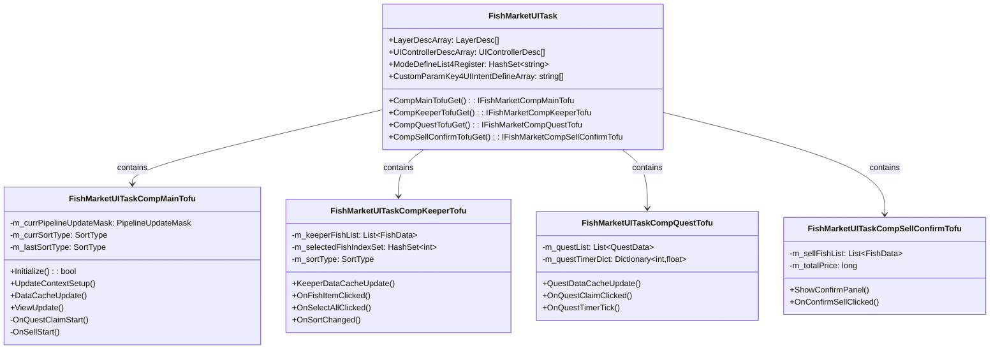
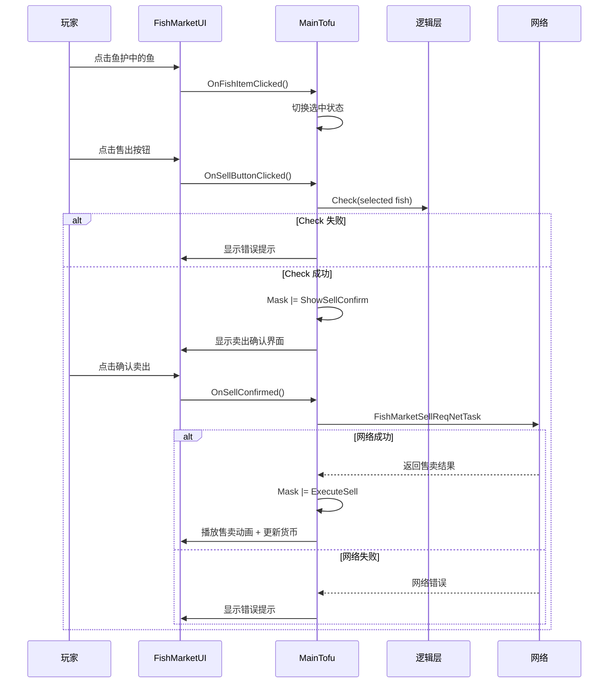
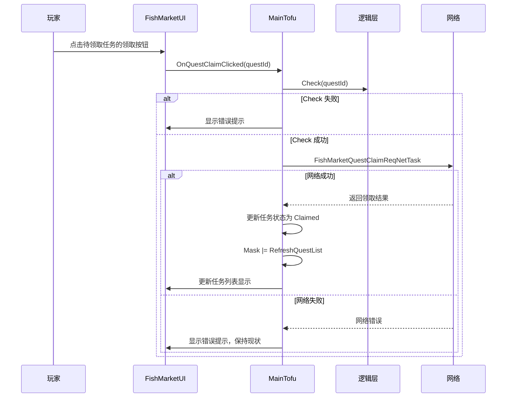
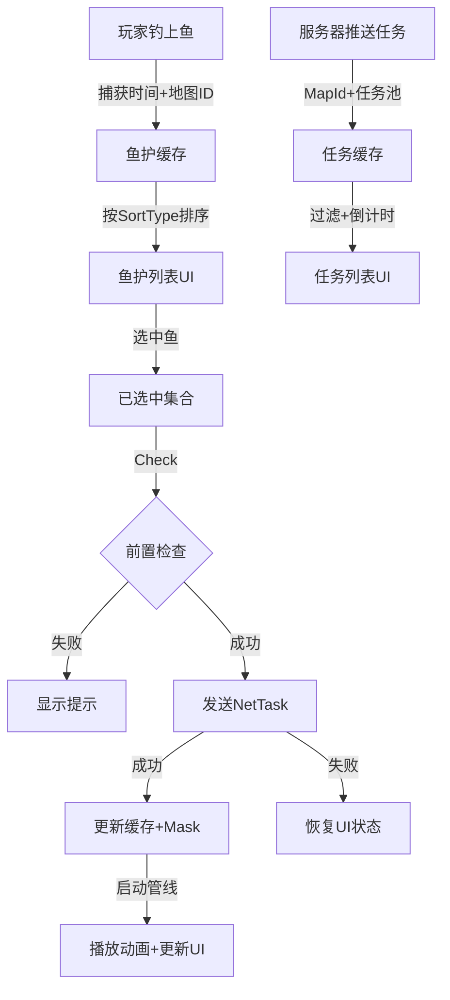
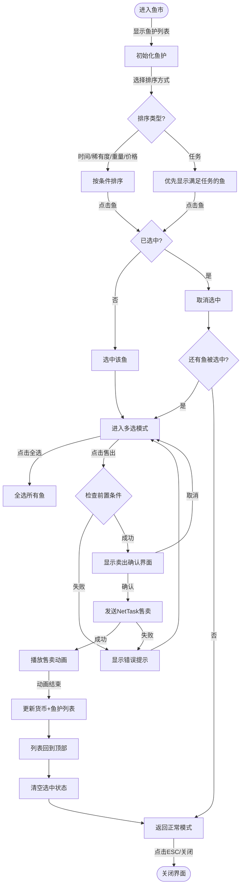
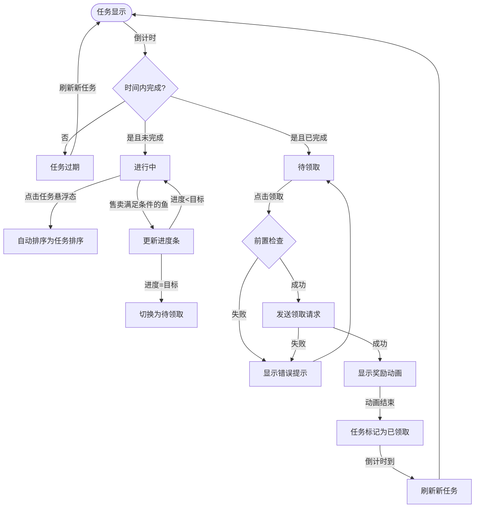

# 鱼市(FishMarket)UI设计文档 | v2.0 | 2026-02-02

## 逻辑审计与交互审计自检 (Logic & Architecture Audit)

### 逻辑审计报告

#### 风险点汇总

| 信号类型 | 问题描述 | PRD位置 | 严重程度 |
|----------|----------|--------|----------|
| 孤立动词 | "刷新"任务的触发时机和完成条件未明确 | 系统功能-刷新规则 | ⚠️ 中 |
| 宾语缺失 | "任务完成"后的邮件发送未定义具体的业务流程 | 系统功能-刷新规则#3 | ⚠️ 中 |
| 闭环缺失 | "点击领取奖励"后的网络失败处理未定义 | 界面逻辑-限时任务#6 | ⚠️ 中 |
| 形容词互斥 | "进度条"同时显示"已完成+待领取+进行中"三种状态，切换逻辑不清 | 界面逻辑-限时任务 | ⚠️ 中 |
| 边界问题 | 任务刷新时机：服务器推送还是客户端轮询 | 系统功能-刷新规则#1 | ⚠️ 中 |
| 边界问题 | 新鲜度为0的鱼"无法完成任务"，但售价是否仍按幼年体计算 | 系统功能-新鲜度 vs 界面逻辑#10 | ⚠️ 中 |
| 跨层耦合 | 鱼护排序逻辑（任务排序）涉及逻辑层数据，需明确边界 | 系统功能-排序#2,#3 | ⚠️ 中 |
| 模糊定义 | "满足任务条件的鱼会优先排在前方"，排序算法未定义（优先级权重） | 系统功能-排序#3 | ℹ️ 低 |

#### 修正建议

1. **刷新规则明确化**
   - 刷新采用"服务器推送 + 客户端60秒定时同步"的双保险策略
   - 刷新完成后，通过 Mask 标记 `RefreshQuestList` 触发管线更新

2. **奖励领取流程规范化**
   - 流程：Check -> NetTask (FishMarketQuestClaimReqNetTask) -> Mask (RefreshQuestList) -> Pipeline
   - 网络失败：显示通用错误提示，保持当前状态不变

3. **任务状态转换明确化**
   - 三态模型：进行中 -> 完成待领取 -> 已领取（完成）
   - 完成待领取时显示"待领取"按钮，已领取时按钮置灰

4. **新鲜度与售价规范**
   - 新鲜度为0的鱼：无法完成任务，但销售时按"幼年体"单价计算（已在系统功能中明确）
   - 鱼护中的任务标记在新鲜度为0时置灰，显示感叹号提示

5. **排序规则权重定义**
   - 任务排序优先级：`满足当前任务的鱼 > 按获得时间倒序`
   - 若多条鱼都满足任务条件，则按获得时间倒序排列

6. **全选逻辑规范**
   - 全选按钮状态：`手动全选 = 自动判断（所有鱼都选中）`
   - 取消单条鱼选中 -> 全选按钮自动变为未选状态

---

### 交互审计报告

#### 问题点汇总

| 问题类型 | 问题描述 | PRD位置 | 影响范围 |
|----------|----------|--------|----------|
| ESC闭环缺失 | 鱼护中手动全选后，按ESC应返回未选状态还是保持选中 | 界面逻辑-鱼护#10 | 中 |
| 管线触发不清 | 任务悬浮态点击后自动排序切换，是否需要启动刷新管线 | 界面逻辑-限时任务#8 | 中 |
| 初始化恢复缺陷 | 返回鱼市界面后是否恢复之前的排序方式和选中状态 | 系统功能-排序刷新 | 中 |
| UIProcess设计缺失 | 售卖动画表现的"一段动画表现"未拆解成具体的UIProcess | 界面逻辑-卖出确认#4 | 中 |
| 输入阻塞策略缺失 | 售卖确认动画播放期间是否允许用户操作 | 界面逻辑-卖出确认#4-5 | 中 |

#### 建议

1. **ESC返回逻辑统一**
   - ESC在"多选状态"下返回主界面（鱼护回到首位）
   - 在"卖出确认界面"下返回鱼护界面（选中状态保持）

2. **管线驱动明确化**
   - 任务悬浮态点击 -> 启动 Mask (RefreshKeeperList | SwitchSortToTask) -> 刷新排序
   - 排序切换后，鱼护列表自动刷新，满足条件的鱼排到前列

3. **排序恢复规则**
   - 返回鱼市界面：恢复"最后使用的排序方式"（记录在 m_lastSortType）
   - 若上次是任务排序，任务完成后自动切换回"时间排序"

4. **售卖动画UIProcess拆解**
   - `SellAnimationUIProcessCreate()` 包含：
     - 资源加载 -> 动画播放 -> 结果显示 -> 延迟关闭
   - 播放期间设置 `m_isBlockGlobalUIInput = true` 阻止用户操作

5. **多选选中状态管理**
   - 进入多选 -> 选中状态保存在 `m_selectedFishIndexSet`
   - 返回鱼护界面 -> 恢复之前选中的鱼（高亮显示）
   - 售卖后 -> 清空选中状态，回到未选中

---

### Mode-Action 状态矩阵表

#### 纵轴（Y）：ModeDefineList4Register

| Mode名称 | 说明 | 初始状态 |
|----------|------|----------|
| `Default` | 默认状态，显示鱼护和任务列表 | ✓ |
| `TaskObserving` | 任务悬浮态观察状态 | - |
| `KeeperMultiSelect` | 鱼护多选状态 | - |
| `SellConfirming` | 售卖确认界面显示 | - |
| `SellAnimating` | 售卖动画播放中 | - |

#### 横轴（X）：用户交互行为

| Action | Default | TaskObserving | KeeperMultiSelect | SellConfirming | SellAnimating |
|--------|---------|---------------|-------------------|----------------|---------------|
| Click_Task | 进入任务排序，Mask=SwitchSortToTask | - | 进入单选模式 | 返回多选 | 阻塞 |
| Click_Fish | 进入多选模式 | - | 切换选中状态 | 返回多选 | 阻塞 |
| Click_SelectAll | 全选所有鱼 | - | 全选或取消全选 | 返回多选 | 阻塞 |
| Click_Sell | 弹出卖出确认，Mask=ShowSellConfirm | - | 弹出卖出确认 | - | 阻塞 |
| Click_SellConfirm | N/A | N/A | N/A | 播放售卖动画，Mask=ExecuteSell | 阻塞 |
| Click_Cancel | 返回鱼护 | 返回Default | 返回Default | 返回多选 | 阻塞 |
| Press_ESC | 关闭界面 | 返回Default | 返回Default | 返回多选 | 阻塞 |
| Press_Space | N/A | N/A | N/A | 确认售卖 | 阻塞 |
| Scroll_Keeper | 滚动鱼护列表 | 滚动 | 滚动 | 返回多选 | 阻塞 |
| Hover_Fish | 显示悬浮态信息 | - | 显示 | 返回多选 | 阻塞 |

---

## 1. 任务定义 (UITask & Intent)

### UITask Name
`FishMarketUITask`

### Intent Params

| 参数名 | 类型 | 必填 | 说明 |
|--------|------|------|------|
| `MapId` | `int` | 是 | 当前地图ID，用于获取对应的限时任务 |
| `OnCloseCallback` | `Action` | 否 | 界面关闭时的回调 |

### UITofu 职责划分

| Tofu名称 | 继承基类 | 职责 | 核心功能 | 关键事件 |
|----------|---------|------|----------|----------|
| **MainTofu** | `UITaskCompTofuBase` | 主业务协调 | 管线调度、跨区域协调、逻辑层交互 | `EventOnQuestClaimStart`, `EventOnSellStart` |
| **KeeperTofu** | `UITaskCompTofuBase` | 鱼护业务 | 鱼护列表缓存、选中状态、排序规则 | `EventOnFishSelected`, `EventOnSortChanged` |
| **QuestTofu** | `UITaskCompTofuBase` | 任务业务 | 限时任务缓存、进度更新、倒计时管理 | `EventOnQuestProgress`, `EventOnQuestComplete` |
| **SellConfirmTofu** | `UITaskCompTofuBase` | 售卖确认 | 确认面板显示、售卖动画编排 | `EventOnSellConfirm` |

### Intent 参数定义

```csharp
#region Intent Param Keys
public const string IntentParamKey4MapId = "MapId";
public const string IntentParamKey4OnCloseCallback = "OnCloseCallback";
#endregion
```

### UITask 类图



### Interface 定义

```csharp
// UITask 外部接口
public interface IFishMarketUITask
{
    void RefreshQuestProgress(int questId, int progress);
    void OnFishSold(int fishCount, long totalPrice);
    void OnQuestClaimed(int questId, int rewardId);
}

// MainTofu Owner 接口
public interface IFishMarketCompOwner : IUITaskCompOwnerBase, IFishMarketUITask
{
    IFishMarketCompMainTofu CompMainTofuGet();
    IFishMarketCompKeeperTofu CompKeeperTofuGet();
    IFishMarketCompQuestTofu CompQuestTofuGet();
    IFishMarketCompSellConfirmTofu CompSellConfirmTofuGet();
}
```

---

## 2. 业务中枢 (MainTofu & Data)

### 数据缓存结构 (Data Cache)

#### 鱼护数据

```csharp
public class FishData
{
    public int FishId { get; set; }                    // 鱼ID
    public int FishTypeId { get; set; }                // 鱼种类ID
    public string FishName { get; set; }               // 鱼名称
    public int Quality { get; set; }                   // 品质 (1-5)
    public float Freshness { get; set; }               // 新鲜度 (0-100)
    public float Weight { get; set; }                  // 重量 (kg)
    public long SellPrice { get; set; }                // 售价 (银币)
    public DateTime CatchTime { get; set; }            // 捕获时间
    public int MapId { get; set; }                     // 捕获地图ID
    public bool IsTaskMatched { get; set; }            // 是否满足当前任务
    public int TaskMatchedQuestId { get; set; }        // 匹配的任务ID（-1 = 不匹配）
}
```

#### 任务数据

```csharp
public class QuestData
{
    public int QuestId { get; set; }                   // 任务ID
    public int MapId { get; set; }                     // 地图ID
    public int TargetFishTypeId { get; set; }          // 目标鱼种ID
    public float WeightCondition { get; set; }         // 重量条件 (0 = 无条件)
    public int TargetCount { get; set; }               // 目标数量
    public int CurrentProgress { get; set; }           // 当前进度
    public QuestStatus Status { get; set; }            // 任务状态
    public DateTime RefreshTime { get; set; }          // 刷新时间
    public long RewardAmount { get; set; }             // 奖励金币
    public int RewardId { get; set; }                  // 奖励ID
}

public enum QuestStatus
{
    InProgress = 0,      // 进行中
    CompleteWaitClaim = 1, // 完成待领取
    Claimed = 2,         // 已领取
    Locked = 3           // 待解锁 (Alpha1不做)
}
```

#### 排序类型

```csharp
public enum SortType
{
    Time = 0,            // 获得时间（默认）
    Rarity = 1,          // 稀有度
    Weight = 2,          // 重量
    Price = 3,           // 售价
    Task = 4             // 任务
}
```

### MainTofu 关键成员

```csharp
public class FishMarketUITaskCompMainTofu : UITaskCompTofuBase
{
    // 数据缓存
    private List<FishData> m_keeperFishCache;          // 鱼护鱼列表缓存
    private List<QuestData> m_questCache;              // 限时任务列表缓存
    private HashSet<int> m_selectedFishIndexSet;       // 已选中的鱼索引集合
    private SortType m_currSortType;                   // 当前排序方式
    private SortType m_lastSortType;                   // 上次使用的排序方式

    // UI状态
    private PipelineUpdateMask m_currPipelineUpdateMask; // 当前管线更新掩码
    private bool m_isQuestClaimRequesting;             // 是否正在请求领取奖励
    private bool m_isSellConfirmed;                    // 是否确认售卖

    // 控制器引用
    private FishMarketMainUIController m_mainUICtrl;
    private FishMarketKeeperUIController m_keeperUICtrl;
    private FishMarketQuestUIController m_questUICtrl;
    private FishMarketSellConfirmUIController m_sellConfirmUICtrl;

    // 组件引用
    private IFishMarketCompKeeperTofu m_compKeeperTofu;
    private IFishMarketCompQuestTofu m_compQuestTofu;
    private IFishMarketCompSellConfirmTofu m_compSellConfirmTofu;
}
```

### 业务逻辑流程 (Business Logic)

#### 售卖流程



#### 任务领取流程



### 数据流向图



---

## 3. 业务流程与状态机 (Flow & State)

### 业务流程图

#### 鱼护操作流程



#### 任务交互流程



### 状态枚举定义

```csharp
// 任务状态 (QuestStatus)
public enum QuestStatus
{
    InProgress = 0,      // 进行中：任务目标未达成，可继续售卖
    CompleteWaitClaim = 1, // 待领取：任务目标已达成，等待玩家点击领取
    Claimed = 2,         // 已领取：玩家已领取奖励，任务完成
    Locked = 3           // 待解锁：某些条件不满足，任务栏未解锁（Alpha1不做）
}

// 排序类型 (SortType)
public enum SortType
{
    Time = 0,            // 获得时间（默认，倒序）
    Rarity = 1,          // 稀有度（降序）
    Weight = 2,          // 重量（降序）
    Price = 3,           // 售价（降序）
    Task = 4             // 任务（满足条件的优先，再按时间倒序）
}

// 鱼护多选状态 (SelectMode)
public enum SelectMode
{
    None = 0,            // 未选中
    PartialSelect = 1,   // 部分选中
    AllSelect = 2        // 全选
}
```

### 流转逻辑

#### 任务状态转换

```
InProgress
  ├─ 玩家完成目标 → CompleteWaitClaim
  └─ 时间到达刷新时间 → 刷新新任务（InProgress）

CompleteWaitClaim
  ├─ 玩家点击领取 → Claimed
  └─ 时间到达刷新时间 → 邮件发送奖励 → 刷新新任务

Claimed
  └─ 倒计时到 → 完全移出列表，显示新任务

Locked (Alpha1不做)
  └─ 满足解锁条件 → 显示可解锁界面
```

#### 排序模式转换

```
默认排序 (Time)
  ├─ 用户选择其他排序 → 切换到新排序类型
  └─ 点击任务悬浮态 → 自动切换为 Task 排序

Task 排序
  ├─ 任务完成领取后 → 自动返回上次排序方式
  └─ 用户手动选择其他排序 → 切换到新排序类型

其他排序 (Rarity/Weight/Price)
  └─ 保持不变，直到用户主动改变
```

---

## 4. 驱动与刷新 (Pipeline & Mask)

### PipelineUpdateMask 定义

```csharp
[Flags]
public enum PipelineUpdateMask
{
    None = 0,

    // 鱼护刷新
    RefreshKeeperList = 1 << 0,           // 刷新鱼护列表数据
    RefreshKeeperListStayPos = 1 << 1,    // 刷新鱼护列表但保持滚动位置

    // 任务刷新
    RefreshQuestList = 1 << 2,            // 刷新任务列表数据
    RefreshQuestProgress = 1 << 3,        // 更新单个任务进度

    // 排序相关
    SwitchSortToTask = 1 << 4,            // 切换排序为任务排序
    SwitchSortToNormal = 1 << 5,          // 切换排序为默认排序

    // 确认界面相关
    ShowSellConfirm = 1 << 6,             // 显示卖出确认界面
    HideSellConfirm = 1 << 7,             // 隐藏卖出确认界面
    ExecuteSell = 1 << 8,                 // 执行售卖（发网络请求）

    // 综合刷新
    RefreshAll = 1 << 9                   // 完整刷新所有内容
}
```

### Mask 参数Key定义

```csharp
#region PipelineUpdateMask Param Key
public const string ParamKeyPipelineUpdateMask = "PipelineUpdateMask";
#endregion
```

### ViewUpdate 策略

#### MainTofu ViewUpdate 实现

```csharp
public override void ViewUpdate(IUITaskUpdatePipelineController pipelineCtrl)
{
    // 1. 初始化/恢复时显示界面
    if (IsPipelineInitOrResume())
    {
        pipelineCtrl.UIProcessPlayInPipeline(
            m_mainUICtrl.PanelShowUIProcessCreate());
    }

    // 2. 根据 Mask 刷新鱼护列表
    if (m_currPipelineUpdateMask.HasFlag(PipelineUpdateMask.RefreshKeeperList))
    {
        m_keeperUICtrl.KeeperListRefresh(m_keeperFishCache);
        // 列表滚到顶部
    }

    if (m_currPipelineUpdateMask.HasFlag(PipelineUpdateMask.RefreshKeeperListStayPos))
    {
        m_keeperUICtrl.KeeperListRefresh(m_keeperFishCache, stayPos: true);
    }

    // 3. 根据 Mask 刷新任务列表
    if (m_currPipelineUpdateMask.HasFlag(PipelineUpdateMask.RefreshQuestList))
    {
        m_questUICtrl.QuestListRefresh(m_questCache);
    }

    if (m_currPipelineUpdateMask.HasFlag(PipelineUpdateMask.RefreshQuestProgress))
    {
        var questId = m_currContextParamDict.GetStructParam<int>("QuestIdToRefresh");
        m_questUICtrl.QuestProgressRefresh(questId, m_questCache);
    }

    // 4. 根据 Mask 切换排序
    if (m_currPipelineUpdateMask.HasFlag(PipelineUpdateMask.SwitchSortToTask))
    {
        m_currSortType = SortType.Task;
        // 重新排序并刷新鱼护列表
        m_keeperFishCache = SortFishList(m_keeperFishCache, SortType.Task);
        m_keeperUICtrl.KeeperListRefresh(m_keeperFishCache);
    }

    // 5. 显示/隐藏卖出确认界面
    if (m_currPipelineUpdateMask.HasFlag(PipelineUpdateMask.ShowSellConfirm))
    {
        pipelineCtrl.UIProcessPlayInPipeline(
            m_sellConfirmUICtrl.PanelShowUIProcessCreate());
    }

    if (m_currPipelineUpdateMask.HasFlag(PipelineUpdateMask.HideSellConfirm))
    {
        pipelineCtrl.UIProcessPlayInPipeline(
            m_sellConfirmUICtrl.PanelHideUIProcessCreate());
    }

    // 6. 执行售卖动画
    if (m_currPipelineUpdateMask.HasFlag(PipelineUpdateMask.ExecuteSell))
    {
        pipelineCtrl.UIProcessPlayInPipeline(
            m_mainUICtrl.SellAnimationUIProcessCreate(),
            onEnd: (process, isComplete) =>
            {
                // 动画完成后，刷新鱼护列表和更新货币显示
                var info = m_owner.CompUpdatePipelineManagerGet()
                    .UpdatePipelineInitInfoAlloc();
                info.m_customParamDict.SetParam(
                    ParamKeyPipelineUpdateMask,
                    PipelineUpdateMask.RefreshKeeperList);
                m_owner.CompUpdatePipelineManagerGet()
                    .UpdatePipelineLaunch(info);
            });
    }
}
```

#### 管线启动示例

```csharp
// 售卖确认后启动管线
private void OnSellConfirmed()
{
    var pipelineInitInfo = m_owner.CompUpdatePipelineManagerGet()
        .UpdatePipelineInitInfoAlloc();
    pipelineInitInfo.m_customParamDict.SetParam(
        ParamKeyPipelineUpdateMask,
        PipelineUpdateMask.ExecuteSell);
    pipelineInitInfo.m_isBlockGlobalUIInput = true;
    m_owner.CompUpdatePipelineManagerGet().UpdatePipelineLaunch(pipelineInitInfo);
}

// 任务完成后更新进度
public void OnFishSold(int fishCount, long totalPrice)
{
    // 检查是否完成任务
    var completedQuestIds = CheckQuestCompletion(m_selectedFishIndexSet);

    if (completedQuestIds.Count > 0)
    {
        var pipelineInitInfo = m_owner.CompUpdatePipelineManagerGet()
            .UpdatePipelineInitInfoAlloc();
        pipelineInitInfo.m_customParamDict.SetParam(
            ParamKeyPipelineUpdateMask,
            PipelineUpdateMask.RefreshQuestProgress);
        pipelineInitInfo.m_customParamDict.SetParam(
            "QuestIdToRefresh",
            completedQuestIds[0]);
        m_owner.CompUpdatePipelineManagerGet().UpdatePipelineLaunch(pipelineInitInfo);
    }
}
```

---

## 5. 视图表现 (UIController & UIProcess)

### Controller 层职责与接口

#### FishMarketMainUIController 接口

```csharp
public class FishMarketMainUIController : UIControllerBase
{
    // 面板显示/隐藏
    public UIProcess PanelShowUIProcessCreate();
    public UIProcess PanelHideUIProcessCreate();

    // 售卖动画
    public UIProcess SellAnimationUIProcessCreate();
    public void CurrencyDisplay(long amount);

    // 综合刷新
    public void ViewRefresh();
}
```

#### FishMarketKeeperUIController 接口

```csharp
public class FishMarketKeeperUIController : UIControllerBase
{
    // 列表刷新与操作
    public void KeeperListRefresh(List<FishData> fishList, bool stayPos = false);
    public void SelectFish(int index);
    public void DeselectFish(int index);
    public void SelectAllFish();
    public void DeselectAllFish();

    // 排序切换
    public void SortTypeSet(SortType sortType);

    // UI状态更新
    public void SellButtonEnable(bool enable);
    public void SelectAllButtonStateSet(bool isAllSelected);
}
```

#### FishMarketQuestUIController 接口

```csharp
public class FishMarketQuestUIController : UIControllerBase
{
    // 任务列表刷新
    public void QuestListRefresh(List<QuestData> questList);

    // 单个任务更新
    public void QuestProgressRefresh(int questId, List<QuestData> questList);
    public void QuestStatusSet(int questId, QuestStatus status);

    // 倒计时显示
    public void QuestTimerDisplay(int questId, int remainingSeconds);
}
```

#### FishMarketSellConfirmUIController 接口

```csharp
public class FishMarketSellConfirmUIController : UIControllerBase
{
    // 面板显示/隐藏
    public UIProcess PanelShowUIProcessCreate();
    public UIProcess PanelHideUIProcessCreate();

    // 确认面板数据更新
    public void ConfirmPanelRefresh(List<FishData> fishList, long totalPrice);

    // 事件
    public event Action EventOnConfirmClicked;
    public event Action EventOnCancelClicked;
}
```

### UIProcess 设计

#### 售卖动画 UIProcess

```csharp
// Controller 内实现
public UIProcess SellAnimationUIProcessCreate()
{
    // 并行执行：数字递增 + 表现动画
    var mainProcess = UIProcessFactory.CreateExecutorProcess(
        UIProcess.ProcessExecMode.Parallel);

    // 1. 货币数字递增动画
    var currencyProcess = UIProcessFactory.CreateExecutorProcess(
        UIProcess.ProcessExecMode.Serial,
        executeOnEnd =>
        {
            StartCoroutine(PlayCurrencyIncreaseAnim(
                m_initialCurrency,
                m_initialCurrency + m_totalSellPrice,
                1.0f,
                () => executeOnEnd?.Invoke(true)));
        });
    mainProcess.AddChild(currencyProcess);

    // 2. 浮动文字表现
    var floatingTextProcess = UIProcessFactory.CreateExecutorProcess(
        UIProcess.ProcessExecMode.Serial,
        executeOnEnd =>
        {
            ShowFloatingText("+" + m_totalSellPrice, Color.yellow);
            executeOnEnd?.Invoke(true);
        });
    mainProcess.AddChild(floatingTextProcess);

    // 3. 延迟关闭确认面板
    var delayCloseProcess = UIProcessFactory.CreateExecutorProcess(
        UIProcess.ProcessExecMode.Serial);
    delayCloseProcess.AddChild(DelayUIProcessCreate(0.5f));
    var closeProcess = UIProcessFactory.CreateExecutorProcess(
        UIProcess.ProcessExecMode.Serial,
        executeOnEnd =>
        {
            m_sellConfirmPanel.SetActive(false);
            executeOnEnd?.Invoke(true);
        });
    delayCloseProcess.AddChild(closeProcess);
    mainProcess.AddChild(delayCloseProcess);

    return mainProcess;
}

private UIProcess DelayUIProcessCreate(float delayTime)
{
    return UIProcessFactory.CreateExecutorProcess(
        UIProcess.ProcessExecMode.Serial,
        executeOnEnd =>
        {
            StartCoroutine(CommonUtil.Delay4Seconds(delayTime, _ =>
            {
                executeOnEnd?.Invoke(true);
            }));
        });
}
```

#### 任务进度完成表现

```csharp
// Controller 内实现
public UIProcess QuestCompleteUIProcessCreate(int questId)
{
    return UIProcessFactory.CreateExecutorProcess(
        UIProcess.ProcessExecMode.Serial,
        executeOnEnd =>
        {
            var questItem = FindQuestItemByID(questId);
            if (questItem == null)
            {
                executeOnEnd?.Invoke(false);
                return;
            }

            // 播放完成动画（闪光、缩放等）
            questItem.PlayCompleteAnimation(() =>
            {
                // 更新任务按钮状态为待领取
                UpdateQuestButtonState(questId, QuestStatus.CompleteWaitClaim);
                executeOnEnd?.Invoke(true);
            });
        });
}
```

### Controller 主要成员变量

#### FishMarketMainUIController

```csharp
public class FishMarketMainUIController : UIControllerBase
{
    // UI 根节点
    private Transform m_rootTransform;
    private CanvasGroup m_rootCanvasGroup;

    // 状态机
    private AdvanceUIStateController m_mainUIStateController;

    // 货币显示
    private TextMeshProUGUI m_currencyText;

    // 其他子Controller
    private FishMarketKeeperUIController m_keeperUICtrl;
    private FishMarketQuestUIController m_questUICtrl;
    private FishMarketSellConfirmUIController m_sellConfirmUICtrl;
}
```

#### FishMarketKeeperUIController

```csharp
public class FishMarketKeeperUIController : UIControllerBase
{
    // 鱼护列表
    private LoopVerticalScrollRect m_loopScrollRect;
    private EasyObjectPool m_easyObjectPool;
    private Transform m_itemRoot;

    // 排序UI
    private ButtonEx m_sortButton;
    private TextMeshProUGUI m_sortTypeDisplay;

    // 操作按钮
    private ButtonEx m_selectAllButton;
    private ButtonEx m_sellButton;

    // 状态
    private List<FishMarketFishItemUIController> m_itemControllers;
    private HashSet<int> m_selectedIndexSet;
    private SortType m_currSortType;
}
```

#### FishMarketQuestUIController

```csharp
public class FishMarketQuestUIController : UIControllerBase
{
    // 任务列表容器
    private Transform m_questRoot;
    private List<FishMarketQuestItemUIController> m_questItems;

    // 任务数据缓存
    private Dictionary<int, QuestData> m_questDataDict;
    private Dictionary<int, Timer> m_questTimerDict;

    // UI刷新回调
    public event Action<int> EventOnQuestStatusChanged;
}
```

#### FishMarketSellConfirmUIController

```csharp
public class FishMarketSellConfirmUIController : UIControllerBase
{
    // 确认面板
    private Transform m_confirmPanel;
    private CanvasGroup m_confirmPanelCanvasGroup;

    // 列表显示
    private Transform m_fishListRoot;
    private List<FishMarketSellFishItemUIController> m_fishItems;

    // 信息显示
    private TextMeshProUGUI m_fishCountText;
    private TextMeshProUGUI m_totalPriceText;

    // 按钮
    private ButtonEx m_confirmButton;
    private ButtonEx m_cancelButton;

    // 状态机
    private AdvanceUIStateController m_panelStateCtrl;
}
```

### 快捷键管理

#### ESC 返回逻辑

```csharp
// 在 MainTofu 中处理 ESC
public override void UpdateContextSetup(IUpdatePipelineInfoProvider pipelineInfoProvider)
{
    // 注册 ESC 快捷键
    InputManager.Instance.RegisterShortcutKey(
        KeyCode.Escape,
        OnEscapePressed);
}

private void OnEscapePressed()
{
    switch (m_currMode)
    {
        case "Default":
            // ESC 关闭界面
            CloseUI();
            break;

        case "KeeperMultiSelect":
            // ESC 返回 Default 模式，清空选中
            ClearAllSelection();
            m_currModeSet("Default");
            break;

        case "SellConfirming":
            // ESC 返回 KeeperMultiSelect 模式，保持选中
            HideSellConfirm();
            m_currModeSet("KeeperMultiSelect");
            break;

        case "SellAnimating":
            // 动画播放中，ESC 无效
            break;
    }
}
```

#### Space 确认逻辑

```csharp
// 在 MainTofu 中处理 Space
private void OnSpacePressed()
{
    if (m_currMode == "SellConfirming")
    {
        // Space 确认售卖
        OnConfirmSellClicked();
    }
}
```

---

## 6. 技术重点与风险 (Implementation Notes)

### 边界问题

#### 1. 新鲜度为0的鱼处理

**问题**: 新鲜度为0的鱼无法完成任务，但售价应该如何计算？

**解决方案**:
- 新鲜度为0的鱼：按"幼年体"单价计算（已在系统功能中明确）
- 鱼护中的任务标记在新鲜度为0时置灰，显示感叹号
- 点击感叹号弹出提示："新鲜度为0时，无法完成限时热收"

#### 2. 单位显示规则

**问题**: 鱼的体长和重量显示单位如何进位？

**解决方案**（已从PRD规范）:
- 阈值：1m / 1kg / 1t
- 最多保留4位有效数字，末尾多余小数位直接移除
- 长度单位：cm → m（当≥100cm时）
- 重量单位：g → kg（当≥1000g时），kg → t（当≥1000kg时）

**实现**:
```csharp
public static string FormatUnitDisplay(float value, UnitType unitType)
{
    if (unitType == UnitType.Weight)
    {
        if (value >= 1000f) return (value / 1000f).ToString("F4").TrimEnd('0') + "t";
        if (value >= 1f) return value.ToString("F4").TrimEnd('0') + "kg";
        return value.ToString("F4").TrimEnd('0') + "g";
    }
    // 类似处理长度单位...
}
```

### 技术难点

#### 1. 排序算法设计

**难点**: 任务排序时，"满足条件的鱼优先排在前方"如何实现高效的排序？

**解决方案**:
- 使用"权重+二级排序"的策略
- 满足条件的鱼权重为1，不满足为0
- 一级排序按权重降序，二级排序按获得时间倒序

```csharp
private List<FishData> SortFishList(List<FishData> fishList, SortType sortType)
{
    return sortType switch
    {
        SortType.Task => fishList
            .OrderByDescending(f => f.IsTaskMatched ? 1 : 0)
            .ThenByDescending(f => f.CatchTime)
            .ToList(),

        SortType.Price => fishList
            .OrderByDescending(f => f.SellPrice)
            .ToList(),

        SortType.Weight => fishList
            .OrderByDescending(f => f.Weight)
            .ToList(),

        // 其他排序类型...
    };
}
```

#### 2. 倒计时同步机制

**难点**: 如何确保倒计时的准确性和服务器时间的同步？

**解决方案**:
- 使用"服务器时间 - 当前本地时间 = 剩余时间"
- 每次进入界面时同步一次服务器时间
- 倒计时到0后，立即刷新任务列表（不等待额外延迟）

```csharp
private void UpdateQuestCountdown()
{
    foreach (var quest in m_questCache)
    {
        long remainingSeconds = (quest.RefreshTime.Ticks - DateTime.UtcNow.Ticks) / 10000000;

        if (remainingSeconds <= 0)
        {
            // 时间到，标记为需要刷新
            m_needsRefreshQuestList = true;
        }
        else
        {
            m_questUICtrl.QuestTimerDisplay(quest.QuestId, (int)remainingSeconds);
        }
    }
}
```

#### 3. 多选状态与全选按钮的一致性

**难点**: 如何保证"全选按钮"状态与"实际选中鱼"的一致性？

**解决方案**:
- 维护 `m_selectedFishIndexSet` 集合
- 手动选中/取消时，检查是否所有鱼都被选中
- 若是，全选按钮自动亮起；否则置灰

```csharp
public void UpdateSelectAllButtonState()
{
    bool isAllSelected = m_selectedFishIndexSet.Count == m_keeperFishCache.Count
                     && m_keeperFishCache.Count > 0;
    m_keeperUICtrl.SelectAllButtonStateSet(isAllSelected);
}

public void OnFishItemClicked(int index)
{
    if (m_selectedFishIndexSet.Contains(index))
    {
        m_selectedFishIndexSet.Remove(index);
    }
    else
    {
        m_selectedFishIndexSet.Add(index);
    }

    UpdateSelectAllButtonState();
}

public void OnSelectAllButtonClicked()
{
    if (m_selectedFishIndexSet.Count == m_keeperFishCache.Count)
    {
        // 已全选，则取消全选
        m_selectedFishIndexSet.Clear();
    }
    else
    {
        // 未全选，则全选所有
        m_selectedFishIndexSet.Clear();
        for (int i = 0; i < m_keeperFishCache.Count; i++)
        {
            m_selectedFishIndexSet.Add(i);
        }
    }

    UpdateSelectAllButtonState();
    m_keeperUICtrl.SelectAllButtonStateSet(m_selectedFishIndexSet.Count == m_keeperFishCache.Count);
}
```

#### 4. 返回界面时的状态恢复

**难点**: 从卖出确认界面返回鱼护界面时，如何恢复排序方式和选中状态？

**解决方案**:
- 记录"上次使用的排序方式" (`m_lastSortType`)
- 从卖出确认返回时，恢复排序方式
- 如果上次是任务排序，任务完成后自动切换回"时间排序"

```csharp
public void OnCancelSellConfirm()
{
    // 从卖出确认界面返回，恢复排序
    var pipelineInitInfo = m_owner.CompUpdatePipelineManagerGet()
        .UpdatePipelineInitInfoAlloc();

    // 如果当前排序是任务排序且任务已完成，切换回时间排序
    if (m_currSortType == SortType.Task && IsCurrentTaskCompleted())
    {
        m_currSortType = m_lastSortType;
        pipelineInitInfo.m_customParamDict.SetParam(
            ParamKeyPipelineUpdateMask,
            PipelineUpdateMask.SwitchSortToNormal);
    }
    else
    {
        pipelineInitInfo.m_customParamDict.SetParam(
            ParamKeyPipelineUpdateMask,
            PipelineUpdateMask.RefreshKeeperListStayPos);
    }

    m_owner.CompUpdatePipelineManagerGet().UpdatePipelineLaunch(pipelineInitInfo);
}
```

### 性能优化

#### 1. 列表虚拟化 (LoopScrollRect)

**方案**: 使用 `LoopVerticalScrollRect` 虚拟滚动，只渲染可见的鱼项
- 鱼护列表使用 `LoopScrollRect`，配合 `EasyObjectPool`
- 每项包含：品质 Icon、新鲜度进度条、鱼名、售价、重量
- 每页显示约8-10条鱼，滚动时动态回收/创建

#### 2. 数据缓存策略

**方案**:
- 进入界面时一次性加载所有鱼护数据和任务数据
- 售卖成功后增量更新（移除已售的鱼）
- 任务完成后增量更新（更新任务状态）

#### 3. 倒计时优化

**方案**:
- 使用单一的全局倒计时系统，而非为每个任务创建独立的 Timer
- 每帧检查所有倒计时，更新 UI 只在秒数变化时进行

---

## 总结

### 关键要点

1. **严格遵循 Check → NetTask → Mask → Pipeline 流程**
   - 所有修改操作前需要前置检查
   - 网络请求成功后通过 Mask 驱动管线更新

2. **Mode-Action 矩阵确保交互一致性**
   - 在不同 Mode 下，同一个 Action 有明确的行为定义
   - ESC 和 Space 的行为因 Mode 而异

3. **UIProcess 封装复杂动画**
   - 售卖动画、任务完成动画等都通过 UIProcess 编排
   - Controller 提供工厂方法，Tofu 在 ViewUpdate 中调用

4. **数据流向清晰**
   - 鱼护数据 → 排序 → UI 显示
   - 任务数据 → 进度更新 → 状态转换 → UI 显示
   - 所有状态变化都触发相应的 Mask，驱动管线刷新

5. **边界处理完善**
   - 新鲜度为0的鱼无法完成任务，但仍可售卖
   - 单位显示遵循进位规则
   - 排序时满足条件的鱼优先排列

### 实现建议

1. 先实现 MainTofu 的基础框架和数据缓存
2. 实现 KeeperTofu 的排序和选中逻辑
3. 实现 QuestTofu 的倒计时和进度管理
4. 实现 SellConfirmTofu 的确认面板显示
5. 对接网络层和逻辑层，完成售卖和领取流程
6. 编写完整的单元测试覆盖各个 Mode-Action 的转换
7. 性能测试：确保大量鱼时的滚动帧率在60FPS以上

