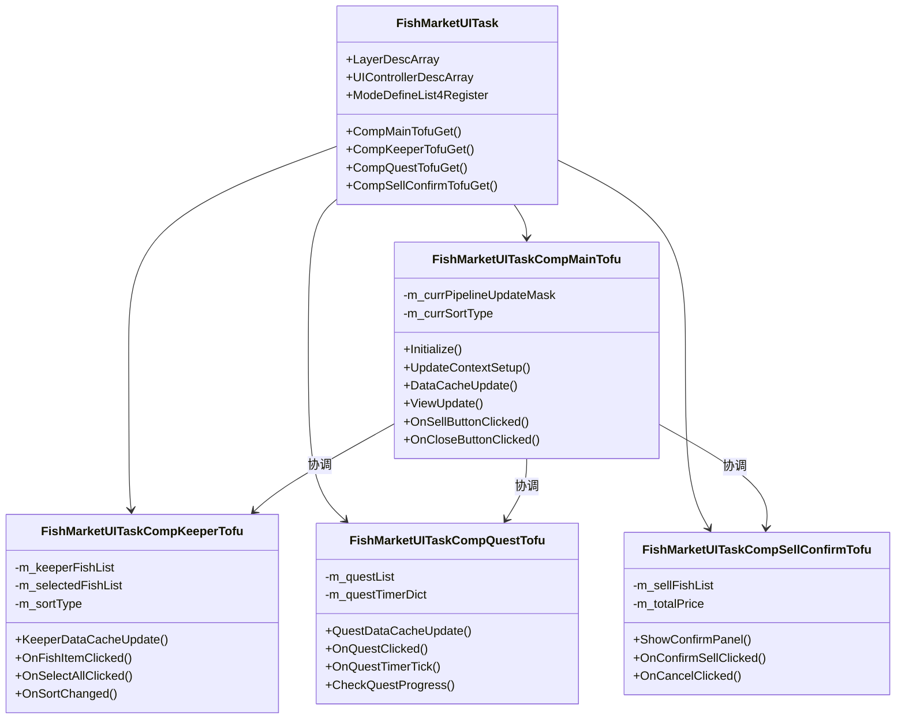
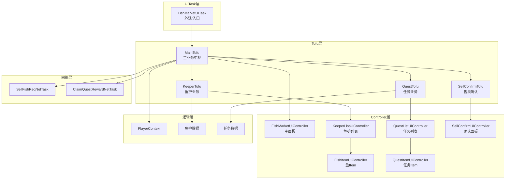
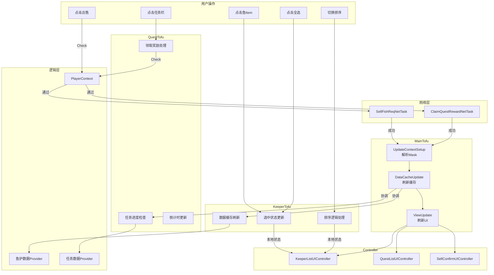
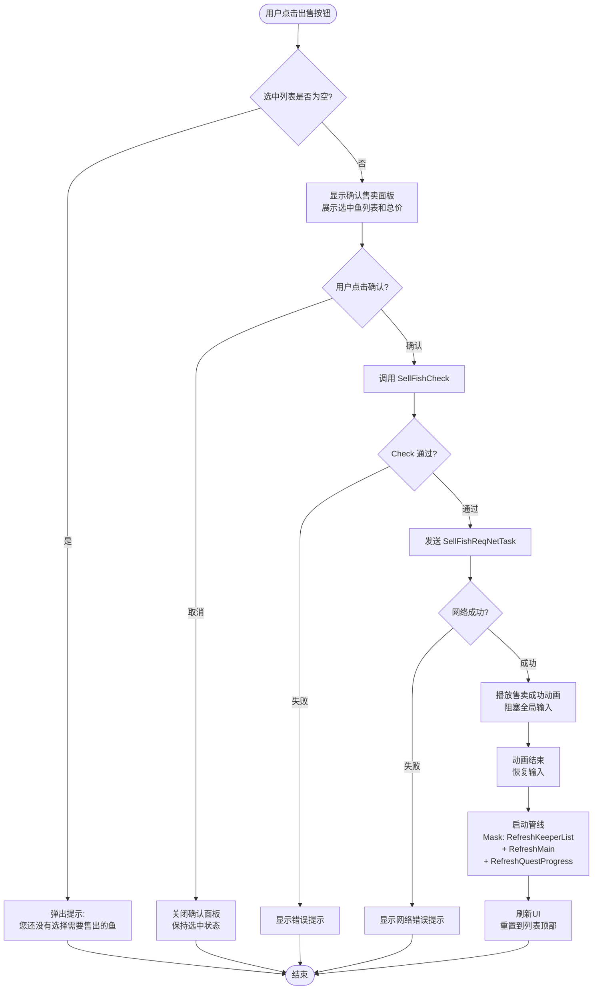
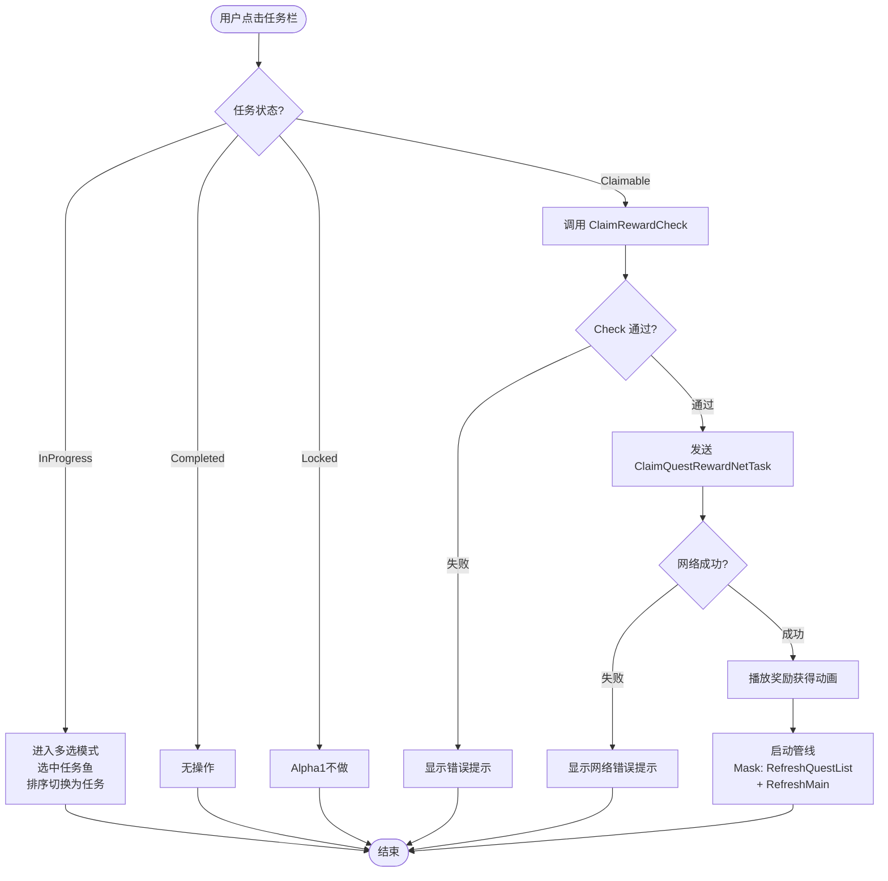
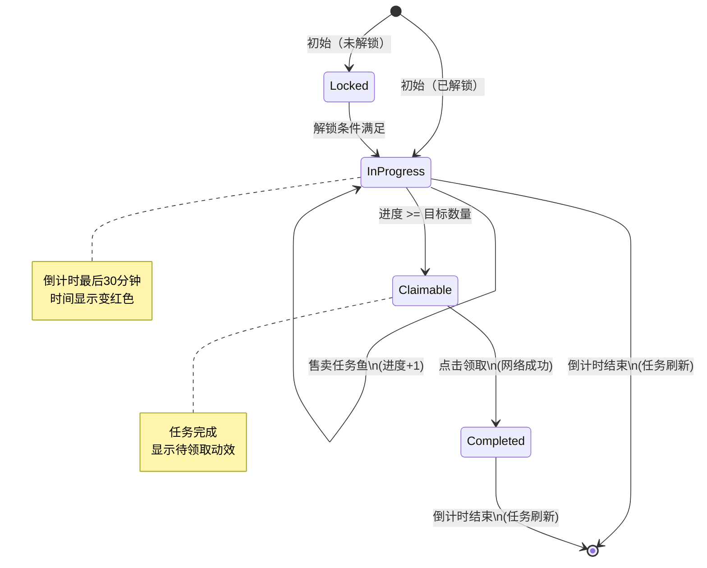
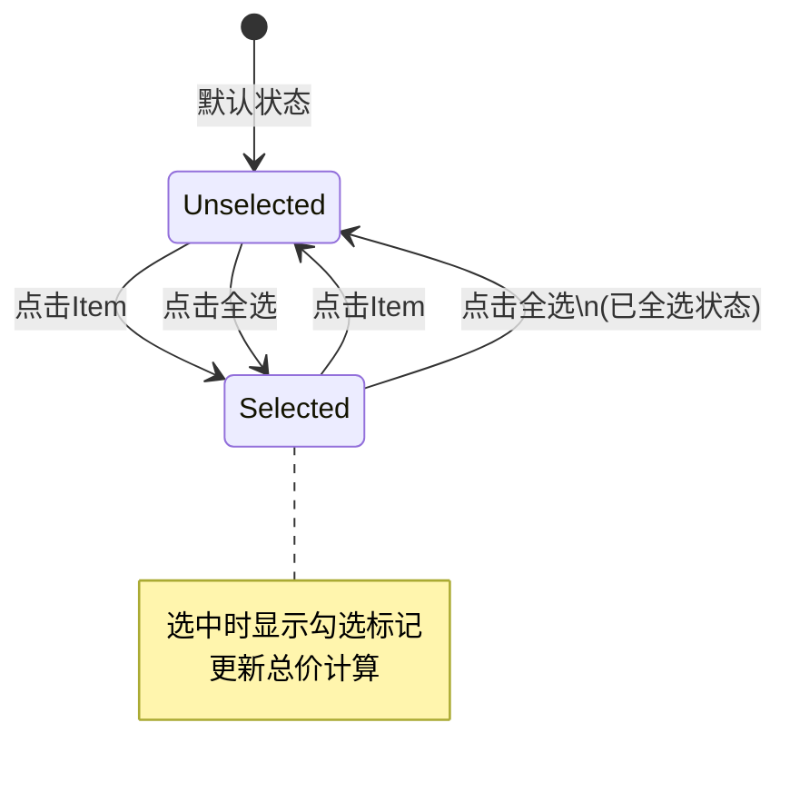
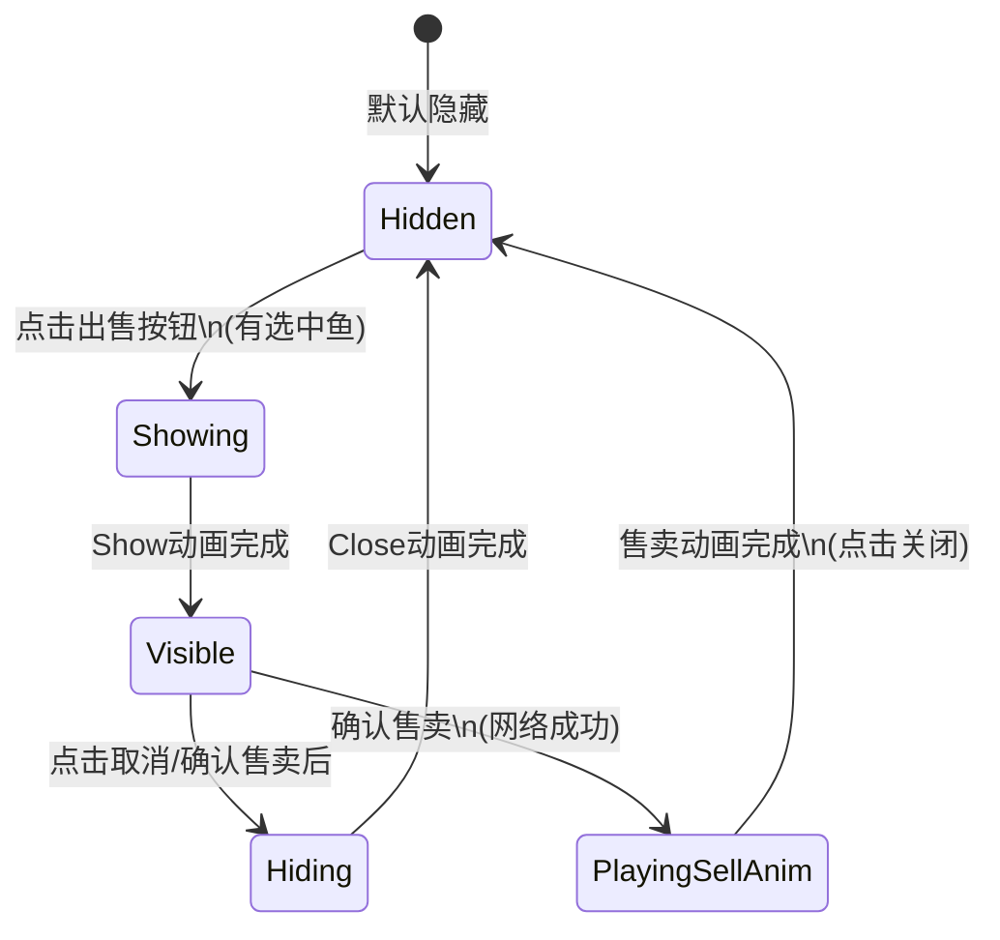

# 鱼市(FishMarket)UI设计文档 | v1.0 | 2026-01-27

## 逻辑审计与架构自检 (Logic & Architecture Audit)

### 风险点

| 信号类型 | 问题描述 | 严重程度 |
|----------|----------|----------|
| 闭环缺失 | "点击领取奖励"后的网络失败处理未定义 | ⚠️ 中 |
| 定义模糊 | "跳转对应的解锁界面"具体界面未明确（Alpha1不做） | ℹ️ 低 |
| 边界问题 | 任务刷新时机：服务器推送还是客户端轮询？ | ⚠️ 中 |
| 边界问题 | 售卖确认动画播放期间的UI阻塞策略未定义 | ⚠️ 中 |

### 修正建议

1. **网络失败处理**：所有 NetTask 失败后，显示通用错误提示，保持当前状态不变
2. **任务刷新机制**：采用服务器推送 + 客户端定时同步（60秒）双保险策略
3. **动画期间阻塞**：售卖确认动画播放期间，设置 `m_isBlockGlobalUIInput = true`
4. **所有售卖操作**：严格遵循 `Check -> NetTask -> Mask -> Pipeline` 流程

---

## 1. 任务定义 (UITask & Intent)

### UITask Name
`FishMarketUITask`

### Intent Params

| 参数名 | 类型 | 必填 | 说明 |
|--------|------|------|------|
| `MapId` | `int` | 是 | 当前地图ID，用于获取对应的限时任务 |
| `OnCloseCallback` | `Action` | 否 | 界面关闭时的回调 |

### UITofu 职责划分

| Tofu名称 | 职责 | 核心功能 |
|----------|------|----------|
| `FishMarketUITaskCompMainTofu` | 主业务Tofu | 管线调度、跨区域协调、逻辑层交互 |
| `FishMarketUITaskCompKeeperTofu` | 鱼护业务Tofu | 鱼护列表管理、选中状态、排序逻辑 |
| `FishMarketUITaskCompQuestTofu` | 任务业务Tofu | 限时任务状态、进度、倒计时管理 |
| `FishMarketUITaskCompSellConfirmTofu` | 售卖确认Tofu | 确认面板显示、售卖动画编排 |

### 类图



### 模块依赖图



---

## 2. 业务中枢 (MainTofu & Data)

### Data Cache 定义

```csharp
// MainTofu 数据缓存
public class FishMarketUITaskCompMainTofu
{
    // 货币数据
    private CurrencyInfo m_currencyInfo;
    
    // 当前地图ID
    private int m_currentMapId;
    
    // 管线状态
    private PipelineUpdateMask m_currPipelineUpdateMask;
}

// KeeperTofu 数据缓存
public class FishMarketUITaskCompKeeperTofu
{
    // 鱼护中的鱼列表（原始数据）
    private List<FishItemInfo> m_keeperFishList;
    
    // 排序后的鱼列表（视图数据）
    private List<FishItemInfo> m_sortedFishList;
    
    // 选中的鱼列表
    private HashSet<long> m_selectedFishInstanceIds;
    
    // 当前排序类型
    private FishSortType m_sortType;
    
    // 是否全选状态
    private bool m_isAllSelected;
}

// QuestTofu 数据缓存
public class FishMarketUITaskCompQuestTofu
{
    // 限时任务列表
    private List<TimeLimitQuestInfo> m_questList;
    
    // 任务倒计时字典 <QuestId, RemainSeconds>
    private Dictionary<int, float> m_questTimerDict;
    
    // 任务进度字典 <QuestId, CurrentProgress>
    private Dictionary<int, int> m_questProgressDict;
}

// SellConfirmTofu 数据缓存
public class FishMarketUITaskCompSellConfirmTofu
{
    // 待售卖的鱼列表
    private List<FishItemInfo> m_sellFishList;
    
    // 总价
    private long m_totalPrice;
}
```

### 数据实体定义

```csharp
// 鱼信息
public class FishItemInfo
{
    public long InstanceId;           // 实例ID
    public int FishId;                // 鱼配置ID
    public string FishName;           // 鱼名称
    public int Quality;               // 品质
    public float Weight;              // 克重
    public int FreshnessPercent;      // 新鲜度(0-100)
    public long SellPrice;            // 售价
    public string IconPath;           // 图标路径
    public long CatchTime;            // 捕获时间
    public bool IsQuestFish;          // 是否符合任务条件
    public int MatchQuestId;          // 匹配的任务ID（0表示无）
}

// 限时任务信息
public class TimeLimitQuestInfo
{
    public int QuestId;               // 任务ID
    public QuestState State;          // 任务状态
    public int TargetFishId;          // 目标鱼ID
    public float MinWeight;           // 最小重量要求（0表示无要求）
    public int RequireCount;          // 需要数量
    public int CurrentProgress;       // 当前进度
    public float RemainSeconds;       // 剩余时间（秒）
    public List<RewardItem> Rewards;  // 奖励列表
    public string FishIconPath;       // 任务鱼图标
}

// 任务状态枚举
public enum QuestState
{
    Locked,       // 待解锁
    InProgress,   // 进行中
    Claimable,    // 待领取
    Completed     // 已完成
}

// 排序类型枚举
public enum FishSortType
{
    Time,         // 时间排序（默认）
    Quality,      // 品质排序
    Weight,       // 重量排序
    Price,        // 价格排序
    Quest         // 任务排序（任务鱼优先）
}
```

### Business Logic: Check 和 NetTask 触发时机

| 操作 | Check方法 | NetTask | 触发Mask |
|------|-----------|---------|----------|
| 售卖鱼 | `SellFishCheck()` | `SellFishReqNetTask` | `RefreshKeeperList \| RefreshMain \| RefreshQuestProgress` |
| 领取奖励 | `ClaimQuestRewardCheck()` | `ClaimQuestRewardNetTask` | `RefreshQuestList \| RefreshMain \| PlayRewardAnimation` |

### 数据流向图



---

## 3. 业务流程与状态机 (Flow & State)

### 业务流程图

#### 售卖流程



#### 领取奖励流程



### 状态机图

#### 任务状态机



#### 鱼选中状态机



#### 确认面板状态机



### 状态枚举定义

```csharp
// 任务状态
public enum QuestState
{
    Locked,       // 待解锁（Alpha1不做）
    InProgress,   // 进行中
    Claimable,    // 待领取
    Completed     // 已完成
}

// 鱼选中状态
public enum FishSelectState
{
    Unselected,   // 未选中
    Selected      // 已选中
}

// 新鲜度状态
public enum FreshnessState
{
    Fresh,        // 新鲜 (>0%)
    Rotten        // 腐烂 (=0%)，显示红色
}

// 确认面板状态
public enum ConfirmPanelState
{
    Hidden,           // 隐藏
    Showing,          // 显示中（动画）
    Visible,          // 可见
    Hiding,           // 隐藏中（动画）
    PlayingSellAnim   // 播放售卖动画
}
```

---

## 4. 驱动与刷新 (Pipeline & Mask)

### PipelineUpdateMask 定义

```csharp
[Flags]
public enum PipelineUpdateMask
{
    None = 0,
    
    // 基础刷新
    RefreshMain = 1 << 0,              // 刷新主面板（货币、标题等）
    RefreshKeeperList = 1 << 1,        // 刷新鱼护列表
    RefreshKeeperListStayPos = 1 << 2, // 刷新鱼护列表（保持滚动位置）
    RefreshQuestList = 1 << 3,         // 刷新任务列表
    RefreshQuestProgress = 1 << 4,     // 仅刷新任务进度
    
    // 状态刷新
    RefreshSelectedState = 1 << 5,     // 刷新选中状态
    RefreshSortState = 1 << 6,         // 刷新排序UI
    
    // 动画播放
    PlaySellAnimation = 1 << 7,        // 播放售卖成功动画
    PlayRewardAnimation = 1 << 8,      // 播放奖励获得动画
    PlayQuestRefreshAnim = 1 << 9,     // 播放任务刷新动画
    PlayQuestCompleteAnim = 1 << 10,   // 播放任务完成动效
    
    // 确认面板
    ShowConfirmPanel = 1 << 11,        // 显示确认面板
    HideConfirmPanel = 1 << 12,        // 隐藏确认面板
    
    // 组合Mask
    RefreshAll = RefreshMain | RefreshKeeperList | RefreshQuestList,
    RefreshAfterSell = RefreshMain | RefreshKeeperList | RefreshQuestProgress,
}
```

### ViewUpdate 策略

| Mask | 调用的Controller接口 | 说明 |
|------|----------------------|------|
| `RefreshMain` | `FishMarketUIController.CurrencyRefresh()` | 刷新货币显示 |
| `RefreshKeeperList` | `KeeperListUIController.ListViewRefresh()` | 完整刷新列表，重置到顶部 |
| `RefreshKeeperListStayPos` | `KeeperListUIController.ListViewRefresh(stayPos: true)` | 刷新列表，保持位置 |
| `RefreshQuestList` | `QuestListUIController.QuestListRefresh()` | 刷新任务列表 |
| `RefreshQuestProgress` | `QuestListUIController.QuestProgressRefresh()` | 仅刷新任务进度 |
| `RefreshSelectedState` | `KeeperListUIController.SelectStateRefresh()` | 刷新选中状态 |
| `RefreshSortState` | `KeeperListUIController.SortViewRefresh()` | 刷新排序UI |
| `PlaySellAnimation` | `SellConfirmUIController.PlaySellSuccessAnimation()` | 播放售卖动画 |
| `PlayRewardAnimation` | `QuestListUIController.PlayRewardAnimation()` | 播放奖励动画 |
| `ShowConfirmPanel` | `SellConfirmUIController.ConfirmPanelShow()` | 显示确认面板 |
| `HideConfirmPanel` | `SellConfirmUIController.ConfirmPanelHide()` | 隐藏确认面板 |

### ViewUpdate 实现示例

```csharp
public override void ViewUpdate(IUITaskUpdatePipelineController pipelineCtrl)
{
    // 初始化/恢复时全量刷新
    if (IsUITaskUpdatePipelineInitOrResume())
    {
        m_mainUICtrl.PanelViewRefresh();
        m_mainUICtrl.CurrencyRefresh(m_currencyInfo);
        m_keeperListUICtrl.ListViewRefresh(m_sortedFishList, m_selectedFishInstanceIds);
        m_questListUICtrl.QuestListRefresh(m_questList);
        
        // 注册UI事件
        MainUICtrlUIEventRegister();
        return;
    }
    
    // 按Mask精细刷新
    if (m_currPipelineUpdateMask.HasFlag(PipelineUpdateMask.RefreshMain))
    {
        m_mainUICtrl.CurrencyRefresh(m_currencyInfo);
    }
    
    if (m_currPipelineUpdateMask.HasFlag(PipelineUpdateMask.RefreshKeeperList))
    {
        m_keeperListUICtrl.ListViewRefresh(m_sortedFishList, m_selectedFishInstanceIds);
    }
    else if (m_currPipelineUpdateMask.HasFlag(PipelineUpdateMask.RefreshKeeperListStayPos))
    {
        m_keeperListUICtrl.ListViewRefresh(m_sortedFishList, m_selectedFishInstanceIds, stayPos: true);
    }
    
    if (m_currPipelineUpdateMask.HasFlag(PipelineUpdateMask.RefreshQuestList))
    {
        m_questListUICtrl.QuestListRefresh(m_questList);
    }
    else if (m_currPipelineUpdateMask.HasFlag(PipelineUpdateMask.RefreshQuestProgress))
    {
        m_questListUICtrl.QuestProgressRefresh(m_questProgressDict);
    }
    
    if (m_currPipelineUpdateMask.HasFlag(PipelineUpdateMask.RefreshSelectedState))
    {
        m_keeperListUICtrl.SelectStateRefresh(m_selectedFishInstanceIds, m_isAllSelected);
    }
    
    // 动画播放
    if (m_currPipelineUpdateMask.HasFlag(PipelineUpdateMask.PlaySellAnimation))
    {
        pipelineCtrl.UIProcessPlayInPipeline(
            m_sellConfirmUICtrl.SellSuccessAnimationUIProcessGet(),
            onEnd: (_, _) => { m_owner.UITaskStop(); });
    }
    
    if (m_currPipelineUpdateMask.HasFlag(PipelineUpdateMask.PlayRewardAnimation))
    {
        pipelineCtrl.UIProcessPlayInPipeline(m_questListUICtrl.RewardAnimationUIProcessGet());
    }
    
    // 确认面板控制
    if (m_currPipelineUpdateMask.HasFlag(PipelineUpdateMask.ShowConfirmPanel))
    {
        pipelineCtrl.UIProcessPlayInPipeline(m_sellConfirmUICtrl.PanelShowUIProcessCreate());
    }
    
    if (m_currPipelineUpdateMask.HasFlag(PipelineUpdateMask.HideConfirmPanel))
    {
        pipelineCtrl.UIProcessPlayInPipeline(m_sellConfirmUICtrl.PanelCloseUIProcessCreate());
    }
}
```

---

## 5. 视图表现 (UIController & UIProcess)

### Controller 接口定义

#### FishMarketUIController

```csharp
public class FishMarketUIController : UIControllerBase
{
    // 事件
    public event Action EventOnCloseButtonClick;
    public event Action EventOnSellButtonClick;
    
    // 刷新接口
    public void PanelViewRefresh();
    public void CurrencyRefresh(CurrencyInfo info);
    
    // UIProcess工厂方法
    public UIProcess PanelShowUIProcessCreate();
    public UIProcess PanelCloseUIProcessCreate();
}
```

#### KeeperListUIController

```csharp
public class KeeperListUIController : UIControllerBase
{
    // 事件
    public event Action<long> EventOnFishItemClick;        // 参数：鱼InstanceId
    public event Action<long> EventOnFishItemHover;        // 悬浮事件
    public event Action EventOnSelectAllClick;
    public event Action<FishSortType> EventOnSortChanged;
    
    // 刷新接口
    public void ListViewRefresh(List<FishItemInfo> fishList, HashSet<long> selectedIds, bool stayPos = false);
    public void SelectStateRefresh(HashSet<long> selectedIds, bool isAllSelected);
    public void SortViewRefresh(FishSortType sortType);
    
    // 总价计算显示
    public void TotalPriceRefresh(long totalPrice);
}
```

#### QuestListUIController

```csharp
public class QuestListUIController : UIControllerBase
{
    // 事件
    public event Action<int> EventOnQuestClick;            // 参数：任务ID
    
    // 刷新接口
    public void QuestListRefresh(List<TimeLimitQuestInfo> questList);
    public void QuestProgressRefresh(Dictionary<int, int> progressDict);
    public void QuestTimerRefresh(Dictionary<int, float> timerDict);
    
    // UIProcess工厂方法
    public UIProcess RewardAnimationUIProcessGet();
    public UIProcess QuestRefreshAnimationUIProcessGet();
    public UIProcess QuestCompleteAnimationUIProcessGet(int questId);
}
```

#### SellConfirmUIController

```csharp
public class SellConfirmUIController : UIControllerBase
{
    // 事件
    public event Action EventOnConfirmClick;
    public event Action EventOnCancelClick;
    public event Action EventOnAnimationClick;             // 动画期间点击关闭
    
    // 刷新接口
    public void ConfirmPanelShow(List<FishItemInfo> sellList, long totalPrice);
    public void ConfirmPanelHide();
    
    // UIProcess工厂方法
    public UIProcess PanelShowUIProcessCreate();
    public UIProcess PanelCloseUIProcessCreate();
    public UIProcess SellSuccessAnimationUIProcessGet();
}
```

#### FishItemUIController

```csharp
public class FishItemUIController : UIControllerBase, IScrollItem
{
    // 事件
    public event Action<long> EventOnClick;
    public event Action<long> EventOnHover;
    public event Action<long> EventOnHoverExit;
    
    // 刷新接口
    public void ItemViewRefresh(FishItemInfo fishInfo, bool isSelected);
    public void SelectStateSet(bool isSelected);
    public void HoverStateSet(bool isHover);
    
    // 任务鱼标记
    public void QuestFishMarkRefresh(bool isQuestFish, bool isFreshnessZero);
}
```

#### QuestItemUIController

```csharp
public class QuestItemUIController : UIControllerBase
{
    // 事件
    public event Action<int> EventOnClick;
    
    // 刷新接口
    public void ItemViewRefresh(TimeLimitQuestInfo questInfo);
    public void ProgressRefresh(int current, int target);
    public void TimerRefresh(float remainSeconds, bool isUrgent);  // isUrgent: 最后30分钟
    public void StateRefresh(QuestState state);
}
```

### UIProcess 定义

| UIProcess | 用途 | 执行模式 |
|-----------|------|----------|
| `PanelShowUIProcess` | 面板显示动画 | Serial |
| `PanelCloseUIProcess` | 面板关闭动画 | Serial |
| `SellSuccessUIProcess` | 售卖成功动画 | Serial，阻塞输入 |
| `RewardObtainUIProcess` | 奖励获得动画 | Serial |
| `QuestRefreshUIProcess` | 任务刷新动画 | Serial |
| `QuestCompleteUIProcess` | 任务完成动效 | Serial |

### UIProcess 实现示例

```csharp
// 售卖成功动画 UIProcess
public UIProcess SellSuccessAnimationUIProcessGet()
{
    var mainProcess = UIProcessFactory.CreateExecutorProcess(UIProcess.ProcessExecMode.Serial);
    
    // 1. 播放售卖成功动画
    var animProcess = UIProcessFactory.CreateExecutorProcess(
        UIProcess.ProcessExecMode.Serial,
        executeOnEnd =>
        {
            m_sellSuccessAnimator.Play("SellSuccess");
            StartCoroutine(WaitForAnimation("SellSuccess", () =>
            {
                executeOnEnd?.Invoke(true);
            }));
        });
    mainProcess.AddChild(animProcess);
    
    // 2. 等待用户点击关闭
    var waitClickProcess = UIProcessFactory.CreateExecutorProcess(
        UIProcess.ProcessExecMode.Serial,
        executeOnEnd =>
        {
            m_onAnimationClickCallback = () =>
            {
                m_onAnimationClickCallback = null;
                executeOnEnd?.Invoke(true);
            };
        });
    mainProcess.AddChild(waitClickProcess);
    
    return mainProcess;
}
```

### Controller 主要成员

#### KeeperListUIController 成员

```csharp
public class KeeperListUIController : UIControllerBase
{
    #region UI组件引用
    
    // 滚动列表（使用LoopScrollRect处理长列表）
    [SerializeField] private LoopVerticalScrollRect m_loopScrollRect;
    
    // 对象池
    [SerializeField] private EasyObjectPool m_fishItemPool;
    
    // 排序下拉框
    [SerializeField] private TMP_Dropdown m_sortDropdown;
    
    // 全选按钮
    [SerializeField] private ButtonEx m_selectAllButton;
    [SerializeField] private Image m_selectAllCheckmark;
    
    // 出售按钮
    [SerializeField] private ButtonEx m_sellButton;
    
    // 总价显示
    [SerializeField] private TMP_Text m_totalPriceText;
    
    #endregion
    
    #region UI状态机
    
    // 主面板状态机
    private AdvanceUIStateController m_mainUIStateController;
    // 状态：Show, Close
    
    #endregion
    
    #region 数据
    
    // 当前显示的鱼列表
    private List<FishItemInfo> m_fishList;
    
    // 选中的鱼ID集合
    private HashSet<long> m_selectedIds;
    
    // Item控制器缓存
    private List<FishItemUIController> m_itemCtrls = new List<FishItemUIController>();
    
    #endregion
}
```

#### QuestListUIController 成员

```csharp
public class QuestListUIController : UIControllerBase
{
    #region UI组件引用
    
    // 任务Item根节点（固定数量，不使用滚动列表）
    [SerializeField] private Transform m_questItemRoot;
    
    // 任务Item预制体
    [SerializeField] private GameObject m_questItemPrefab;
    
    #endregion
    
    #region UI状态机
    
    // 单个任务Item状态机
    // 状态：InProgress, Claimable, Completed, Locked
    
    #endregion
    
    #region 数据
    
    // 任务Item控制器列表（固定3个）
    private List<QuestItemUIController> m_questItemCtrls;
    
    #endregion
}
```

#### SellConfirmUIController 成员

```csharp
public class SellConfirmUIController : UIControllerBase
{
    #region UI组件引用
    
    // 确认面板根节点
    [SerializeField] private GameObject m_confirmPanelRoot;
    
    // 列表（简单ScrollRect，数量有限）
    [SerializeField] private ScrollRect m_fishListScrollRect;
    [SerializeField] private Transform m_fishListContent;
    
    // 对象池
    [SerializeField] private EasyObjectPool m_confirmItemPool;
    
    // 总价显示
    [SerializeField] private TMP_Text m_totalPriceText;
    
    // 按钮
    [SerializeField] private ButtonEx m_confirmButton;
    [SerializeField] private ButtonEx m_cancelButton;
    
    // 售卖成功动画
    [SerializeField] private Animator m_sellSuccessAnimator;
    [SerializeField] private GameObject m_sellSuccessRoot;
    
    #endregion
    
    #region UI状态机
    
    // 确认面板状态机
    private AdvanceUIStateController m_panelUIStateController;
    // 状态：Show, Close
    
    #endregion
}
```

### 快捷键管理

```csharp
protected override UIHotKeyInfoDesc[] UIHotKeyInfoDescArray
{
    get
    {
        return new[]
        {
            // 默认模式：ESC关闭界面
            new UIHotKeyInfoDesc
            {
                m_modeName = UIHotKeyModeName4Default,
                m_uiHotKeyCmdId = new List<int> { UIHotKeyInputCmdId.InputCmdId4FunctionPageStop },
                m_buttonTriggerType = UIHotKeyButtonTriggerType.PressDown,
                m_uiHotKeyCallBack = TryCloseUITask
            },
            // 确认面板模式：ESC关闭确认面板
            new UIHotKeyInfoDesc
            {
                m_modeName = UIHotKeyModeName4ConfirmPanel,
                m_uiHotKeyCmdId = new List<int> { UIHotKeyInputCmdId.InputCmdId4FunctionPageStop },
                m_buttonTriggerType = UIHotKeyButtonTriggerType.PressDown,
                m_uiHotKeyCallBack = OnConfirmPanelClose
            }
        };
    }
}
```

---

## 6. 技术重点与风险 (Implementation Notes)

### 边界问题

| 问题 | 场景 | 解决方案 |
|------|------|----------|
| 并发售卖 | 用户快速双击出售按钮 | 出售按钮点击后立即禁用，网络返回后恢复 |
| 任务刷新时机 | 倒计时结束时刷新 | 服务器推送 + 客户端60秒定时同步 |
| 新鲜度实时变化 | 鱼护中的鱼新鲜度随时间降低 | 服务器推送变化事件，客户端不做本地模拟 |
| 跨关卡任务 | 不同关卡的限时任务独立 | 启动时通过MapId获取对应任务 |
| 售卖动画中断 | 动画播放期间切后台 | 设置阻塞标志，恢复时检查状态 |

### 技术难点

#### 1. 长列表性能优化

**问题**：鱼护可能有大量鱼，普通列表会造成性能问题

**解决方案**：
- 使用 `LoopVerticalScrollRect` 实现虚拟滚动
- 配合 `EasyObjectPool` 复用FishItem
- 只渲染可见区域的Item

```csharp
// LoopScrollRect 配置
m_loopScrollRect.totalCount = m_fishList.Count;
m_loopScrollRect.AddItemRefreshListener(OnFishItemNeedFill);

private void OnFishItemNeedFill(Transform item, int index)
{
    var ctrl = item.GetComponent<FishItemUIController>();
    var fishInfo = m_fishList[index];
    var isSelected = m_selectedIds.Contains(fishInfo.InstanceId);
    ctrl.ItemViewRefresh(fishInfo, isSelected);
}
```

#### 2. 任务倒计时同步

**问题**：多个任务同时倒计时，需要精确显示

**解决方案**：
- MainTofu 维护倒计时字典
- 使用 `ITickableComponent` 接口每帧更新
- 时间格式化：天/小时、小时/分、分/秒

```csharp
public void OnTick(float deltaTime)
{
    bool needRefresh = false;
    foreach (var questId in m_questTimerDict.Keys.ToList())
    {
        m_questTimerDict[questId] -= deltaTime;
        if (m_questTimerDict[questId] <= 0)
        {
            // 任务到期，请求服务器刷新
            RequestQuestRefresh(questId);
        }
        needRefresh = true;
    }
    
    if (needRefresh)
    {
        m_questListUICtrl.QuestTimerRefresh(m_questTimerDict);
    }
}
```

#### 3. 选中状态与全选逻辑

**问题**：全选/取消全选与单选的状态同步

**解决方案**：
- 使用 `HashSet<long>` 存储选中的InstanceId
- 全选状态通过比较 Count 判断
- 单选变化时更新全选按钮状态

```csharp
private void OnFishItemClicked(long instanceId)
{
    if (m_selectedIds.Contains(instanceId))
    {
        m_selectedIds.Remove(instanceId);
    }
    else
    {
        m_selectedIds.Add(instanceId);
    }
    
    // 更新全选状态
    m_isAllSelected = m_selectedIds.Count == m_fishList.Count;
    
    // 更新总价
    RecalculateTotalPrice();
    
    // 刷新UI
    LaunchPipelineWithMask(PipelineUpdateMask.RefreshSelectedState);
}
```

#### 4. 任务鱼匹配与排序

**问题**：任务排序时需要将符合任务条件的鱼排在前面

**解决方案**：
- 在 `DataCacheUpdate` 阶段标记每条鱼是否匹配任务
- 任务排序时使用自定义比较器

```csharp
private void SortFishListByQuest()
{
    m_sortedFishList = m_keeperFishList
        .OrderByDescending(f => f.IsQuestFish)           // 任务鱼优先
        .ThenByDescending(f => f.FreshnessPercent > 0)   // 新鲜的优先
        .ThenByDescending(f => f.CatchTime)              // 时间新的优先
        .ToList();
}
```

### 风险评估

| 风险项 | 等级 | 影响 | 缓解措施 |
|--------|------|------|----------|
| 网络延迟导致UI不同步 | 中 | 用户体验下降 | 添加loading状态，禁用交互 |
| 任务刷新与用户操作冲突 | 中 | 用户选中的任务鱼可能失效 | 刷新时提示用户，重新计算选中状态 |
| 大量鱼导致内存压力 | 低 | 内存占用过高 | 使用对象池，限制最大显示数量 |
| 倒计时精度问题 | 低 | 时间显示不准确 | 定期与服务器同步时间 |

---

## 附录A：Mode-Action 状态迁移矩阵

### ModeDefineList4Register

| Mode名称 | 说明 |
|----------|------|
| Default | 默认模式，鱼护列表浏览、选择、排序 |
| ConfirmPanel | 售卖确认面板模式 |
| SellAnimation | 售卖成功动画播放模式 |

### Action 列表

| Action | 说明 |
|--------|------|
| Click_FishItem | 点击鱼护中的鱼Item |
| Click_SelectAll | 点击全选按钮 |
| Click_Sort | 点击排序下拉框 |
| Click_Sell | 点击出售按钮 |
| Click_QuestItem | 点击任务栏Item |
| Click_Confirm | 点击确认售卖按钮 |
| Click_Cancel | 点击取消按钮 |
| Click_Close | 点击关闭按钮 |
| Click_Screen | 点击屏幕任意位置 |
| Press_ESC | 按下ESC键 |

### Mode-Action 矩阵表

| Mode \ Action | Click_FishItem | Click_SelectAll | Click_Sort | Click_Sell | Click_QuestItem | Click_Confirm | Click_Cancel | Click_Close | Click_Screen | Press_ESC |
|---------------|----------------|-----------------|------------|------------|-----------------|---------------|--------------|-------------|--------------|-----------|
| **Default** | 切换选中状态<br/>`RefreshSelectedState` | 全选/取消全选<br/>`RefreshSelectedState` | 切换排序<br/>`RefreshKeeperList` | 显示确认面板<br/>→ConfirmPanel<br/>`ShowConfirmPanel` | InProgress:选中任务鱼<br/>Claimable:领取奖励<br/>`RefreshQuestList` | N/A | N/A | 关闭界面<br/>`TryCloseUITask` | Ignore | 关闭界面<br/>`TryCloseUITask` |
| **ConfirmPanel** | Ignore | Ignore | Ignore | Ignore | Ignore | Check→NetTask<br/>→SellAnimation<br/>`PlaySellAnimation` | 关闭确认面板<br/>→Default<br/>`HideConfirmPanel` | Ignore | Ignore | 关闭确认面板<br/>→Default<br/>`HideConfirmPanel` |
| **SellAnimation** | Ignore | Ignore | Ignore | Ignore | Ignore | Ignore | Ignore | Ignore | 关闭动画<br/>刷新界面<br/>`RefreshAfterSell` | Ignore |

### 矩阵说明

1. **Default模式**
   - 用户可以自由浏览、选择鱼、切换排序
   - 点击任务栏根据任务状态执行不同操作
   - ESC或关闭按钮退出界面

2. **ConfirmPanel模式**
   - 仅响应确认/取消操作
   - 其他操作被忽略，防止误操作
   - ESC等同于取消

3. **SellAnimation模式**
   - 全局输入阻塞（`m_isBlockGlobalUIInput = true`）
   - 仅响应屏幕点击关闭动画
   - 动画结束后自动刷新界面并返回Default

### 状态流转图

```mermaid
stateDiagram-v2
    [*] --> Default : 界面打开
    
    Default --> ConfirmPanel : Click_Sell\n(有选中鱼)
    Default --> [*] : Press_ESC / Click_Close
    
    ConfirmPanel --> Default : Click_Cancel / Press_ESC
    ConfirmPanel --> SellAnimation : Click_Confirm\n(网络成功)
    
    SellAnimation --> Default : Click_Screen\n(动画结束)
    SellAnimation --> [*] : 刷新完成后\n可再次操作
    
    note right of Default
        主要交互模式
        支持所有鱼护操作
    end note
    
    note right of ConfirmPanel
        模态面板
        阻塞其他操作
    end note
    
    note right of SellAnimation
        全局输入阻塞
        等待用户确认
    end note
```

---

## 附录B：常量定义

```csharp
public partial class FishMarketUITask
{
    #region Layer
    public const string UILayerName = "FishMarketUILayer";
    #endregion
    
    #region Mode
    public const string ModeName4Default = "Default";
    public const string ModeName4ConfirmPanel = "ConfirmPanel";
    #endregion
    
    #region ParamKey
    public const string IntentParamKey4MapId = "MapId";
    public const string IntentParamKey4OnCloseCallback = "OnCloseCallback";
    public const string ParamKeyPipelineUpdateMask = "PipelineUpdateMask";
    #endregion
    
    #region UIState
    public const string UIStateName4Show = "Show";
    public const string UIStateName4Close = "Close";
    public const string UIStateName4Hover = "Hover";
    public const string UIStateName4Normal = "Normal";
    public const string UIStateName4Selected = "Selected";
    public const string UIStateName4InProgress = "InProgress";
    public const string UIStateName4Claimable = "Claimable";
    public const string UIStateName4Completed = "Completed";
    public const string UIStateName4Locked = "Locked";
    #endregion
}
```
