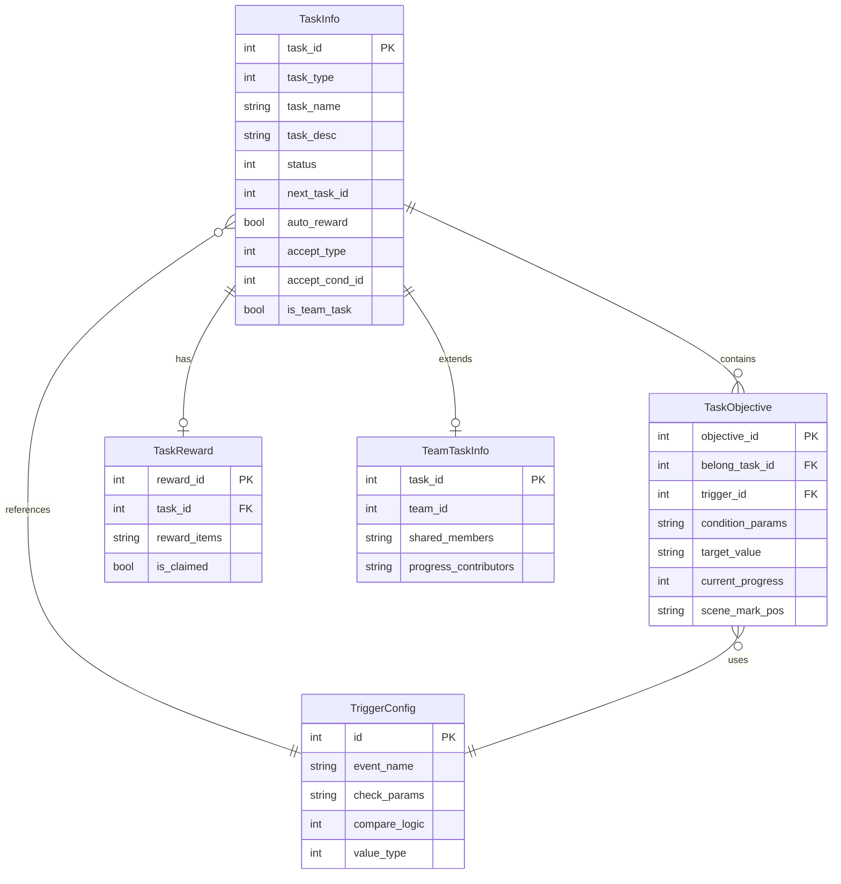
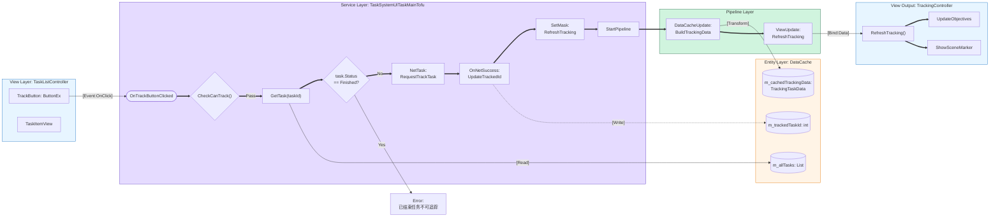
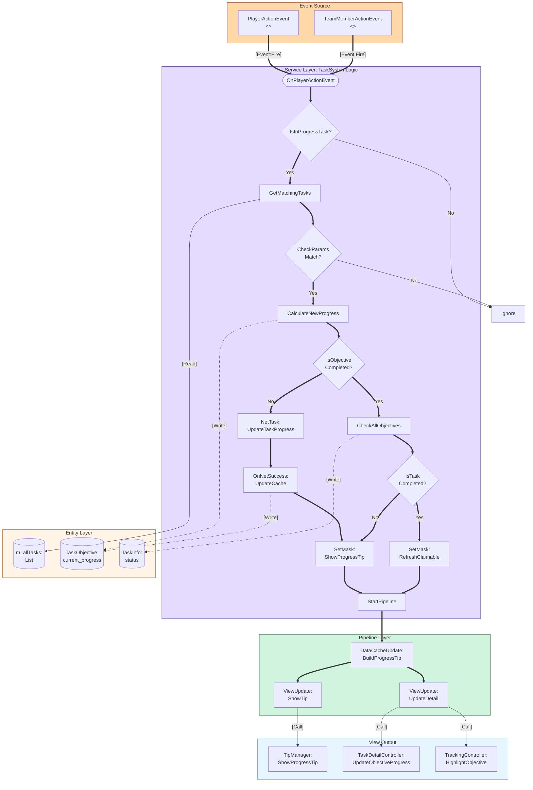
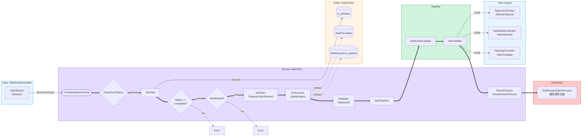
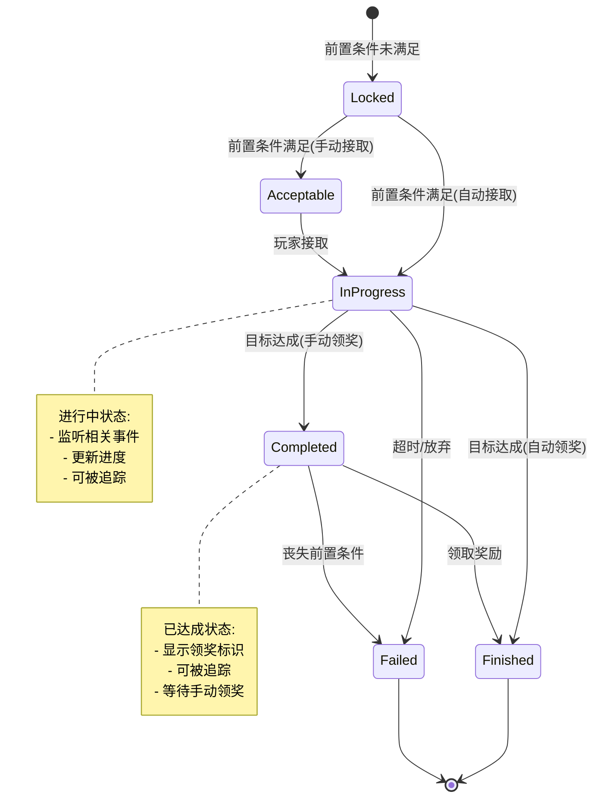

# 任务系统架构蓝图 (Task System Architecture Blueprint)

**日期**: 2026-02-13
**PRD**: tasksytem.md

---

## 1. ER 数据模型

---

## 2. 追踪任务流程蓝图

---

## 3. 任务进度更新流程蓝图

---

## 4. 领取奖励流程蓝图

---

## 5. 任务状态机

---

## 6. 质量检查清单

- [x] **Subgraph 有明确的框架角色标注**
  - view_layer、logic_layer、data_layer、pipeline_layer 都有标注

- [x] **连线标签包含代码生成参数**
  - [Event:OnClick]、[Read]、[Write]、[Bind:Data]、[Call]

- [x] **节点 ID 为合法 C# 变量名**
  - S1, S2, D1, V1, P1 等都是合法标识符

- [x] **执行流逻辑闭环**
  - 所有流程都有明确的起点和终点，包括错误处理分支

---

**架构蓝图生成完毕！**
