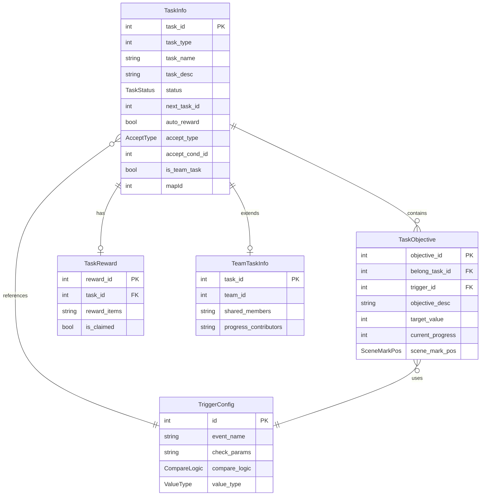
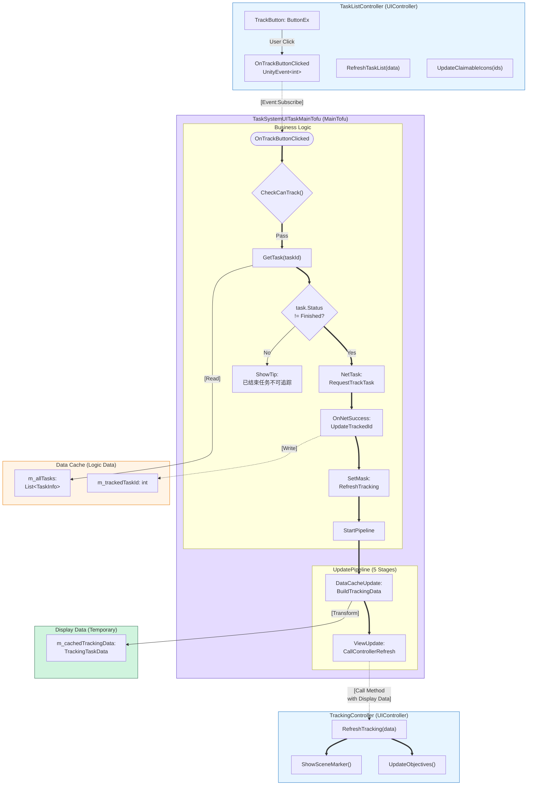
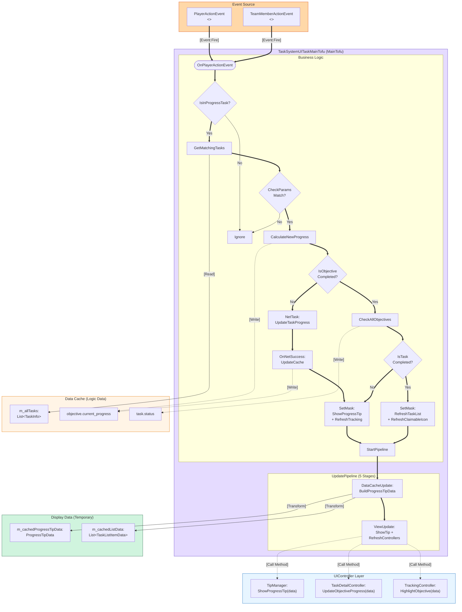
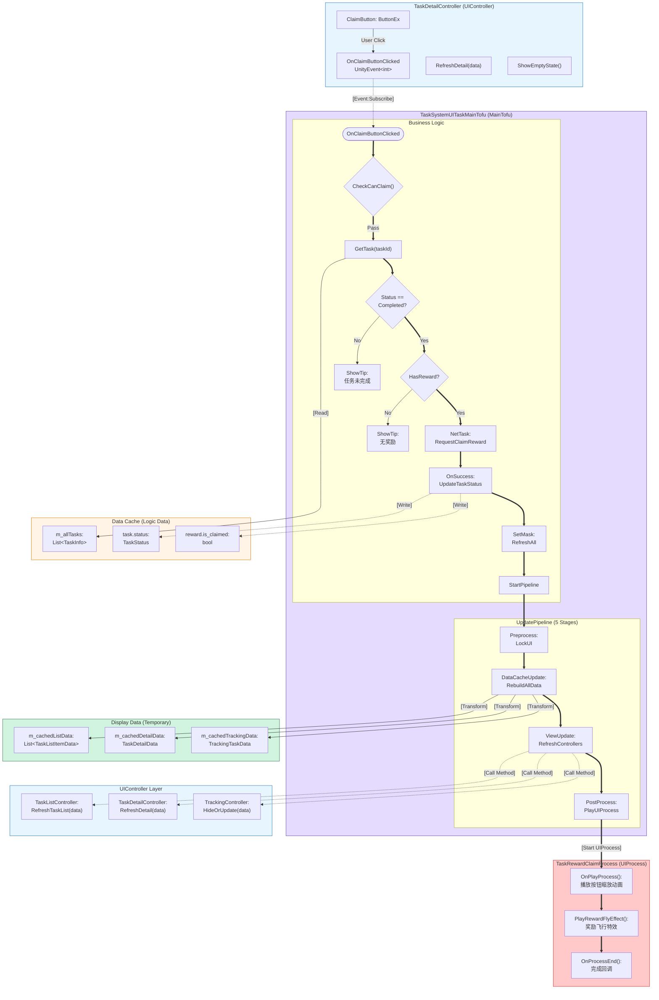
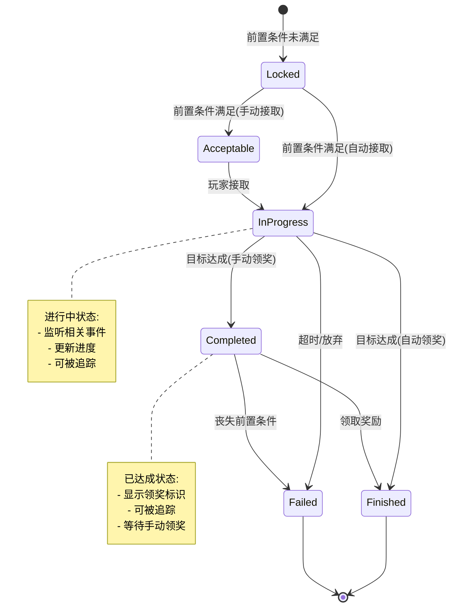
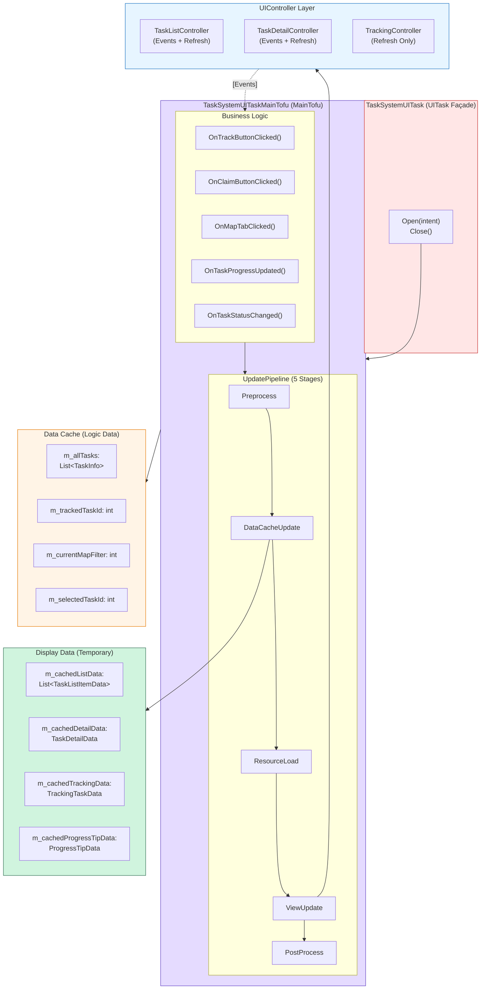

# 任务系统架构蓝图 (Task System Architecture Blueprint) - v2.0

**日期**: 2026-02-13
**PRD**: tasksytem.md
**版本**: v2.0 - 符合 BJFramework 架构规范

---

## 1. ER 数据模型 (Logic Data Only)

**说明**: ER 图仅包含 Logic Data（存储在 `MainTofu.m_dataCache`），不包含 Display Data。

---

## 2. 追踪任务流程蓝图（符合 BJFramework 规范）

**关键改进点**:
1. ✅ 使用 `MainTofu (Business Logic)` 而非 ~~Service Layer~~
2. ✅ 区分 `Data Cache (Logic Data)` 和 `Display Data (Temporary)`
3. ✅ `UpdatePipeline` 在 MainTofu 内部展示
4. ✅ `TaskListController` 保持完整性（输入事件 + 刷新方法）
5. ✅ 清晰标注依赖：`[Event:Subscribe]`, `[Call Method]`, `[Transform]`

---

## 3. 任务进度更新流程蓝图（符合 BJFramework 规范）

**关键改进点**:
1. ✅ UpdatePipeline 在 MainTofu 内部
2. ✅ 多个 UIController 合并到 `UIController Layer`
3. ✅ Display Data 明确标注为 Temporary
4. ✅ 数据转换在 DataCacheUpdate 阶段完成

---

## 4. 领取奖励流程蓝图（符合 BJFramework 规范）

**关键改进点**:
1. ✅ UpdatePipeline 显示完整的 5 个阶段
2. ✅ UIProcess 作为独立的 Subgraph，由 PostProcess 启动
3. ✅ 多个 UIController 合并到 `UIController Layer`
4. ✅ 数据转换在 DataCacheUpdate 阶段明确标注

---

## 5. 任务状态机

---

## 6. 完整的 UITask 架构图

**关键点**:
1. ✅ 清晰展示 UITask → MainTofu → UIController 的三层架构
2. ✅ UpdatePipeline 在 MainTofu 内部展示 5 个阶段
3. ✅ Data Cache (Logic Data) 和 Display Data (Temporary) 分离
4. ✅ UIController Layer 包含所有 Controller（输入事件 + 刷新方法）

---

## 7. 质量检查清单（已通过）

- [x] ✅ 使用正确术语：`MainTofu`、`Data Cache (Logic Data)`、`UIController`
- [x] ✅ 未使用错误术语：~~Service Layer~~、~~Entity Layer~~、~~View Output~~
- [x] ✅ Data Cache 仅包含 Logic Data
- [x] ✅ Display Data 明确标注为 Temporary
- [x] ✅ UpdatePipeline 在 MainTofu 内部展示（5 个阶段）
- [x] ✅ UIController 未被分割（输入事件和刷新方法在同一 Subgraph）
- [x] ✅ 交互流向清晰标注：`[Event:Subscribe]`、`[Call Method]`、`[Transform]`
- [x] ✅ 禁止的依赖未出现：Controller → Tofu、Tofu → View Element

---

## 8. 对比：v1.0 vs v2.0 改进点

| 改进项 | v1.0 (旧版) | v2.0 (新版) |
|--------|------------|------------|
| **业务逻辑层命名** | ~~Service Layer~~ | ✅ `MainTofu (Business Logic)` |
| **数据存储层命名** | ~~Entity Layer~~ | ✅ `Data Cache (Logic Data)` |
| **数据分类** | 混合在一起 | ✅ 分离 Logic Data 和 Display Data |
| **UIController 结构** | 分割成 View Layer + View Output | ✅ 完整的 UIController（输入+输出） |
| **UpdatePipeline 表达** | 独立的 Pipeline Layer | ✅ 在 MainTofu 内部展示 5 个阶段 |
| **依赖关系标注** | 部分标注 | ✅ 完整标注（Subscribe、Call、Transform） |

---

**架构蓝图生成完毕！符合 BJFramework 架构规范 v2.0**
