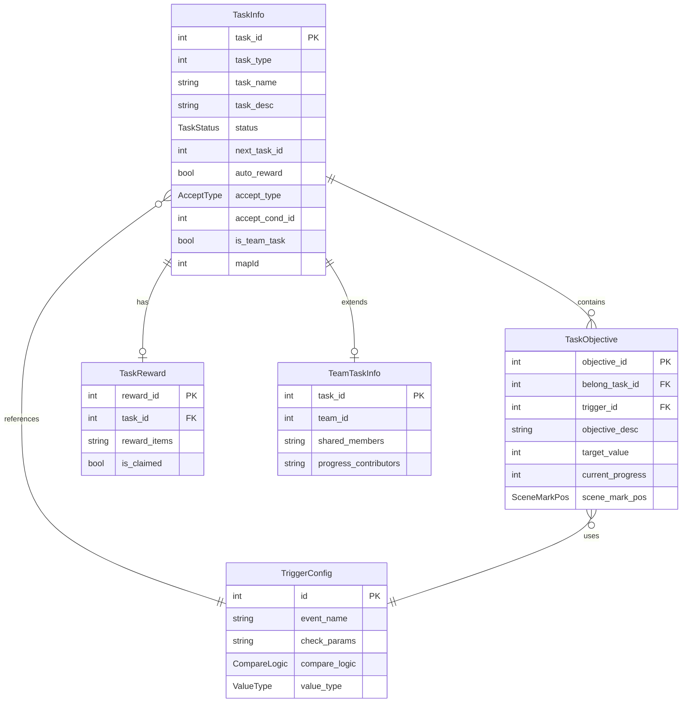
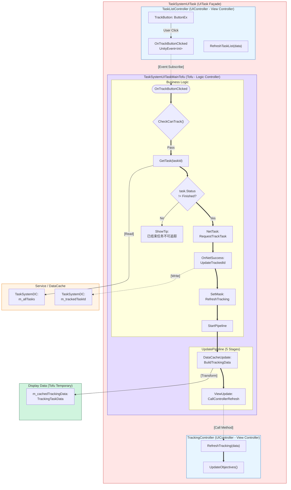
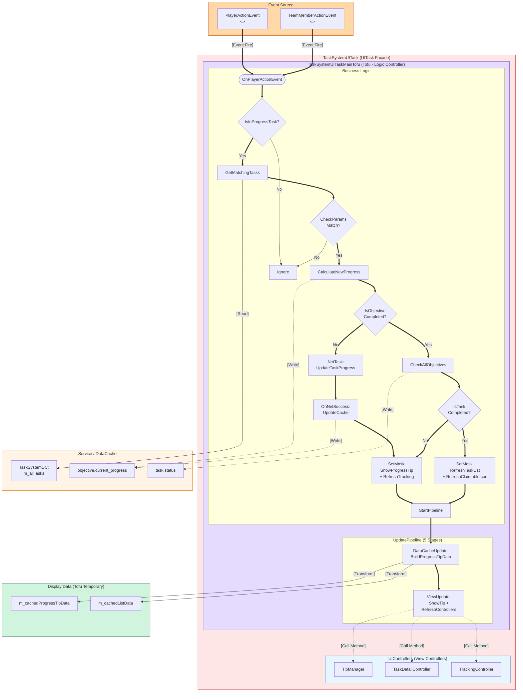
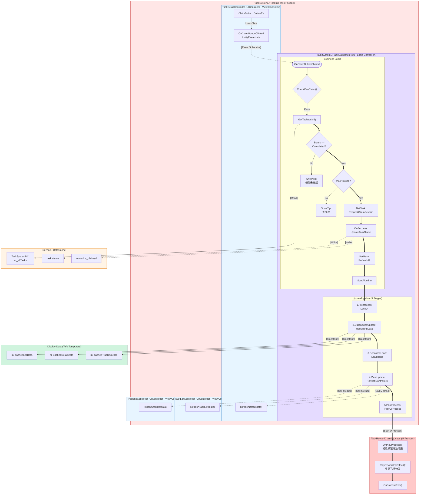
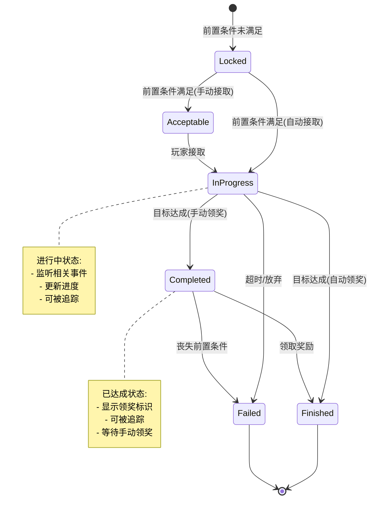
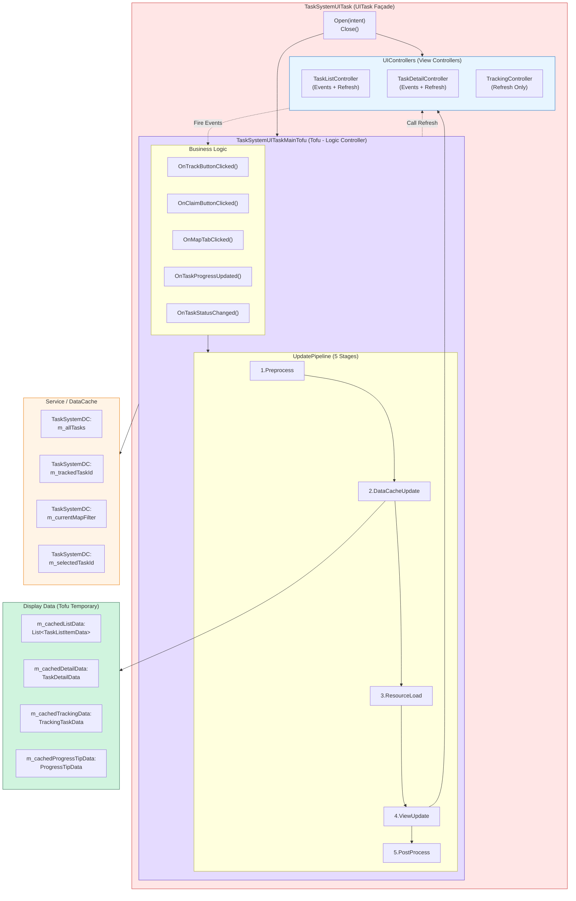

# 任务系统架构蓝图 (Task System Architecture Blueprint) - v3.0

**日期**: 2026-02-13
**PRD**: tasksytem.md
**版本**: v3.0 - 符合 BJFramework 双 Controller 架构

---

## ️核心架构理解

BJFramework 采用**类 MVC 架构**，将 Controller 分离为：
- **Tofu** = Logic Controller（逻辑控制器）
- **UIController** = View Controller（视图控制器）

```
UITask (Façade)
├── Tofu (Logic Controller)
│   ├── 处理业务逻辑
│   ├── 与 Service/DataCache 交互
│   ├── UpdatePipeline (5 stages)
│   └── 调用 UIController 刷新
└── UIController (View Controller)
    ├── 处理 UI 显示
    ├── 接收用户输入
    └── 抛出事件给 Tofu
```

---

## 1. ER 数据模型 (Logic Data - 存储在 Service/DataCache)



---

## 2. 追踪任务流程蓝图（体现双 Controller 架构）



**关键架构点**:
1. ✅ UITask 包含 Tofu 和 UIController（体现 Façade 外观模式）
2. ✅ Tofu 标注为 "Logic Controller"（逻辑控制器）
3. ✅ UIController 标注为 "View Controller"（视图控制器）
4. ✅ Service/DataCache 作为底层数据服务
5. ✅ Display Data 标注为 "Tofu Temporary"（在 Tofu 中临时构建）

---

## 3. 任务进度更新流程蓝图（体现双 Controller 架构）



---

## 4. 领取奖励流程蓝图（体现双 Controller 架构）



---

## 5. 任务状态机



---

## 6. 完整的 UITask 架构图（体现双 Controller）



**关键架构点**:
1. ✅ UITask 作为 Façade，包含 Tofu 和 UIController
2. ✅ Tofu 是 Logic Controller，包含 Business Logic + UpdatePipeline
3. ✅ UIController 是 View Controller，包含 Events + Refresh Methods
4. ✅ Service/DataCache 存储 Logic Data
5. ✅ Display Data 在 Tofu 中临时构建
6. ✅ 双向依赖：Controllers → Tofu (Events), Tofu → Controllers (Call Refresh)

---

## 7. 质量检查清单（已通过）

- [x] ✅ UITask 作为 Façade，包含 Tofu 和 UIController
- [x] ✅ Tofu 标注为 "Logic Controller"
- [x] ✅ UIController 标注为 "View Controller"
- [x] ✅ Service/DataCache 作为独立层
- [x] ✅ Logic Data 存储在 Service/DataCache
- [x] ✅ Display Data 标注为 "Tofu Temporary"
- [x] ✅ UpdatePipeline 在 Tofu 内部展示（5 个阶段）
- [x] ✅ 交互流向清晰：UIController Event → Tofu Subscribe
- [x] ✅ 刷新流向清晰：Tofu → UIController Method
- [x] ✅ 禁止的依赖未出现：UIController → Tofu Method, UIController → Service

---

## 8. 对比：v2.0 vs v3.0 改进点

| 改进项 | v2.0 (旧版) | v3.0 (新版) |
|--------|------------|------------|
| **架构理解** | Tofu 和 UIController 平行 | ✅ Tofu 和 UIController 都在 UITask 内部 |
| **Tofu 定位** | Business Logic Layer | ✅ Logic Controller（逻辑控制器） |
| **UIController 定位** | Pure View Layer | ✅ View Controller（视图控制器） |
| **双 Controller 体现** | 未明确体现 | ✅ 清晰标注两个 Controller 的职责 |
| **Logic Data 存储** | Data Cache | ✅ Service / DataCache（更明确） |
| **架构图嵌套** | Tofu 和 UIController 分离 | ✅ Tofu 和 UIController 都在 UITask 内部 |

---

**架构蓝图生成完毕！符合 BJFramework 双 Controller 架构 v3.0**
