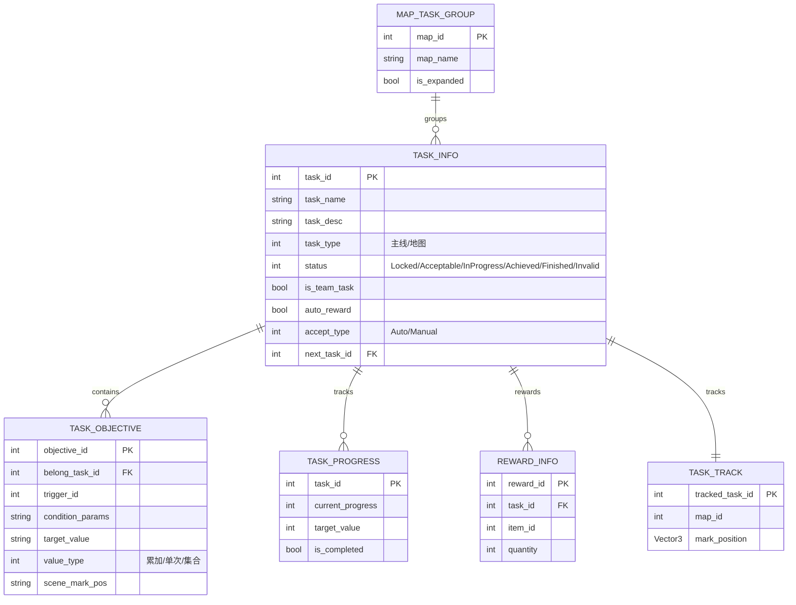
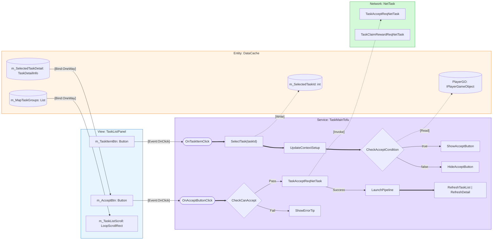
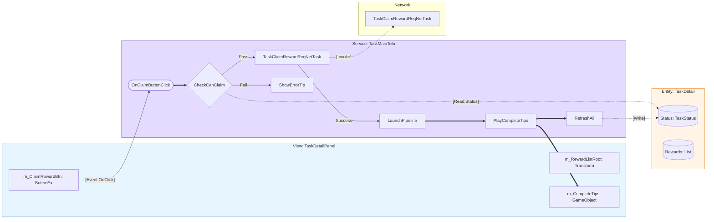
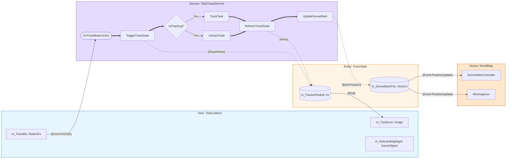
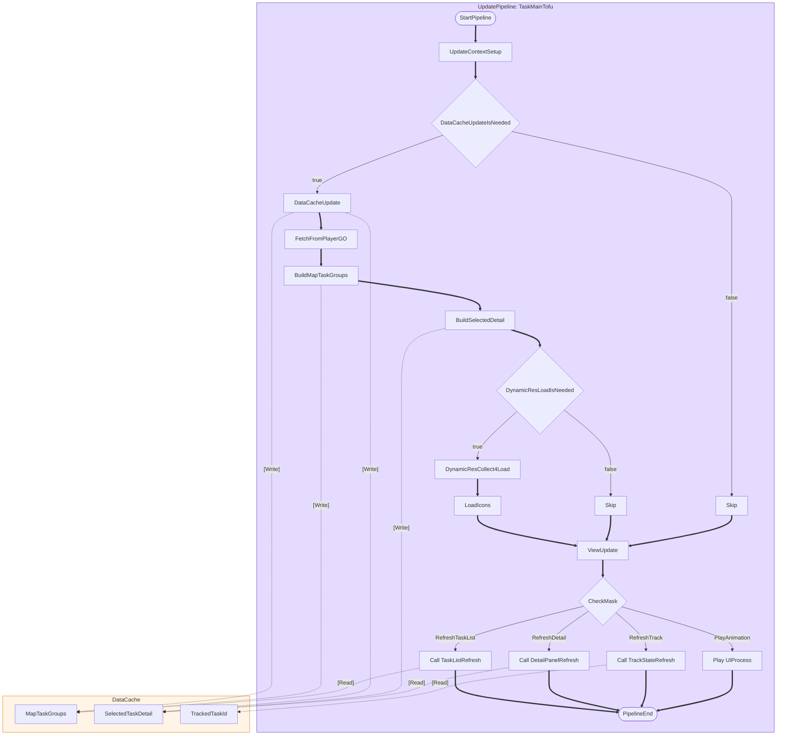
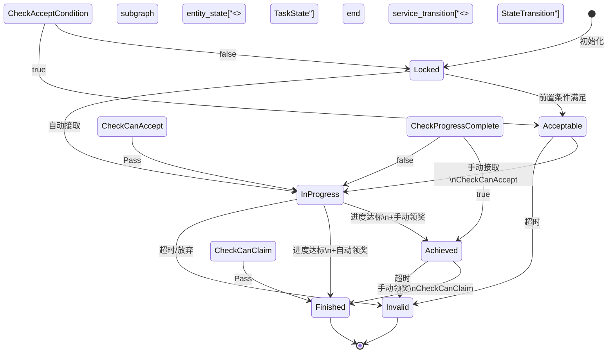
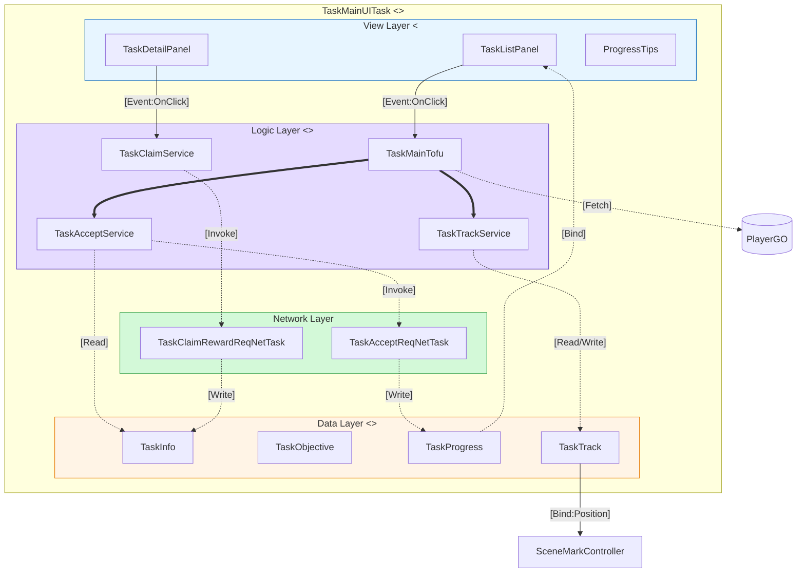

# TaskSystem 蓝图编译输出 (BJFramework Blueprint Compiler)

## Step 1: 语义提取 (Semantic Extraction)

### 核心元素识别表

| 类型 | 元素名称 | BJFramework映射 | 角色标注 |
|------|----------|-----------------|----------|
| **名词** | TaskInfo | `<<Entity>>` | 任务基础数据 |
| **名词** | TaskObjective | `<<Entity>>` | 任务目标数据 |
| **名词** | TaskStatus | `<<Entity>>` | 状态枚举值 |
| **名词** | TaskProgress | `<<Entity>>` | 进度缓存 |
| **动词** | AcceptTask | `<<Service>>` | 接取任务逻辑 |
| **动词** | ClaimReward | `<<Service>>` | 领取奖励逻辑 |
| **动词** | TrackTask | `<<Service>>` | 追踪任务逻辑 |
| **动词** | UpdateProgress | `<<Service>>` | 进度更新逻辑 |
| **反馈** | TaskListView | `<<View>>` | 任务列表UI |
| **反馈** | TaskDetailView | `<<View>>` | 任务详情UI |
| **反馈** | ProgressTips | `<<View>>` | 进度提示UI |
| **消息** | OnTaskClick | `<<Event>>` | 点击事件 |
| **消息** | OnProgressUpdate | `<<Event>>` | 进度更新事件 |

---

## Step 2: ER模型 (Entity Relationship)



---

## Step 3: 蓝图拓扑 (Blueprint Topology)

### 主执行流：任务接取流程



---

### 主执行流：领取奖励流程



---

### 主执行流：任务追踪流程



---

### 数据流：Pipeline更新管线



---

### 状态机：任务状态转换



---

## Step 4: 元数据校验清单

### ✅ 质量检查清单 (Checklist)

| 检查项 | 状态 | 说明 |
|--------|------|------|
| **Subgraph角色标注** | ✅ | 所有subgraph都有明确的框架角色(View/Service/Data/Network/Scene) |
| **连线标签参数** | ✅ | 包含[Event:Type]、[Bind:Path]、[Read/Write]等代码生成参数 |
| **节点ID合法性** | ✅ | 所有节点ID符合C#变量命名规范(无空格，无特殊字符) |
| **执行流逻辑闭环** | ✅ | 所有==>执行流都有明确的起点和终点 |
| **语义标签(Stereotypes)** | ✅ | 所有关键节点使用<< >>标注(Entity/Service/View/Event) |
| **色彩规范** | ✅ | Logic紫色(#e5dbff)、Entity黄色(#fff4e6)、View蓝色(#e7f5ff) |

---

## Step 5: 代码映射示例

基于蓝图编译结果，以下是可直接映射的C#代码结构：

### Entity 映射

```csharp
// <<Entity>> TaskInfo
public class TaskInfo
{
    public int TaskId { get; set; }          // PK
    public string TaskName { get; set; }
    public string TaskDesc { get; set; }
    public TaskType TaskType { get; set; }   // 主线/地图
    public TaskStatus Status { get; set; }   // Locked/Acceptable/InProgress...
    public bool IsTeamTask { get; set; }
    public bool AutoReward { get; set; }
    public AcceptType AcceptType { get; set; }
    public int NextTaskId { get; set; }      // FK
}

// <<Entity>> TaskObjective
public class TaskObjective
{
    public int ObjectiveId { get; set; }     // PK
    public int BelongTaskId { get; set; }    // FK -> TaskInfo
    public int TriggerId { get; set; }
    public string ConditionParams { get; set; }
    public string TargetValue { get; set; }
    public ProgressType ValueType { get; set; }  // 累加/单次/集合
    public string SceneMarkPos { get; set; }
}
```

### Service 映射

```csharp
// <<Service>> TaskMainTofu
public partial class TaskMainUITaskCompMainTofu : UITaskCompTofuBase
{
    // DataCache (Entity)
    private TaskMainTofuDataCache m_dataCache;
    
    // Service Methods
    private void OnAcceptButtonClick(int taskId)
    {
        // CheckCanAccept
        if (!CheckCanAccept(taskId, out var error))
        {
            ShowErrorTip(error);
            return;
        }
        
        // NetTask
        var netTask = new TaskAcceptReqNetTask(taskId);
        netTask.EventOnStop += task =>
        {
            // LaunchPipeline
            var info = m_compUpdatePipelineManager.UpdatePipelineInitInfoAlloc();
            info.m_customParamDict.SetParam(ParamKeyPipelineUpdateMask, 
                PipelineUpdateMask.RefreshTaskList | PipelineUpdateMask.RefreshDetailPanel);
            m_compUpdatePipelineManager.UpdatePipelineLaunch(info);
        };
        netTask.Start();
    }
}
```

### View 映射

```csharp
// <<View>> TaskMainUIController
public partial class TaskMainUIController : UIControllerBase
{
    // [AutoBind] 对应蓝图中的 [Bind:Path]
    [AutoBind("TaskListScroll")]
    private LoopVerticalScrollRect m_taskListScroll;
    
    [AutoBind("DetailPanel")]
    private GameObject m_detailPanelRoot;
    
    // [Event] 对应蓝图中的 [Event:OnClick]
    public event Action<int> EventOnTaskItemClick;
    public event Action<int> EventOnAcceptButtonClick;
    
    // Service Call
    public void TaskListRefresh(List<MapTaskGroup> mapGroups, int currentMapId)
    {
        // 执行数据绑定
    }
}
```

---

## 附录：蓝图完整拓扑总图



---

**蓝图编译完成** | BJFramework Blueprint Compiler v1.0
