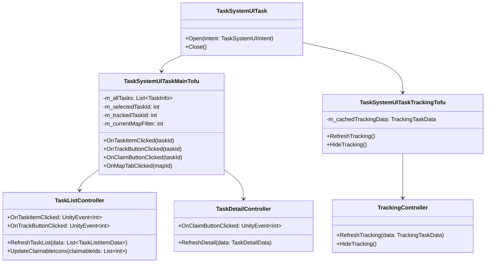
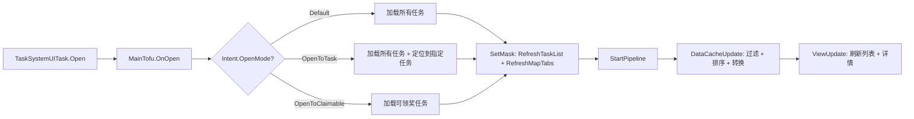
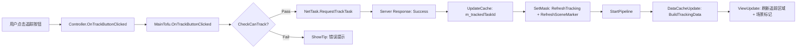
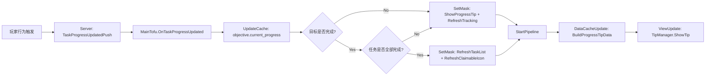
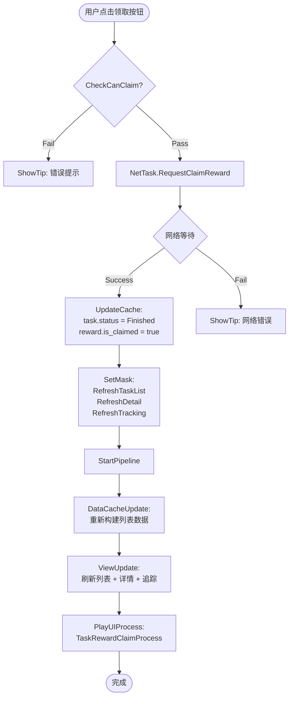
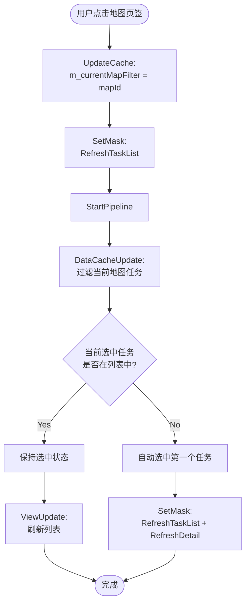
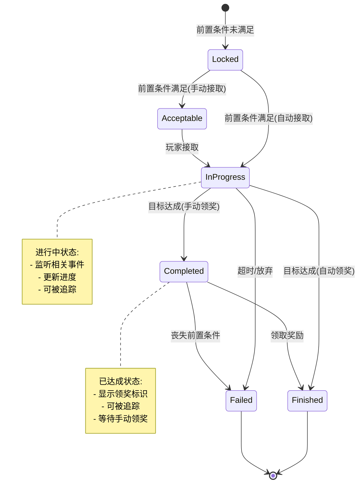

---

mindmap-plugin: markdown

---
# 任务系统UI设计文档 | ProjectEF | 2026-02-13

**PRD**: H:\Work\U3D_EF\ProjectEF\Assets\Doc\10_Projects\TaskSystem\PRD\tasksytem.md

---

## 逻辑审计与交互审计自检 (Logic & Architecture Audit)

### 逻辑设计报告

**[风险点1]: 追踪任务时未检查任务状态**
- **问题**: PRD 中"追踪任务"功能未明确是否可追踪"已结束"状态的任务
- **违规倾向**: 可能导致追踪已完成任务，显示无效的场景标记
- **修正建议**:
  - 在 `Check` 阶段添加状态检查：`task.Status != TaskStatus.Finished && task.Status != TaskStatus.Failed`
  - 在 UI 层禁用已结束任务的追踪按钮

**[风险点2]: 组队任务进度共享缺少范围验证**
- **问题**: PRD 提到"队友在共享范围内的操作也会推进任务进度"，但未定义"共享范围"
- **违规倾向**: 可能导致跨地图/跨房间的进度同步错误
- **修正建议**:
  - 在服务端推送时携带 `contributorMapId` 和 `contributorRoomId`
  - 在 `OnTeamMemberActionEvent` 中检查：`contributorMapId == PlayerCtx.CurrentMapId && contributorRoomId == PlayerCtx.CurrentRoomId`

**[风险点3]: 自动领奖与手动领奖的奖励发放时机不明确**
- **问题**: "自动领奖"是在目标达成时立即发放，还是异步推送？
- **违规倾向**: 可能导致客户端显示"已完成"但奖励未到账
- **修正建议**:
  - 自动领奖：服务端在 `TaskCompleted` 时立即发放奖励并推送 `TaskRewardGrantedPush`
  - 客户端收到推送后，SetMask(RefreshTaskList | RefreshClaimableIcon) → StartPipeline

### 交互审计报告

**[问题点1]: 地图页签切换时是否清空已选任务详情**
- **问题**: PRD 未说明切换地图页签后，右侧任务详情区域的行为
- **建议**:
  - 若切换后列表中不包含当前选中任务 → 自动选中第一个任务或显示空状态
  - 若切换后列表中包含当前选中任务 → 保持选中状态

**[问题点2]: 追踪任务后进入新地图的显示逻辑**
- **问题**: 若玩家追踪了"地图A的任务"，进入地图B后，追踪区域是否显示？场景标记是否消失？
- **建议**:
  - 追踪区域：始终显示已追踪任务，不受地图切换影响
  - 场景标记：仅在 `objective.scene_mark_pos.mapId == PlayerCtx.CurrentMapId` 时显示

**[问题点3]: 进度提示的显示时长与队列机制**
- **问题**: 若短时间内触发多个任务目标完成，提示如何展示？
- **建议**:
  - 使用 `TipManager` 的消息队列机制
  - 每条提示显示 2 秒，队列顺序播放
  - 队友贡献的提示优先级低于自己的操作

### 状态迁移矩阵：Mode-Action 矩阵表

| Mode \ Action | Click_Close | Click_TaskItem | Click_TrackButton | Click_ClaimButton | Click_MapTab | Press_ESC |
|---------------|-------------|----------------|-------------------|-------------------|--------------|-----------|
| **Default**   | CloseUI     | SelectTask + RefreshDetail | Check → TrackTask | Check → ClaimReward | SwitchMapFilter | CloseUI   |
| **Loading**   | N/A (锁定) | N/A (锁定)    | N/A (锁定)       | N/A (锁定)       | N/A (锁定)  | N/A (锁定)|
| **DetailView**| CloseUI     | SelectTask + RefreshDetail | Check → TrackTask | Check → ClaimReward | SwitchMapFilter | CloseUI   |

**说明**:
- `Default`: 默认模式，界面打开且未执行网络请求
- `Loading`: 执行网络请求中，所有交互禁用
- `DetailView`: 选中任务查看详情（与 Default 行为一致，仅用于语义区分）

---

## 1. 任务定义 (UITask & Intent)

### UITask Name
`TaskSystemUITask`

### UITofu 定义

#### TaskSystemUITaskMainTofu
**职责**: 任务系统主界面业务中枢
- 管理任务列表、任务详情、追踪任务的数据缓存
- 处理地图页签切换、任务选中、追踪、领奖等交互逻辑
- 订阅服务端推送（任务状态变更、进度更新、奖励发放）

**事件订阅**:
- `OnTaskStatusChangedPush`: 任务状态变更推送
- `OnTaskProgressUpdatedPush`: 任务进度更新推送
- `OnTaskRewardGrantedPush`: 奖励发放推送

**接口定义**:
```csharp
public class TaskSystemUITaskMainTofu : UITofu
{
    // 数据缓存
    private List<TaskInfo> m_allTasks;
    private int m_selectedTaskId;
    private int m_trackedTaskId;
    private int m_currentMapFilter; // 0 = 全部地图

    // Display Data
    private List<TaskListItemData> m_cachedListData;
    private TaskDetailData m_cachedDetailData;
    private TrackingTaskData m_cachedTrackingData;

    // 交互处理
    public void OnTaskItemClicked(int taskId);
    public void OnTrackButtonClicked(int taskId);
    public void OnClaimButtonClicked(int taskId);
    public void OnMapTabClicked(int mapId);

    // 服务端推送
    private void OnTaskStatusChanged(TaskStatusChangedPush push);
    private void OnTaskProgressUpdated(TaskProgressUpdatedPush push);
    private void OnTaskRewardGranted(TaskRewardGrantedPush push);
}
```

#### TaskSystemUITaskTrackingTofu
**职责**: 追踪任务显示逻辑（常驻 HUD）
- 监听 `m_trackedTaskId` 变化
- 刷新追踪任务区域和场景标记

**接口定义**:
```csharp
public class TaskSystemUITaskTrackingTofu : UITofu
{
    private TrackingTaskData m_cachedTrackingData;

    public void RefreshTracking();
    public void HideTracking();
}
```

### Intent Params

```csharp
public class TaskSystemUIIntent
{
    public TaskSystemUIIntentOpenMode OpenMode;
    public int InitialSelectedTaskId;  // 初始选中的任务 ID（0 = 自动选择第一个）
    public int FromSceneId;            // 来源场景 ID（用于自动追踪逻辑）
}

public enum TaskSystemUIIntentOpenMode
{
    Default,          // 默认打开，显示所有任务
    OpenToTask,       // 打开并定位到指定任务
    OpenToClaimable   // 打开并筛选可领奖任务
}
```

### 主要类图



---

## 2. 业务中枢 (MainTofu & Data)

### Data Cache

#### Business Data (Logic Data)
存储在 `TaskSystemUITaskMainTofu.m_dataCache` 中：

```csharp
public class TaskSystemDataCache
{
    public List<TaskInfo> AllTasks;          // 所有任务信息
    public int TrackedTaskId;                 // 当前追踪的任务 ID
    public Dictionary<int, TeamTaskInfo> TeamTasks; // 组队任务信息
}

public class TaskInfo
{
    public int task_id;
    public TaskType task_type;
    public string task_name;
    public string task_desc;
    public TaskStatus status;
    public int next_task_id;
    public bool auto_reward;
    public AcceptType accept_type;
    public bool is_team_task;
    public int mapId;
    public List<TaskObjective> objectives;
    public TaskReward reward;
}

public class TaskObjective
{
    public int objective_id;
    public int belong_task_id;
    public int trigger_id;
    public string objective_desc;
    public int target_value;
    public int current_progress;
    public SceneMarkPos scene_mark_pos;
}
```

#### Display Data
传递给 UIController 的简化数据：

```csharp
public class TaskListItemData
{
    public int TaskId;
    public string TaskName;
    public TaskType TaskType;
    public TaskStatus Status;
    public bool IsClaimable;
    public bool IsTracked;
    public bool IsTeamTask;
}

public class TaskDetailData
{
    public string TaskName;
    public string TaskDesc;
    public List<ObjectiveDisplayData> Objectives;
    public List<RewardDisplayData> Rewards;
    public bool IsClaimable;
    public bool IsTeamTask;
}

public class ObjectiveDisplayData
{
    public string Description;
    public string ProgressText;      // "3/10"
    public float ProgressPercentage;  // 0.3f
    public bool IsCompleted;
}

public class TrackingTaskData
{
    public string TaskName;
    public List<ObjectiveDisplayData> Objectives;
    public List<SceneMarkerData> SceneMarkers;
}
```

### Business Logic

#### Check 触发时机

**追踪任务 (TrackTask)**:
```csharp
private bool CheckCanTrack(int taskId)
{
    var task = GetTask(taskId);
    if (task == null) return false;
    if (task.status == TaskStatus.Finished || task.status == TaskStatus.Failed)
    {
        ShowTip("已结束的任务无法追踪");
        return false;
    }
    return true;
}
```

**领取奖励 (ClaimReward)**:
```csharp
private bool CheckCanClaim(int taskId)
{
    var task = GetTask(taskId);
    if (task == null) return false;
    if (task.status != TaskStatus.Completed)
    {
        ShowTip("任务未完成，无法领取奖励");
        return false;
    }
    if (task.reward == null || task.reward.is_claimed)
    {
        ShowTip("奖励已领取");
        return false;
    }
    return true;
}
```

#### NetTask 触发时机

- **追踪任务**: `NetTask.RequestTrackTask(taskId)`
  - 时机: `CheckCanTrack()` 通过后
  - 成功后: 更新 `m_trackedTaskId`，SetMask(RefreshTracking | RefreshSceneMarker)

- **领取奖励**: `NetTask.RequestClaimReward(taskId)`
  - 时机: `CheckCanClaim()` 通过后
  - 成功后: 更新任务状态为 Finished，SetMask(RefreshTaskList | RefreshDetail | RefreshTracking)

- **任务进度更新**: 由服务端推送触发，不由客户端主动发起

### 数据流向 (Data Flow)

#### 场景 1: 打开任务界面



#### 场景 2: 追踪任务



#### 场景 3: 任务进度更新（服务端推送）



---

## 3. 业务流程与状态机 (Flow & State)

### 业务流程图

#### 流程 1: 领取奖励流程



#### 流程 2: 切换地图页签流程



### 状态机图

#### 任务状态机



#### UI 模式状态机

```mermaid
stateDiagram-v2
    [*] --> Default: UITask.Open
    Default --> Loading: NetTask 执行
    Loading --> Default: NetTask 完成
    Loading --> Error: NetTask 失败
    Error --> Default: 关闭提示
    Default --> [*]: UITask.Close
```

### 状态枚举

```csharp
public enum TaskStatus
{
    Locked = 0,      // 锁定（前置条件未满足）
    Acceptable = 1,  // 可接取（手动接取）
    InProgress = 2,  // 进行中
    Completed = 3,   // 已达成（待领奖）
    Finished = 4,    // 已结束（已领奖）
    Failed = 5       // 失败（超时/放弃）
}

public enum UIMode
{
    Default = 0,     // 默认模式
    Loading = 1,     // 加载中（锁定交互）
    Error = 2        // 错误提示中
}
```

### 流转逻辑

**任务状态流转**:
- `Locked → Acceptable`: 前置条件满足 + 手动接取模式
- `Locked → InProgress`: 前置条件满足 + 自动接取模式
- `Acceptable → InProgress`: 玩家手动点击"接取"按钮
- `InProgress → Completed`: 所有目标达成 + 手动领奖模式
- `InProgress → Finished`: 所有目标达成 + 自动领奖模式
- `Completed → Finished`: 玩家手动点击"领取"按钮

**UI 模式流转**:
- `Default → Loading`: 任何 NetTask 开始执行时
- `Loading → Default`: NetTask 成功返回时
- `Loading → Error`: NetTask 失败时
- `Error → Default`: 错误提示关闭后

---

## 4. 驱动与刷新 (Pipeline & Mask)

### PipelineUpdateMask 定义

```csharp
[Flags]
public enum TaskSystemPipelineMask
{
    None = 0,
    RefreshTaskList = 1 << 0,           // 刷新任务列表
    RefreshTaskDetail = 1 << 1,         // 刷新任务详情
    RefreshTracking = 1 << 2,           // 刷新追踪区域
    RefreshMapTabs = 1 << 3,            // 刷新地图页签
    ShowProgressTip = 1 << 4,           // 显示进度提示
    RefreshSceneMarker = 1 << 5,        // 刷新场景标记
    RefreshClaimableIcon = 1 << 6,      // 刷新可领奖标识
    RefreshTaskListStayPos = 1 << 7,    // 刷新任务列表（保持滚动位置）
    All = ~0
}
```

**Mask 使用场景**:
- `RefreshTaskList`: 初次打开、切换地图页签、任务状态变更
- `RefreshTaskDetail`: 选中任务、任务进度更新、领取奖励
- `RefreshTracking`: 追踪任务、任务进度更新、取消追踪
- `RefreshMapTabs`: 初次打开（显示所有地图页签）
- `ShowProgressTip`: 任务进度更新、目标完成
- `RefreshSceneMarker`: 追踪任务、切换地图
- `RefreshClaimableIcon`: 任务达成、领取奖励
- `RefreshTaskListStayPos`: 仅刷新列表数据，不滚动到顶部（用于后台任务状态更新）

### ViewUpdate 策略

```csharp
protected override void ViewUpdate()
{
    // 1. 刷新任务列表
    if (CheckMask(RefreshTaskList) || CheckMask(RefreshTaskListStayPos))
    {
        bool stayPos = CheckMask(RefreshTaskListStayPos);
        m_taskListCtrl.RefreshTaskList(m_cachedListData, stayPos);
    }

    // 2. 刷新任务详情
    if (CheckMask(RefreshTaskDetail))
    {
        if (m_cachedDetailData != null)
            m_taskDetailCtrl.RefreshDetail(m_cachedDetailData);
        else
            m_taskDetailCtrl.ShowEmptyState();
    }

    // 3. 刷新追踪任务
    if (CheckMask(RefreshTracking))
    {
        if (m_cachedTrackingData != null)
            m_trackingCtrl.RefreshTracking(m_cachedTrackingData);
        else
            m_trackingCtrl.HideTracking();
    }

    // 4. 刷新地图页签
    if (CheckMask(RefreshMapTabs))
    {
        var mapIds = m_allTasks.Select(t => t.mapId).Distinct().ToList();
        m_taskListCtrl.RefreshMapTabs(mapIds, m_currentMapFilter);
    }

    // 5. 显示进度提示
    if (CheckMask(ShowProgressTip))
    {
        TipManager.ShowTip(m_cachedProgressTipData.Text, m_cachedProgressTipData.Duration);
    }

    // 6. 刷新场景标记
    if (CheckMask(RefreshSceneMarker))
    {
        if (m_cachedTrackingData?.SceneMarkers != null)
            SceneMarkerManager.RefreshMarkers(m_cachedTrackingData.SceneMarkers);
        else
            SceneMarkerManager.ClearMarkers();
    }

    // 7. 刷新可领奖标识
    if (CheckMask(RefreshClaimableIcon))
    {
        var claimableIds = m_cachedListData
            .Where(t => t.IsClaimable)
            .Select(t => t.TaskId)
            .ToList();
        m_taskListCtrl.UpdateClaimableIcons(claimableIds);
    }
}
```

---

## 5. 视图表现 (UIController & UIProcess)

### Controller 接口定义

#### TaskListController

```csharp
public class TaskListController : UIController
{
    // 事件
    public UnityEvent<int> OnTaskItemClicked;
    public UnityEvent<int> OnTrackButtonClicked;
    public UnityEvent<int> OnMapTabClicked;

    // 接口
    public void RefreshTaskList(List<TaskListItemData> data, bool stayPos = false);
    public void RefreshMapTabs(List<int> mapIds, int currentMapFilter);
    public void UpdateClaimableIcons(List<int> claimableTaskIds);

    // UI 成员
    private LoopScrollRect m_scrollRect;
    private TaskItemPool m_itemPool;
    private MapTabGroup m_mapTabGroup;
}
```

#### TaskDetailController

```csharp
public class TaskDetailController : UIController
{
    // 事件
    public UnityEvent<int> OnClaimButtonClicked;

    // 接口
    public void RefreshDetail(TaskDetailData data);
    public void ShowEmptyState();

    // UI 成员
    private Text m_taskNameText;
    private Text m_taskDescText;
    private ObjectiveListView m_objectiveListView;
    private RewardListView m_rewardListView;
    private ButtonEx m_claimButton;
}
```

#### TrackingController

```csharp
public class TrackingController : UIController
{
    // 接口
    public void RefreshTracking(TrackingTaskData data);
    public void HideTracking();

    // UI 成员
    private GameObject m_trackingPanel;
    private Text m_taskNameText;
    private ObjectiveProgressList m_objectiveList;
}
```

### Controller 主要成员

#### TaskListController 成员变量

```csharp
// 滚动列表
[SerializeField] private LoopScrollRect m_scrollRect;
private TaskItemPool m_itemPool;
private int m_currentScrollPosition; // 保存滚动位置用于 StayPos 刷新

// 地图页签
[SerializeField] private MapTabGroup m_mapTabGroup;
private List<MapTab> m_mapTabs;

// 对象池
private class TaskItemPool : ILoopScrollDataSource
{
    public void ProvideData(Transform item, int index);
}

// 可领奖标识缓存
private HashSet<int> m_claimableTaskIds;
```

#### TaskDetailController 成员变量

```csharp
// 基础信息
[SerializeField] private Text m_taskNameText;
[SerializeField] private Text m_taskDescText;
[SerializeField] private Image m_taskTypeIcon;

// 目标列表
[SerializeField] private ObjectiveListView m_objectiveListView;
private List<ObjectiveItemView> m_objectiveItems;

// 奖励列表
[SerializeField] private RewardListView m_rewardListView;
private List<RewardItemView> m_rewardItems;

// 领取按钮
[SerializeField] private ButtonEx m_claimButton;

// 空状态
[SerializeField] private GameObject m_emptyStatePanel;
```

### UIProcess 定义

#### TaskRewardClaimProcess

```csharp
public class TaskRewardClaimProcess : UIProcess
{
    protected override void OnPlayProcess()
    {
        // 1. 播放按钮缩放动画（0.2s）
        DOTween.Sequence()
            .Append(m_claimButton.transform.DOScale(1.2f, 0.1f))
            .Append(m_claimButton.transform.DOScale(1f, 0.1f))
            .OnComplete(() =>
            {
                // 2. 显示奖励飞行特效（1s）
                PlayRewardFlyEffect(m_rewardItems);

                // 3. 延迟后完成流程
                DOVirtual.DelayedCall(1f, () => OnProcessEnd());
            });
    }

    private void PlayRewardFlyEffect(List<RewardDisplayData> rewards)
    {
        foreach (var reward in rewards)
        {
            var icon = Instantiate(m_rewardIconPrefab, m_claimButton.transform.position, Quaternion.identity);
            icon.sprite = reward.Icon;
            icon.transform.DOMove(m_rewardTargetPos, 0.8f)
                .SetEase(Ease.OutQuad)
                .OnComplete(() => Destroy(icon.gameObject));
        }
    }
}
```

#### TaskCompleteProcess

```csharp
public class TaskCompleteProcess : UIProcess
{
    protected override void OnPlayProcess()
    {
        // 1. 播放任务条目高亮动画（0.5s）
        var taskItem = m_taskListCtrl.GetItemView(m_completedTaskId);
        taskItem.PlayHighlightEffect();

        // 2. 显示完成标识（淡入动画 0.3s）
        var completeIcon = taskItem.GetComponent<CompleteIcon>();
        completeIcon.gameObject.SetActive(true);
        completeIcon.GetComponent<CanvasGroup>().DOFade(1f, 0.3f);

        // 3. 延迟后完成流程
        DOVirtual.DelayedCall(0.8f, () => OnProcessEnd());
    }
}
```

### 快捷键管理

```csharp
public class TaskSystemUITaskMainTofu : UITofu
{
    protected override void OnInputUpdate()
    {
        // ESC 关闭界面
        if (UIInputManager.GetKeyDown(KeyCode.Escape))
        {
            OwnerUITask.Close();
        }

        // Tab 切换地图页签
        if (UIInputManager.GetKeyDown(KeyCode.Tab))
        {
            int nextMapIndex = (m_currentMapFilter + 1) % m_mapIds.Count;
            OnMapTabClicked(m_mapIds[nextMapIndex]);
        }

        // J 打开任务界面（全局快捷键，在 UIInputManager 中注册）
        // T 追踪当前选中任务
        if (UIInputManager.GetKeyDown(KeyCode.T))
        {
            OnTrackButtonClicked(m_selectedTaskId);
        }
    }
}
```

---

## 6. 技术重点与风险 (Implementation Notes)

### 边界问题

**1. 追踪任务后任务被删除**
- **场景**: 玩家追踪了"每日任务 A"，次日凌晨任务重置后，任务 A 被删除
- **问题**: `m_trackedTaskId` 指向无效任务，导致追踪区域显示错误
- **解决方案**:
  - 在 `OnTaskStatusChanged` 中检查：若 `m_trackedTaskId` 对应的任务状态变为 `Deleted`，自动清空追踪
  - 在 `DataCacheUpdate` 阶段添加防御性检查：
    ```csharp
    if (CheckMask(RefreshTracking))
    {
        var trackedTask = GetTask(m_trackedTaskId);
        if (trackedTask == null || trackedTask.status == TaskStatus.Deleted)
        {
            m_trackedTaskId = 0;
            m_cachedTrackingData = null;
        }
        else
        {
            m_cachedTrackingData = BuildTrackingData(trackedTask);
        }
    }
    ```

**2. 任务列表过滤后为空**
- **场景**: 玩家切换到"地图 A"页签，但该地图没有任务
- **问题**: 列表显示空白，用户不知道是加载失败还是真的没有任务
- **解决方案**:
  - 在 `ViewUpdate` 中检查 `m_cachedListData.Count == 0`，显示空状态提示：
    ```csharp
    if (m_cachedListData.Count == 0)
        m_taskListCtrl.ShowEmptyState("该地图暂无任务");
    ```

**3. 网络请求失败后任务状态不一致**
- **场景**: 玩家点击"领取奖励"，网络请求失败，但 UI 已经禁用了领取按钮
- **问题**: 按钮永久禁用，玩家无法重试
- **解决方案**:
  - NetTask 失败时，调用 `SetMask(RefreshTaskDetail)` 重新刷新详情界面
  - 在 `Preprocess` 中锁定 UI，在 `PostProcess` 中解锁，确保请求失败后 UI 恢复交互

### 技术难点

**难点 1: LoopScrollRect 动态高度支持**
- **需求**: 任务条目的高度不固定（任务名称可能换行）
- **挑战**: LoopScrollRect 默认要求固定高度
- **解决方案**:
  - 使用 `LoopScrollRect` 的 `LayoutGroup` 模式
  - 在 `TaskItemView.RefreshData()` 中动态计算高度：
    ```csharp
    LayoutRebuilder.ForceRebuildLayoutImmediate(m_taskNameText.rectTransform);
    float height = m_taskNameText.preferredHeight + m_padding * 2;
    GetComponent<LayoutElement>().preferredHeight = height;
    ```
  - 在 `LoopScrollDataSource.ProvideData()` 中通知高度变化：
    ```csharp
    m_scrollRect.RefreshCells();
    ```

**难点 2: 场景标记的地图坐标转换**
- **需求**: 将任务配置的地图坐标 (MapID, X, Y, Z) 转换为屏幕坐标显示标记
- **挑战**: 不同地图可能有不同的坐标系
- **解决方案**:
  - 使用全局坐标系统 `MapCoordinateSystem`：
    ```csharp
    Vector3 worldPos = MapCoordinateSystem.ToWorldPosition(mapId, x, y, z);
    Vector2 screenPos = Camera.main.WorldToScreenPoint(worldPos);
    m_markerIcon.anchoredPosition = screenPos;
    ```
  - 场景标记仅在当前地图显示，跨地图时隐藏：
    ```csharp
    bool isVisible = objective.scene_mark_pos.mapId == PlayerCtx.CurrentMapId;
    m_markerIcon.gameObject.SetActive(isVisible);
    ```

**难点 3: 进度提示的队列管理**
- **需求**: 短时间内触发多个任务进度更新，提示不能叠加显示
- **挑战**: 多个提示同时触发，如何保证顺序播放且不遗漏
- **解决方案**:
  - 使用 `TipManager` 的消息队列机制：
    ```csharp
    public class TipManager : MonoBehaviour
    {
        private Queue<TipData> m_tipQueue = new Queue<TipData>();
        private bool m_isPlaying = false;

        public void ShowTip(string text, float duration)
        {
            m_tipQueue.Enqueue(new TipData { Text = text, Duration = duration });
            if (!m_isPlaying)
                PlayNextTip();
        }

        private void PlayNextTip()
        {
            if (m_tipQueue.Count == 0)
            {
                m_isPlaying = false;
                return;
            }

            m_isPlaying = true;
            var tip = m_tipQueue.Dequeue();
            m_tipText.text = tip.Text;
            m_tipPanel.SetActive(true);

            DOVirtual.DelayedCall(tip.Duration, () =>
            {
                m_tipPanel.SetActive(false);
                PlayNextTip();
            });
        }
    }
    ```

**难点 4: 组队任务进度同步的延迟与冲突**
- **需求**: 队友完成任务目标后，自己的进度需要实时更新
- **挑战**: 网络延迟可能导致进度推送顺序错乱
- **解决方案**:
  - 服务端推送时携带 `timestamp`，客户端按时间戳排序：
    ```csharp
    private void OnTaskProgressUpdated(TaskProgressUpdatedPush push)
    {
        var objective = GetObjective(push.objectiveId);
        if (objective == null) return;

        // 检查时间戳，防止旧数据覆盖新数据
        if (push.timestamp < objective.last_update_timestamp)
        {
            Debug.LogWarning($"丢弃旧的进度推送: {push.objectiveId}");
            return;
        }

        objective.current_progress = push.newProgress;
        objective.last_update_timestamp = push.timestamp;

        SetMask(ShowProgressTip | RefreshTracking);
        StartPipeline();
    }
    ```

**难点 5: 性能优化 - 任务列表滚动优化**
- **需求**: 任务数量可能达到 100+，滚动时不能卡顿
- **挑战**: 每次滚动都重新创建 GameObject 会导致 GC 和卡顿
- **解决方案**:
  - 使用 `LoopScrollRect` 的对象池机制（已采用）
  - 在 `TaskItemView` 中缓存 `Text`、`Image` 组件引用，避免 `GetComponent`：
    ```csharp
    private Text m_taskNameText;
    private Image m_taskTypeIcon;
    private ButtonEx m_trackButton;

    private void Awake()
    {
        m_taskNameText = transform.Find("TaskName").GetComponent<Text>();
        m_taskTypeIcon = transform.Find("TypeIcon").GetComponent<Image>();
        m_trackButton = transform.Find("TrackButton").GetComponent<ButtonEx>();
    }

    public void RefreshData(TaskListItemData data)
    {
        // 直接使用缓存的引用，不调用 GetComponent
        m_taskNameText.text = data.TaskName;
        m_taskTypeIcon.sprite = GetTaskTypeIcon(data.TaskType);
        m_trackButton.interactable = data.IsTracked;
    }
    ```
  - 避免在 `RefreshData` 中执行复杂计算，将计算逻辑放在 `DataCacheUpdate` 阶段

---

## 总结

本设计文档完整覆盖了任务系统 UI 的所有关键设计要点：

1. **逻辑审计与交互审计**: 识别了 3 个风险点和 3 个交互问题点，并提供了修正建议
2. **UITask 定义**: 定义了 `TaskSystemUITask` 及其 2 个 Tofu（MainTofu、TrackingTofu）
3. **数据模型**: 区分了 Business Data 和 Display Data，明确了数据转换时机
4. **业务流程**: 绘制了 3 个关键业务流程图（领取奖励、切换地图、进度更新）
5. **状态机**: 定义了任务状态机（6 个状态）和 UI 模式状态机（3 个状态）
6. **Pipeline 驱动**: 定义了 8 个 PipelineUpdateMask，明确了刷新策略
7. **UIController 接口**: 定义了 3 个 Controller 的接口和主要成员变量
8. **UIProcess 编排**: 设计了 2 个 UIProcess（领奖动画、完成动画）
9. **技术难点**: 识别了 5 个技术难点并提供了解决方案

**符合 BJFramework 规范**:
- ✅ UITask 作为 Façade 封装 UI 意图
- ✅ MainTofu 作为业务中枢，维护数据缓存和业务逻辑
- ✅ UIController 纯视图化，仅暴露事件和刷新接口
- ✅ UpdatePipeline 驱动刷新，通过 PipelineUpdateMask 精确控制刷新范围
- ✅ UIProcess 编排复杂动画，与 Pipeline 协作

**可直接用于编码实施！**
