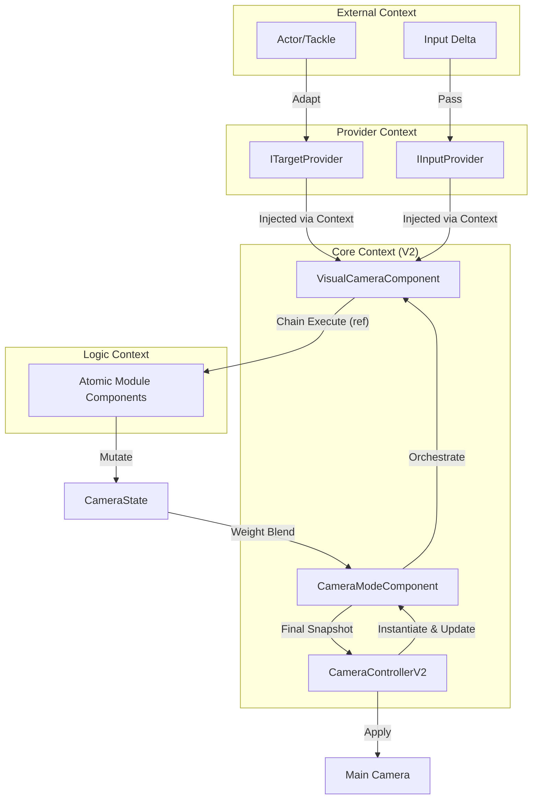

# 相机系统模块切分与边界定义规范 (Decoupling Specs)

## 全局信息

| 项目 | 值 |
|------|-----|
| **命名空间** | `BlackJack.ProjectEF.Runtime.CameraController` |
| **代码目录** | `Assets/GameProject/Scripts/Runtime/GameView/Camera/` |
| **版本** | v2.0 (组件化架构对齐) |

---

## 1. 模块地图 (Module Map)

| 模块 ID | 模块名称 | 职责 (Responsibility) | 核心组件 | 对应文档 |
| :--- | :--- | :--- | :--- | :--- |
| **M-CONFIG** | 配置模块 | 基于 Prefab 的模式/管线/模块参数定义 | `Modes Prefab`, `CameraModeComponent` | 2.Configuration |
| **M-CORE** | 相机编排器 | 模式调度、Prefab 加载、硬件应用 | `CameraControllerV2` | 3.Core |
| **M-LOGIC** | 原子逻辑库 | 执行阶段化位姿计算 (Body/Aim/Noise/Final) | `CameraModuleComponent` 子类 | 4.Logic |
| **M-VM** | 虚拟相机 | 封装模块管线，支持多 VM 权重混合 | `VisualCameraComponent` | 5.VisualCamera |
| **M-PROV** | 数据提供者 | 隔离外部物理组件与输入系统 | `ITargetProvider`, `IInputProvider` | 6.Provider |
| **M-BLEND** | 状态混合器 | 处理多 VM 间的状态插值与平滑过渡 | `CameraModeComponent.BlendVisualCameraStates` | (集成于Mode) |
| **M-DRIVE** | 渲染驱动器 | 最终位姿的物理应用 | `CameraControllerV2.ApplyCameraTransform` | (集成于Core) |

---

## 2. 数据主权 (Data Sovereignty)

- **M-CONFIG**: 拥有 Prefab 序列化数据的定义权。
- **M-CORE**: 拥有模式栈（Mode Stack）的控制权与硬件相机的唯一修改权。
- **M-PROV**: 拥有对外部 `Transform`、`ICameraFollowTarget` 的唯一"读取适配权"。
- **M-LOGIC**: 拥有对 `CameraState` 局部字段的"计算变异权"。
- **M-VM**: 拥有内部模块管线的执行顺序控制权。



---

## 3. 通讯契约 (Communication Contracts)

### 3.1 核心交互协议
- **输入流 (Input Flow)**: 业务层通过 `CameraControllerV2.HandleLookInput` 等接口注入原始输入增量。
- **上下文流 (Context Flow)**: 模块仅通过 `CameraModuleContext` 获取只读环境数据。
- **状态流 (Chain Mutation)**: 模块间通过 `ref CameraState` 进行链式加工，实现无 GC 的位姿累加。

---

## 4. 模块设计快照 (Context Snapshots)

### [M-CONFIG: 配置模块]
- **定位**: 系统的物理蓝图。
- **上游**: 策划/美术（通过 Unity Inspector）。
- **下游**: 为 M-CORE 提供初始化的实例列表。
- **载体**: Unity Prefab。
- **约束**: 严禁在 Prefab 节点上挂载非相机相关的业务逻辑脚本。

### [M-CORE: 相机编排器]
- **定位**: 系统的控制与加载中心。
- **上游**: 业务逻辑层。
- **下游**: 虚拟相机管线。
- **职责**: 实例化 Prefab，驱动 `Update` 链条，管理 `Push/Pop` 模式栈。
- **约束**: 禁止包含具体的几何计算代码。

### [M-LOGIC: 原子逻辑库]
- **定位**: 纯数学计算组件。
- **上游**: VM 管线调度。
- **下游**: `CameraState` 变异结果。
- **职责**: 接收上下文，修改 `CameraState`。
- **约束**: 必须是幂等的数学逻辑，严禁产生 GC，严禁访问业务单例。

### [M-VM: 虚拟相机]
- **定位**: 逻辑位姿生成的原子容器。
- **上游**: CameraMode 编排。
- **下游**: CameraState 快照输出。
- **职责**: 自动收集其下的模块，维护 `m_currentBlendWeight`。
- **约束**: 禁止跨 VM 通讯。

### [M-PROV: 数据提供者]
- **定位**: 空间上下文适配器。
- **上游**: Unity 物理/渲染组件。
- **下游**: 计算模块。
- **数据隔离**: 独占 `GetComponent` 调用权。
- **约束**: 禁止存储相机位姿数据，必须提供实时、无状态的几何快照。

### [M-BLEND: 状态混合器]
- **定位**: 多管线状态的数学融合器。
- **上游**: 多个 VM 的 CameraState 输出。
- **下游**: 最终 CameraState。
- **数据隔离**: 拥有插值系数的控制权。
- **约束**: 仅执行数学插值，禁止包含业务逻辑。
---

## 5. 禁止事项 (Negative Scope)

- **禁止直接操作硬件**: `ICameraModule` 和 `IVisualCamera` 严禁直接修改 `UnityEngine.Camera.transform`。
- **禁止逻辑膨胀**: 模式组件（Mode）严禁编写具体的位姿插值逻辑，必须通过组合模块实现。
- **禁止隐式依赖**: 严禁在模块内使用 `GameObject.Find` 或访问静态业务变量。
- **禁止非受控实例化**: 严禁使用 `new` 创建模式或模块，必须通过 Unity Prefab 机制。
- **禁止 GC 分配**: `ICameraModule.Execute` 内严禁使用 `new`、`Linq` 或频繁的装箱操作。
- **禁止状态泄露**: VM 之间严禁共享中间变量，每个 VM 必须完全独立。
---

## 6. 目录结构

```
Assets/GameProject/Scripts/Runtime/GameView/Camera/
├── Core/                           # M-CORE: 编排器
│   ├── CameraControllerV2.cs
│   ├── CameraState.cs
│   └── CameraModuleContext.cs
│
├── Components/                     # 组件化核心
│   ├── CameraModeComponent.cs      # 模式基类
│   ├── VisualCameraComponent.cs    # 虚拟相机
│   ├── CameraModuleComponent.cs    # 模块基类
│   ├── Modes/                      # 具体模式 (FPS/TPS...)
│   └── Modules/                    # 具体模块 (Follow/Rotation...)
│
├── Providers/                      # M-PROV: 数据提供者
│   ├── ITargetProvider.cs
│   ├── IInputProvider.cs
│   └── Adapters/                   # 适配器实现
│
└── Services/                       # 辅助服务
    ├── ITrackService.cs
    └── ...
