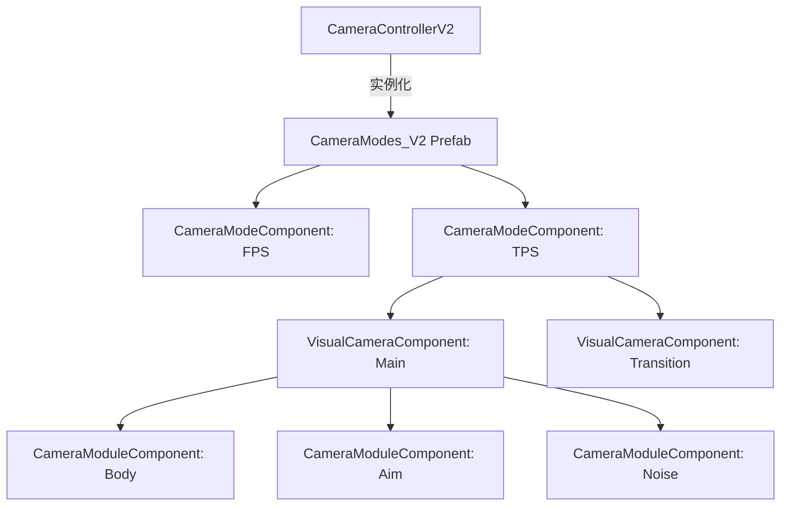

# 配置模块 (M-CONFIG) 设计文档（组件化对齐版）

## 全局信息

| 项目 | 值 |
|------|-----|
| **命名空间** | `BlackJack.ProjectEF.Runtime.CameraController` |
| **代码目录** | `Assets/GameProject/Scripts/Runtime/GameView/Camera/Components/` |
| **模块 ID** | M-CONFIG |

---

## 1. 模块定位 (Module Positioning)

重构后的 `Config` 模块由原先的 `ScriptableObject` 驱动转变为 **`Prefab` + `MonoBehaviour` 组件驱动**。它利用 Unity 的序列化机制实现"所见即所得"的相机配置，将复杂的计算管线可视化。

### 核心职责
- **可视化配置**: 通过 Unity Inspector 直接配置模式、虚拟相机和模块参数。
- **自动实例化**: 利用 Unity Prefab 系统实现配置的加载与对象池化基础。
- **管线解耦**: 每个模块作为独立组件，支持在 Prefab 中灵活组合。
- **混合驱动**: 定义虚拟相机（VisualCamera）的权重和混合曲线。

---

## 2. 核心架构与层级 (Architecture & Hierarchy)

### 2.1 组件层级关系
系统的配置不再是扁平的列表，而是具有明确物理层级的对象树：


`Sources: [Assets/GameProject/Scripts/Runtime/GameView/Camera/Core/CameraControllerV2.cs:15-21](), [Assets/GameProject/Scripts/Runtime/GameView/Camera/Components/CameraModeComponent.cs:12-17]()`

### 2.2 关键组件说明

#### CameraModeComponent (模式配置)
定义单一相机模式的身份。负责管理其子层级的 `VisualCamera`。
- **自动化**: 支持 `m_autoCollectVisualCameras` 自动扫描子对象。
- **混合**: 包含 `CameraModeBlenderConfig` 定义进入/退出模式的曲线。
`Sources: [Assets/GameProject/Scripts/Runtime/GameView/Camera/Components/CameraModeComponent.cs:22-46]()`

#### VisualCameraComponent (虚拟相机配置)
配置的核心单元，代表一个具体的视角逻辑。
- **权重控制**: `m_weight` 定义该相机在混合中的占比。
- **模块管线**: 包含 `m_moduleComponents` 列表，定义计算顺序。
- **过渡效果**: `m_blendInTime` / `m_blendOutTime` 定义相机激活时的平滑时间。
`Sources: [Assets/GameProject/Scripts/Runtime/GameView/Camera/Components/VisualCameraComponent.cs:23-66]()`

#### CameraModuleComponent (模块配置)
具体的原子计算单元（如 `OrbitFollowModuleComponent`）。
- **阶段控制**: `m_stage` (Body/Aim/Noise/Finalize) 决定在管线中的执行时机。
- **执行顺序**: `m_order` 决定同阶段内的优先级。
`Sources: [Assets/GameProject/Scripts/Runtime/GameView/Camera/Components/CameraModuleComponent.cs:22-39]()`

---

## 3. 初始化与加载流程 (Initialization Flow)

系统通过 `CameraControllerV2` 统一驱动加载：

1. **载体加载**: `CameraControllerV2` 实例化配置好的模式 Prefab。
   `Sources: [Assets/GameProject/Scripts/Runtime/GameView/Camera/Core/CameraControllerV2.cs:179]()`
2. **模式注册**: 自动遍历并初始化所有 `CameraModeComponent`，按 `CameraModeType` 存入字典。
   `Sources: [Assets/GameProject/Scripts/Runtime/GameView/Camera/Core/CameraControllerV2.cs:184-198]()`
3. **管线构建**: 
   - `CameraModeComponent` 收集 `VisualCameraComponent`。
   - `VisualCameraComponent` 收集并按 `Stage` 排序其下的 `CameraModuleComponent`。
   `Sources: [Assets/GameProject/Scripts/Runtime/GameView/Camera/Components/VisualCameraComponent.cs:414-425]()`

---

## 4. 交互流程 (Workflow)

1. **创建预制体**: 创建一个名为 `CameraModes_V2` 的 Prefab。
2. **添加模式**: 在根节点下创建子对象，挂载 `SimpleTPSModeComponent`。
3. **配置虚拟相机**: 在模式下创建子对象，挂载 `VisualCameraComponent`。
4. **组合模块**: 在虚拟相机下挂载如 `OrbitFollowModuleComponent` 等组件，并在 Inspector 中调整参数。
5. **绑定**: 将该 Prefab 拖入场景中 `CameraControllerV2` 的 `m_modesPrefab` 槽位。

---

## 5. 目录结构

```
Camera/
├── Core/
│   └── CameraControllerV2.cs       # 核心入口与 Prefab 加载器
├── Components/                     # 组件化配置实现
│   ├── CameraModeComponent.cs      # 模式基类
│   ├── VisualCameraComponent.cs    # 虚拟相机基类
│   ├── CameraModuleComponent.cs    # 模块基类
│   ├── Modes/                      # 具体模式实现 (FPS/TPS)
│   └── Modules/                    # 具体模块实现 (Follow/Rotation/Noise)
```
`Sources: [Assets/GameProject/Scripts/Runtime/GameView/Camera]()`
