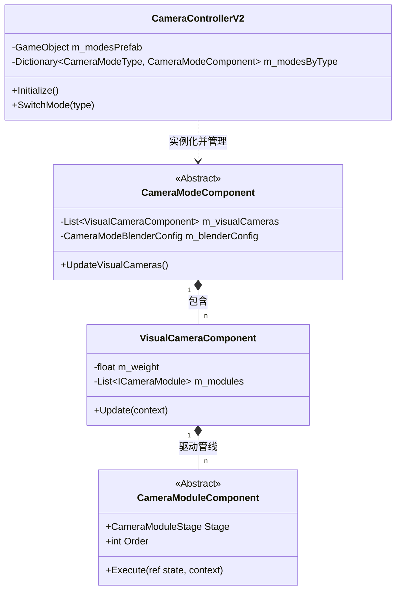

# 配置设计方案（组件化对齐版）

针对"相机模式初始化冗余"问题，结合 **VisualCamera (VM)** 语义和 **MonoBehaviour 组件化** 管线架构，设计"所见即所得"的 Prefab 驱动配置方案。

## 设计目标

**核心思想：架构即配置（Architecture as Configuration）**

1. **Prefab 载体**: 所有的相机模式、虚拟相机和模块均通过 Unity Prefab 承载，消除 ScriptableObject 的中间转换。
2. **自动发现**: `CameraControllerV2` 自动扫描 Prefab 节点，实现零代码配置。
3. **消除中间层**: 彻底移除旧设计的 Factory、Registry 和扁平化 Config 类。
4. **实时预览**: 支持在 Inspector 中直接调整参数并实时观察相机位姿变化。

---

## 重构后的设计

### 1. 数据与实例合一 (Integrated Model)

**设计决策依据**：在 Unity 中，MonoBehaviour 本身既是数据容器（序列化字段）又是运行逻辑。通过 Prefab，我们将"配置"与"实例蓝图"合二为一。

```csharp
// VisualCameraComponent - 虚拟相机核心，直接挂载模块
public class VisualCameraComponent : MonoBehaviour, IVisualCamera
{
    [SerializeField] private float m_weight = 1f;            // 混合权重
    [SerializeField] private float m_blendInTime = 0.3f;     // 混合时间
    
    // 自动收集子对象上的模块组件
    [SerializeField] private bool m_autoCollectModules = true;
    
    // 运行时维护的模块管线
    private List<ICameraModule> m_modules = new List<ICameraModule>();
    
    public void Update(in CameraModuleContext context) 
    {
        // 链式执行模块管线
        foreach(var module in m_modules) {
            module.Execute(ref m_currentState, context);
        }
    }
}
```
`Sources: [Assets/GameProject/Scripts/Runtime/GameView/Camera/Components/VisualCameraComponent.cs:23-53](), [Assets/GameProject/Scripts/Runtime/GameView/Camera/Components/VisualCameraComponent.cs:157-183]()`

### 2. 配置载体 (Prefab Container)

`CameraControllerV2` 不再读取 SO，而是引用一个 **Modes Prefab**。

```csharp
public class CameraControllerV2 : MonoBehaviour
{
    [Header("模式配置")]
    [SerializeField]
    [Tooltip("相机模式 Prefab（包含 CameraModeComponent 子对象）")]
    private GameObject m_modesPrefab;

    private void LoadModesPrefab()
    {
        // 1. 实例化整个配置树
        m_modesContainer = Instantiate(m_modesPrefab, transform);
        
        // 2. 自动发现所有模式组件
        var modeComponents = m_modesContainer.GetComponentsInChildren<CameraModeComponent>(true);
        
        foreach (var mode in modeComponents) {
            mode.Initialize(this); // 初始化并建立索引
            m_modesByType[mode.ModeType] = mode;
        }
    }
}
```
`Sources: [Assets/GameProject/Scripts/Runtime/GameView/Camera/Core/CameraControllerV2.cs:33-40](), [Assets/GameProject/Scripts/Runtime/GameView/Camera/Core/CameraControllerV2.cs:170-204]()`

---

## 架构关系图 (Architecture Diagram)


`Sources: [Assets/GameProject/Scripts/Runtime/GameView/Camera/Core/CameraControllerV2.cs](), [Assets/GameProject/Scripts/Runtime/GameView/Camera/Components/CameraModeComponent.cs](), [Assets/GameProject/Scripts/Runtime/GameView/Camera/Components/VisualCameraComponent.cs](), [Assets/GameProject/Scripts/Runtime/GameView/Camera/Components/CameraModuleComponent.cs]()`

---

## 设计决策对比

| 项目 | 之前的 SO 方案 | 现在的 Prefab 方案 | 改善 |
|------|-----|------|-----|
| **配置载体** | ScriptableObject (纯数据) | Prefab (组件化对象) | **更符合 Unity 工作流** |
| **实例化方式** | `Activator.CreateInstance` | `GameObject.Instantiate` | **性能更优 (序列化支持)** |
| **层级结构** | 扁平化列表 | 树状 VM 混合结构 | **支持多相机混合** |
| **调试体验** | 运行时修改 SO 无反馈 | Inspector 实时调整 | **所见即所得** |

**核心改进总结**：
1. **去中心化创建**：不再需要 Factory 类，Unity 引擎负责对象的创建和反序列化。
2. **强类型引用**：通过 `GetComponentInParent` 等手段自然建立父子引用关系，消除手动建立的字典映射。
3. **VM 混合支持**：原生支持 `VisualCamera` 语义，允许一个模式内存在多个相互混合的计算支路。
