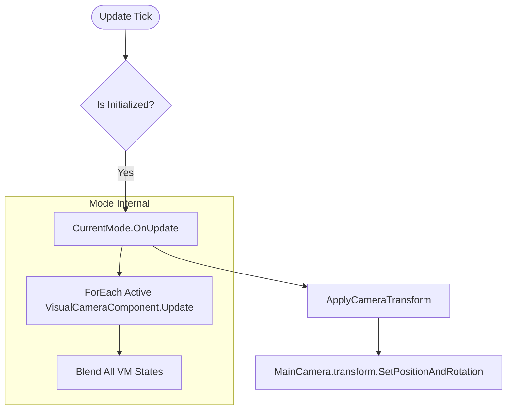

# 相机编排器 (M-CORE) 模块设计文档 (组件化对齐版)

## 全局信息

| 项目 | 值 |
|------|-----|
| **命名空间** | `BlackJack.ProjectEF.Runtime.CameraController` |
| **代码目录** | `Assets/GameProject/Scripts/Runtime/GameView/Camera/Core/` |
| **模块 ID** | M-CORE |

---

## 1. 模块定位 (Module Positioning)

`Core` 模块是相机系统的“中枢神经系统”，负责将业务层的非确定性意图（指令）转化为确定性的相机行为编排。在重构后的 V2 版本中，它转变为基于 **MonoBehaviour 组件树** 的调度器。

### 核心职责
- **指令分发**: 接收并解析外部 `ICameraCmd`，驱动模式切换或参数微调。
- **模式调度**: 管理 `CameraModeComponent` 的激活状态、权重混合以及模式栈（Push/Pop）。
- **配置加载**: 负责实例化 **Modes Prefab** 并自动建立模式索引。
- **生命周期同步**: 统一驱动 `Update` 流水线，并确保将最终位姿应用到硬件相机。

---

## 2. 核心组件设计 (Core Components)

### 2.1 CameraControllerV2 (核心控制器)
系统的入口类，继承自 `MonoBehaviour`。
- **模式管理**: 维护 `Dictionary<CameraModeType, CameraModeComponent>` 索引。
- **模式栈**: 使用 `Stack<CameraModeComponent>` 支持模式的压入与弹出逻辑。
- **硬件绑定**: 直接持有 `UnityEngine.Camera` 引用，执行最终位姿应用。
`Sources: [Assets/GameProject/Scripts/Runtime/GameView/Camera/Core/CameraControllerV2.cs:29-61]()`

### 2.2 CameraModeComponent (模式组件)
配置与逻辑的载体，负责编排其下的虚拟相机（VisualCamera）。
- **初始化**: 接收 `CameraControllerV2` 的引用，建立上下文关联。
- **状态维护**: 负责模式内部的混合逻辑。
`Sources: [Assets/GameProject/Scripts/Runtime/GameView/Camera/Components/CameraModeComponent.cs:22-96]()`

---

## 3. 交互契约 (Interaction Contracts)

### 3.1 外部交互 (Inbound)
- **业务层 -> Core**: 通过 `SwitchMode`、`PushMode`、`PopMode` 驱动状态流转。
- **输入层 -> Core**: 通过 `HandleLookInput` 和 `HandleMoveInput` 传递原始输入。
`Sources: [Assets/GameProject/Scripts/Runtime/GameView/Camera/Core/CameraControllerV2.cs:281-443]()`

### 3.2 内部调度 (Outbound)
- **Core -> Mode**: 触发 `OnUpdate(deltaTime)`。
- **Core -> Camera**: 在 `ApplyCameraTransform` 中将计算出的 `Position/Rotation/FOV` 应用到硬件。
`Sources: [Assets/GameProject/Scripts/Runtime/GameView/Camera/Core/CameraControllerV2.cs:451-464]()`

---

## 4. 控制流逻辑 (Control Flow)

`Sources: [Assets/GameProject/Scripts/Runtime/GameView/Camera/Core/CameraControllerV2.cs:118-130](), [Assets/GameProject/Scripts/Runtime/GameView/Camera/Components/CameraModeComponent.cs:268-283]()`

---

## 5. 数据主权定义

- **模式主权**: `CameraControllerV2` 拥有对 `m_modesByType` 的唯一所有权。
- **状态主权**: 当前活跃模式（`CurrentMode`）决定最终渲染位姿。
- **硬件主权**: `CameraControllerV2` 是唯一允许修改 `MainCamera.transform` 的类。

---

## 6. 禁止事项 (Negative Scope)

- **禁止数学计算**: `Core` 模块严禁编写位姿插值或几何算法（应在 Module 中实现）。
- **禁止直接创建模式**: 严禁使用 `new` 创建模式类，必须通过 Prefab 实例化。
- **禁止绕过模式**: 严禁在 `CameraControllerV2` 中直接操作 `ICameraModule`，必须通过模式或 VM 层级。