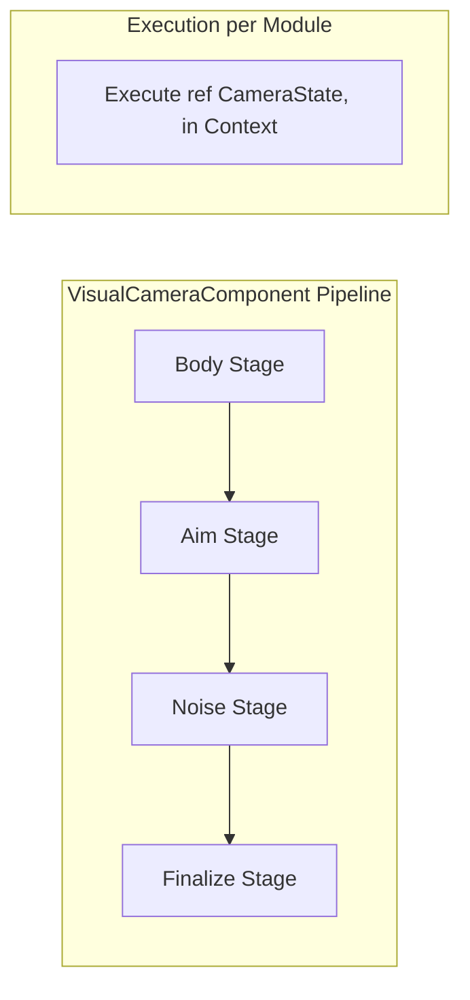

# 原子逻辑模块 (M-LOGIC) 设计文档 (组件化对齐版)

## 全局信息

| 项目 | 值 |
|------|-----|
| **命名空间** | `BlackJack.ProjectEF.Runtime.CameraController` |
| **代码目录** | `Assets/GameProject/Scripts/Runtime/GameView/Camera/Components/Modules/` |
| **模块 ID** | M-LOGIC |

---

## 1. 模块定位 (Module Positioning)

`M-LOGIC` 模块是相机系统的**原子计算单元库**。在重构后的 V2 架构中，这些模块由纯 C# 类转变为 **`MonoBehaviour` 组件**，支持在 Unity Prefab 中进行可视化配置。

### 核心职责
- **阶段化计算**: 严格遵循 Body(定位)、Aim(朝向)、Noise(噪声)、Finalize(修正) 四个执行阶段。
- **配置即实例**: 模块参数直接通过 `[SerializeField]` 暴露在 Inspector 中，实现所见即所得。
- **无 GC 加工**: 通过 `ref CameraState` 实现高效的链式位姿处理。

---

## 2. 核心接口与基类设计 (Base Design)

### 2.1 ICameraModule 接口
定义了模块在管线中的标准行为。
`Sources: [Assets/GameProject/Scripts/Runtime/GameView/Camera/ICameraModule.cs:7-61]()`

### 2.2 CameraModuleComponent (基类)
所有可视化模块的基类，负责将 `ICameraModule` 的逻辑桥接到 Unity 组件系统。
- **执行顺序**: 通过 `m_stage` 和 `m_order` 序列化字段定义。
- **生命周期**: 映射 `Initialize`、`Reset`、`Cleanup` 到组件生命周期。
`Sources: [Assets/GameProject/Scripts/Runtime/GameView/Camera/Components/CameraModuleComponent.cs:22-55]()`

---

## 3. 典型模块实现 (Typical Implementations)

### 3.1 Body 阶段（计算基础位置）
| 模块组件 | 职责 | 核心参数 |
| :--- | :--- | :--- |
| `OrbitFollowModuleComponent` | 基于球坐标环绕目标 | Distance, Yaw/Pitch Limits, Sensitivity |
| `PointFollowModuleComponent` | 保持相对偏移跟随 | Offset Vector, Smooth Time |

### 3.2 Aim 阶段（计算朝向）
| 模块组件 | 职责 | 核心参数 |
| :--- | :--- | :--- |
| `InputRotationModuleComponent` | 将输入转化为旋转增量 | Sensitivity, Invert X/Y |
| `HardLookAtModuleComponent` | 立即看向目标 | LookAt Offset |

---

## 4. 管线执行逻辑 (Pipeline Execution)

`Sources: [Assets/GameProject/Scripts/Runtime/GameView/Camera/Components/VisualCameraComponent.cs:174-183](), [Assets/GameProject/Scripts/Runtime/GameView/Camera/Components/VisualCameraComponent.cs:414-425]()`

---

## 5. 开发约束 (Development Constraints)

- **禁止跨组件引用**: 模块组件严禁直接持有其他 `MonoBehaviour` 的引用（必须通过 `CameraModuleContext` 访问）。
- **禁止在 Execute 中使用 GetComponent**: 所有的依赖必须在 `Initialize` 阶段预取或通过上下文注入。
- **序列化优先**: 所有的数学参数（如速度、阻尼、限制值）必须是可序列化的，严禁在代码中硬编码。
- **无状态计算**: `Execute` 逻辑应尽量依赖 `CameraState` 的当前值，减少内部私有状态，以支持无缝混合。
