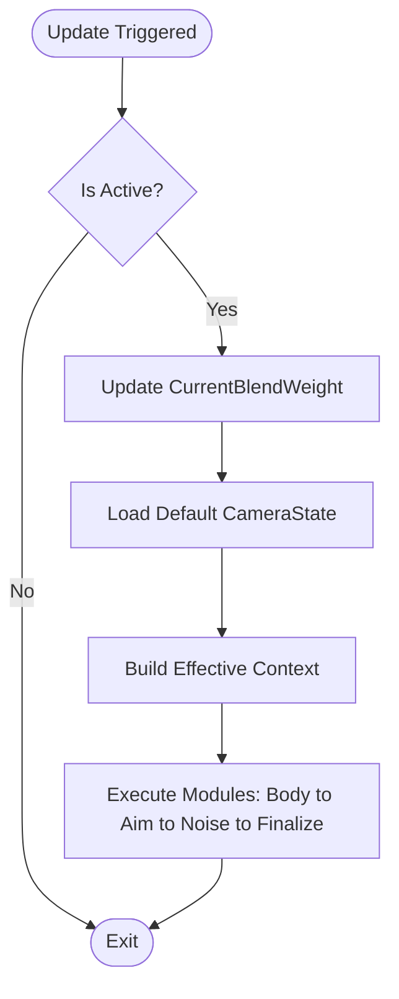

# 虚拟相机 (M-VM) 模块设计文档 (组件化对齐版)

## 全局信息

| 项目 | 值 |
|------|-----|
| **命名空间** | `BlackJack.ProjectEF.Runtime.CameraController` |
| **代码目录** | `Assets/GameProject/Scripts/Runtime/GameView/Camera/Components/` |
| **模块 ID** | M-VM |

---

## 1. 模块定位 (Module Definition)

`VisualCamera` (简称 VM) 是相机系统中负责**逻辑位姿生成**的原子容器。在重构后的 V2 架构中，它由 `VisualCameraComponent` 实现，作为一个 **MonoBehaviour 组件** 承载可插拔的计算管线。

### 核心职责
- **管线持有者**: 维护并按序执行由 `CameraModuleComponent` 组成的计算链。
- **状态生成器**: 每帧产出一个独立的 `CameraState`，包含基础位姿与表现修正。
- **混合单元**: 作为视角行为的最小混合单元，支持通过权重（Weight）与其他 VM 进行平滑插值。
- **可视化配置**: 支持在 Prefab 中直观配置模块组合及其执行阶段。

---

## 2. 核心组件设计 (Component Design)

### 2.1 VisualCameraComponent
VM 的核心实现类，挂载在 GameObject 上。
- **自动收集**: 支持 `m_autoCollectModules` 自动扫描子对象上的模块组件。
- **混合参数**: 暴露 `m_weight`、`m_blendInTime`、`m_blendOutTime` 和 `m_blendCurve`。
- **目标覆盖**: 支持独立于全局上下文的 `OverridePrimaryTarget`，实现“VM A 看角色，VM B 看道具”的复杂编排。
`Sources: [Assets/GameProject/Scripts/Runtime/GameView/Camera/Components/VisualCameraComponent.cs:23-85]()`

### 2.2 IVisualCamera 接口
定义了虚拟相机的标准交互契约，确保 `CameraModeComponent` 能够统一调度。
`Sources: [Assets/GameProject/Scripts/Runtime/GameView/Camera/Components/IVisualCamera.cs]()`

---

## 3. 内部管线逻辑 (Internal Pipeline)

VM 内部维护一个排序后的模块列表，并严格按照 `CameraModuleStage` 强制执行顺序。

### 3.1 执行流程图

`Sources: [Assets/GameProject/Scripts/Runtime/GameView/Camera/Components/VisualCameraComponent.cs:157-183](), [Assets/GameProject/Scripts/Runtime/GameView/Camera/Components/VisualCameraComponent.cs:430-468]()`

---

## 4. 混合机制 (Blending Mechanism)

VM 之间的混合由父级 `CameraModeComponent` 驱动，但混合状态由 VM 自身维护：
- **权重插值**: 使用 `m_blendCurve` 处理进入（BlendIn）和退出（BlendOut）的平滑度。
- **状态同步**: 当 VM 被激活时，调用 `SyncFrom` 将上一帧的最终位姿反算并对齐内部模块状态，确保无缝接管。
`Sources: [Assets/GameProject/Scripts/Runtime/GameView/Camera/Components/VisualCameraComponent.cs:251-265](), [Assets/GameProject/Scripts/Runtime/GameView/Camera/Components/VisualCameraComponent.cs:325-344]()`

---

## 5. 数据交互契约 (Data Contracts)

### 5.1 输入: CameraModuleContext (只读)
VM 不允许主动索取外部数据，所有依赖必须通过上下文注入。如果 VM 设置了 `OverridePrimaryTarget`，它会构建一个**有效上下文 (Effective Context)** 传递给内部模块。
`Sources: [Assets/GameProject/Scripts/Runtime/GameView/Camera/Components/VisualCameraComponent.cs:473-490]()`

### 5.2 输出: CameraState
VM 的唯一输出产物。
- **Weight**: 包含 `m_currentBlendWeight`，供模式层执行加权合成。
- **Raw/Offset**: 分别输出基础位姿和表现偏移。

---

## 6. 禁止事项 (Negative Scope)

- **禁止跨 VM 通讯**: 每个 VM 必须是完全独立的，严禁读取其他 VM 的中间变量。
- **禁止直接操作硬件**: VM 严禁直接持有 `UnityEngine.Camera` 或修改场景 `Transform`。
- **禁止硬编码顺序**: 模块执行顺序 must be 按照 `Stage` 和 `Order` 动态排序，严禁在代码中写死执行数组。
