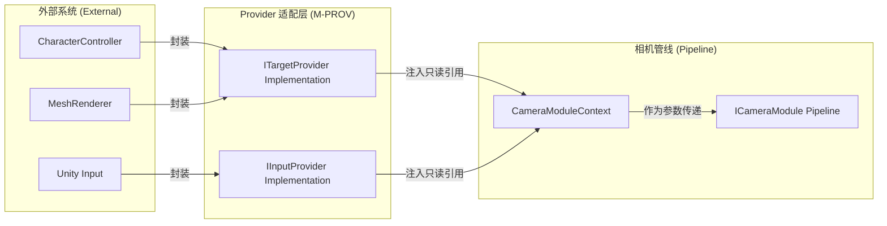

# 数据提供者 (M-PROV) 模块设计文档

## 全局信息

| 项目 | 值 |
|------|-----|
| **命名空间** | `BlackJack.ProjectEF.Runtime.Camera` |
| **代码目录** | `Assets/GameProject/Scripts/Runtime/GameView/Camera/Providers/` |
| **模块 ID** | M-PROV |

---

## 1. 模块定位 (Module Positioning)

`Provider` 模块是相机系统与外部世界（Unity 物理引擎、渲染组件、输入系统）之间的**隔离层**。它通过接口抽象，将相机逻辑从繁杂的 `GetComponent` 和环境探测中解放出来，实现真正的**环境解耦**。

### 核心职责
- **数据适配**: 将业务对象（Actor、钓具、UI）的原始数据转化为相机系统可直接消费的标准化空间数据。
- **职责隔离**: 确保相机系统不直接依赖 `Renderer`、`Collider` 或具体的 `InputManager`。
- **性能优化**: 通过 Provider 内部的缓存或事件驱动机制，减少相机管线每帧探测环境的开销。

---

## 2. 核心接口定义 (Interface Specifications)

### 2.1 ITargetProvider (空间几何提供者)

负责提供相机观察目标的物理快照。

```csharp
namespace BlackJack.ProjectEF.Runtime.Camera
{
    /// <summary>
    /// 目标数据提供者接口
    /// 负责提供相机观察目标的空间几何信息
    /// </summary>
    public interface ITargetProvider
    {
        /// <summary>
        /// 获取目标的基础世界坐标（通常为 Pivot 或中心点）
        /// </summary>
        Vector3 GetPosition();

        /// <summary>
        /// 获取目标的世界空间旋转
        /// 用于相对旋转计算（如：跟随目标朝向的相机）
        /// </summary>
        Quaternion GetRotation();

        /// <summary>
        /// 获取目标的 Transform 引用
        /// 用于需要完整变换信息的场景（如：挂点跟随）
        /// 注意：调用者不应缓存此引用，每帧应重新获取
        /// </summary>
        Transform GetTransform();

        /// <summary>
        /// 获取目标的实时速度（用于计算 Noise 或平滑预测）
        /// </summary>
        Vector3 GetVelocity();

        /// <summary>
        /// 获取目标的世界空间包围盒 (AABB)
        /// 用于 AutoFitModule 计算最优观察距离
        /// 相机系统仅通过此接口获取几何信息，不关心具体实现方式
        /// 实现者可根据实际情况返回基于 Renderer、Collider 或其他方式计算的包围盒
        /// </summary>
        Bounds GetWorldBounds();

        /// <summary>
        /// 检查目标是否具有有效的几何信息
        /// 用于在调用 GetWorldBounds 前进行安全检查
        /// </summary>
        /// <returns>如果目标具有可用的几何信息返回 true</returns>
        bool HasValidGeometry();

        /// <summary>
        /// 目标是否有效（如：是否已销毁或被禁用）
        /// </summary>
        bool IsActive();
    }
}
```

### 2.2 IInputProvider (控制输入提供者)

负责屏蔽输入设备差异（键盘、手柄、触屏、AI）。

```csharp
namespace BlackJack.ProjectEF.Runtime.Camera
{
    /// <summary>
    /// 输入数据提供者接口
    /// 负责提供归一化的相机控制输入
    /// </summary>
    public interface IInputProvider
    {
        /// <summary>
        /// 获取归一化的旋转增量 (x=Yaw, y=Pitch)
        /// 范围通常为 [-1, 1]，具体取决于实现
        /// </summary>
        Vector2 GetLookDelta();

        /// <summary>
        /// 获取归一化的移动输入 (x=水平, y=垂直)
        /// 用于支持自由移动的相机模式
        /// </summary>
        Vector2 GetMoveInput();

        /// <summary>
        /// 获取归一化的缩放增量 (Zoom)
        /// 正值表示拉近，负值表示拉远
        /// </summary>
        float GetZoomDelta();

        /// <summary>
        /// 重置输入状态
        /// 用于在相机模式切换时清除残留的输入值
        /// </summary>
        void ResetInput();

        /// <summary>
        /// 输入是否有效（如：是否被 UI 拦截）
        /// </summary>
        bool IsInputValid();
    }
}
```

---

## 3. 模块实现方案 (Implementation)

### 3.1 适配器模式 (Adapter Pattern)

Provider 本身不存储数据，而是作为外部组件的包装器。

```csharp
namespace BlackJack.ProjectEF.Runtime.Camera
{
    /// <summary>
    /// Actor 目标适配器
    /// 包装 FishmanActor，提供标准化的空间数据
    /// </summary>
    public class ActorTargetProvider : ITargetProvider
    {
        private readonly Transform m_target;
        private readonly Renderer[] m_renderers;
        private Bounds m_cachedBounds;

        public ActorTargetProvider(Transform target)
        {
            m_target = target;
            m_renderers = target.GetComponentsInChildren<Renderer>();
        }

        public Vector3 GetPosition() => m_target.position;
        public Quaternion GetRotation() => m_target.rotation;
        public Transform GetTransform() => m_target;
        public Vector3 GetVelocity() => Vector3.zero; // 可扩展为读取 CharacterController

        public Bounds GetWorldBounds()
        {
            if (m_renderers.Length == 0)
            {
                return new Bounds(m_target.position, Vector3.one);
            }

            m_cachedBounds = m_renderers[0].bounds;
            for (int i = 1; i < m_renderers.Length; i++)
            {
                m_cachedBounds.Encapsulate(m_renderers[i].bounds);
            }
            return m_cachedBounds;
        }

        public bool HasValidGeometry() => m_renderers.Length > 0;
        public bool IsActive() => m_target != null && m_target.gameObject.activeInHierarchy;
    }
}
```

### 3.2 标准输入适配器

```csharp
namespace BlackJack.ProjectEF.Runtime.Camera
{
    /// <summary>
    /// 标准输入适配器
    /// 包装 Unity Input System，提供归一化的相机控制输入
    /// </summary>
    public class StandardInputProvider : IInputProvider
    {
        private Vector2 m_lookDelta;
        private Vector2 m_moveInput;
        private float m_zoomDelta;
        private bool m_isValid = true;

        public Vector2 GetLookDelta() => m_isValid ? m_lookDelta : Vector2.zero;
        public Vector2 GetMoveInput() => m_isValid ? m_moveInput : Vector2.zero;
        public float GetZoomDelta() => m_isValid ? m_zoomDelta : 0f;

        public void ResetInput()
        {
            m_lookDelta = Vector2.zero;
            m_moveInput = Vector2.zero;
            m_zoomDelta = 0f;
        }

        public bool IsInputValid() => m_isValid;

        // 由外部输入系统调用更新
        public void UpdateInput(Vector2 look, Vector2 move, float zoom)
        {
            m_lookDelta = look;
            m_moveInput = move;
            m_zoomDelta = zoom;
        }

        public void SetValid(bool valid) => m_isValid = valid;
    }
}
```

### 3.3 数据主权与生命周期

- **主权归属**: `M-PROV` 模块拥有对目标组件的**唯一读取权**。
- **注入时机**: 在 `CameraMode.OnEnter` 或通过指令 `BindTargetCmd` 注入到 `VisualCamera` 上下文中。

---

## 4. 数据流向图 (Data Flow)



---

## 5. 目录结构

```
Assets/GameProject/Scripts/Runtime/GameView/Camera/Providers/
├── Interfaces/
│   ├── ITargetProvider.cs          # 目标数据接口
│   └── IInputProvider.cs           # 输入数据接口
│
├── Adapters/
│   ├── ActorTargetProvider.cs      # Actor 目标适配器
│   ├── TackleTargetProvider.cs     # 钓具目标适配器
│   ├── PointTargetProvider.cs      # 固定点目标适配器
│   └── StandardInputProvider.cs    # 标准输入适配器
│
└── Utilities/
    └── ProviderFactory.cs          # Provider 工厂类
```

---

## 6. 禁止事项 (Negative Scope)

- **禁止存储状态**: Provider 必须是"无状态"的适配器，严禁存储相机位姿（CameraState）。
- **禁止修改外部对象**: Provider 仅限读取（Read-only），严禁修改目标的 `Transform` 或 `Renderer` 属性。
- **禁止直接引用 Camera**: Provider 严禁感知 `UnityEngine.Camera` 的存在。
- **禁止逻辑加工**: Provider 只负责"提供数据"，不负责"计算如何看"。例如：它提供 Bounds，但不应计算适配 Bounds 所需的距离（该逻辑属于 `AutoFitModule`）。
- **禁止产生 GC**: Provider 的数据获取方法严禁使用 `new`、`Linq` 或频繁的 `GetComponent`。
