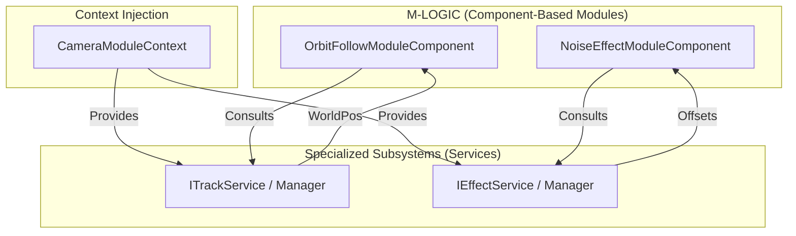

# 遗留系统整合方案 (Legacy Integration Plan - Subsystem Approach)

## 1. 核心整合原则 (Core Integration Principles)

为了平衡“构架重构”与“逻辑稳定性”，我们将 `CameraTrackManager` 和 `CameraEffectManager` 保留为**专用服务子系统 (Services)**。在重构后的 V2 架构中，这些子系统将通过 `CameraModuleContext` 注入到 **`CameraModuleComponent`** 中，为原子逻辑模块提供专业的数据计算支持。

---

## 2. 轨道子系统 (`CameraTrackManager`)

### 定位
作为**空间几何服务提供者**，负责管理复杂的曲线数据和坐标映射逻辑。

### 整合方式
- **保留类**: `CameraTrackManager` 继续作为 `MonoBehaviour` 存在。
- **接口化**: 抽象出 `ITrackService` 接口。
- **调用流**:
    1.  `M-LOGIC` 中的模块（如 `OrbitFollowModuleComponent`）在执行时通过上下文获取 `ITrackService`。
    2.  调用 `ITrackService.EvaluatePosition(...)` 获取基于轨道的坐标。
    3.  `CameraTrackManager` 执行复杂的数学插值，返回世界空间坐标。
- **收益**: 逻辑模块无需关心 Bezier 曲线的底层实现，只需消费计算结果。
`Sources: [Assets/GameProject/Scripts/Runtime/GameView/Camera/Core/CameraModuleContext.cs:51](), [Assets/GameProject/Scripts/Runtime/GameView/Camera/Services/ITrackService.cs]()`

---

## 3. 效果子系统 (`CameraEffectManager`)

### 定位
作为**动态偏移服务提供者**，负责管理所有叠加的镜头震动、表现性偏移效果。

### 整合方式
- **保留类**: `CameraEffectManager` 负责维护效果列表及其优先级混合算法。
- **接口化**: 抽象出 `IEffectService` 接口。
- **调用流**:
    1.  模块（如 `Noise` 阶段的组件）在执行 `Execute` 时，从 `CameraModuleContext` 获取 `IEffectService`。
    2.  调用 `IEffectService.GetCombinedOffset()` 获取混合后的位移和旋转偏移。
    3.  模块将这些偏移累加到 `ref CameraState` 的 `PositionOffset` 和 `RotationOffset` 字段中。
- **收益**: 保持了原有效果系统的灵活性，同时将其应用点规范化到相机流水线的 Noise 阶段。
`Sources: [Assets/GameProject/Scripts/Runtime/GameView/Camera/Core/CameraModuleContext.cs:56]()`

---

## 4. 模块依赖矩阵 (Revised Dependency Matrix)

| 逻辑模块组件 (Consumer) | 依赖接口 (Contract) | 典型服务提供者 (Provider) |
| :--- | :--- | :--- |
| `OrbitFollowModuleComponent` | `ITrackService` | `CameraTrackManager` |
| `NoiseEffectModuleComponent` | `IEffectService` | `CameraEffectManager` |
| `PointFollowModuleComponent` | `ITargetProvider` | 适配后的 `ICameraFollowTarget` |

---

## 5. 通讯契约定义 (Interaction Contract)

---

## 6. 整合约束 (Constraints)

- **单向依赖**: 严禁 `Manager` 子系统反向调用 `VisualCameraComponent` 或 `CameraModuleComponent`。它们必须保持为纯粹的“被动服务”。
- **状态隔离**: `Manager` 仅负责计算偏移，严禁直接修改 `MainCamera.transform`。所有的位姿变更必须通过 `CameraState` 向上提交，由 `CameraControllerV2` 统一应用。
- **上下文驱动**: 模块严禁直接访问 `Manager` 单例，必须通过 `CameraModuleContext` 获取接口引用，以保证管线的可测试性和解耦性。

---

## 7. 结论

通过这种“服务化”整合方案，我们既保留了原有系统中经过验证的复杂数学逻辑（轨道插值、效果混合），又实现了相机控制权在组件化流水线（Pipeline）中的高度集中。`Manager` 从“控制者”转变为“计算服务商”，完美融入了 V2 的组件化构架。