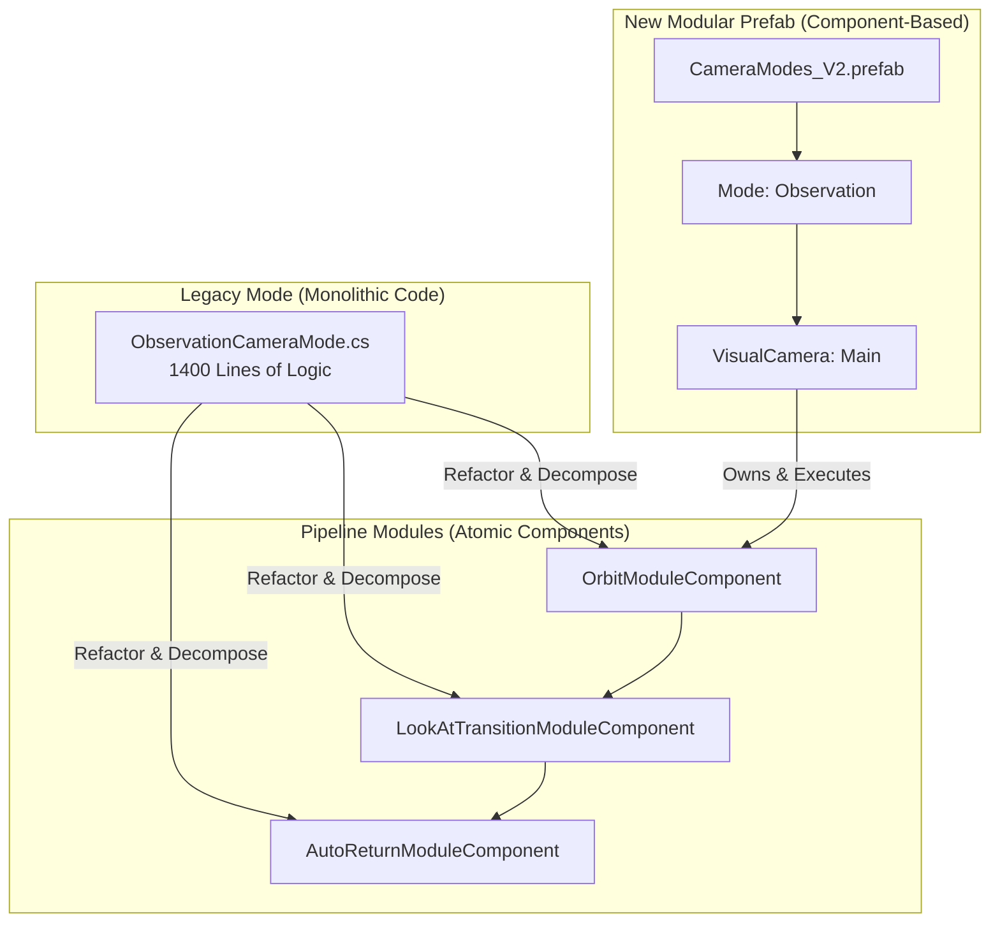

# 相机系统组件化管道架构迁移方案文档 (Refactoring Design)

## 1. 迁移方案设计总览

重构的核心是将原本交织在 `ICameraMode` 实现类中的位姿计算、输入处理与表现增强逻辑，拆解并迁移到基于 **Prefab + MonoBehaviour 组件** 的管线阶段中。

### 1.1 核心迁移路径
- **从代码到组件**: 逻辑从 `OnUpdate` 迁移至具体的 `CameraModuleComponent` 子类。
- **从 SO 到 Prefab**: 配置参数从 `ScriptableObject` 迁移至 Prefab 节点上的序列化字段。
- **生命周期解耦**: 模式类仅负责 `VisualCameraComponent` 的激活与权重编排，不再参与具体的 Vector3 计算。

---

## 2. 典型模式迁移示例

### 2.1 PitchTrackFPSMode (FPS 轨道模式)
**重构前表现**: 混合了俯仰角曲线修正、轨道偏移和头部位置补偿。

**配置编排 (Prefab)**:
- **Node: VM_PitchTrackFPS** (`VisualCameraComponent`)
    - **Body 阶段**:
        - `TrackSampleModuleComponent`: 消费 `Input.Pitch`，在轨道上采样 `RawPosition`。
        - `HeadCompensationModuleComponent`: 实时计算并应用头部物理位移的补偿。
    - **Aim 阶段**:
        - `InputRotationModuleComponent`: 处理 Yaw 轴旋转。
        - `PitchCurveModuleComponent`: 将原始 Pitch 映射为非线性旋转输出。
    - **Finalize 阶段**:
        - `DampingModuleComponent`: 对最终位姿应用阻尼平滑。

### 2.2 FollowTPSMode (第三人称跟随)
**重构前表现**: 简单的角色背后跟随，平滑逻辑硬编码在 `OnUpdate`。

**配置编排 (Prefab)**:
- **Node: VM_FollowTPS** (`VisualCameraComponent`)
    - **Body 阶段**:
        - `PointFollowModuleComponent`: 根据 `ITargetProvider` 的位置和旋转计算 `RawPosition`。
    - **Aim 阶段**:
        - `HardLookAtModuleComponent`: 强制相机注视目标中心点。
    - **Finalize 阶段**:
        - `CollisionModuleComponent`: 封装射线探测逻辑，执行碰撞剔除。
        - `DampingModuleComponent`: 提供可配置的位姿平滑。

### 2.3 ObservationCameraMode (通用观察模式)
**重构前表现**: 支持球面环绕、注视点平滑过渡、自动回正。

**配置编排 (Prefab)**:
- **Node: VM_Observation** (`VisualCameraComponent`)
    - **Body 阶段**:
        - `OrbitModuleComponent`: 将输入增量转化为球面坐标位移。
    - **Aim 阶段**:
        - `LookAtTransitionModuleComponent`: 负责注视中心在不同目标点间的平滑切换。
    - **Finalize 阶段**:
        - `AutoReturnModuleComponent`: 监测输入空闲时间，触发回正。

---

## 3. 迁移后的数据流设计

### 3.1 模块执行契约
每个迁移后的模块通过 `Execute` 接口对 `CameraState` 进行定量加工。

| 模块 | 关键输入 (Inspector) | 加工操作 (Quantitative) | 影响状态字段 |
| :--- | :--- | :--- | :--- |
| `PitchCurveModule` | `AnimationCurve` | `state.RawRotation = Euler(-Curve.Eval(Pitch), Yaw, 0)` | `RawRotation` |
| `HeadCompModule` | `float Strength` | `Offset = CurrentHead - LastHead; state.RawPosition += Offset * Strength` | `RawPosition` |
| `AutoReturnModule` | `float IdleTime` | `if(Time > Idle) state.RawRotation = Slerp(Current, Default, dt * Speed)` | `RawRotation` |

### 3.2 配置迁移 (Settings Migration)
原本的 `ObservationModeSettings` 等 SO 数据，现在直接作为 `CameraModuleComponent` 子类（如 `OrbitModuleComponent`）的序列化字段存在。

---

## 4. 可视化迁移验证 (Migration Flow)

---

## 5. 迁移建议

1.  **逻辑剥离**: 重构后的模式类（如 `SimpleTPSModeComponent`）应不再包含任何 `Vector3.Lerp` 或 `GetComponent` 代码，仅作为生命周期控制器。
2.  **参数对齐**: 迁移时需确保 Prefab 上的初始参数（如 `Damping` 强度）与原代码中的硬编码数值一致。
3.  **支持无缝混合**: 充分利用 `VisualCameraComponent` 的 `m_weight` 属性。原先复杂的注视点切换逻辑，现在可以通过两个 VM 之间的权重插值自然完成。