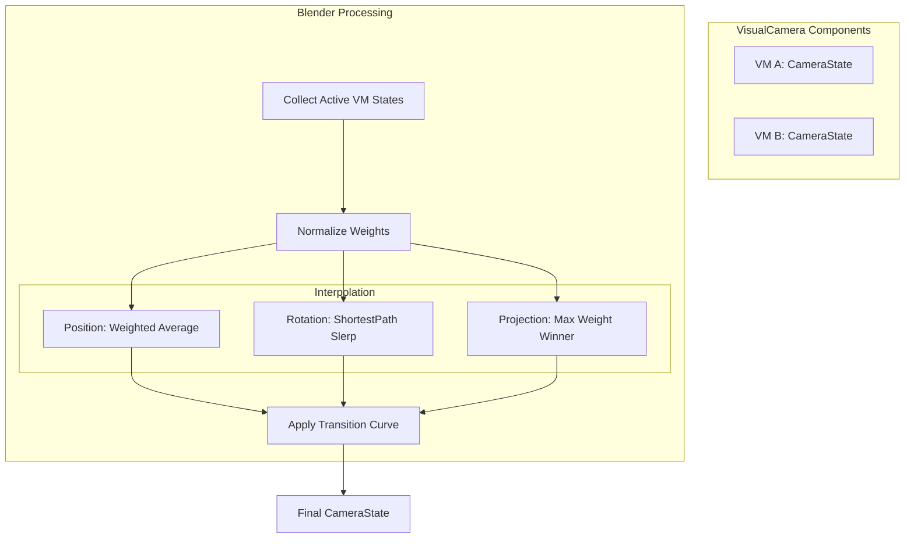

# 状态混合器 (M-BLEND) 模块设计文档 (组件化对齐版)

## 全局信息

| 项目 | 值 |
|------|-----|
| **命名空间** | `BlackJack.ProjectEF.Runtime.CameraController` |
| **代码目录** | `Assets/GameProject/Scripts/Runtime/GameView/Camera/Core/` |
| **模块 ID** | M-BLEND |

---

## 1. 模块定位 (Module Positioning)

`Blender` 模块是相机系统中负责**多管线状态融合**的数学处理器。在组件化架构中，它被 `CameraModeComponent` 持有，用于将该模式下多个活跃 `VisualCameraComponent` 的独立状态快照，根据各自的权重进行数学插值，产出最终应用于物理相机的唯一 `CameraState`。

### 核心职责
- **权重插值**: 根据各 VM 的 `Weight` 属性执行位姿的加权平均。
- **平滑过渡**: 在模式切换或 VM 切换时提供时间驱动的混合曲线。
- **多通道合并**: 处理 Raw 通道、WorldOffset 和 LocalOffset 通道的混合逻辑。
- **矩阵决策**: 针对不可插值的 `ProjectionMatrix`，采用权重领先原则进行选择。

---

## 2. 核心接口设计 (Interface Design)

### 2.1 ICameraStateBlender 接口
`Sources: [Assets/GameProject/Scripts/Runtime/GameView/Camera/Core/ICameraStateBlender.cs]()`

### 2.2 CameraStateBlender 实现
核心混合逻辑实现类：
- **最短路径插值**: 旋转混合使用 `ShortestPathSlerp`，确保旋转角度超过 180 度时不会“绕远路”。
- **状态同步**: 通过 `PreviousStateSet` 接口接收上一帧的最终状态，作为过渡混合的起点。
`Sources: [Assets/GameProject/Scripts/Runtime/GameView/Camera/Core/CameraStateBlender.cs]()`

---

## 3. 混合策略 (Blending Strategies)

### 3.1 权重混合 (Weight Blending)
当一个模式内有多个 `VisualCameraComponent` 同时激活时（如：角色跟随 + 局部特写微调）：
1. 归一化所有 VM 的权重。
2. 位置字段（Raw/WorldOffset/LocalOffset）执行加权累加。
3. 旋转字段执行球面线性插值（Slerp）。
4. FOV 执行加权平均。

### 3.2 过渡混合 (Transition Blending)
当触发 `CameraControllerV2.SwitchMode` 时：
1. `Blender` 记录当前帧状态为 `m_previousState`。
2. 启动 `TransitionStart(duration)`。
3. 在后续帧中，根据 `m_blendCurve` 在旧状态与新模式计算出的目标状态间插值。

---

## 4. 数据流向图 (Data Flow)

---

## 5. 模块边界

- **与 Mode 的边界**: `CameraModeComponent` 负责业务层面的决策（谁参与混合，权重是多少），`Blender` 仅负责执行数学合并。
- **与 VM 的边界**: `VisualCameraComponent` 输出“单点最优解”状态，`Blender` 不感知 VM 内部的管线逻辑。

---

## 6. 禁止事项 (Negative Scope)

- **禁止业务逻辑**: Blender 严禁包含任何业务判断（如：判断是否在钓鱼）。
- **禁止产生 GC**: `Blend` 方法每帧高频调用，严禁使用 `new`、`Linq` 或 `foreach` 产生的装箱。
- **禁止硬件耦合**: Blender 仅处理 `CameraState` 结构体，严禁直接引用 `UnityEngine.Camera`。
