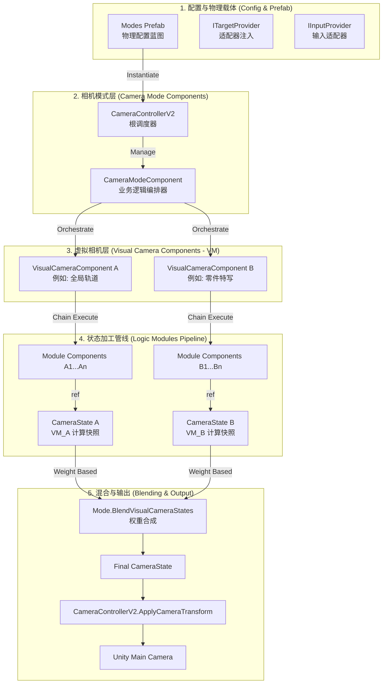

# 相机系统组件化管道架构设计文档 (Refactoring Design)

## 1. 系统概述 (System Overview)

### 1.1 背景与痛点
现有相机系统逻辑高度耦合，业务与计算混杂。特别是当需要从“全局观察”切换到“零件特写”时，往往需要在同一个巨型类中手动编写复杂的插值逻辑，极易导致时序冲突和画面抖动。此外，旧版控制器启动时全量初始化，存在内存冗余。

### 1.2 设计目标
- **虚拟化 (Virtualization)**：引入 `VisualCamera (VM)` 语义，将特定的视角逻辑封装为独立的组件节点。
- **模块化 (Modular)**：计算逻辑拆分为原子模块组件（Module Components），每个 VM 拥有自己的 Pipeline 管线。
- **配置化 (Prefab-Driven)**：利用 Unity Prefab 实现“架构即配置”，支持可视化调整与按需加载。
- **混合架构 (Blending)**：通过权重控制实现多 VM 状态的平滑混合，彻底解决硬编码插值问题。

---

## 2. 核心架构图 (Architecture Diagram)

重构后的系统采用 **“Prefab 配置 -> 模式组件 -> 虚拟相机组件 -> 原子模块管线”** 的物理层级结构。

---

## 3. 核心配置与实例化方案

### 3.1 架构即配置 (Architecture as Configuration)
系统彻底放弃了 ScriptableObject 映射方案，转而采用 **Prefab 节点树**：
- **载体**: 一个名为 `CameraModes_V2` 的预制体。
- **模式定义**: 每个模式是一个挂载了 `CameraModeComponent` 子类的 GameObject 节点。
- **VM 定义**: 模式节点下的子对象，挂载 `VisualCameraComponent`。
- **模块定义**: VM 节点下的子对象，挂载具体的 `CameraModuleComponent`。

### 3.2 动态加载流程
1. `CameraControllerV2` 在 `Initialize` 时实例化 `m_modesPrefab`。
2. 通过 `GetComponentsInChildren` 自动发现并注册所有模式组件。
3. 模式激活时，驱动其下的 VM 管线进行链式计算。

---

## 4. 核心语义与组件职责

### 4.1 VisualCameraComponent (VM) - 逻辑位姿容器
负责维护一组模块构成的 Pipeline。
- **输入**：通过 `CameraModuleContext` 注入的 `ITargetProvider` 和 `IInputProvider`。
- **输出**：每帧产出一个 `CameraState` (数据快照)。
- **混合元数据**：维护自身的 `m_currentBlendWeight`。

### 4.2 CameraModeComponent - 业务编排器
不再进行具体的坐标计算，仅负责“逻辑开关”。
- **职责**：根据业务状态（如：钓鱼阶段）控制其下 VM 的激活与权重。
- **混合控制**：执行多个活跃 VM 状态的加权合成。

### 4.3 CameraModuleComponent - 原子计算单元
- **Body 阶段**: 计算基础位置（如轨道采样）。
- **Aim 阶段**: 计算旋转朝向（如 LookAt）。
- **Noise 阶段**: 叠加抖动偏移。
- **Finalize 阶段**: 最终修正（如碰撞剔除）。

---

## 5. 重构收益总结

1.  **所见即所得**：所有相机参数、模块组合、执行阶段均在 Unity Inspector 中直观配置，无需修改代码。
2.  **职责解耦**：逻辑剥离到原子模块，模式类（Mode）仅保留不到 10% 的生命周期编排代码。
3.  **无缝混合**：支持无限层级的 VM 混合，彻底消除了手动编写 Lerp 逻辑导致的跳变问题。
4.  **零 GC 性能**：通过 `ref CameraState` 引用传递实现管线加工，确保高频计算下的性能表现。