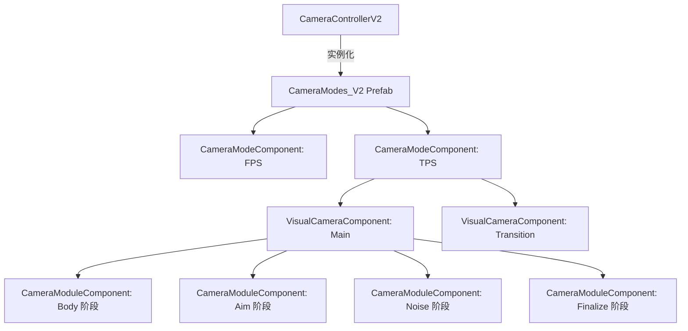
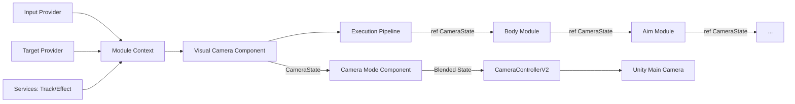

# 相机系统组件化管道重构详细设计方案 (组件化对齐版)

## 版本信息
- **版本**: v2.1
- **日期**: 2026-01-28
- **状态**: 组件化架构对齐

---

## 1. 重构概述

### 1.1 重构背景

基于对现有相机系统的深度调研，识别出以下核心问题：

| 问题类型 | 具体表现 | 影响范围 |
|---------|---------|---------|
| **God Class** | `TackleObservationCameraMode` 等类逻辑臃肿（4000+行），混合了大量位姿计算与业务逻辑 | 维护困难、测试困难 |
| **代码重复** | 球面坐标计算、包围盒自适应、投影矩阵处理在多个模式中重复实现 | 修改需多处同步，易出 Bug |
| **初始化冗余** | 旧版 `CameraController` 启动时全量初始化所有模式，造成内存浪费 | 启动延迟、内存占用高 |
| **职责耦合** | 模式类直接调用 `GetComponent` 或访问物理组件，缺乏抽象层 | 难以脱离场景测试 |
| **配置不直观** | 参数修改依赖 ScriptableObject 或硬编码，无法在 Inspector 中实时预览效果 | 调整手感效率低下 |

### 1.2 重构目标

1. **虚拟化 (Virtualization)**: 引入 `VisualCamera (VM)` 语义，将特定的视角配置封装为独立的组件节点。
2. **模块化 (Modular)**: 计算逻辑拆分为原子模块组件 `CameraModuleComponent`，支持跨模式复用。
3. **架构即配置 (Architecture as Config)**: 通过 Unity Prefab 定义完整的相机树结构，实现“所见即所得”的配置体验。
4. **混合架构 (Blending)**: 支持多 VM 状态的平滑混合，彻底消除手动编写的硬编码插值逻辑。
5. **高性能**: 采用 `ref struct` 传递状态，实现无 GC 的链式位姿加工流水线。

---

## 2. 核心架构设计

### 2.1 整体物理层级 (Hierarchy)

系统不再依赖复杂的工厂类，而是利用 Unity 的序列化机制，将配置直接映射为对象树：

### 2.2 数据流向 (Data Flow)

---

## 3. 核心接口与数据结构

### 3.1 CameraState (相机状态快照)
采用“基础位姿 (Raw) + 表现偏移 (Offset)”的双通道设计，确保在多 VM 混合时数学结果的确定性。
`Sources: [Assets/GameProject/Scripts/Runtime/GameView/Camera/Core/CameraState.cs]()`

### 3.2 CameraModuleContext (执行上下文)
只读结构体，封装了模块计算所需的所有外部依赖：
- `m_deltaTime`: 帧时间。
- `m_targetProvider`: 主跟随目标。
- `m_secondaryTarget`: 次要注视目标。
- `m_inputProvider`: 输入增量提供者。
- `m_trackService / m_effectService`: 遗留系统服务接口。
`Sources: [Assets/GameProject/Scripts/Runtime/GameView/Camera/Core/CameraModuleContext.cs]()`

### 3.3 ICameraModule (计算模块接口)
定义了模块的生命周期（Initialize/Reset/Cleanup）与核心执行方法 `Execute(ref CameraState, context)`。
`Sources: [Assets/GameProject/Scripts/Runtime/GameView/Camera/ICameraModule.cs]()`

---

## 4. 组件职责详细定义

### 4.1 CameraControllerV2 (根调度器)
- **物理载体**: 挂载在主相机上，持有 `m_modesPrefab` 引用。
- **加载逻辑**: 通过 `Instantiate` 加载预制体，并使用 `GetComponentsInChildren` 自动建立模式索引。
- **状态应用**: 在 `LateUpdate` 末尾将最终 `CameraState` 应用到 `UnityEngine.Camera`。

### 4.2 CameraModeComponent (业务编排器)
- **逻辑开关**: 负责根据业务逻辑（如：进入钓鱼）激活/停用其下的 `VisualCamera`。
- **混合驱动**: 计算各 VM 的实时权重，并执行 `BlendVisualCameraStates` 进行状态合成。

### 4.3 VisualCameraComponent (视角逻辑容器)
- **管线管理**: 自动收集挂载在自身节点下的所有 `CameraModuleComponent`。
- **执行顺序**: 严格按照 `Stage` (Body -> Aim -> Noise -> Finalize) 顺序驱动模块执行。
- **目标覆盖**: 支持 `OverridePrimaryTarget`，允许特定 VM 观察特定目标。

### 4.4 CameraModuleComponent (原子计算单元)
- **数学实现**: 具体的计算逻辑（如 `OrbitFollow`、`Damping`、`Collision`）。
- **可视化参数**: 所有控制参数（如速度、距离、曲线）均通过序列化字段暴露，支持 Inspector 实时调整。

---

## 5. 迁移方案与实施路径

### 5.1 迁移步骤
1.  **原子化**: 将原本散落在巨型类中的数学公式提取为独立的 `CameraModuleComponent` 子类。
2.  **预制化**: 在 `CameraModes_V2` Prefab 中按模式层级搭建节点树。
3.  **参数对齐**: 将原代码中的硬编码数值填入组件的序列化字段中。
4.  **业务切换**: 修改业务逻辑，通过 `CameraControllerV2.SwitchMode` 驱动新架构。

### 5.2 典型配置示例：FollowTPSMode
- **Node: TPS_Mode** (`CameraModeComponent`)
    - **Node: VM_Main** (`VisualCameraComponent`)
        - `PointFollowModuleComponent` (Body): 处理角色跟随。
        - `InputRotationModuleComponent` (Aim): 处理玩家视角控制。
        - `CollisionModuleComponent` (Finalize): 处理射线探测避障。
        - `DampingModuleComponent` (Finalize): 处理位姿平滑。

---

## 6. 验收标准

- **代码质量**: 单个模式类的代码行数控制在 200 行以内。
- **扩展性**: 增加新的相机表现（如：震屏）只需在 Prefab 中添加对应的 `ShakeModuleComponent` 节点。
- **性能性能**: 核心计算管线（Update）实现零 GC 分配。
- **调试体验**: 策划可在运行模式下通过 Inspector 直接修改相机参数并获得即时反馈。
