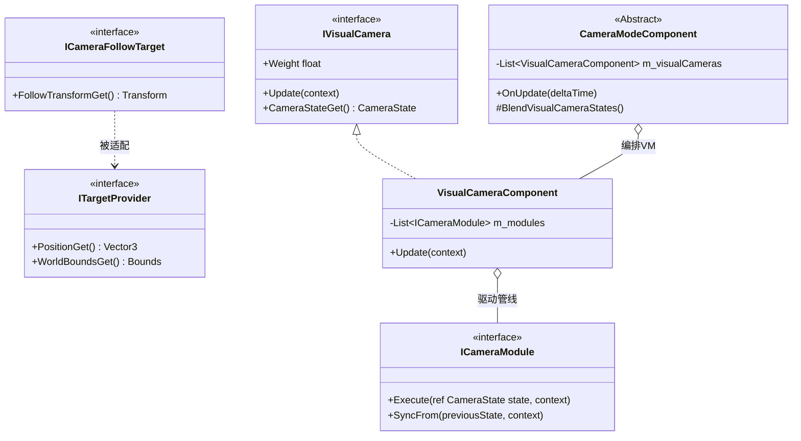

基于组件化管道 (Component Pipeline) 与 提供者模式 (Provider Pattern) 的重构设计，从数据、逻辑、边界和依赖四个维度，推导出高质量的接口定义方案。

# 第一步：映射重构方案
核心目标：将相机系统从“巨型业务类”转变为“原子功能管线”。

## 核心原则：

- **从“过程式调用”转向“声明式意图”**：外部不应直接调用具体算法，而应通过 `CameraControllerV2` 驱动模式流转。
- **职责剥离**：`CameraControllerV2` 不再感知业务概念，只感知 `ITargetProvider`（空间数据）和输入流。
- **配置驱动 (Prefab-Based)**：通过 Unity Prefab 动态加载模式与模块，消除硬编码。
- **解耦环境探测**：通过 `ITargetProvider` 隔离物理组件。
- **状态数据化**：使用 `CameraState` 统合 Pos/Rot/FOV/Matrix。
- **语义虚拟化**：引入 `VisualCameraComponent` 容器，支持多管线并行计算与权重混合。

# 第二步：推导接口签名

## 1. 核心控制接口 (Core Control)
设计决策：基于 `MonoBehaviour` 的组件化入口，管理生命周期与硬件应用。

### 接口/类: CameraControllerV2
方法签名:
- `SwitchMode(modeType: CameraModeType): bool` (驱动模式切换)
- `FollowTargetBind(target: ICameraFollowTarget): void` (全局目标注入)
- `HandleLookInput(lookInput: Vector2): void` (输入增量注入)

## 2. 边界层接口 (Boundary Layer)
设计决策：基于依赖倒置原则 (D.I.P.)，相机系统定义其所需的“空间上下文”。

### 接口名称: ITargetProvider
方法签名:
- `PositionGet(): Vector3`
- `VelocityGet(): Vector3`
- `WorldBoundsGet(): Bounds` (仅获取几何信息，不关心实现)
- `IsActive(): bool`

### 接口名称: IInputProvider
方法签名:
- `GetLookDelta(): Vector2` (Yaw/Pitch 增量)
- `GetZoomDelta(): float` (缩放增量)

## 3. 逻辑层接口 (Logic Layer)
设计决策依据：基于单一职责原则 (SRP)，通过 `ref` 传递状态实现无 GC 的链式加工。

### 接口名称: ICameraModule
方法签名:
- `Execute(ref state: CameraState, context: CameraModuleContext): void`
- `Initialize(): void`
- `SyncFrom(previousState: CameraState, context: CameraModuleContext): void` (实现无缝接管)

## 4. 虚拟相机管线接口 (Visual Camera Pipeline)
设计决策：引入 `IVisualCamera` 语义，使模式演变为“视角编排器”。

### 接口名称: IVisualCamera
方法签名:
- `Update(context: CameraModuleContext): void`
- `CameraStateGet(): CameraState` (获取当前管线产出的快照)
- `Weight { get; set; }` (当前混合权重)

## 5. 数据模型 (Data Transfer Objects)

### 结构体: CameraState
```csharp
public struct CameraState {
    public Vector3 RawPosition;      // 逻辑位置
    public Quaternion RawRotation;   // 逻辑旋转
    public Vector3 PositionOffset;   // 表现偏移
    public float FieldOfView;
    public float Weight;             // 混合元数据
    
    public Vector3 FinalPosition => RawPosition + PositionOffset;
}
```

# 第三步：可视化验证 (Architecture Diagram)



# 接口演进总结：
1. **从 ICameraMode 到 Component 编排**：将“业务”与“视角”分离，支持在 Inspector 中直观配置。
2. **从硬编码到原子模块**：所有位姿逻辑提取为 `CameraModuleComponent`，实现高度复用。
3. **从主动探测到 ITargetProvider**：彻底解决了相机系统必须依赖特定业务组件（如 Actor）的痛点。
