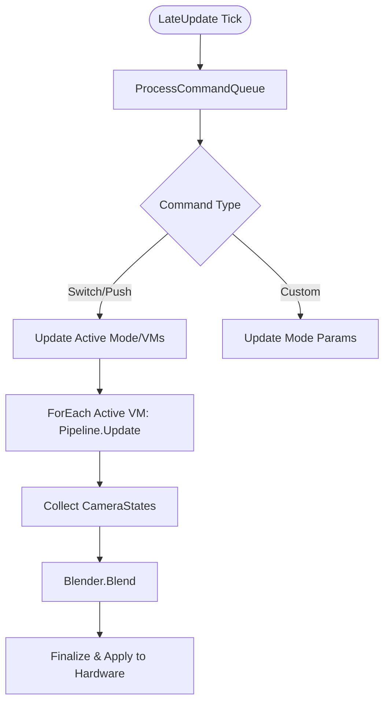

# 相机编排器 (Core) 模块设计文档

## 1. 模块定位 (Module Positioning)

`Core` 模块是相机系统的“中枢神经系统”，负责将业务层的非确定性意图（指令）转化为确定性的相机行为编排。它管理模式的生命周期、维护虚拟相机（VM）列表，并调度状态混合器（Blender）。

### 核心职责
- **指令分发**: 接收并解析外部 `ICameraCmd`，驱动模式切换或参数微调。
- **模式管理**: 负责 `CameraMode` 的动态实例化（通过工厂）与运行时注册（Registry）。
- **VM 编排**: 维护活跃模式下的 `VisualCamera` 列表，控制 VM 的激活状态与混合权重。
- **生命周期调度**: 统一触发 `Update` 流水线，并确保在渲染前应用最终位姿。

---

## 2. 核心组件设计 (Core Components)

### 2.1 CameraModeRegistry (模式注册表)
管理所有已实例化的模式，提供类型安全的检索。
- **数据主权**: 拥有 `Dictionary<Type, ICameraMode>`。
- **接口**: `RegisterAvailableModes()`, `GetModeInstance<T>()`。

### 2.2 CameraModeFactory (模式工厂)
根据配置动态创建对象，消除硬编码。
- **职责**: 读取 `CameraModeConfig`，拼装 VM 管线并注入私有 Settings。

### 2.3 Command Queue (指令队列)
实现控制流的异步化与原子化。
- **职责**: 缓冲外部并发请求，确保每帧按序处理位姿变更。

---

## 3. 交互契约 (Interaction Contracts)

### 3.1 外部交互 (Inbound)
- **业务层 -> Core**: 必须通过 `SubmitCommand(ICameraCmd)`。严禁外部直接修改模式内部状态。
- **配置层 -> Core**: 通过 `CameraAssetConfig` (SO) 注入当前场景支持的模式蓝图。

### 3.2 内部调度 (Outbound)
- **Core -> VM**: 驱动 `IVisualCamera.Update()`。
- **Core -> Blender**: 将多个 VM 产出的 `CameraState` 传递给混合器执行插值。
- **Core -> Drive**: 调用 `ApplyState()` 驱动物理相机。

---

## 4. 控制流逻辑 (Control Flow)

---

## 5. 数据主权定义

- **指令主权**: `Core` 拥有对 `m_commandQueue` 的唯一读写权。
- **生命周期主权**: `Core` 拥有对模式 `OnEnter/OnPause/OnResume/OnExit` 的唯一触发权。
- **混合主权**: `Core` 决定当前参与混合的 VM 列表及其基础权重。

---

## 6. 禁止事项 (Negative Scope)

- **禁止数学计算**: `Core` 模块严禁编写任何具体的位姿插值、坐标转换或几何算法（应在 Module 中实现）。
- **禁止物理探测**: `Core` 模块严禁调用 `GetComponent` 或访问 `Collider`（应由 Provider 注入）。
- **禁止硬件耦合**: 除了最终的 `ApplyState` 环节，`Core` 的核心逻辑严禁直接引用 `UnityEngine.Camera`。
- **禁止业务硬编码**: `Core` 不应感知“钓鱼”、“走路”等具体业务，只感知“模式”和“VM”。