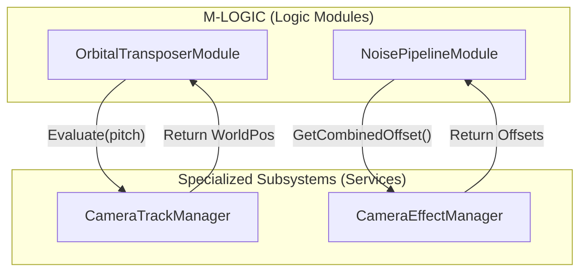

# 遗留系统整合方案 (Legacy Integration Plan - Subsystem Approach)

## 1. 核心整合原则 (Core Integration Principles)

为了平衡“构架重构”与“逻辑稳定性”，我们将 `CameraTrackManager` 和 `CameraEffectManager` 保留为**专用子系统 (Subsystems)**。它们将作为 `M-PROV`（数据提供者）或公共服务的延伸，为 `M-LOGIC`（原子逻辑模块）提供专业的数据计算支持。

---

## 2. 轨道子系统 (`CameraTrackManager`)

### 定位
作为**空间几何服务提供者**，负责管理复杂的曲线数据和坐标映射逻辑。

### 整合方式
- **保留类**: `CameraTrackManager` 继续作为 `MonoBehaviour` 挂载在主相机或独立对象上。
- **接口化**: 抽象出 `ITrackService` 接口。
- **调用流**:
    1.  `M-LOGIC` 中的 `OrbitalTransposerModule` 持有 `ITrackService` 的引用。
    2.  `OrbitalTransposerModule` 在执行 `Body` 阶段时，调用 `ITrackService.EvaluatePosition(target, pitch)`。
    3.  `CameraTrackManager` 执行复杂的数学插值，返回世界空间坐标。
- **收益**: 逻辑模块无需关心 Bezier 曲线的底层实现，只需消费计算结果。

---

## 3. 镜头特写/效果子系统 (`CameraEffectManager`)

### 定位
作为**动态偏移服务提供者**，负责管理所有叠加的镜头震动、走路晃动等效果。

### 整合方式
- **保留类**: `CameraEffectManager` 负责维护 `ICameraEffect` 列表及其优先级混合算法。
- **接口化**: 抽象出 `IEffectService` 接口。
- **调用流**:
    1.  `M-LOGIC` 中的 `NoisePipelineModule` 在执行 `Noise` 阶段时，调用 `IEffectService.GetCombinedOffset(context)`。
    2.  `CameraEffectManager` 遍历其内部效果列表，执行混合算法。
    3.  返回最终的 `Vector3` 位移和 `Quaternion` 旋转偏移。
    4.  `NoisePipelineModule` 将这些偏移应用到 `CameraState`。
- **收益**: 保持了原有效果系统的灵活性，同时将其应用点规范化到相机流水线的末端。

---

## 4. 模块依赖矩阵 (Revised Dependency Matrix)

| 逻辑模块 (Consumer) | 依赖接口 (Contract) | 服务提供者 (Provider) |
| :--- | :--- | :--- |
| `OrbitalTransposerModule` | `ITrackService` | `CameraTrackManager` |
| `NoisePipelineModule` | `IEffectService` | `CameraEffectManager` |
| `AutoFitModule` | `ITargetProvider` | `ICameraFollowTarget` 适配器 |

---

## 5. 通讯契约定义 (Interaction Contract)

---

## 6. 整合约束 (Constraints)

- **单向依赖**: 严禁 `TrackManager` 或 `EffectManager` 反向调用 `VisualCamera` 或 `ICameraModule`。它们必须保持为纯粹的“被动服务”。
- **状态隔离**: `Manager` 仅负责计算偏移，严禁直接修改 `Camera.main.transform`。所有修改必须由模块通过 `CameraState` 向上提交。
- **生命周期**: `M-CORE` 负责在初始化时将这些 Manager 实例（或其接口）注入到 `VisualCamera` 的上下文中，确保模块可以随时访问服务。

---

## 7. 结论

通过这种“服务化”整合方案，我们既保留了原有系统中经过验证的复杂数学逻辑（轨道插值、效果混合），又实现了相机控制权的高度集中（Pipeline）。`Manager` 从“控制者”转变为“计算服务商”，完美融入了新的解耦构架。