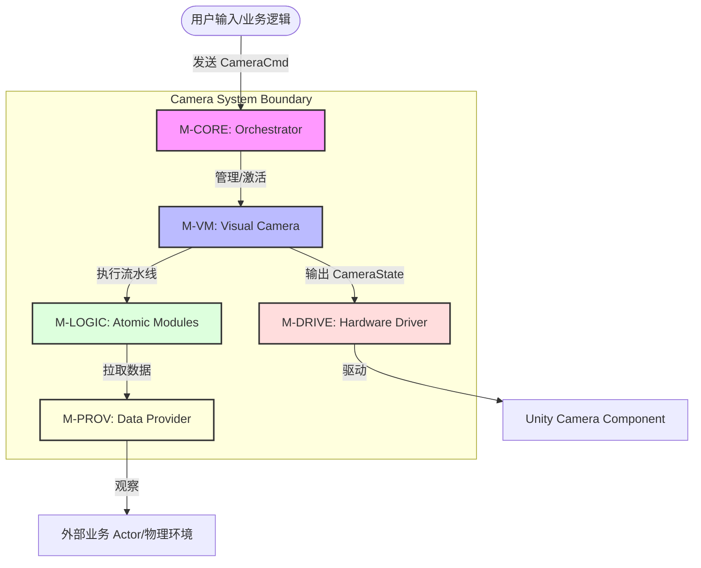

# 相机系统模块切分与边界定义规格书 (Module Decoupling Specs)

## 1. 模块地图 (Module Map)

系统被划分为五个核心独立单元，每个单元具有严格的单一职责。

| 模块名称 | 核心职责 | 逻辑内聚簇 |
| :--- | :--- | :--- |
| **M-CORE (编排器)** | 系统生命周期、模式栈管理、指令分发、全局服务注册。 | `CameraController`, `CameraCmd`, `ModuleRegistry` |
| **M-VM (虚拟相机)** | 状态容器。管理模块流水线 (Pipeline)，输出 `CameraState` 数据快照。 | `VisualCamera`, `PipelineExecutor` |
| **M-LOGIC (原子逻辑)** | 数学计算单元。负责 Body (位移)、Aim (旋转)、Noise (抖动) 的具体算法。 | `ICameraModule`, `OrbitalTransposer`, `Composer` |
| **M-PROV (数据源)** | 外部适配层。屏蔽物理引擎、业务 Actor、输入系统的直接依赖。 | `ITargetProvider`, `IInputProvider` |
| **M-DRIVE (驱动器)** | 硬件应用层。将 `CameraState` 最终应用到 Unity `Camera` 硬件组件。 | `CameraDriver`, `PostProcessHandler` |

---

## 2. 数据主权 (Data Sovereignty)

明确每一份数据的归属，严禁跨模块越权写操作。

| 数据对象 | 主权归属模块 | 访问规则 |
| :--- | :--- | :--- |
| **模式栈 (ModeStack)** | `M-CORE` | 仅 CORE 可写。VM 通过 CORE 提供的只读接口查询当前优先级。 |
| **相机状态 (CameraState)** | `M-VM` | VM 负责逐帧生成。LOGIC 模块仅接收 Ref/Out 引用进行增量修改。 |
| **目标包围盒 (Bounds)** | `M-PROV` | 原始数据归属于 PROV。LOGIC 模块必须通过 `ITargetProvider` 获取。 |
| **配置数据 (Settings)** | `M-CORE` | CORE 负责加载 ScriptableObject 并分发给对应的 VM。 |
| **硬件矩阵 (Matrices)** | `M-DRIVE` | 只有 DRIVE 模块允许调用 `camera.projectionMatrix` 或 `camera.transform`。 |

---

## 3. 通讯契约 (Interaction Contracts)

### 3.1 同步调用契约 (Request-Response)
- **CORE -> VM**: `Update(deltaTime)`。驱动 VM 执行内部流水线。
- **VM -> LOGIC**: `Execute(ref CameraState, context)`。流水线按序分发状态进行数学加工。
- **LOGIC -> PROV**: `GetPosition()`, `GetLookDelta()`。逻辑模块按需拉取物理/输入数据。

### 3.2 异步事件契约 (Pub-Sub)
- **CORE.OnModeChanged**: 当模式栈发生推入/弹出时通知 UI 或其他系统。
- **VM.OnTargetLost**: 当 `ITargetProvider` 返回失效时，触发 VM 的回退逻辑。

---

## 4. 上下文映射图 (Context Map)

---

## 5. 禁止事项 (Negative Scope)

- **[M-LOGIC] 严禁直接访问 `GameObject.Find` 或 `GetComponent`**: 必须通过 `ITargetProvider` 获取目标信息。
- **[M-VM] 严禁处理具体的数学算法**: VM 只负责编排逻辑模块的顺序，不应关心轨道是如何计算的。
- **[M-CORE] 严禁直接持有硬件 Camera 引用**: 必须通过 `M-DRIVE` 进行最终渲染参数的应用。
- **[M-PROV] 严禁持有 `CameraState`**: 提供者不应知道相机当前在哪，它只负责告诉相机目标在哪。
- **[全模块] 严禁产生 GC Alloc**: 核心 Tick 流程内严禁使用 `new` 关键字（除必要的初始化外），必须使用结构体或对象池。

---

## 6. 上下文快照 (Context Snapshot)

### [M-CORE 设计快照]
- **定位**: 全局大脑，负责“谁在运行”。
- **上游**: 业务逻辑（通过指令系统）。
- **下游**: 激活对应的 `VisualCamera`。
- **约束**: 不参与任何空间位置计算。

### [M-VM 设计快照]
- **定位**: 逻辑容器，负责“怎么组合”。
- **上游**: `M-CORE` 的 Tick 驱动。
- **下游**: 调用 `M-LOGIC` 序列。
- **数据隔离**: 拥有 `CameraState` 的写权限。

### [M-PROV 设计快照]
- **定位**: 物理翻译官，负责“外面发生了什么”。
- **上游**: 无（被动拉取）。
- **下游**: 为 `M-LOGIC` 提供 `ITargetProvider`。
- **约束**: 严禁修改外部对象状态。