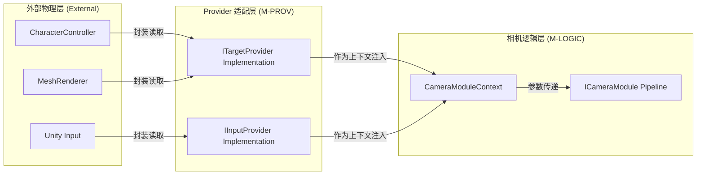

# 数据提供者 (Provider) 模块设计文档

## 1. 模块定位 (Module Positioning)

`Provider` 模块是相机系统与外部物理世界（Unity 物理引擎、渲染组件、输入系统）之间的**解耦适配层**。它的存在确保了相机逻辑不再直接依赖于具体的业务对象（如 `FishmanActor`）或物理组件（如 `MeshRenderer`），从而实现真正的**环境隔离**。

### 核心职责
- **数据适配**: 将业务对象（Actor、钓具、UI）的原始物理数据转化为相机系统可直接消费的标准化空间数据。
- **职责隔离**: 确保相机系统不直接调用 `GetComponent` 或处理复杂的包围盒合并逻辑。
- **输入抽象**: 屏蔽不同输入设备（键盘、手柄、触屏）的差异，提供归一化的增量数据。

---

## 2. 核心接口定义 (Interface Specifications)

### 2.1 ITargetProvider (空间几何提供者)
负责提供相机观察目标的物理快照。

```csharp
public interface ITargetProvider
{
    /// <summary>
    /// 获取目标的基础世界坐标（通常为 Pivot 或中心点）
    /// </summary>
    Vector3 GetPosition();

    /// <summary>
    /// 获取目标的实时速度（用于计算 Noise 或平滑预测）
    /// </summary>
    Vector3 GetVelocity();

    /// <summary>
    /// 获取目标的世界空间包围盒 (AABB)
    /// 用于 AutoFitModule 计算最优观察距离
    /// </summary>
    Bounds GetWorldBounds();

    /// <summary>
    /// 获取目标的胶囊体参数 (针对角色适配)
    /// </summary>
    CapsuleInfo GetCapsuleInfo();

    /// <summary>
    /// 目标是否有效（如：是否已销毁或被禁用）
    /// </summary>
    bool IsActive();
}
```

### 2.2 IInputProvider (控制输入提供者)
负责屏蔽输入设备差异。

```csharp
public interface IInputProvider
{
    /// <summary>
    /// 获取归一化的旋转增量 (x=Yaw, y=Pitch)
    /// </summary>
    Vector2 GetLookDelta();

    /// <summary>
    /// 获取归一化的缩放增量 (Zoom)
    /// </summary>
    float GetZoomDelta();

    /// <summary>
    /// 输入是否有效（如：是否被 UI 拦截）
    /// </summary>
    bool IsInputValid();
}
```

---

## 3. 模块实现方案 (Implementation Strategy)

### 3.1 适配器模式 (Adapter Pattern)
Provider 模块主要通过适配器类来实现，这些类持有对业务对象的引用，但向相机系统暴露标准接口。

- **ActorTargetProvider**: 包装 `FishmanActor`，内部负责处理头部 Transform 的位置获取。
- **TackleTargetProvider**: 包装钓具 Prefab，内部负责动态计算多个 `MeshRenderer` 的合并 Bounds。
- **StandardInputProvider**: 封装 Unity `Input.GetAxis` 或新的 `InputSystem`。

### 3.2 数据主权与边界
- **主权归属**: `M-PROV` 模块拥有对目标组件的**唯一读取适配权**。
- **注入机制**: 在 `CameraMode` 启动或切换时，由业务层将对应的 Provider 实例注入到 `VisualCamera` 的上下文中。

---

## 4. 模块交互流图 (Interaction Flow)



---

## 5. 禁止事项 (Negative Scope)

- **禁止存储相机状态**: Provider 必须是“无状态”的，严禁存储 `CameraState` 或任何相机位姿的历史数据。
- **禁止修改外部对象**: Provider 仅限读取（Read-only），严禁修改目标的 `Transform`、`Renderer` 或输入状态。
- **禁止参与数学加工**: Provider 只负责“提供原始几何数据”，不负责“计算相机该怎么看”。例如：它提供 Bounds，但不应计算适配该 Bounds 所需的距离（该逻辑属于 `AutoFitModule`）。
- **禁止直接引用 Camera**: Provider 严禁持有 `UnityEngine.Camera` 的引用。