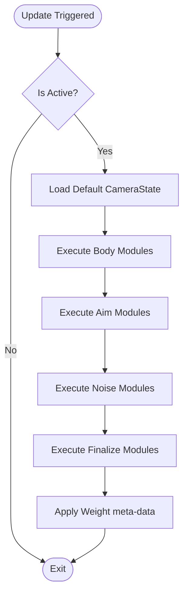

# VisualCamera (VM) 模块详细设计规范

## 1. 模块定位 (Module Definition)

`VisualCamera` (简称 VM) 是相机系统中负责**逻辑位姿生成**的原子容器。它封装了一套可插拔的计算管线（Pipeline），负责将原始输入和环境几何数据转化为标准的相机状态快照。

### 核心职责
- **管线持有者**: 维护并按序执行由 `ICameraModule` 组成的计算链。
- **状态生成器**: 每帧产出一个独立的 `CameraState`，包含基础位姿与表现修正。
- **配置载体**: 作为视角行为的最小配置单元，支持在不同业务模式间复用。

---

## 2. 核心接口设计 (Interface Design)

### 2.1 IVisualCamera 接口
VM 必须实现此接口，以确保 `CameraMode` 和 `Blender` 能够统一调度。

```csharp
public interface IVisualCamera
{
    /// <summary>
    /// 虚拟相机唯一名称，用于业务检索
    /// </summary>
    string Name { get; }

    /// <summary>
    /// 混合权重 (0-1)，决定该 VM 对最终输出的贡献度
    /// </summary>
    float Weight { get; set; }

    /// <summary>
    /// 是否激活。非激活状态下不执行内部 Pipeline 计算
    /// </summary>
    bool IsActive { get; set; }

    /// <summary>
    /// 驱动管线更新
    /// </summary>
    /// <param name="context">包含 DeltaTime、Target 和 Input 的只读上下文</param>
    void Update(in CameraModuleContext context);

    /// <summary>
    /// 获取当前管线计算产出的位姿快照
    /// </summary>
    CameraState GetState();

    /// <summary>
    /// 动态管理管线模块
    /// </summary>
    void AddModule(ICameraModule module);
    void RemoveModule(ICameraModule module);
    
    /// <summary>
    /// 重置管线内部所有模块的状态（如清除平滑缓存、计时器）
    /// </summary>
    void Reset();
}
```

---

## 3. 内部管线逻辑 (Internal Pipeline)

VM 内部通过一个有序列表维护 `ICameraModule`，并严格按照 `CameraModuleStage` 强制执行顺序。

### 3.1 阶段化加工流水线
| 阶段 (Stage) | 修改目标 (CameraState) | 典型逻辑 |
| :--- | :--- | :--- |
| **1. Body (定位)** | `RawPosition` | 轨道采样、点跟随、环绕位移计算。 |
| **2. Aim (朝向)** | `RawRotation` | LookAt 目标计算、输入旋转应用。 |
| **3. Noise (噪声)** | `PositionOffset`, `RotationOffset` | 手持感抖动、物理震屏累加。 |
| **4. Finalize (修正)** | `ProjectionMatrix`, `Position` | 碰撞剔除、包围盒自适应、构图矩阵生成。 |

### 3.2 执行流程图


---

## 4. 数据交互契约 (Data Contracts)

### 4.1 输入: CameraModuleContext (只读)
VM 不允许主动向外部“索取”数据，所有依赖必须通过上下文注入。
- **ITargetProvider**: 提供目标的实时 `Position`, `Bounds`, `Capsule`。
- **IInputProvider**: 提供归一化的输入增量（Yaw/Pitch/Zoom）。
- **DeltaTime**: 确保计算的帧率无关性。

### 4.2 输出: CameraState (快照)
VM 的唯一输出产物，采用**双通道位姿设计**：
- **逻辑通道 (Raw)**: 存储确定的、可预测的基础位姿。
- **修正通道 (Offset)**: 存储不确定的、表现性的偏移。
- **混合元数据**: 存储当前 VM 的 `Weight`，供 `Blender` 执行插值。

---

## 5. 模块协作与边界

### 5.1 与 CameraMode 的边界
- **CameraMode**: 负责业务逻辑（如：点击鱼饵 UI -> 切换到特写 VM）。
- **VisualCamera**: 负责数学实现（如：如何平滑地看向鱼饵）。
- **红线**: VM 禁止感知 UI 事件或具体的业务流程。

### 5.2 与 Blender 的边界
- **VisualCamera**: 负责生成“单点最优解”状态。
- **Blender**: 负责在多个 VM 的“单点最优解”之间进行数学插值。
- **红线**: VM 禁止自行执行跨模式的 `Lerp` 逻辑。

---

## 6. 禁止事项 (Negative Scope)

- **禁止直接操作组件**: VM 严禁持有 `UnityEngine.Camera` 的引用，严禁直接修改场景中的 `Transform`。
- **禁止产生 GC**: `Update` 逻辑内严禁使用 `new`、`Linq` 或频繁的 `GetComponent`（环境数据必须由 Provider 预先准备）。
- **禁止跨 VM 通讯**: 每个 VM 必须是完全独立的，严禁 VM A 读取 VM B 的中间变量。