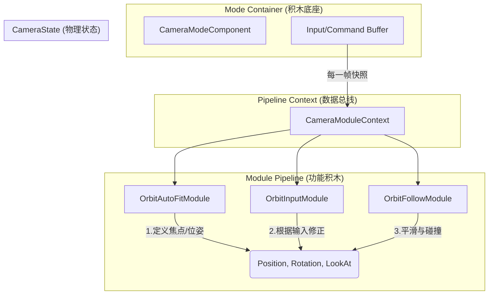

# 🏗️ 相机系统深度管道化去耦合方案 (Deep Pipeline Decoupling)

## 1. 设计思路 (The Thinking)

目前的架构虽然实现了模块化，但 Mode 仍通过“命令式调用”（如 `m_inputModule.HandleInput`）来驱动模块。这导致 Mode 必须了解模块的具体类型，形成了最后的耦合。

**重构目标**：参考 **Cinemachine** 的设计，将业务模式（Mode）降级为纯粹的“积木容器”，将所有指令和输入转化为“管道数据流”，使模块能够根据数据自驱动。

## 2. 核心概念 (Core Concepts)

### 2.1 指令即数据 (Commands as Data)
将离散的业务操作（如“重置相机”、“触发适配”）转化为 `CameraModuleContext` 中的**布尔标记位（Flags）**。Mode 只负责在 Context 中“插旗”，模块在执行时自行检查。

### 2.2 输入流标准化 (Standardized Input Stream)
消除模块上的 `HandleInput`、`HandleZoom` 等公共方法。Mode 将接收到的原始输入存入缓冲区，并通过 `IInputProvider` 注入管线。模块在 `Execute` 阶段按需索取输入增量。

### 2.3 物理意图总线 (Physical Intent Bus)
继续沿用 `ReferenceLookAt` 和 `RawPosition` 作为模块间通信的隐式契约，定义相机的物理骨架。

## 3. 重构具体细节 (Implementation Details)

### 3.1 扩展核心上下文 (`CameraModuleContext`)
在 `readonly struct` 中增加指令位，用于携带 Mode 的瞬时意图：
```csharp
public readonly bool m_resetRequested;    // 是否请求重置
public readonly bool m_autoFitRequested;  // 是否请求自动适配
```

### 3.2 增强模式基类 (`CameraModeComponent`)
基类将承担起“输入转换器”和“指令注入器”的职责：
*   **输入缓冲**: 维护内部的 `Vector2` 和 `float` 变量，累加一帧内的所有旋转/缩放输入。
*   **Context 构建**: 在 `BuildModuleContext` 时，将缓冲区数据包装进 `IInputProvider`，并将业务 Flag（如 `m_isResetDirty`）注入 Context。

### 3.3 模块自驱动重构 (Module Evolution)

| 模块 (Module) | 变更细节 (Changes) |
| :--- | :--- |
| **OrbitInputModule** | 1. 移除 `HandleInput/Zoom` 方法。<br>2. 在 `Execute` 中：`var delta = context.m_inputProvider.LookDeltaGet();` |
| **OrbitAutoFitModule** | 1. 移除 `TriggerAutoFit` 方法。<br>2. 在 `Execute` 中：`if (context.m_autoFitRequested || TargetChanged) { ... }` |
| **OrbitFollowModule** | 保持不变，继续作为纯粹的物理实现者。 |

### 3.4 业务模式极简化 (`OrbitViewModeComponent`)
重构后的 `OrbitViewMode` 将缩减为：
1.  **配置定义**: 仅包含序列化字段。
2.  **指令转发**: `ResetCamera()` 仅执行 `m_isResetDirty = true`。
3.  **移除引用**: 彻底删除 `m_inputModule` 等字段及 `CacheModuleReferences` 方法。

## 4. 协作拓扑图



## 5. 方案优势总结

1.  **真正的自由组合**: 你可以在同一个 Mode 下挂载任意多个输入模块（如：一个响应鼠标，一个响应自动旋转），它们会自动叠加效果。
2.  **零代码侵入**: 增加新功能只需编写新 Module 并挂载到 Prefab，无需修改 Mode 的 C# 代码。
3.  **状态一致性**: 所有的逻辑分支都汇聚在 `Execute` 这一唯一入口，极大地降低了调试难度。