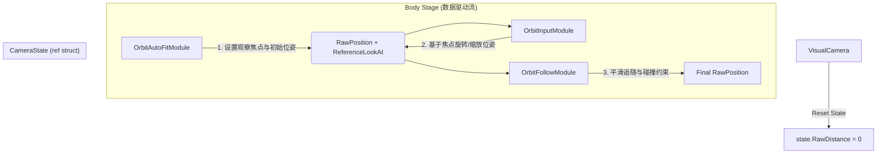

# 🛠️ OrbitView 模块化去耦合技术方案 (TDD)

## 1. 现状问题分析 (Problem Statement)

在重构后的组件化相机系统中，`OrbitView` 相关模块（Input, AutoFit, Follow）虽然在物理上拆分成了独立组件，但在逻辑上仍存在强耦合：

*   **命令式调用**: `OrbitAutoFitModule` 通过 `GetComponent` 寻找并直接调用 `OrbitInputModule.SetTargetDistance()`。
*   **状态持有冲突**: `Distance` 状态被 `OrbitInputModule` 持有，但 `OrbitFollowModule` 计算位置时必须依赖它，导致模块间必须互相可见。
*   **违反组件化原则**: 理论上组件应可任意组合（如：只挂载 Follow 用于固定观察），但目前的实现导致缺少任一模块都会引发逻辑中断。

## 2. 核心设计：基于“意图焦点”的隐式契约

参考 **Cinemachine** 的架构设计，我们引入 `ReferenceLookAt` 语义，将“观察意图”与“物理实现”彻底解耦。

### 2.1 核心数据载体：CameraState 扩展
在 [`CameraState.cs`](../../GameProject/Scripts/Runtime/GameView/Camera/Core/CameraState.cs) 中引入 `ReferenceLookAt`：
*   **`ReferenceLookAt` (看哪/绕哪)**: 相机想要观察的逻辑中心点。
*   **`RawPosition` (在哪)**: 相机期望的原始空间位置。
*   **隐式距离 (Distance)**: $\text{dist} = \|\text{RawPosition} - \text{ReferenceLookAt}\|$。

### 2.2 模块职责重定义 (New Contract)

| 模块 (Module) | 阶段 (Stage) | 职责 (Responsibility) | 输出 (Output) |
| :--- | :--- | :--- | :--- |
| **OrbitAutoFit** | Body (Order 0) | **意图生产者**：根据目标包围盒计算理想的观察点和距离。 | `ReferenceLookAt`, `RawPosition` |
| **OrbitInput** | Body (Order 5) | **意图修正者**：读取当前位姿，根据玩家输入绕焦点旋转或沿连线缩放。 | `RawPosition`, `RawRotation` |
| **OrbitFollow** | Body (Order 10) | **物理实现者**：将 `RawPosition` 视为目的地，执行平滑插值与碰撞修正。 | 更新最终 `RawPosition` |

## 3. 协作流水线 (Pipeline)

## 4. 优化后的优势

1.  **完全解耦**: 模块间不再需要 `GetComponent` 寻找兄弟节点，所有通信通过 `CameraState` 隐式完成。
2.  **任意组合**: 
    *   去掉 `AutoFit`：`Input` 模块基于当前位置继续工作。
    *   去掉 `Input`：相机变为自动适配目标的固定观察模式。
3.  **符合管线哲学**: 数据在管线中流动，每个模块都是一个纯粹的“位姿处理器”。

## 5. 实施步骤 (Action Plan)

1.  **核心扩展**: 修改 [`CameraState.cs`](../../GameProject/Scripts/Runtime/GameView/Camera/Core/CameraState.cs) 添加 `ReferenceLookAt` 字段及 `Lerp` 逻辑。
2.  **模块重构**:
    *   重构 `OrbitAutoFitModule`，移除 `InputModule` 引用，输出至 `state`。
    *   重构 `OrbitInputModule`，移除内部 `m_distance` 状态，改为基于 `state` 的增量修正。
    *   重构 `OrbitFollowModule`，移除所有兄弟引用，改为纯粹的物理约束器。
3.  **模式简化**: 简化 `OrbitViewModeComponent`，移除对子模块的生命周期管理代码。