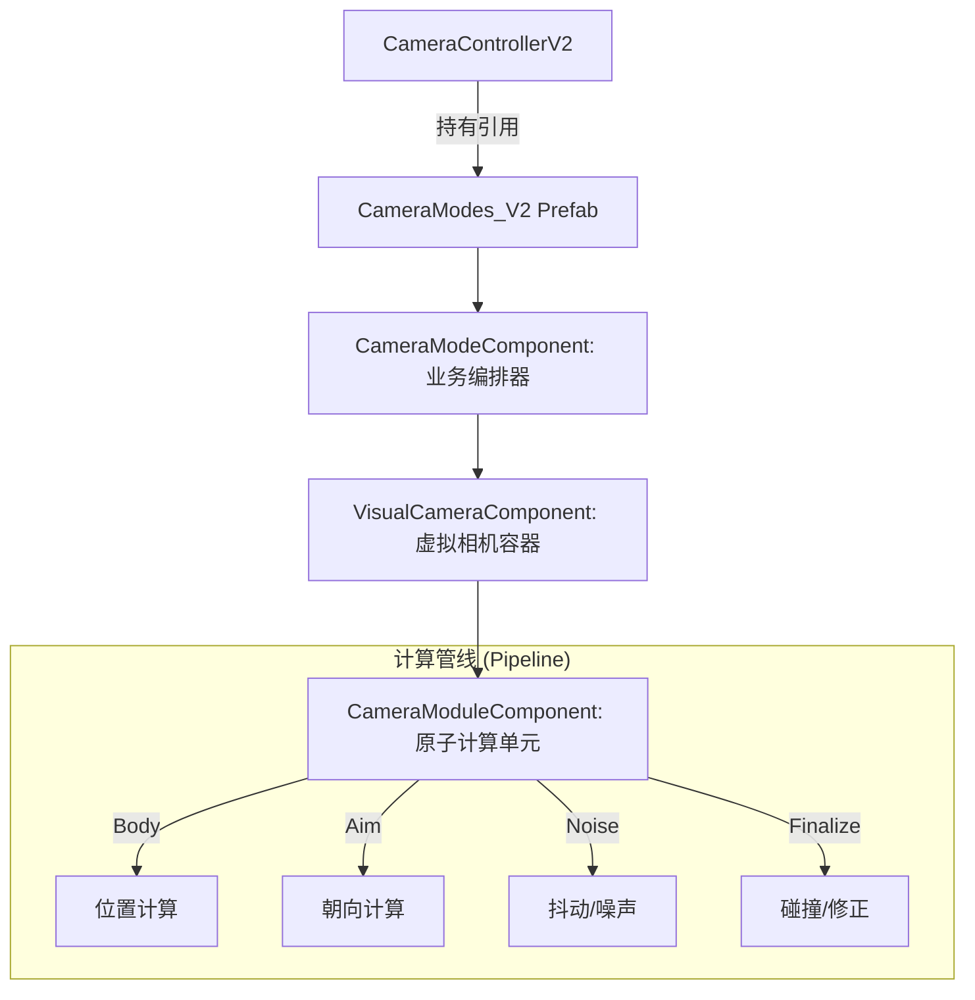
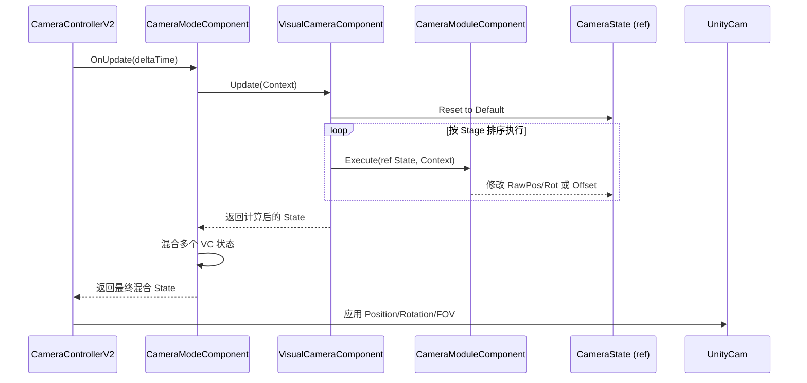
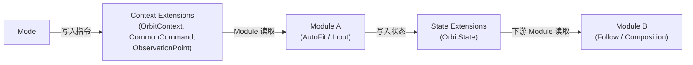
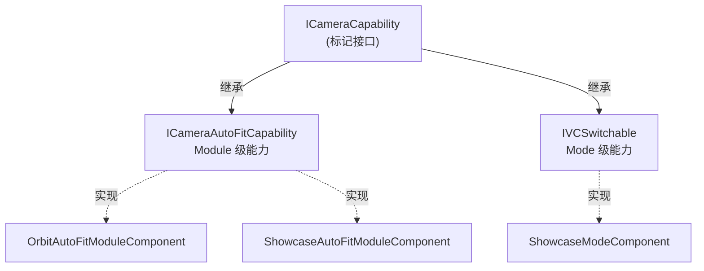
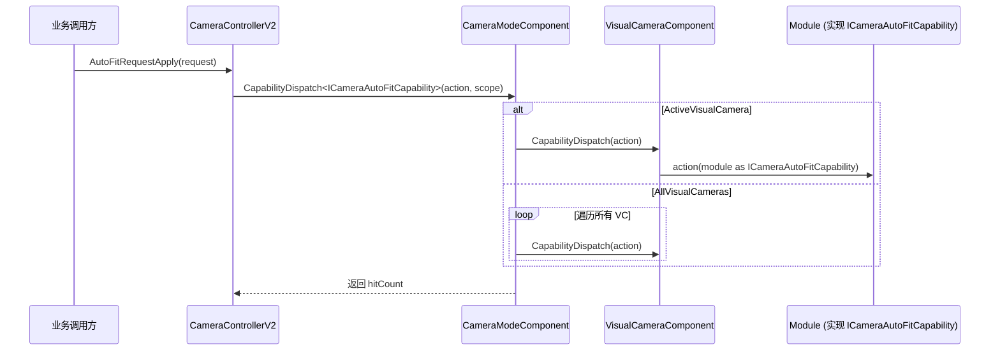
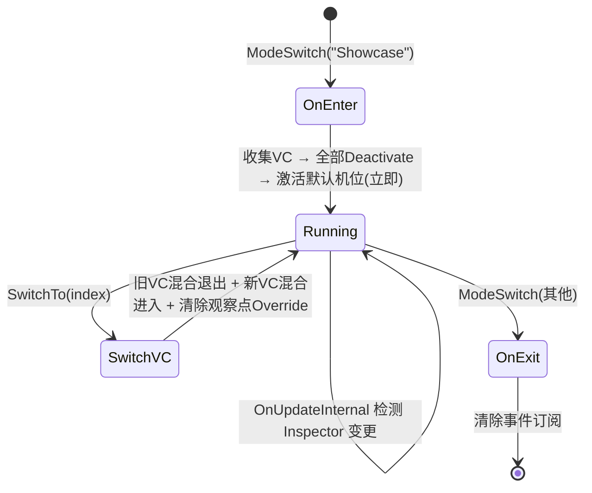

# 🚀 CameraController V2 技术维基 (Deep Wiki)

## 1. 项目概览 (Overview)
[`CameraControllerV2.cs`](../../GameProject/Scripts/Runtime/GameView/Camera/Core/CameraControllerV2.cs) 是重构后的新一代相机系统核心。它采用了**组件化管道 (Component-based Pipeline)** 架构，旨在解决旧版系统中逻辑臃肿（God Class）、职责耦合以及配置不直观等痛点。

### 核心设计目标
- **虚拟化与组件化**: 引入 `VisualCamera (VM)` 语义，通过原子化的 `CameraModuleComponent` 组装视角逻辑。
- **架构即配置**: 深度集成 Unity Prefab 流程，实现相机树结构的“所见即所得”配置。
- **高性能无 GC**: 核心计算管线使用 `ref struct` (如 `CameraState`) 传递状态，确保运行时零分配。
- **平滑混合**: 原生支持多虚拟相机 (VC) 之间的权重混合与过渡。

*Sources: [Assets/Doc/CameraRefactor/CameraRefactoring_DetailedDesign.md:10-31](), [Assets/GameProject/Scripts/Runtime/GameView/Camera/Core/CameraControllerV2.cs:8-27]()*

---

## 2. 🏗️ 架构拓扑 (Architecture)

### 2.1 系统逻辑层级
系统采用四层组件嵌套结构，将复杂的相机逻辑拆解为单一职责的物理节点：


*Sources: [Assets/Doc/CameraRefactor/CameraRefactoring_DetailedDesign.md:40-51](), [Assets/GameProject/Scripts/Runtime/GameView/Camera/Core/CameraControllerV2.cs:13-21]()*

---

## 3. 📂 目录索引 (Folder Structure)

```text
Assets/GameProject/Scripts/Runtime/GameView/Camera/
├── Core/                      # 核心数据结构与调度器
│   ├── CameraControllerV2.cs  # 根调度器
│   ├── CameraState.cs         # 状态快照 (ref struct)
│   └── CameraModuleContext.cs # 执行上下文
├── Components/                # MonoBehaviour 组件实现
│   ├── CameraModuleComponent.cs  # 模块基类
│   ├── VisualCameraComponent.cs  # 虚拟相机容器
│   └── Modes/                 # 具体业务模式组件 (FPS/TPS/Orbit)
├── Providers/                 # 数据提供者接口 (Target/Input)
├── Services/                  # 外部服务接口 (Track/Effect)
├── ICameraModule.cs           # 模块计算接口
└── CameraModuleStage.cs       # 管线执行阶段定义
```
*Sources: [Assets/GameProject/Scripts/Runtime/GameView/Camera/]() (Directory Structure)*

---

## 4. 🧩 核心模块详解 (Modules)

### 4.1 CameraState (状态快照)
采用“基础位姿 (Raw) + 表现偏移 (Offset)”的双通道设计。
- **RawPosition/Rotation**: 由 Body 和 Aim 阶段计算的基础物理位姿。
- **World/LocalOffset**: 用于叠加震屏、手持感等表现效果，不干扰基础逻辑。
- **FinalPosition/Rotation**: 最终输出给 Unity Camera 的属性。

*Sources: [Assets/GameProject/Scripts/Runtime/GameView/Camera/Core/CameraState.cs:10-63]()*

### 4.2 VisualCameraComponent (虚拟相机)
视角逻辑的物理容器，负责管理模块管线的执行顺序。
- **执行顺序**: 严格遵循 `Body (0)` -> `Aim (100)` -> `Noise (200)` -> `Finalize (300)`。
- **权重混合**: 支持通过 `BlendTo` 方法实现 VC 间的平滑切换。

*Sources: [Assets/GameProject/Scripts/Runtime/GameView/Camera/Components/VisualCameraComponent.cs:23-43](), [Assets/GameProject/Scripts/Runtime/GameView/Camera/CameraModuleStage.cs:7-32]()*

### 4.3 CameraModuleComponent (原子组件)
所有计算逻辑（如跟随、旋转、碰撞）的基类。开发者通过重写 `Execute` 方法注入数学逻辑。

*Sources: [Assets/GameProject/Scripts/Runtime/GameView/Camera/Components/CameraModuleComponent.cs:22-39]()*

---

## 5. 🔄 数据流向 (Data Flow)

### 5.1 执行流水线
每一帧 `LateUpdate`，系统都会经历从输入到渲染的完整加工：


*Sources: [Assets/GameProject/Scripts/Runtime/GameView/Camera/Core/CameraControllerV2.cs:118-129](), [Assets/GameProject/Scripts/Runtime/GameView/Camera/Components/VisualCameraComponent.cs:157-183](), [Assets/Doc/CameraRefactor/CameraRefactoring_DetailedDesign.md:55-71]()*

---

## 6. 🚦 核心接口规范

| 接口 / 类 | 职责 | 关键方法 |
| :--- | :--- | :--- |
| [`ICameraModule`](../../GameProject/Scripts/Runtime/GameView/Camera/ICameraModule.cs) | 定义计算单元契约 | `Execute(ref CameraState, context)`, `SyncFrom(...)` |
| [`ITargetProvider`](../../GameProject/Scripts/Runtime/GameView/Camera/Core/CameraModuleContext.cs) | 提供目标空间数据 | `PositionGet()`, `RotationGet()`, `IsActive()` |
| [`IInputProvider`](../../GameProject/Scripts/Runtime/GameView/Camera/Core/CameraModuleContext.cs) | 提供玩家输入增量 | `LookInputGet()`, `MoveInputGet()` |

*Sources: [Assets/GameProject/Scripts/Runtime/GameView/Camera/ICameraModule.cs:7-61](), [Assets/GameProject/Scripts/Runtime/GameView/Camera/Core/CameraModuleContext.cs:11-41]()*

---

## 7. 可扩展性与定制性 (Extensibility)

### 如何添加新的相机表现？
1. **创建组件**: 继承 `CameraModuleComponent`。
2. **实现逻辑**: 在 `Execute` 中修改 `state.LocalPositionOffset` 或 `state.RotationOffset`。
3. **挂载配置**: 将新组件挂载到 Prefab 中对应 `VisualCamera` 节点的下方。
4. **即时生效**: 无需修改调度器代码，管线会自动收集并执行。

```mermaid
graph LR
    Sub[New Custom Module] --|> Base[CameraModuleComponent]
    Sub -->|Inject into| Prefab[VisualCamera Node]
    Prefab -->|Auto Collect| Pipeline[Execution Pipeline]
```
*Sources: [Assets/Doc/CameraRefactor/CameraRefactoring_DetailedDesign.md:107-115](), [Assets/GameProject/Scripts/Runtime/GameView/Camera/Components/VisualCameraComponent.cs:382-409]()*

---

## 8. 🧱 积木式扩展与 Extension 机制 (Extension System)

### 8.1 设计思想

传统做法是将相机的各种业务数据（Orbit 参数、重置指令、观察点配置等）全部塞进 `CameraModuleContext` 或 `CameraState` 的固定字段中，导致核心结构不断膨胀。V2 架构引入 **Extension 机制**，将业务特有的数据"外挂"到容器上，实现核心结构精简 + 业务按需扩展。

- **核心结构保持不变**：`CameraModuleContext` 和 `CameraState` 只持有通用字段（deltaTime、Target、Input 等）。
- **业务数据走 Extension**：`OrbitContextExtension`、`ObservationPointExtension` 等由各 Mode 按需注册，Module 按需读取。
- **O(1) 类型安全访问**：通过 `ExtensionContainer` + 泛型静态字段实现编译期类型安全 + 运行时 O(1) 查找。

### 8.2 ExtensionContainer 实现

[`ExtensionContainer`](../../GameProject/Scripts/Runtime/GameView/Camera/Extensions/ExtensionContainer.cs) 利用 C# 泛型静态字段的语言特性，为每个扩展类型分配唯一运行时 ID：

```csharp
// 类型注册器 —— 每个 T 自动获得唯一 ID
public static class ExtensionTypeRegistry
{
    private static int s_nextTypeId = 0;
    public static int GetTypeId<T>() => TypeIdHolder<T>.Id;
    private static class TypeIdHolder<T> { public static readonly int Id = s_nextTypeId++; }
}

// 容器 —— O(1) 的 Set/Get/Has/Remove
public class ExtensionContainer
{
    private object[] m_extensions = new object[16];  // 按需倍增
    public void Set<T>(T ext)    { m_extensions[GetTypeId<T>()] = ext; }
    public T    Get<T>()         { return m_extensions[GetTypeId<T>()] as T; }
    public bool Has<T>()         { ... }
    public void Remove<T>()      { ... }
}
```

### 8.3 两个 Extension 容器

系统中存在两个独立的 `ExtensionContainer`，分别承担不同职责：

| 容器位置 | 写入方 | 消费方 | 生命周期 | 用途 |
| :--- | :--- | :--- | :--- | :--- |
| `CameraModuleContext.m_extensions` | Mode | Module | 每帧由 Mode 构建 | **指令传递** (Mode→Module) |
| `CameraState.m_extensions` | Module | Module / Mode | 跨帧持久化 | **状态共享** (Module→Module) |

**数据流示意：**


### 8.4 内置 Extension 一览

| Extension 类 | 容器 | 功能 | 典型写入方 |
| :--- | :--- | :--- | :--- |
| [`CommonCommandExtension`](../../GameProject/Scripts/Runtime/GameView/Camera/Extensions/CommonCommandExtension.cs) | Context | 通用一次性指令（Reset、TargetChanged、ImmediateSync） | 任意 Mode |
| [`OrbitContextExtension`](../../GameProject/Scripts/Runtime/GameView/Camera/Extensions/OrbitContextExtension.cs) | Context | OrbitView 的指令与配置参数（AutoFit、InitialYaw/Pitch 等） | OrbitViewMode |
| [`OrbitStateExtension`](../../GameProject/Scripts/Runtime/GameView/Camera/Extensions/OrbitContextExtension.cs) | State | OrbitView 的运行状态（OptimalDistance、CurrentYaw/Pitch 等） | OrbitAutoFit / OrbitInput / OrbitFollow |
| [`ObservationPointExtension`](../../GameProject/Scripts/Runtime/GameView/Camera/Extensions/ObservationPointExtension.cs) | Context | 当前 VC 的默认观察点名称与跟踪模式 | ShowcaseMode |

### 8.5 如何添加自定义 Extension

1. **定义扩展类**（放在 `Extensions/` 目录下）：
```csharp
public class MyCustomExtension
{
    public bool SomeFlag;
    public float SomeValue;
    public void Clear() { SomeFlag = false; SomeValue = 0f; }
}
```

2. **Mode 中注册与写入**：
```csharp
protected override void InitializeExtensions()
{
    base.InitializeExtensions();
    m_extensionContainer.Set(m_myExtension);
}

protected override void BuildModuleContext(float deltaTime)
{
    m_myExtension.SomeFlag = true;  // 设置指令
    base.BuildModuleContext(deltaTime);
}
```

3. **Module 中消费**：
```csharp
public override void Execute(ref CameraState state, in CameraModuleContext context)
{
    var ext = context.GetExtension<MyCustomExtension>();
    if (ext != null && ext.SomeFlag) { /* 执行逻辑 */ }
}
```

无需修改 `CameraModuleContext` 或 `CameraState` 的结构定义。

*Sources: [Assets/GameProject/Scripts/Runtime/GameView/Camera/Extensions/ExtensionContainer.cs](), [Assets/GameProject/Scripts/Runtime/GameView/Camera/Core/CameraModuleContext.cs:67-97](), [Assets/GameProject/Scripts/Runtime/GameView/Camera/Core/CameraState.cs:112-141]()*

---

## 9. 🎯 能力接口 (Capability Interfaces)

### 9.1 设计思想

相机系统中，不同 Mode 和 Module 具备不同的"能力"（如 AutoFit、机位切换等）。V2 架构通过 **Capability 接口** 体系将这些能力标准化，使调用方无需关心底层实现：



### 9.2 核心接口定义

[`CameraCapabilities.cs`](../../GameProject/Scripts/Runtime/GameView/Camera/Core/CameraCapabilities.cs):

| 接口 | 层级 | 职责 | 关键方法 |
| :--- | :--- | :--- | :--- |
| `ICameraCapability` | - | 标记接口，所有能力的根 | *(无方法)* |
| `ICameraAutoFitCapability` | Module | 自动适配目标物体到画面 | `AutoFitRequestApply(in CameraAutoFitRequest)` |
| [`IVCSwitchable`](../../GameProject/Scripts/Runtime/GameView/Camera/Components/IVCSwitchable.cs) | Mode | 多机位切换 | `SwitchTo(string)`, `SwitchTo(int)` |

### 9.3 能力分发机制 (CapabilityDispatch)

调用方通过 `CameraControllerV2` 或 `CameraModeComponent` 发起能力请求，系统自动分发给具备该能力的 Module：



**作用域控制**（`CameraCapabilityApplyScope`）：
- `ActiveVisualCamera`：仅作用于当前活跃 VC（默认）
- `AllVisualCameras`：遍历模式内所有 VC

### 9.4 AutoFit 请求参数

`CameraAutoFitRequest` 封装了一次 AutoFit 请求的全部可选参数：

| 字段 | 类型 | 说明 |
| :--- | :--- | :--- |
| `m_autoFitMode` | `CameraAutoFitMode?` | 适配算法 (Bounds/Capsule, ScreenRatio, None) |
| `m_adjustCenterToGeometry` | `bool?` | 是否对齐到目标几何中心 |
| `m_targetInFrameRatio` | `float?` | 目标占屏比例 (0.01~1.0) |
| `m_applyScope` | `CameraCapabilityApplyScope` | 请求作用范围 |
| `m_observationPointName` | `string` | 命名观察点 (如 "Head", "Weapon", "Reel") |
| `m_trackingMode` | `ObservationPointTrackingMode?` | 观察点跟踪模式 (Snapshot/Continuous) |

*Sources: [Assets/GameProject/Scripts/Runtime/GameView/Camera/Core/CameraCapabilities.cs](), [Assets/GameProject/Scripts/Runtime/GameView/Camera/Components/IVCSwitchable.cs](), [Assets/GameProject/Scripts/Runtime/GameView/Camera/Components/CameraModeComponent.cs:406-440]()*

---

## 10. 📸 Showcase 模式 (ShowcaseMode)

### 10.1 概述

[`ShowcaseModeComponent`](../../GameProject/Scripts/Runtime/GameView/Camera/Components/Modes/ShowcaseModeComponent.cs) 是专为展示场景设计的相机模式。与 OrbitView 的"围绕单目标旋转"不同，Showcase 模式侧重**多机位预设展示**——每个子 VisualCamera 代表一个固定或半固定的相机机位，通过索引/名称在机位间平滑切换。

### 10.2 典型 Prefab 结构

```text
CameraControllerV2 (GameObject)
└── CameraModes_V2 (Prefab Root)
    ├── OrbitViewMode (CameraModeComponent)
    │   └── MainVC (VisualCameraComponent)
    │       ├── OrbitAutoFit (Module)
    │       ├── OrbitInput (Module)
    │       ├── OrbitFollow (Module)
    │       └── Composition (Module)
    │
    └── ShowcaseMode (ShowcaseModeComponent)
        ├── FullBodyVC (VisualCameraComponent)
        │   ├── DirectPose (Module)
        │   └── ShowcaseAutoFit (Module)
        ├── CloseUpVC (VisualCameraComponent)
        │   └── ShowcaseAutoFit (Module)
        └── DetailVC (VisualCameraComponent)
            └── ShowcaseAutoFit (Module)
```

### 10.3 核心特性

#### 多机位管理
- 每个子节点 `VisualCameraComponent` = 一个相机机位
- 支持手动指定 + 自动收集子节点两种方式
- 按 **Hierarchy 子节点顺序**（SiblingIndex）排序，而非 Priority

#### 机位切换 (IVCSwitchable)
```csharp
public void SwitchTo(int index);     // 按索引切换
public void SwitchTo(string vcName); // 按名称切换
public void Next();                  // 循环下一个
public void Previous();              // 循环上一个
```
切换时旧 VC 通过 `Deactivate(blendDuration)` 混合退出，新 VC 通过 `Activate(blendDuration)` 混合进入，实现平滑过渡。

#### 观察点系统 (ObservationPoint)
每个 VC 可配置独立的默认观察点：
- `DefaultObservationPointName`：VC 上预配置的观察点名称（如 "Head"、"Reel"）
- `DefaultTrackingMode`：跟踪模式 (Snapshot 快照 / Continuous 持续跟踪)
- Mode 在 `BuildModuleContext` 时将当前活跃 VC 的观察点配置写入 `ObservationPointExtension`

#### AutoFit 适配
每个 VC 下的 `ShowcaseAutoFitModuleComponent` 实现 `ICameraAutoFitCapability`：
- 沿相机朝向调整距离，使目标物体适配画面
- 支持 Bounds/Capsule、ScreenRatio、None 三种算法
- 支持运行时观察点 Override（调用方指定特定部位）
- 切换 VC 时自动清除观察点 Override

#### 事件通知
```csharp
public event Action<int, int> EventOnVCSwitched;  // (oldIndex, newIndex)
```

### 10.4 生命周期



### 10.5 与 OrbitView 的对比

| 维度 | OrbitViewMode | ShowcaseMode |
| :--- | :--- | :--- |
| VC 数量 | 通常 1 个 | 多个（每个 = 一个机位） |
| 用户输入 | 旋转/缩放 | 无（预设机位） |
| 排序规则 | Priority 降序 | Hierarchy 子节点顺序 |
| 核心模块 | OrbitAutoFit + OrbitInput + OrbitFollow | DirectPose + ShowcaseAutoFit |
| 典型场景 | 物品 3D 预览 | 钓鱼人/鱼/装备多角度展示 |

*Sources: [Assets/GameProject/Scripts/Runtime/GameView/Camera/Components/Modes/ShowcaseModeComponent.cs](), [Assets/GameProject/Scripts/Runtime/GameView/Camera/Components/Modules/ShowcaseAutoFitModuleComponent.cs](), [Assets/GameProject/Scripts/Runtime/GameView/Camera/Extensions/ObservationPointExtension.cs]()*

---

## 11. 📂 目录索引补充 (Updated Folder Structure)

```text
Assets/GameProject/Scripts/Runtime/GameView/Camera/
├── Core/                        # 核心数据结构与调度器
│   ├── CameraControllerV2.cs    # 根调度器
│   ├── ICameraControllerV2.cs   # 控制器公共接口
│   ├── CameraState.cs           # 状态快照 (含 Extension 容器)
│   ├── CameraModuleContext.cs   # 执行上下文 (含 Extension 容器)
│   └── CameraCapabilities.cs   # 能力标记接口 + AutoFit 请求
├── Components/                  # MonoBehaviour 组件实现
│   ├── CameraModeComponent.cs   # 模式基类 (含 CapabilityDispatch)
│   ├── CameraModuleComponent.cs # 模块基类
│   ├── VisualCameraComponent.cs # 虚拟相机容器 (含 CapabilityDispatch)
│   ├── IVCSwitchable.cs         # 机位切换能力接口
│   └── Modes/
│       ├── OrbitViewModeComponent.cs      # 环绕查看模式
│       └── ShowcaseModeComponent.cs       # 多机位展示模式
├── Extensions/                  # Extension 数据类
│   ├── ExtensionContainer.cs    # 类型安全 O(1) 容器
│   ├── CommonCommandExtension.cs    # 通用指令
│   ├── OrbitContextExtension.cs     # OrbitView 指令+状态
│   └── ObservationPointExtension.cs # 观察点配置
├── Components/Modules/          # 原子计算模块
│   ├── OrbitAutoFitModuleComponent.cs     # Orbit AutoFit
│   ├── OrbitInputModuleComponent.cs       # Orbit 旋转输入
│   ├── OrbitFollowModuleComponent.cs      # Orbit 跟随平滑
│   ├── ShowcaseAutoFitModuleComponent.cs  # Showcase AutoFit
│   ├── DirectPoseModuleComponent.cs       # 直接位姿输出
│   ├── InputRotationModuleComponent.cs    # 简单旋转输入
│   └── CompositionModuleComponent.cs      # 构图修正
├── Providers/                   # 数据提供者接口 (Target/Input)
├── Services/                    # 外部服务接口 (Track/Effect)
├── ICameraModule.cs             # 模块计算接口
└── CameraModuleStage.cs         # 管线执行阶段定义
```

---

## 12. 🚦 核心接口规范补充 (Updated Interface Reference)

| 接口 / 类 | 职责 | 关键方法 |
| :--- | :--- | :--- |
| [`ICameraModule`](../../GameProject/Scripts/Runtime/GameView/Camera/ICameraModule.cs) | 定义计算单元契约 | `Execute(ref CameraState, context)`, `SyncFrom(...)`, `Reset()` |
| [`ITargetProvider`](../../GameProject/Scripts/Runtime/GameView/Camera/Core/CameraModuleContext.cs) | 提供目标空间数据 | `PositionGet()`, `RotationGet()`, `IsActive()` |
| [`IInputProvider`](../../GameProject/Scripts/Runtime/GameView/Camera/Core/CameraModuleContext.cs) | 提供玩家输入增量 | `LookInputGet()`, `MoveInputGet()` |
| [`ICameraCapability`](../../GameProject/Scripts/Runtime/GameView/Camera/Core/CameraCapabilities.cs) | 能力标记接口 (根) | *(无方法)* |
| [`ICameraAutoFitCapability`](../../GameProject/Scripts/Runtime/GameView/Camera/Core/CameraCapabilities.cs) | AutoFit 能力 | `AutoFitRequestApply(in CameraAutoFitRequest)` |
| [`IVCSwitchable`](../../GameProject/Scripts/Runtime/GameView/Camera/Components/IVCSwitchable.cs) | 机位切换能力 | `SwitchTo(string)`, `SwitchTo(int)` |
| [`ExtensionContainer`](../../GameProject/Scripts/Runtime/GameView/Camera/Extensions/ExtensionContainer.cs) | 类型安全扩展容器 | `Set<T>()`, `Get<T>()`, `Has<T>()`, `Remove<T>()` |

*Sources: [Assets/GameProject/Scripts/Runtime/GameView/Camera/]()*