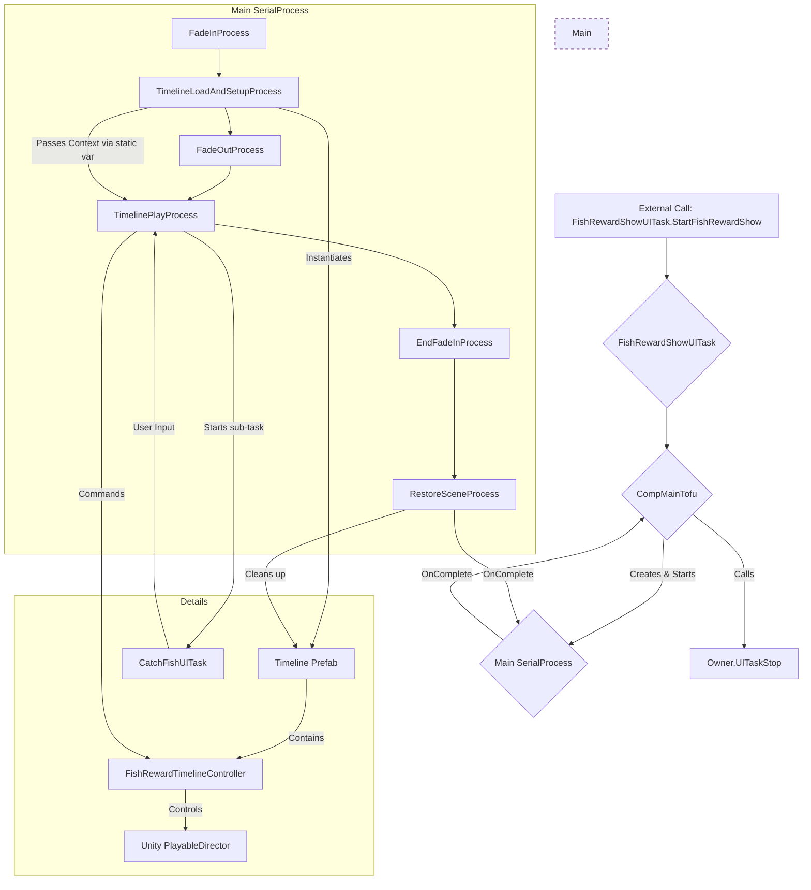

# Project EF - Architecture Analysis Report

**Date:** 2025-07-25
**Author:** Roo, Technical Leader

## 1. Executive Summary

This report provides a comprehensive analysis of the Project EF application architecture. The architecture is built upon a highly structured, custom C# framework (`BJFramework`) that promotes modularity, scalability, and maintainability.

The key characteristic of this architecture is its strict separation of concerns, most notably between the **Game Logic Layer** and the **Game View Layer**. This is achieved through a sophisticated, task-driven, and component-based system. The framework heavily relies on established design patterns like Component, Template Method, and Observer to create a system that is both robust and flexible. The overall design is excellent for a complex interactive application, as it enforces a clean separation of responsibilities, making the codebase easier to understand, extend, and debug.

## 2. Core Architectural Principles

The architecture is founded on a set of well-defined principles that govern the entire application structure:

*   **Layered Architecture:** The application is strictly divided into two primary layers:
    *   **`GameLogic` (Logic Layer):** Contains the "source of truth". It is responsible for all game rules, data state, and business logic. It is completely independent of the presentation and has no knowledge of Unity or how the game is displayed.
    *   **`GameView` (View Layer):** Responsible for all presentation, including rendering 3D scenes and 2D user interfaces. It observes the `GameLogic` layer and updates itself accordingly but does not contain any core game logic.
    *   **Intent System:** Communication from the View to the Logic layer is handled via an `Intent` system, which ensures a decoupled, message-based interaction.

*   **Task-Driven Lifecycle:** The lifecycle of every major feature is encapsulated within a `Task` (`SceneTask` for 3D scenes, `UITask` for UI). These tasks manage their own initialization, updates, and shutdown, providing a standardized entry point for all functionalities.

*   **Component-Based Design:** Functionality is built by composition rather than inheritance. `Task` objects act as containers that are assembled from various single-responsibility `Components` (`SceneTaskComp` or `UITaskCompTofu`). This makes features highly modular and promotes code reuse.

*   **Pipelined Processing:** Complex, multi-step operations (e.g., resource loading, reward sequences) are defined as `UpdatePipelines`. This uses the **Template Method Pattern** to enforce a standardized, sequential process, ensuring that complex operations are predictable and maintainable.

*   **Process Orchestration:** For high-level business logic that spans multiple `UITask`s or `SceneTask`s (like a tutorial or a multi-stage quest), the framework provides `UIProcess` objects to orchestrate the flow.

## 3. Module Breakdown

The project's code is logically organized into directories that reflect the architecture.

*   **`Runtime/GameLogic`**: This module contains the core game simulation. It includes the state and logic for all game entities like `PlayerGameObject`, `FishingLevel`, `FishActor`, etc. It has no dependencies on Unity's rendering or UI engine.

*   **`Runtime/GameView`**: This module is responsible for everything the user sees and interacts with.
    *   **`GameView/Scene`**: Manages the 3D world. The `FishingLevelSceneTask` is the central piece, composed of components that manage the camera (`CompCameraCtrl`), player input (`CompInput`), and the visual representation of game entities (`FishActorCtrlManager`, `FishmanActorCtrlManager`).
    *   **`GameView/UI`**: Manages all 2D interfaces. It is further divided into modules representing a specific feature (e.g., `CatchFish`, `FishRewardShow`, `FishingMap`). The `ProjectEFUITaskRegister` is a critical file that defines all UI tasks and their relationships, enforcing a structured UI management system.

## 4. Key Design Patterns in Practice

The framework's strength lies in its practical and consistent application of several key design patterns:

*   **Component Pattern:** As seen in `FishingLevelUITask`, the task itself is a lightweight container. Its functionality is built by composing components like `FishingLevelUITaskCompMainTofu` and `FishingLevelUITaskCompTackleSwitchTofu`. The task delegates all work to these components.

*   **Template Method Pattern:** `UpdatePipelineBase` defines the skeleton of a complex process. Concrete classes like a hypothetical `FishRewardPipeline` would implement the specific steps, but the overall flow is controlled by the base class, ensuring consistency.

*   **Observer Pattern:** This is the primary mechanism for asynchronous communication. When `FishingLevelUITaskCompMainTofu` starts a sub-task like `LureRigSwitchUITask`, it subscribes to its `EventOnStop`. This allows the main component to react to the completion of the sub-task without being tightly coupled to its implementation.

*   **Facade Pattern:** `UIManager` serves as a facade for the entire UI system. It provides simple methods like `StartUITask` which hide the complexity of task creation, dependency injection, and lifecycle management from the client code.

*   **Strategy Pattern:** The various `UpdatePipeline` implementations can be seen as different strategies for handling different processes. The system can select and execute the appropriate strategy (pipeline) based on the current game context.

## 5. Interaction & Data Flow

The data flow is unidirectional and designed to maintain the strict layer separation.

1.  **User Input:** Input is captured in the `GameView` layer (e.g., by `FishingLevelSceneTaskCompInput`).
2.  **Intent Creation:** The View layer translates this input into a semantic `Intent` (e.g., an intent to "cast the rod").
3.  **Logic Processing:** This `Intent` is sent to the `GameLogic` layer. The logic layer processes the intent, updates its internal state (e.g., changes the state of the `FishmanActor`), and performs any necessary calculations. It does *not* know how this state change will be displayed.
4.  **View Observation:** The `GameView` layer observes the state changes in the `GameLogic` layer (likely via events or a data-binding mechanism).
5.  **View Update:** Upon detecting a state change, the relevant `Controller` in the `GameView` (e.g., `FishmanActorController`) updates the visual representation of the actor to match the new state from the logic layer.

This clean, one-way data flow is crucial for preventing circular dependencies and makes the system's behavior easy to trace and reason about.

## 6. Conclusion & Recommendations

The architecture of Project EF is exceptionally well-designed. It is robust, scalable, and highly maintainable due to its strict adherence to modern software design principles.

**Strengths:**
*   **High Modularity:** The component-based design makes it easy to add or modify features without impacting other parts of the system.
*   **Clear Separation of Concerns:** The logic/view split is a significant advantage for team collaboration and long-term maintenance.
*   **Testability:** The decoupled `GameLogic` layer can be tested independently of the Unity-dependent `GameView`, allowing for robust unit and integration testing.
*   **Scalability:** The Task/Component/Pipeline structure can easily accommodate new gameplay features and complexity.

**Recommendations:**
*   **Maintain Strict Discipline:** The success of this architecture relies on developers continuing to adhere strictly to the established patterns. Any deviation, such as adding logic to the View layer or creating direct dependencies between components, will quickly erode the benefits of the design.
*   **Documentation:** Continue to document new `UIProcess` flows and `UpdatePipeline`s to ensure that the high-level business logic remains understandable as the project grows.
*   **Refine the `Intent` System:** As the number of intents grows, consider creating a more formalized structure or registry for them to ensure they remain manageable.

This architecture provides a solid foundation for building a complex and high-quality game.

---

## 7. Appendix A: Camera System Architecture

The [`CameraController`](Runtime/GameView/Scene/FishingLevelScene/Controllers/CameraController/CameraController.cs) is a sophisticated, self-contained system responsible for all camera behavior in the 3D scene. It is a prime example of applying multiple design patterns to create a flexible, extensible, and powerful system. The architecture is composed of four main pillars: a **Command System**, a **Mode System**, an **Effect System**, and a **Track System**.

```mermaid
graph TD
    subgraph External Systems
        direction TB
        SceneTask[FishingLevelSceneTask]
        Timeline[Unity Timeline]
    end

    subgraph CameraController
        direction LR
        CmdQueue[Command Queue]
        ModeStack[Mode Stack]
        EffectMgr[Effect Manager]
        TrackMgr[Track Manager]
    end

    subgraph "Camera Modes (Strategy/State Pattern)"
        direction TB
        ModeBase[ICameraMode]
        FPSMode[SimpleFPSMode]
        TPSMode[PitchTrackTPSMode]
        CineMode[CineCameraMode]
        
        ModeBase <|-- FPSMode
        ModeBase <|-- TPSMode
        ModeBase <|-- CineMode
    end
    
    subgraph "Camera Effects (Composite/Strategy Pattern)"
        direction TB
        EffectBase[ICameraEffect]
        WalkBob[WalkBobEffect]
        Shake[CameraShakeEffect]
        
        EffectBase <|-- WalkBob
        EffectBase <|-- Shake
    end

    External Systems -- Sends --> CmdQueue
    
    CmdQueue -- Processed by --> CameraController
    CameraController -- Modifies --> ModeStack
    
    ModeStack -- Determines --> ActiveMode[Active ICameraMode]

    ActiveMode -- Uses --> TrackMgr
    ActiveMode -- Calculates --> CoreTransform[Core Position & Rotation]

    EffectMgr -- Manages --> Camera_Effects
    EffectMgr -- Calculates --> EffectOffset[Combined Effect Offset]
    
    CoreTransform -- Is Modified By --> EffectOffset

    EffectOffset --> FinalTransform[Final Camera Transform]
    
    FinalTransform -- Applied to --> UnityCamera[Unity Camera]

    style CameraController fill:#f5f5f5,stroke:#333,stroke-width:2px
    style External Systems fill:#e3f2fd,stroke:#333,stroke-width:1px
```

### 7.1. Command System (Command Pattern)

*   **Purpose:** To decouple the request for a camera action from the execution of that action.
*   **Implementation:**
    *   [`CameraCmd.cs`](Runtime/GameView/Scene/FishingLevelScene/Controllers/CameraController/CameraCmd.cs) defines a base class for all camera commands (e.g., `CameraModeSwitchCmd`, `CameraModePushCmd`, `CustomCameraCmd`).
    *   The [`CameraController`](Runtime/GameView/Scene/FishingLevelScene/Controllers/CameraController/CameraController_Command.cs:435) maintains a queue of these commands (`m_commandQueue`).
    *   In its `LateUpdate`, the controller dequeues and executes a limited number of commands per frame, preventing performance spikes.
*   **Benefits:** This allows any system (UI, game logic via intents, timelines) to request camera changes without needing a direct reference to the camera's internal state. It also ensures that camera state changes happen in a predictable order.

### 7.2. Mode System (State Pattern)

*   **Purpose:** To manage different high-level camera behaviors (e.g., first-person, third-person, cinematic).
*   **Implementation:**
    *   [`ICameraMode.cs`](Runtime/GameView/Scene/FishingLevelScene/Controllers/CameraController/ICameraMode.cs) defines the interface for all camera states, including lifecycle methods (`OnEnter`, `OnExit`, `OnUpdate`) and methods for calculating the camera's position and rotation.
    *   [`CameraModeBase.cs`](Runtime/GameView/Scene/FishingLevelScene/Controllers/CameraController/CameraModeBase.cs) provides a base implementation with common functionality.
    *   The `Modes/` directory contains concrete strategies like `SimpleFPSMode`, `PitchTrackTPSMode`, etc.
    *   The [`CameraController`](Runtime/GameView/Scene/FishingLevelScene/Controllers/CameraController/CameraController_Command.cs) uses a custom priority stack (`CameraModeStack`) to manage active modes. A `Push` command can temporarily override the current mode with a higher-priority one (e.g., a short cinematic cutscene), and a `Pop` command will return to the previous mode.
*   **Benefits:** This pattern cleanly encapsulates the logic for each distinct camera behavior, making it easy to add new camera types or modify existing ones without affecting the `CameraController` itself. The stack allows for complex, layered camera behaviors.

### 7.3. Effect System (Composite/Strategy Pattern)

*   **Purpose:** To apply secondary, procedural animations on top of the base camera mode, such as walk bobbing or screen shake.
*   **Implementation:**
    *   [`ICameraEffect.cs`](Runtime/GameView/Scene/FishingLevelScene/Controllers/CameraController/ICameraEffect.cs) defines the interface for all camera effects. Each effect is responsible for calculating a position, rotation, or FOV offset.
    *   [`CameraEffectManager.cs`](Runtime/GameView/Scene/FishingLevelScene/Controllers/CameraController/CameraEffectManager.cs) acts as a composite. It holds a list of all active `ICameraEffect` instances.
    *   In each frame, the `CameraController` asks the `CameraEffectManager` to update all its effects. The manager then blends their individual offset results into a single final offset based on a configurable blend mode (e.g., Additive, Highest Priority).
*   **Benefits:** This decouples the core camera movement from secondary effects. New effects can be created and added to the manager without any changes to the camera modes or the controller.

### 7.4. Track System

*   **Purpose:** To define and manage complex camera paths that camera modes can utilize.
*   **Implementation:**
    *   [`CameraTrack.cs`](Runtime/GameView/Scene/FishingLevelScene/Controllers/CameraController/CameraTrack.cs) defines a data structure for a single path, consisting of multiple [`CameraTrackPoint`](Runtime/GameView/Scene/FishingLevelScene/Controllers/CameraController/CameraTrackPoint.cs)s. It supports different interpolation methods (Linear, Bezier).
    *   [`CameraTrackManager.cs`](Runtime/GameView/Scene/FishingLevelScene/Controllers/CameraController/CameraTrackManager.cs) is a component that manages a collection of these tracks.
    *   A `CameraMode` (like `PitchTrackFPSMode`) can then query the `CameraTrackManager` to get a position offset based on an input parameter (e.g., the player's pitch angle), effectively making the camera move along the predefined track.
*   **Benefits:** This separates the *data* of a camera path from the *behavior* of a camera mode. It allows designers to create and edit complex camera paths visually without touching code, and allows programmers to create new camera modes that can leverage these paths.

### 7.5. Conclusion on Camera System

The camera system is a micro-architecture unto itself. Its multi-layered, pattern-based design provides an extremely high degree of flexibility and separation of concerns. The final camera transform is a result of a clear and logical pipeline: **Commands modify the Mode stack -> the active Mode determines the base transform (potentially using a Track) -> the Effect Manager calculates and blends procedural offsets -> the two are combined for the final result.** This is an exemplary piece of engineering within the project.

---

## 8. Appendix B: Timeline Playback Architecture

The system for playing back cinematic sequences, exemplified by the `FishRewardShow` feature, is another excellent showcase of the framework's **Process Orchestration** capabilities. Instead of a monolithic block of code, the entire sequence is broken down into a series of discrete, independent, and reusable `UIProcess` steps.



### 8.1. High-Level Flow

The entire playback is managed by the [`FishRewardShowUITaskCompMainTofu`](Runtime/GameView/UI/FishRewardShow/Comp/FishRewardShowUITaskCompMainTofu.cs). When started, it constructs a main **`SerialProcess`**. This parent process contains a chain of child processes, each responsible for one specific step of the sequence. The parent process ensures they execute one after another.

### 8.2. The Process Chain

1.  **FadeInProcess:** A standard `BlackScreenProcess` that fades the screen to black, hiding the setup from the user.
2.  **[`TimelineLoadAndSetupProcess`](Runtime/GameView/UI/FishRewardShow/FishRewardTimeline/TimelineLoadAndSetupProcess.cs):**
    *   Instantiates the Timeline prefab from the loaded resources.
    *   Gets or adds the [`FishRewardTimelineController`](Runtime/GameView/UI/FishRewardShow/FishRewardTimeline/FishRewardTimelineController.cs) component.
    *   Binds the necessary actors (fisherman, fish) to the Timeline tracks.
    *   **Crucially, it stores a reference to the instantiated `FishRewardTimelineController` and the `IFishActor` in a `static` property.** This is the mechanism used to pass context to the subsequent, independent processes.
3.  **FadeOutProcess:** Fades the screen back in to reveal the prepared cinematic scene.
4.  **[`TimelinePlayProcess`](Runtime/GameView/UI/FishRewardShow/FishRewardTimeline/TimelinePlayProcess.cs):**
    *   Retrieves the `FishRewardTimelineController` from the static property.
    *   Subscribes to events on the controller, such as `OnTimelineLoopStarted`.
    *   Calls `Play()` on the controller.
    *   The playback is not linear. The Timeline asset has a `Signal` that, when triggered, calls `OnTimelineLoopStarted` on the controller.
    *   This event is caught by the `TimelinePlayProcess`, which then **pauses the Timeline** and starts a separate `CatchFishUITask` to get user input (e.g., "Keep" or "Release" the fish).
    *   Once the user makes a choice, the `CatchFishUITask`'s callback is fired. The `TimelinePlayProcess` then stops the Timeline playback entirely and marks itself as complete. It does *not* necessarily play the Timeline to the end.
5.  **EndFadeInProcess:** Another fade-to-black to provide a smooth transition out of the cinematic.
6.  **[`RestoreSceneProcess`](Runtime/GameView/UI/FishRewardShow/FishRewardTimeline/RestoreSceneProcess.cs):**
    *   Retrieves the `FishRewardTimelineController` from the static property one last time.
    *   Calls `RestoreSceneState()` on the controller, which is responsible for returning any manipulated objects to their original state.
    *   Destroys the instantiated Timeline GameObject.
    *   **Crucially, it nullifies the `static` reference to the controller**, cleaning up and preventing memory leaks.

### 8.3. Conclusion on Timeline System

This architecture demonstrates a masterful use of the **Chain of Responsibility** and **Command** patterns, implemented through the project's custom `UIProcess` system.

*   **Decoupling:** Each step of the complex process is a self-contained unit. The "Load" process knows nothing about the "Play" process, and the "Play" process knows nothing about the "Restore" process. They are only linked by the parent `SerialProcess` and the `static` context property.
*   **Reusability:** Each process (e.g., `BlackScreenProcess`) is highly reusable in other parts of the application.
*   **Clarity:** The flow is exceptionally clear and easy to follow. A developer can understand the entire sequence simply by reading the `CreateFishRewardTimelineUIProcess` method and seeing the order in which child processes are added. This is far more maintainable than a single, massive function with nested callbacks or a complex state machine.