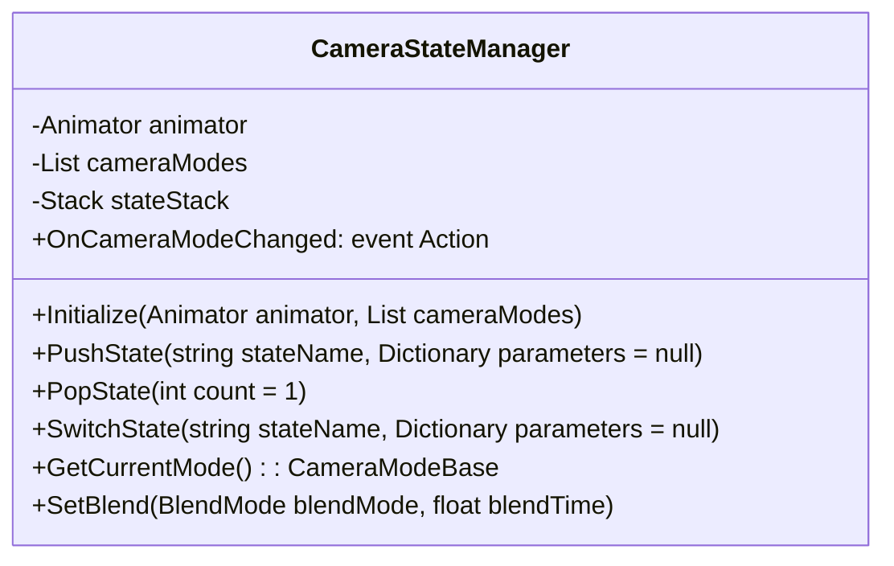
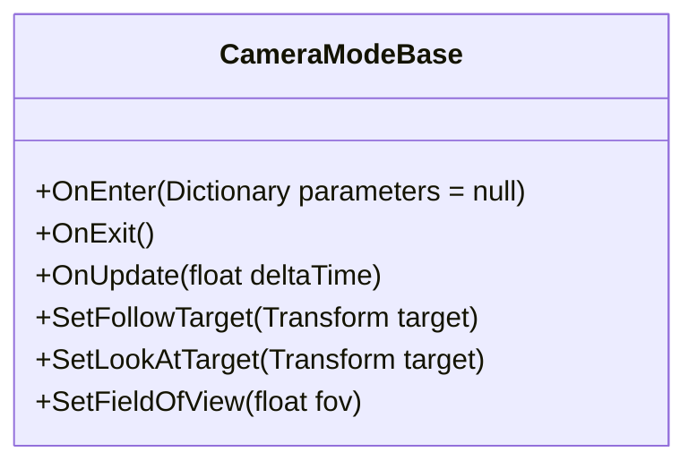
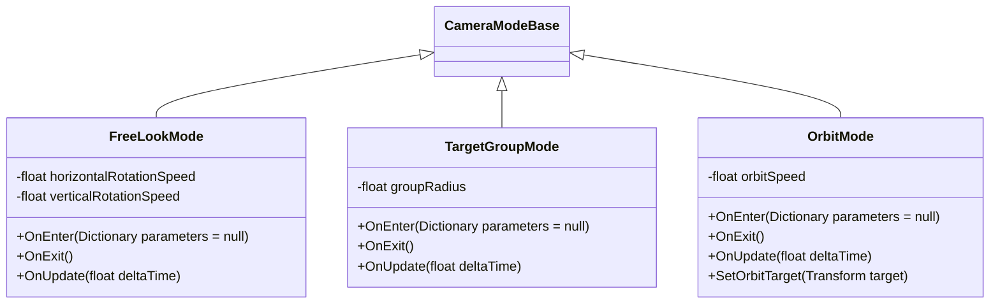
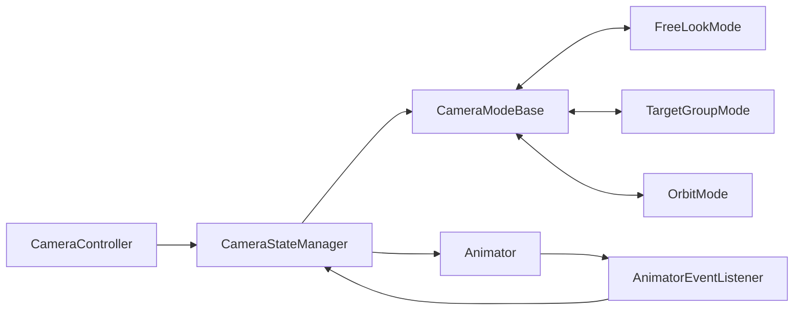

# 基于状态机的相机状态管理方案 (参考 Cinemachine)

**1. 概述**

本方案旨在参考 Cinemachine 的技术细节，结合现有相机架构，实现基于状态机的相机状态管理。通过将相机状态与 Animator Controller 中的动画状态关联，实现相机行为与游戏逻辑的高度解耦，**但不直接使用 Cinemachine 组件**。

**2. 核心概念 (参考 Cinemachine)**

*   **虚拟相机 (Virtual Camera)**:  代表一个相机视角。可以配置各种参数，例如位置、旋转、FOV、跟踪目标、观察目标等。
*   **相机大脑 (Camera Brain)**:  控制场景中所有虚拟相机的切换和混合。负责选择当前激活的虚拟相机，并控制相机之间的过渡效果。
*   **混合 (Blend)**:  虚拟相机之间的过渡效果。可以配置不同的混合模式，例如 Cut, Ease In Out, Linear 等。
*   **状态驱动 (State-Driven)**：根据游戏对象的状态（例如动画状态）自动切换相机。

**3. 功能设计**

*   **状态定义**:
    *   将每个相机状态定义为一个自定义的相机模式类，例如 `FreeLookMode`、`TargetGroupMode`、`OrbitMode` 等。
    *   每个相机模式类负责一种特定的相机行为，并包含相应的参数。
*   **状态管理**:
    *   创建一个相机状态管理器类 (`CameraStateManager`)，负责管理所有相机模式实例，并根据游戏状态选择当前激活的相机模式。
    *   相机状态管理器维护一个状态栈，用于支持相机状态的层级管理和切换。
*   **状态切换**:
    *   使用 `Animator Controller` 控制相机状态的切换。
    *   相机状态管理器监听 `Animator Controller` 的状态变化，并根据状态变化激活不同的相机模式。
    *   可以配置不同的混合模式，实现平滑过渡效果。
*   **参数控制**:
    *   通过代码控制 `Animator Controller` 的状态，从而控制相机状态的切换。
    *   可以通过代码或配置数据控制相机模式的各种参数，例如：
        *   `FollowTarget`:  设置跟踪目标。
        *   `LookAtTarget`:  设置观察目标。
        *   `FieldOfView`:  设置 FOV。
        *   `HorizontalRotationSpeed`: 设置水平旋转速度。
        *   `VerticalRotationSpeed`: 设置垂直旋转速度。

**4. 组件设计**

*   **CameraStateManager**:
    *   **职责**:
        *   管理相机状态和切换逻辑。
        *   监听 `Animator Controller` 的状态变化，并根据状态变化激活不同的相机模式。
        *   维护一个状态栈，用于支持相机状态的层级管理和切换。
        *   提供接口用于外部系统控制相机状态。

    *   **功能**:
        *   `Initialize(Animator animator, List<CameraModeBase> cameraModes)`:  初始化相机状态管理器，设置 `Animator` 和相机模式列表。
        *   `PushState(string stateName, Dictionary<string, object> parameters = null)`:  将指定状态推入栈顶。
        *   `PopStat[CameraFSM.md](../../Doc/CameraFSM.md)e(int count = 1)`:  从栈中弹出指定数量的状态。
        *   `SwitchState(string stateName, Dictionary<string, object> parameters = null)`:  切换到指定状态，清空现有状态栈。
        *   `GetCurrentMode()`:  获取当前激活的相机模式。
        *   `OnAnimatorStateChanged(string stateName)`: 监听 Animator状态变化
        *   `SetBlend(BlendMode blendMode, float blendTime)`：设置混合动画模式和时间

    *   **接口设计**:

```csharp
public class CameraStateManager : MonoBehaviour
{
    public event Action<CameraModeBase> OnCameraModeChanged;

    public void Initialize(Animator animator, List<CameraModeBase> cameraModes);
    public void PushState(string stateName, Dictionary<string, object> parameters = null);
    public void PopState(int count = 1);
    public void SwitchState(string stateName, Dictionary<string, object> parameters = null);
    public CameraModeBase GetCurrentMode();
    public void SetBlend(BlendMode blendMode, float blendTime);
}
```

    *   **UML 图**:



*   **CameraModeBase**:
    *   **职责**:
        *   相机模式基类，定义了相机模式的通用接口和属性。
        *   包含 `OnEnter`、`OnExit`、`OnUpdate` 等方法，用于处理相机模式的生命周期事件。
        *   包含 `FollowTarget`、`LookAtTarget`、`FieldOfView` 等属性，用于控制相机行为.

    *   **功能**:
        *   `OnEnter(Dictionary<string, object> parameters = null)`:  进入相机模式时调用。
        *   `OnExit()`:  退出相机模式时调用。
        *   `OnUpdate(float deltaTime)`:  每帧更新相机模式时调用。
        *   `SetFollowTarget(Transform target)`:  设置跟踪目标。
        *   `SetLookAtTarget(Transform target)`:  设置观察目标。
        *   `SetFieldOfView(float fov)`:  设置 FOV。

    *   **接口设计**:

```csharp
public abstract class CameraModeBase : MonoBehaviour
{
    public abstract void OnEnter(Dictionary<string, object> parameters = null);
    public abstract void OnExit();
    public abstract void OnUpdate(float deltaTime);
    public virtual void SetFollowTarget(Transform target) { }
    public virtual void SetLookAtTarget(Transform target) { }
    public virtual void SetFieldOfView(float fov) { }
}
```

    *   **UML 图**:



*   **FreeLookMode, TargetGroupMode, OrbitMode**
    *   **职责**:
        *   继承自 `CameraModeBase`，实现具体的相机模式。
        *   `FreeLookMode`:  自由观察相机，允许用户自由旋转和缩放相机。
        *   `TargetGroupMode`:  目标群组相机，自动调整视角以包含所有目标。
        *   `OrbitMode`:  环绕观察相机，相机围绕目标旋转.

    *   **功能**:
        *   实现 `OnEnter`、`OnExit`、`OnUpdate` 等方法，控制相机行为。
        *   包含特定的参数，例如旋转速度、缩放范围等。

    *   **UML 图**:


* **AnimatorEventListener**:
    * **职责**:
        * 监听 Animator Controller 的状态变化
        * 通过UnityEvent回调通知 CameraStateManager

    * **功能**:
        * 监听 Animator Controller 的状态变化
        * 获取当前状态名称
        * 调用CameraStateManager的OnAnimatorStateChanged方法

    * **接口设计**:

```csharp
public class AnimatorEventListener : MonoBehaviour
{
    public UnityEvent<string> OnAnimatorStateChangedEvent;
    public void OnAnimatorStateChanged(string stateName);
}
```

**4. 组件关系图**



**5. 总结**

以上是基于状态机的相机状态管理方案的组件详细设计，包括职责、功能、接口设计、UML图和组件关系图.
