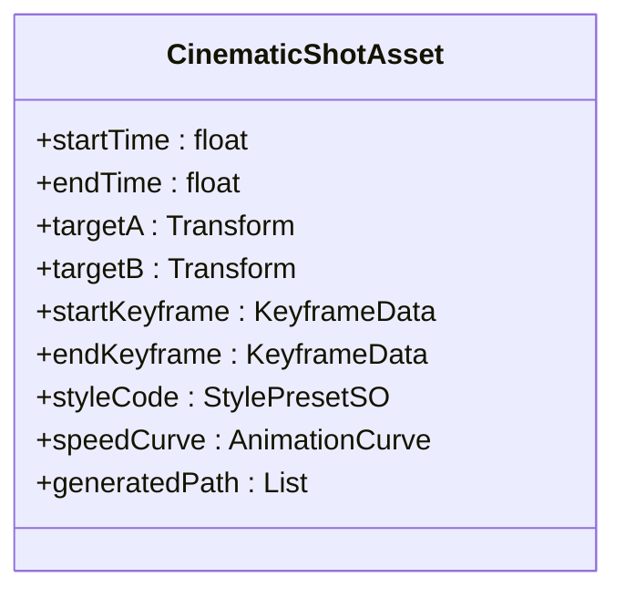
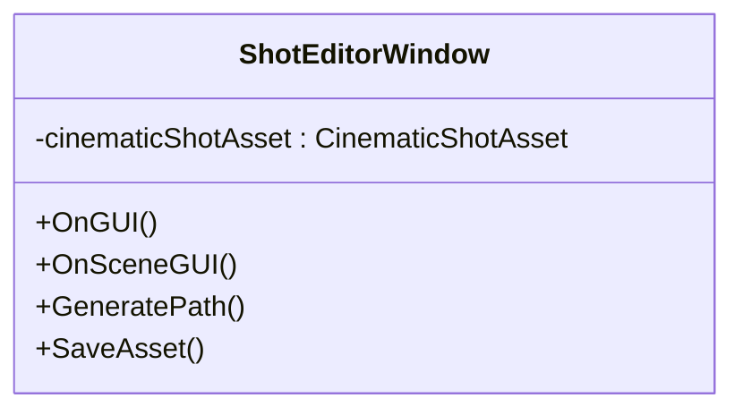

# 风格驱动的电影级相机编辑器 (Style-Driven Cinematic Camera Editor)

**一、项目目标**

设计并实现一个基于 Unity Editor 扩展 的双轨道相机控制系统，该系统融合专业级贝塞尔曲线手动控制和基于 AI 风格学习的智能生成，使用户能够高效、精确地设计电影级相机运镜轨迹。

**二、用户需求 (User Stories)**

| ID    | 需求描述                                                                                                      | 优先级 |
| :---- | :---------------------------------------------------------------------------------------------------------- | :----- |
| UR-101 | 作为艺术家，我希望通过 Timeline 轨道 划分镜头片段，并为每个片段独立设置起始和结束关键帧。                                                              | 🚀 高   |
| UR-102 | 作为艺术家，我希望能够实时在 Scene 视图中拖拽关键帧和贝塞尔切线，并立即看到相机轨迹的变化。                                                              | 🚀 高   |
| UR-103 | 作为艺术家，我希望能够为每个镜头片段选择一种运镜风格（Style Code），并让系统自动生成符合该风格的轨迹。                                                              | 🚀 高   |
| UR-104 | 作为艺术家，我希望能够通过速度曲线 (Animation Curve) 调整相机在轨迹上的运动速度，实现加速和减速的运镜效果。                                                  | 💡 中   |
| UR-105 | 作为技术人员，我希望系统能够将编辑好的相机轨迹数据保存为资产 (Asset)，以便在运行时加载和播放。                                                              | 🚀 高   |
| UR-106 | 作为艺术家，我希望在播放预览时，能双轨道同时看到镜头（相机视角）和目标物体的关键信息，类似于图示中的 Target A 和 Target B。                                    | 🚀 高   |

**三、技术要求**

| ID    | 技术点                                                                                                          | 对应论文参考                                   |
| :---- | :------------------------------------------------------------------------------------------------------------ | :--------------------------------------------- |
| TR-201 | 核心算法必须能够实现基于关键帧和 Style Code 的智能化贝塞尔插值。                                                                | Prediction Network ($f$ 函数)                  |
| TR-202 | 必须集成 Unity Barracuda 库，用于加载和运行 ONNX 格式的 Prediction Model。                                                          | 神经网络运行                                     |
| TR-203 | 关键帧之间的插值需使用连续的距离编码 ($z_{tta}$) 实现平滑过渡。                                                                  | Time-to-Arrival (sin-cos 编码)                   |
| TR-204 | 关键帧编辑时，需提供Toric Space相关的辅助工具，以优化目标追踪和可见性。                                                                  | Toric Space [1]                                |

**四、初步设计方案**

我们将设计一个名为 `CinematicShotAsset` 的 `ScriptableObject` 资产来存储数据，并通过一个名为 `ShotEditorWindow` 的 Unity 扩展窗口来实现编辑功能。

1.  **数据结构设计 (CinematicShotAsset)**

核心资产结构将存储一系列镜头片段（Shots），每个片段包含以下信息：

| 字段名称          | 类型                                                              | 描述                                                                                                           |
| :---------------- | :---------------------------------------------------------------- | :------------------------------------------------------------------------------------------------------------- |
| Start Time / End Time | float                                                             | 镜头片段在总时间轴上的起始和结束时间。                                                                                             |
| Target A / Target B | Transform / GameObject                                              | 镜头目标对象，用于输入到 Prediction 模型。                                                                                             |
| Keyframe Data     | struct KeyframeData                                                   | 起始和结束关键帧的详细信息：位置、旋转、FOV、入/出切线。                                                                                |
| Style Code        | float[] / StylePresetSO                                               | 存储从 Gating Network 提取的运镜风格向量 $z^c$ 或对预设资产的引用。                                                                  |
| Speed Curve       | AnimationCurve                                                        | 控制相机沿着生成轨迹的速度变化曲线（0到1的映射）。                                                                                      |
| Generated Path    | Vector3[] / Quaternion[]                                              | 离线计算后存储的最终相机轨迹点（可选，用于播放）。                                                                                         |

2.  **编辑器界面设计 (ShotEditorWindow)**

界面结构将分为三个主要区域，以匹配您提供的图像和 Timeline 概念。

*   **A. 预览区 (Scene View Extension)**

    *   功能: 实时显示场景、角色和相机运动。
    *   交互:
        *   使用 Gizmos 绘制关键帧节点和贝塞尔曲线。
        *   允许用户在 Scene 视图中直接拖拽关键帧和贝塞尔切线控制柄 (UR-102)。
        *   显示 Toric Space 辅助 Gizmos，例如屏幕中心和目标对象的连线，辅助进行 “运镜” 级别的调整。
*   **B. 时间轴轨道区 (Timeline-Style Panel)**

    *   功能: 组织和管理镜头片段的时间顺序。
    *   轨道设计 (双轨道):
        *   轨道 1：镜头片段轨道 (Shot Segment Track): 承载 CinematicShotAsset 片段。用户可以在此拖拽、调整片段的长度和顺序 (UR-101)。
        *   轨道 2：目标对象轨道 (Target Track): 显示 Target A 和 Target B 的关键事件（如目标切换或特殊动作）。
    *   播放控制: 包含播放/暂停、时间线 Scrubbing（拖动预览）、生成 (Generate) 按钮和保存 (Save) 按钮 (UR-105)。
*   **C. 属性编辑区 (Inspector Panel)**

    *   功能: 针对时间轴上选中的单个镜头片段进行详细参数调整。
    *   主要控件:
        *   目标选择: 字段用于拖拽设置 Target A 和 Target B。
        *   关键帧参数: 详细输入起始和结束关键帧的 Transform 数据。
        *   风格选择: 下拉菜单或按钮，选择预设 Style Code $z^c$ (UR-103)。
        *   速度曲线编辑器: 一个标准的 AnimationCurve 窗口，供用户编辑相机沿路径的速度曲线 (UR-104)。

3.  **工作流程 (Workflow)**

*   **分镜设置**: 艺术家在 时间轴轨道区 上创建新的镜头片段 (Shot Segment) 并调整其长度。
*   **关键帧定义**: 在 属性编辑区 或 Scene View 中设置片段的起始和结束关键帧（位置、旋转、目标）。
*   **智能生成 (AI Assist)**:
    *   用户选择一个 运镜风格 ($z^c$)。
    *   点击 “Generate” 按钮。
    *   Prediction Model (通过 Barracuda) 接收：起始/结束关键帧、目标信息、Style Code $z^c$ 和 $z_{tta}$ 编码，离线计算并生成贝塞尔曲线的控制点和轨迹点。
*   **手动优化 (Artistic Refinement)**:
    *   生成的轨迹和贝塞尔切线显示在 Scene 视图中。
    *   艺术家拖拽贝塞尔切线进行实时调整 (UR-102)。
    *   调整速度曲线来控制节奏 (UR-104)。
*   **预览与保存**:
    *   在时间轴上拖动 Scrubber 或点击 播放 预览效果。
    *   对满意结果点击 “Save”，将最终轨迹数据和设置保存到 CinematicShotAsset 中 (UR-105)。

**五、组件详细设计**

1.  **CinematicShotAsset (ScriptableObject)**

    *   **职责**:  存储镜头片段数据，包括关键帧、目标对象、风格代码、速度曲线和生成的轨迹点。

    *   **数据成员**:

        *   `startTime (float)`: 镜头片段的起始时间。
        *   `endTime (float)`: 镜头片段的结束时间。
        *   `targetA (Transform)`: 目标对象 A。
        *   `targetB (Transform)`: 目标对象 B。
        *   `startKeyframe (KeyframeData)`: 起始关键帧数据。
        *   `endKeyframe (KeyframeData)`: 结束关键帧数据。
        *   `styleCode (StylePresetSO)`: 运镜风格代码。
        *   `speedCurve (AnimationCurve)`: 速度曲线。
        *   `generatedPath (List<Vector3>)`: 生成的轨迹点。

    *   **UML 图**:



2.  **ShotEditorWindow (EditorWindow)**

    *   **职责**:  创建编辑器界面，用于编辑 `CinematicShotAsset` 资源。

    *   **功能**:

        *   显示预览区 (Scene View Extension)。
        *   显示时间轴轨道区。
        *   显示属性编辑区。
        *   处理用户输入和交互。
        *   调用 Prediction Model 生成轨迹。
        *   保存 `CinematicShotAsset` 资源。

    *   **UML 图**:



3.  **KeyframeData (struct)**

    *   **职责**:  存储关键帧数据，包括位置、旋转、FOV 和切线信息。

    *   **数据成员**:

        *   `position (Vector3)`: 关键帧位置。
        *   `rotation (Quaternion)`: 关键帧旋转。
        *   `fov (float)`: 关键帧 FOV。
        *   `inTangent (Vector3)`: 入切线。
        *   `outTangent (Vector3)`: 出切线。

    *   **UML 图**:

```mermaid
classDiagram
    struct KeyframeData {
        +position : Vector3
        +rotation : Quaternion
        +fov : float
        +inTangent : Vector3
        +outTangent : Vector3
    }
```

4.  **StylePresetSO (ScriptableObject)**

    *   **职责**:  存储运镜风格代码。

    *   **数据成员**:

        *   `styleCode (float[])`: 运镜风格代码。

    *   **UML 图**:

```mermaid
classDiagram
    class StylePresetSO {
        +styleCode : float[]
    }