# BJFramework 框架下钓具组装重构方案 (综合版)

## 1. 引言

本报告旨在提出一个全面的重构方案，以解决当前 `TackleStageActorFactory.cs` 存在的“巨石类”风险，并应对日益增长的钓具和角色组装复杂性，特别是支持角色换装和 Actor 之间挂载的需求。本方案将严格遵循 BJFramework 的核心原则和最佳实践，确保系统的高可扩展性、可维护性和可测试性。

## 2. 问题背景与挑战

### 2.1. `TackleStageActorFactory` 的“巨石类”风险

原始的 [`TackleStageActorFactory.cs`](Assets/GameProject/Scripts/Runtime/GameView/UI/StageActorViewUITask/StageActor/TackleStageActorFactory.cs:19) 作为一个静态工厂类，承担了过多的职责，包括钓具各部件的配置读取、资源加载、GameObject 实例化、控制器初始化、导环设置、鱼线渲染模式选择及物理模拟设置等。这种设计导致：

*   **职责过度集中**: 单一类负责所有组装细节。
*   **紧密耦合**: 内部逻辑和外部依赖之间耦合度高。
*   **可维护性差**: 代码量庞大，修改困难，易引入 Bug。
*   **可扩展性受限**: 每次新增部件或逻辑都需修改现有代码，违反“开闭原则”。
*   **可测试性低**: 静态类难以进行单元测试。

### 2.2. 钓组 (BaitGroup) 的复杂性

钓组被定义为具有多种配置方案（路亚、德州、沉底等），由不同数量的饵、钩、铅坠等组件通过子线连接形成的图（Graph）结构。这种复杂性使得传统的一次性组装方式难以应对。

### 2.3. `IStageActor` 的组合与换装需求

`StageActorViewUITask` 是一个通用的 3D Actor 展示 `UITask`。在实际应用中，存在以下复杂场景：

*   **`CharacterStageActor` 自身换装**: 角色不仅由一个基础模型构成，还需要根据配置动态加载和挂载不同的部件（如服装、饰品），这些部件也可能包含自己的挂载点。
*   **`CharacterStageActor` 挂载 `TackleActor`**: 需要将一个**已独立组装完成**的 `TackleActor` (其中包含复杂的 `BaitGroup`) 装配到 `CharacterStageActor` 的特定挂载点上。

这要求 `IStageActor` 接口及其 `Assemble()` 方法能够支持这种多层次、组合式的构建和挂载流程。

## 3. 优化重构目标

*   **解耦职责**: 将钓具、角色部件的组装逻辑与 `IStageActor` 的核心职责分离。
*   **模块化与可扩展性**: 使得新增钓具类型、角色部件或换装逻辑时，无需修改核心组装服务。
*   **提升可测试性**: 方便对各组装模块进行单元测试。
*   **符合 BJFramework 规范**: 充分利用 BJFramework 的 `UITask`、Tofu 组件、`UpdatePipeline` 和依赖注入机制。
*   **支持复杂组合场景**: 能够优雅地处理 `IStageActor` 之间的组合和挂载关系。
*   **数据驱动**: 将配置信息与组装逻辑分离，通过数据配置驱动 Actor 的构建。

## 4. 新的架构模式与 BJFramework 集成方案

本方案将采用 **组合模式 (Composite Pattern)**、**构建器模式 (Builder Pattern)** 和 **依赖注入 (Dependency Injection)** 的思想，并将其深度融入 BJFramework 的 `UITask` 和 Tofu 组件体系。

### 4.1. 核心组件与职责

1.  **`IStageActor` 接口**: 表示舞台上的通用实体。
    *   **职责**: 提供 `ActorId`、根 `GameObject`、`Transform`，支持资源路径收集、GameObject 层次的实例化与配置 (`Assemble`)，放置 (`Place`)，清理 (`Cleanup`)，并暴露可供外部挂载的 `AttachmentPoints`。
    *   **关键点**: `Assemble()` 方法在资源加载完成后，负责实例化其 `GameObject` 层次结构并完成内部组件的配置。
2.  **`TackleStageActor` 类**: `IStageActor` 的具体实现，代表一个钓具实体。
    *   **职责**: 封装钓具的配置 ID，并在 `Assemble()` 方法中，委托给 `TackleAssemblyTofu` 完成实际的 `TackleActorController` (及其 GameObject 层次) 的构建。
3.  **`CharacterStageActor` 类**: `IStageActor` 的具体实现，代表一个角色实体。
    *   **职责**: 封装角色的配置 ID (包含基础模型和换装部件信息)，并在 `Assemble()` 方法中，委托给 `CharacterAssemblyTofu` 完成实际的角色 `GameObject` (包括换装部件) 的构建。
4.  **`TackleAssemblyTofu` (UITaskCompTofuBase)**: 负责钓具（包括复杂钓组）的核心构建逻辑。
    *   **职责**: 协调多个 `ITacklePartAssembler` 和 `IBaitGroupBuilder`，根据钓具配置构建 `TackleActorController` 的 `GameObject` 层次。
    *   **依赖注入**: 接收 `IAssetProvider`、`IConfigDataProvider`、`ITacklePartAssembler` 和 `IBaitGroupBuilder` 列表。
5.  **`CharacterAssemblyTofu` (UITaskCompTofuBase)**: 负责角色（包括基础模型和换装部件）的核心构建逻辑。
    *   **职责**: 协调多个 `ICharacterPartAssembler`，根据角色配置构建角色 `GameObject` 层次（包括挂载换装部件）。
    *   **依赖注入**: 接收 `IAssetProvider`、`IConfigDataProvider`、`ICharacterPartAssembler` 列表。
6.  **`AttachmentServiceTofu` (UITaskCompTofuBase)**: 负责 Actor 之间的通用挂载逻辑。
    *   **职责**: 提供 `AttachActor()` 和 `DetachActor()` 方法，将一个 `IStageActor` 实例挂载到另一个 `IStageActor` 实例的指定挂载点上。
7.  **`IAssetProvider` / `IConfigDataProvider` 接口**: 抽象资源加载和配置数据访问。
8.  **`ITacklePartAssembler` / `IBaitGroupBuilder` 接口**: 钓具部件/钓组的细粒度构建器接口。
9.  **`ICharacterPartAssembler` 接口**: 角色部件（如身体、服装）的细粒度构建器接口。
10. **`StageActorViewUITaskCompMainTofu` (UITaskCompTofuBase)**: `StageActorViewUITask` 的主 Tofu。
    *   **职责**: 作为协调者，负责创建 `IStageActor` 的逻辑实例，并在 `UpdatePipeline` 的 `ViewUpdate` 阶段协调这些 `IStageActor` 的 `Assemble()` 调用，以及利用 `AttachmentServiceTofu` 进行挂载。

### 4.2. BJFramework 流程集成

整个流程将通过 BJFramework 的 `UIIntent` 和 `UpdatePipeline` 机制驱动：

1.  **启动 `UITask`**: 主界面业务 `UITask` (如背包界面) 通过 `UIManager.StartUITask()` 启动 `StageActorViewUITask`，并通过 `UIIntent` 传递所有必要的配置信息，包括：
    *   主 Actor 的 ID (`mainActorId`) 和其配置 ID (`characterConfigId`，用于换装角色，包含基础模型和所有换装部件信息)。
    *   要挂载的子 Actor 的配置 ID (`tackleConfigID`，用于钓具)。
    *   子 Actor 的挂载点名称 (`attachmentPointName`)。
    *   场景预设 (`scenePreset`)。
2.  **`StageActorViewUITask.UpdateContextSetup()`**:
    *   `StageActorViewUITaskCompMainTofu` 从 `UIIntent` 中解析这些参数。
    *   根据参数创建 `CharacterStageActor` 和 `TackleStageActor` 的**逻辑实例**（此时仅为数据对象，尚未实例化 `GameObject`），并传入各自的 `AssemblyTofu` 引用。
3.  **`DynamicResCollect4Load()`**:
    *   `StageActorViewUITaskCompMainTofu` 调用 `m_mainStageActor.CollectResourcePaths()` 和 `m_attachedStageActor.CollectResourcePaths()`。
    *   `CharacterStageActor.CollectResourcePaths()` 委托给 `CharacterAssemblyTofu` 收集角色所有部件的资源路径。
    *   `TackleStageActor.CollectResourcePaths()` 委托给 `TackleAssemblyTofu` 收集钓具所有部件的资源路径。
    *   所有资源路径被添加到 `UITask` 的 `resPathList` 中，由 `UITaskCompDynamicResourceCacheManager` 统一管理加载。
4.  **`ResourceLoad()`**: `UpdatePipeline` 异步加载所有收集到的资源。
5.  **`ViewUpdate()`**:
    *   `StageActorViewUITaskCompMainTofu` 获取已加载的资源字典、`IAssetProvider` 和 `IConfigDataProvider`。
    *   **调用 `m_mainStageActor.Assemble(...)`**: 触发 `CharacterStageActor` 内部的 `Assemble()` 方法，该方法会调用 `CharacterAssemblyTofu` 构建角色 `GameObject` 层次。
    *   **调用 `m_attachedStageActor.Assemble(...)`**: 如果存在挂载 Actor，触发 `TackleStageActor` 内部的 `Assemble()` 方法，该方法会调用 `TackleAssemblyTofu` 构建钓具 `GameObject` 层次。
    *   **展示主 Actor**: `m_mainUICtrl.StageActorDisplay(m_mainStageActor)` 将主 Actor 的 `GameObject` 注入舞台。
    *   **挂载子 Actor**: `m_attachmentServiceTofu.AttachActor(m_mainStageActor, m_attachedStageActor, attachmentPointName)` 将已组装好的子 Actor 挂载到主 Actor 的指定挂载点。

## 5. 详细组件设计与代码结构

### 5.1. `IAssetProvider` / `IConfigDataProvider` 接口与实现

为了抽象资源加载和配置数据访问，我们定义以下接口和默认实现。这些组件应该在 BJFramework 的启动阶段被实例化，并通过依赖注入提供给需要它们的 Tofu 组件。

```csharp
// Assets/GameProject/Scripts/Runtime/Common/IAssetProvider.cs
using System.Collections.Generic;
using UnityEngine;

public interface IAssetProvider
{
    T LoadAsset<T>(string path) where T : Object;
    GameObject InstantiatePrefab(string path);
    GameObject InstantiatePrefab(GameObject prefab);
}

// Assets/GameProject/Scripts/Runtime/Common/DefaultAssetProvider.cs
using System.Collections.Generic;
using UnityEngine;

public class DefaultAssetProvider : IAssetProvider
{
    private readonly IReadOnlyDictionary<string, Object> m_loadedResources;

    public DefaultAssetProvider(IReadOnlyDictionary<string, Object> loadedResources)
    {
        m_loadedResources = loadedResources;
    }

    public T LoadAsset<T>(string path) where T : Object
    {
        if (m_loadedResources.TryGetValue(path, out var asset) && asset is T typedAsset)
        {
            return typedAsset;
        }
        Debug.LogError($"AssetProvider: Failed to load asset of type {typeof(T).Name} from path: {path}");
        return null;
    }

    public GameObject InstantiatePrefab(string path)
    {
        var prefab = LoadAsset<GameObject>(path);
        if (prefab != null)
        {
            return Object.Instantiate(prefab);
        }
        return null;
    }

    public GameObject InstantiatePrefab(GameObject prefab)
    {
        if (prefab != null)
        {
            return Object.Instantiate(prefab);
        }
        Debug.LogError("AssetProvider: Cannot instantiate null prefab.");
        return null;
    }
}

// Assets/GameProject/Scripts/Runtime/Common/IConfigDataProvider.cs
public interface IConfigDataProvider
{
    ConfigDataRodInfo GetConfigDataRodInfo(int id);
    ConfigDataReelInfo GetConfigDataReelInfo(int id);
    ConfigDataLineInfo GetConfigDataLineInfo(int id);
    ConfigDataLureRigInfo GetConfigDataLureRigInfo(int id);
    CharacterConfig GetCharacterConfig(string id); // 假设新增方法
    EquipmentConfig GetEquipmentConfig(string id); // 假设新增方法
    // ... 其他配置数据获取方法
}

// Assets/GameProject/Scripts/Runtime/Common/DefaultConfigDataProvider.cs
public class DefaultConfigDataProvider : IConfigDataProvider
{
    private readonly IConfigDataLoader m_configDataLoader;

    public DefaultConfigDataProvider(IConfigDataLoader configDataLoader)
    {
        m_configDataLoader = configDataLoader;
    }

    public ConfigDataRodInfo GetConfigDataRodInfo(int id) => m_configDataLoader.GetConfigDataRodInfo(id);
    public ConfigDataReelInfo GetConfigDataReelInfo(int id) => m_configDataLoader.GetConfigDataReelInfo(id);
    public ConfigDataLineInfo GetConfigDataLineInfo(int id) => m_configDataLoader.GetConfigDataLineInfo(id);
    public ConfigDataLureRigInfo GetConfigDataLureRigInfo(int id) => m_configDataLoader.GetConfigDataLureRigInfo(id);
    
    // 假设这些方法在 IConfigDataLoader 中有对应实现
    public CharacterConfig GetCharacterConfig(string id) { /* 实现 */ return null; }
    public EquipmentConfig GetEquipmentConfig(string id) { /* 实现 */ return null; }
}
```

### 5.2. `IStageActor` 接口定义

`IStageActor` 是一个通用接口，代表任何可以在 `StageActorViewUITask` 中展示的实体。

```csharp
// Assets/GameProject/Scripts/Runtime/StageActor/IStageActor.cs
using System.Collections.Generic;
using UnityEngine;

public interface IStageActor
{
    string ActorId { get; }
    GameObject GameObject { get; } // 舞台Actor的根GameObject
    Transform RootTransform { get; } // GameObject的Transform

    // 收集自身所需的资源路径，用于预加载
    void CollectResourcePaths(List<string> resPathList);

    // 组装方法：在资源加载完成后，负责实例化GameObject并进行内部配置
    // 此时传入 loadedResources 和必要的服务
    void Assemble(IReadOnlyDictionary<string, Object> loadedResources, IAssetProvider assetProvider, IConfigDataProvider configDataProvider);

    // 将Actor放置到指定父级Transform下，并进行必要的变换设置
    void Place(Transform parentTransform);

    // 清理Actor资源和状态
    void Cleanup();

    // 暴露Actor内部的挂载点
    IReadOnlyDictionary<string, Transform> GetAttachmentPoints();
}
```

### 5.3. `TackleStageActor` 实现方案

`TackleStageActor` 是 `IStageActor` 的一个具体实现，它会包装一个由 `TackleActorController` 管理的钓具 GameObject。

```csharp
// Assets/GameProject/Scripts/Runtime/StageActor/TackleStageActor.cs
using System.Collections.Generic;
using UnityEngine;

public class TackleStageActor : IStageActor
{
    private string _actorId;
    private GameObject _rootGameObject;
    private TackleActorController _tackleController;
    private int _rodConfigId;
    private int _reelConfigId;
    private int _lineConfigId;
    private int _baitGroupConfigId;
    private TackleAssembleUISettingsSO _settings;

    // 引用 TackleAssemblyTofu，通过构造函数注入
    private TackleAssemblyTofu _tackleAssemblyTofu; 

    public string ActorId => _actorId;
    public GameObject GameObject => _rootGameObject;
    public Transform RootTransform => _rootGameObject?.transform;

    public TackleStageActor(string actorId, int rodId, int reelId, int lineId, int BaitGroupId, TackleAssembleUISettingsSO settings, TackleAssemblyTofu tackleAssemblyTofu)
    {
        _actorId = actorId;
        _rodConfigId = rodId;
        _reelConfigId = reelId;
        _lineConfigId = lineId;
        _baitGroupConfigId = BaitGroupId;
        _settings = settings;
        _tackleAssemblyTofu = tackleAssemblyTofu;
    }

    public void CollectResourcePaths(List<string> resPathList)
    {
        _tackleAssemblyTofu.CollectResourcePaths(resPathList, _rodConfigId, _reelConfigId, _lineConfigId, _baitGroupConfigId);
    }

    public void Assemble(IReadOnlyDictionary<string, Object> loadedResources, IAssetProvider assetProvider, IConfigDataProvider configDataProvider)
    {
        if (_rootGameObject != null)
        {
            Debug.LogWarning($"TackleStageActor: Actor '{ActorId}' already assembled. Skipping re-assembly.");
            return;
        }
        _tackleController = _tackleAssemblyTofu.AssembleTackleControllerInternal(
            _rodConfigId, _reelConfigId, _lineConfigId, _baitGroupConfigId, _settings,
            loadedResources, assetProvider, configDataProvider);

        if (_tackleController != null)
        {
            _rootGameObject = _tackleController.gameObject;
            _rootGameObject.name = $"TackleActor_{ActorId}";
        }
        else
        {
            Debug.LogError($"TackleStageActor: Failed to assemble TackleActorController for '{ActorId}'.");
        }
    }

    public void Place(Transform parentTransform)
    {
        if (_rootGameObject != null)
        {
            _rootGameObject.transform.SetParent(parentTransform);
            _rootGameObject.transform.localPosition = Vector3.zero;
            _rootGameObject.transform.localRotation = Quaternion.identity;
            _rootGameObject.transform.localScale = Vector3.one;
        }
    }

    public void Cleanup()
    {
        if (_rootGameObject != null)
        {
            UnityEngine.Object.Destroy(_rootGameObject);
            _rootGameObject = null;
            _tackleController = null;
        }
    }

    public IReadOnlyDictionary<string, Transform> GetAttachmentPoints()
    {
        // 返回钓具内部可能存在的挂载点，例如鱼线末端、特定装饰品槽位等
        // 这里可以根据 _tackleController 的内部结构来查找并返回
        return new Dictionary<string, Transform>();
    }
}
```

### 5.4. `CharacterStageActor` 实现方案 (支持换装)

`CharacterStageActor` 将包含其内部配置信息（例如基础模型 ID 和换装部件 ID 列表），并在 `Assemble()` 方法中委托给一个专门的 `CharacterAssemblyTofu` 来完成实际的 `GameObject` 构造和换装部件挂载。

```csharp
// Assets/GameProject/Scripts/Runtime/StageActor/CharacterStageActor.cs
using System.Collections.Generic;
using UnityEngine;

public class CharacterStageActor : IStageActor
{
    private string _actorId;
    private GameObject _rootGameObject;
    private Dictionary<string, Transform> _attachmentPoints = new Dictionary<string, Transform>();
    
    private string _characterConfigId; 

    // 引用 CharacterAssemblyTofu，通过构造函数注入
    private CharacterAssemblyTofu _characterAssemblyTofu;

    public string ActorId => _actorId;
    public GameObject GameObject => _rootGameObject;
    public Transform RootTransform => _rootGameObject?.transform;

    public CharacterStageActor(string actorId, string characterConfigId, CharacterAssemblyTofu characterAssemblyTofu)
    {
        _actorId = actorId;
        _characterConfigId = characterConfigId;
        _characterAssemblyTofu = characterAssemblyTofu;
    }

    public void CollectResourcePaths(List<string> resPathList)
    {
        _characterAssemblyTofu.CollectResourcePaths(resPathList, _characterConfigId);
    }

    public void Assemble(IReadOnlyDictionary<string, Object> loadedResources, IAssetProvider assetProvider, IConfigDataProvider configDataProvider)
    {
        if (_rootGameObject != null)
        {
            Debug.LogWarning($"CharacterStageActor: Actor '{ActorId}' already assembled. Skipping re-assembly.");
            return;
        }

        _rootGameObject = _characterAssemblyTofu.AssembleCharacterInternal(
            _characterConfigId, loadedResources, assetProvider, configDataProvider);

        if (_rootGameObject != null)
        {
            _rootGameObject.name = $"CharacterActor_{ActorId}";
            FindAttachmentPointsRecursive(_rootGameObject.transform);
        }
        else
        {
            Debug.LogError($"CharacterStageActor: Failed to assemble CharacterActor for '{ActorId}'.");
        }
    }
    
    private void FindAttachmentPointsRecursive(Transform parent)
    {
        // 示例：查找名称包含"Mount"的子Transform作为挂载点
        if (parent.name.Contains("Mount")) 
        {
            _attachmentPoints[parent.name] = parent;
        }
        foreach (Transform child in parent)
        {
            FindAttachmentPointsRecursive(child);
        }
    }

    public void Place(Transform parentTransform)
    {
        if (_rootGameObject != null)
        {
            _rootGameObject.transform.SetParent(parentTransform);
            _rootGameObject.transform.localPosition = Vector3.zero;
            _rootGameObject.transform.localRotation = Quaternion.identity;
            _rootGameObject.transform.localScale = Vector3.one;
        }
    }

    public void Cleanup()
    {
        if (_rootGameObject != null)
        {
            UnityEngine.Object.Destroy(_rootGameObject);
            _rootGameObject = null;
            _attachmentPoints.Clear();
        }
    }

    public IReadOnlyDictionary<string, Transform> GetAttachmentPoints()
    {
        return _attachmentPoints;
    }
}
```

### 5.5. 钓组 (BaitGroup) 架构方案

钓组的组装是钓具中最为复杂的环节，涉及到多个组件（饵、钩、铅坠等）通过子线连接成图结构。本方案引入 `BaitGroupConfig` (ScriptableObject) 来定义结构，`BaitGroupGraph` 作为运行时表示，以及 `IBaitGroupBuilder` 接口来处理不同类型钓组的构建逻辑。

#### 5.5.1. `BaitGroupConfig` (ScriptableObject)

`BaitGroupConfig` 用于定义不同类型的钓组配置，允许设计师在 Unity 编辑器中创建和管理复杂的钓组结构。它包含了钓组的名称、类型，以及构成钓组的节点（组件）和边（子线）的配置信息。

```csharp
// Assets/GameProject/Scripts/ScriptableObjects/BaitGroupConfig.cs
using System.Collections.Generic;
using UnityEngine;

[CreateAssetMenu(fileName = "NewBaitGroupConfig", menuName = "Fishing/Bait Group Config")]
public class BaitGroupConfig : ScriptableObject
{
    public string BaitGroupName;
    public BaitGroupType BaitGroupType; // 例如：Lure, Texas, Bottom

    // 钓组中的节点（组件：饵、钩、铅坠、连接点等）
    public List<BaitGroupNodeConfig> Nodes = new List<BaitGroupNodeConfig>();
    // 钓组中的边（子线连接）
    public List<BaitGroupEdgeConfig> Edges = new List<BaitGroupEdgeConfig>();
}

[System.Serializable]
public class BaitGroupNodeConfig
{
    public string NodeId; // 唯一标识符
    public BaitGroupNodeType NodeType; // 饵、钩、铅坠、连接环等
    public string PrefabAssetPath; // 组件Prefab路径
    public Vector3 LocalPositionOffset; // 相对于父节点的本地位置偏移
    public Vector3 LocalRotationOffset; // 相对于父节点的本地旋转偏移
    public float Weight; // 物理模拟用
    // ... 其他组件特定属性
}

public enum BaitGroupNodeType
{
    Bait,
    Hook,
    Sinker,
    Swivel, // 连接环
    LineAttachmentPoint, // 钓组内部的纯连接点
    MainLineConnectionPoint // 主线连接到钓组的入口点
}

[System.Serializable]
public class BaitGroupEdgeConfig
{
    public string EdgeId; // 唯一标识符
    public string StartNodeId; // 子线起始节点ID
    public string EndNodeId; // 子线结束节点ID
    public float LineLength; // 子线长度
    public float LineRadius; // 子线半径
    public string LineMaterialPath; // 子线材质路径
    // ... 其他子线特定属性
}

public enum BaitGroupType
{
    Lure,
    Texas,
    Bottom,
    // ... 更多钓组类型
}
```

#### 5.5.2. `BaitGroupGraph` (运行时数据结构)

`BaitGroupGraph` 表示已构建的钓组的运行时图结构，持有所有实例化组件的引用及其连接关系。它提供了对钓组内部节点和边的访问，以及获取主线连接点的方法。

```csharp
// Assets/GameProject/Scripts/Runtime/Tackle/BaitGroupGraph.cs
using System.Collections.Generic;
using System.Linq;
using UnityEngine;

public class BaitGroupGraph
{
    public Dictionary<string, BaitGroupNode> Nodes { get; private set; } = new Dictionary<string, BaitGroupNode>();
    public List<BaitGroupEdge> Edges { get; private set; } = new List<BaitGroupEdge>();

    // 获取主线连接点 (如果有)
    public BaitGroupNode GetMainLineConnectionNode()
    {
        return Nodes.Values.FirstOrDefault(node => node.Config.NodeType == BaitGroupNodeType.MainLineConnectionPoint);
    }
}

public class BaitGroupNode
{
    public BaitGroupNodeConfig Config { get; private set; }
    public GameObject GameObject { get; private set; }
    public Transform Transform { get; private set; }

    public BaitGroupNode(BaitGroupNodeConfig config, GameObject gameObject)
    {
        Config = config;
        GameObject = gameObject;
        Transform = gameObject.transform;
    }
}

public class BaitGroupEdge
{
    public BaitGroupEdgeConfig Config { get; private set; }
    public BaitGroupNode StartNode { get; private set; }
    public BaitGroupNode EndNode { get; private set; }
    public LineRenderer LineRenderer { get; private set; } // 或 UILinePhysicsSimulator

    public BaitGroupEdge(BaitGroupEdgeConfig config, BaitGroupNode startNode, BaitGroupNode endNode)
    {
        Config = config;
        StartNode = startNode;
        EndNode = endNode;
    }

    public void SetLineRenderer(LineRenderer lr)
    {
        LineRenderer = lr;
    }
}
```

#### 5.5.3. `IBaitGroupBuilder` 接口与实现

`IBaitGroupBuilder` 接口定义了构建特定类型钓组的通用行为。每个具体的钓组构建器将负责解析其对应 `BaitGroupConfig` 的图结构，并实例化组件、创建子线连接。

```csharp
// Assets/GameProject/Scripts/Runtime/Tackle/IBaitGroupBuilder.cs
using System.Collections.Generic;
using UnityEngine; // For GameObject

public interface IBaitGroupBuilder
{
    BaitGroupType SupportedBaitGroupType { get; }
    BaitGroupGraph Build(BaitGroupConfig config, IReadOnlyDictionary<string, Object> loadedResources, IAssetProvider assetProvider);
    List<string> CollectRequiredResources(BaitGroupConfig config); // 用于预加载
}

// Assets/GameProject/Scripts/Runtime/Tackle/Builders/LureRigBuilder.cs
public class LureRigBuilder : IBaitGroupBuilder
{
    public BaitGroupType SupportedBaitGroupType => BaitGroupType.Lure;

    public BaitGroupGraph Build(BaitGroupConfig config, IReadOnlyDictionary<string, Object> loadedResources, IAssetProvider assetProvider)
    {
        if (config.BaitGroupType != SupportedBaitGroupType)
        {
            Debug.LogError($"LureRigBuilder: Mismatched rig type. Expected {SupportedBaitGroupType}, got {config.BaitGroupType}");
            return null;
        }

        var graph = new BaitGroupGraph();
        var instantiatedNodes = new Dictionary<string, BaitGroupNode>();

        // 1. 实例化所有节点（饵、钩、铅坠等）
        foreach (var nodeConfig in config.Nodes)
        {
            GameObject nodeGameObject = assetProvider.InstantiatePrefab(nodeConfig.PrefabAssetPath);
            if (nodeGameObject == null)
            {
                Debug.LogError($"LureRigBuilder: Failed to instantiate node prefab: {nodeConfig.PrefabAssetPath}");
                return null; // 或抛出异常
            }
            // 设置初始位置和旋转 (相对于钓组根节点)
            nodeGameObject.transform.localPosition = nodeConfig.LocalPositionOffset;
            nodeGameObject.transform.localRotation = Quaternion.Euler(nodeConfig.LocalRotationOffset);

            var node = new BaitGroupNode(nodeConfig, nodeGameObject);
            graph.Nodes.Add(nodeConfig.NodeId, node);
            instantiatedNodes.Add(nodeConfig.NodeId, node);
        }

        // 2. 创建所有边（子线）
        foreach (var edgeConfig in config.Edges)
        {
            if (!instantiatedNodes.TryGetValue(edgeConfig.StartNodeId, out var startNode) ||
                !instantiatedNodes.TryGetValue(edgeConfig.EndNodeId, out var endNode))
            {
                Debug.LogError($"LureRigBuilder: Missing start or end node for edge: {edgeConfig.EdgeId}");
                continue;
            }

            // 创建子线 GameObject 和 LineRenderer
            GameObject subLineObject = new GameObject($"SubLine_{edgeConfig.EdgeId}");
            subLineObject.transform.SetParent(startNode.Transform); // 子线可以挂载到起始节点
            LineRenderer lr = subLineObject.AddComponent<LineRenderer>();
            // 配置 LineRenderer 属性 (材质、颜色、宽度等)
            lr.material = assetProvider.LoadAsset<Material>(edgeConfig.LineMaterialPath);
            lr.startColor = Color.gray; // 示例
            lr.endColor = Color.gray; // 示例
            lr.startWidth = edgeConfig.LineRadius * 2;
            lr.endWidth = edgeConfig.LineRadius * 2;
            lr.positionCount = 2;
            lr.useWorldSpace = false; // 使用本地坐标

            // 设置子线两端点 (需要根据实际连接逻辑来确定，这里简化为直接连接两个节点的世界坐标)
            lr.SetPosition(0, startNode.Transform.InverseTransformPoint(startNode.Transform.position));
            lr.SetPosition(1, startNode.Transform.InverseTransformPoint(endNode.Transform.position));


            var edge = new BaitGroupEdge(edgeConfig, startNode, endNode);
            edge.SetLineRenderer(lr); // 存储LineRenderer引用
            graph.Edges.Add(edge);
        }
        
        return graph;
    }

    public List<string> CollectRequiredResources(BaitGroupConfig config)
    {
        var paths = new List<string>();
        foreach (var nodeConfig in config.Nodes)
        {
            if (!string.IsNullOrEmpty(nodeConfig.PrefabAssetPath))
            {
                paths.Add(nodeConfig.PrefabAssetPath);
            }
        }
        foreach (var edgeConfig in config.Edges)
        {
            if (!string.IsNullOrEmpty(edgeConfig.LineMaterialPath))
            {
                paths.Add(edgeConfig.LineMaterialPath);
            }
        }
        return paths;
    }
}

// 更多 BaitGroupBuilder 实现 (TexasRigBuilder, BottomRigBuilder 等)
// 这些构建器将实现 IBaitGroupBuilder 接口，并根据各自的 BaitGroupType 提供特定的构建逻辑。
```

### 5.6. `TackleAssemblyTofu` 实现方案

`TackleAssemblyTofu` 作为一个 `UITaskCompTofuBase`，封装了钓具的核心构建逻辑。它协调多个 `ITacklePartAssembler` 和 `IBaitGroupBuilder` 来构建 `TackleActorController` 的 `GameObject` 层次。

```csharp
// Assets/GameProject/Scripts/Runtime/Tackle/TackleAssemblyTofu.cs
using System.Collections.Generic;
using System.Linq;
using UnityEngine;
using BlackJack.BJFramework.Runtime.UI;

public class TackleAssemblyTofu : UITaskCompTofuBase
{
    private readonly IAssetProvider _assetProvider;
    private readonly IConfigDataProvider _configDataProvider;
    private readonly IEnumerable<ITacklePartAssembler> _tacklePartAssemblers; // 钓竿、渔轮、钓线等部件组装器
    private readonly IEnumerable<IBaitGroupBuilder> _BaitGroupBuilders; // 钓组构建器

    public TackleAssemblyTofu(IUITaskCompOwnerBase owner, 
        IAssetProvider assetProvider, IConfigDataProvider configDataProvider,
        IEnumerable<ITacklePartAssembler> tacklePartAssemblers, IEnumerable<IBaitGroupBuilder> BaitGroupBuilders) : base(owner)
    {
        _assetProvider = assetProvider;
        _configDataProvider = configDataProvider;
        _tacklePartAssemblers = tacklePartAssemblers;
        _BaitGroupBuilders = BaitGroupBuilders;
    }

    // 供 TackleStageActor.Assemble() 调用的核心组装逻辑
    public TackleActorController AssembleTackleControllerInternal(
        int rodId, int reelId, int lineId, int BaitGroupId, TackleAssembleUISettingsSO settings,
        IReadOnlyDictionary<string, Object> loadedResources, IAssetProvider assetProviderForAssemble, IConfigDataProvider configDataProviderForAssemble)
    {
        // 优先使用传递进来的 assetProviderForAssemble 和 configDataProviderForAssemble
        // 如果没有传入，则使用 Tofu 自身注入的
        IAssetProvider currentAssetProvider = assetProviderForAssemble ?? _assetProvider;
        IConfigDataProvider currentConfigDataProvider = configDataProviderForAssemble ?? _configDataProvider;

        TackleActorController tackleActorController = new GameObject($"TackleActorController_Dynamic").AddComponent<TackleActorController>();
        tackleActorController.Init(); // 初始化控制器

        // 创建钓具组装上下文
        var context = new TackleAssemblyContext(rodId, reelId, lineId, BaitGroupId, settings, currentAssetProvider, currentConfigDataProvider);
        
        // 依次调用各个部件组装器
        foreach (var assembler in _tacklePartAssemblers)
        {
            assembler.Assemble(tackleActorController, context);
        }

        // 钓组的特殊处理：需要先获取 BaitGroupConfig，然后通过对应的 Builder 构建
        var BaitGroupConf = currentConfigDataProvider.GetConfigDataLureRigInfo(BaitGroupId);
        if (BaitGroupConf != null)
        {
            BaitGroupConfig actualBaitGroupConfig = currentAssetProvider.LoadAsset<BaitGroupConfig>(BaitGroupConf.BaitGroupConfigAssetPath);
            if (actualBaitGroupConfig != null)
            {
                IBaitGroupBuilder builder = _BaitGroupBuilders.FirstOrDefault(b => b.SupportedBaitGroupType == actualBaitGroupConfig.BaitGroupType);
                if (builder != null)
                {
                    BaitGroupGraph BaitGroupGraph = builder.Build(actualBaitGroupConfig, loadedResources, currentAssetProvider);
                    if (BaitGroupGraph != null)
                    {
                        // 将钓组的节点GameObject挂载到TackleActorController下
                        foreach (var node in BaitGroupGraph.Nodes.Values)
                        {
                            node.GameObject.transform.SetParent(tackleActorController.GetComponent<TackleActorControllerDesc>().m_lineTransformRoot); // 假设有LineTransformRoot
                        }
                        // 存储 BaitGroupGraph 到 TackleActorController 或 Context
                        // tackleActorController.SetBaitGroupGraph(BaitGroupGraph);
                    }
                }
            }
        }

        return tackleActorController;
    }
    
    // CollectResourcePaths 方法
    public List<string> CollectResourcePaths(List<string> resPathList, int rodId, int reelId, int lineId, int BaitGroupId)
    {
        // 收集钓竿、渔轮、钓线的基础资源
        // 这里应根据 rodId, reelId, lineId 从配置中获取对应的 Prefab 路径并添加到 resPathList
        // 示例：
        var rodConf = _configDataProvider.GetConfigDataRodInfo(rodId);
        if (rodConf != null && !string.IsNullOrEmpty(rodConf.PrefabAssetPath)) resPathList.Add(rodConf.PrefabAssetPath);
        var reelConf = _configDataProvider.GetConfigDataReelInfo(reelId);
        if (reelConf != null && !string.IsNullOrEmpty(reelConf.PrefabAssetPath)) resPathList.Add(reelConf.PrefabAssetPath);
        // 假设钓线 Prefab 路径是固定的，或者从 lineId 配置获取
        // 实际应从 configDataLoader.GetConfigDataLineInfo(lineId) 获取
        // 这里假设 FishingLevelSceneTaskUtil.TackleLineResPathGet() 提供了钓线Prefab的路径
        resPathList.Add(FishingLevelSceneTaskUtil.TackleLineResPathGet()); 
        
        // 收集钓组的资源
        var BaitGroupConf = _configDataProvider.GetConfigDataLureRigInfo(BaitGroupId);
        if (BaitGroupConf != null)
        {
            BaitGroupConfig actualBaitGroupConfig = _assetProvider.LoadAsset<BaitGroupConfig>(BaitGroupConf.BaitGroupConfigAssetPath);
            if (actualBaitGroupConfig != null)
            {
                IBaitGroupBuilder builder = _BaitGroupBuilders.FirstOrDefault(b => b.SupportedBaitGroupType == actualBaitGroupConfig.BaitGroupType);
                if (builder != null)
                {
                    resPathList.AddRange(builder.CollectRequiredResources(actualBaitGroupConfig));
                }
            }
        }
        return resPathList.Distinct().ToList();
    }
}
```

### 5.7. `CharacterAssemblyTofu` 实现方案

`CharacterAssemblyTofu` 作为一个 `UITaskCompTofuBase`，封装了角色基础模型和换装部件的组装逻辑。

```csharp
// Assets/GameProject/Scripts/Runtime/Character/CharacterAssemblyTofu.cs
using System.Collections.Generic;
using System.Linq;
using UnityEngine;
using BlackJack.BJFramework.Runtime.UI;

// 假设存在 ICharacterPartAssembler 接口和具体的实现
public interface ICharacterPartAssembler
{
    // Assemble 方法现在接收 IAttachmentService，以便在组装部件时直接进行挂载
    void Assemble(GameObject characterRoot, CharacterPartConfig partConfig, IReadOnlyDictionary<string, Object> loadedResources, IAssetProvider assetProvider, IAttachmentService attachmentService);
    List<string> CollectRequiredResources(CharacterPartConfig partConfig);
    bool CanAssemble(CharacterPartConfig partConfig); // 用于选择合适的 Assembler
}

// 假设 CharacterConfig 和 EquipmentConfig 存在
// CharacterConfig 用于定义一个可换装角色的整体配置
public class CharacterConfig 
{ 
    public string BaseModelPrefabPath; // 基础模型Prefab路径
    public List<CharacterPartConfig> Parts; // 身体部位和装备部件
}

// CharacterPartConfig 定义了角色某个部件的配置
public class CharacterPartConfig 
{ 
    public string PartId; // 部件唯一ID
    public string PrefabAssetPath; // 部件Prefab路径
    public string MountPointName; // 挂载点名称 (例如 "Hand_R_Mount", "Head_Mount")
    public CharacterPartType PartType; // 部件类型 (例如 Head, Body, Weapon)
}

public enum CharacterPartType { BaseBody, Head, Body, Hand, Foot, Weapon, Accessory }


public class CharacterAssemblyTofu : UITaskCompTofuBase
{
    private readonly IAssetProvider _assetProvider;
    private readonly IConfigDataProvider _configDataProvider;
    private readonly IAttachmentService _attachmentService; // 注入挂载服务 (AttachmentServiceTofu)
    private readonly IEnumerable<ICharacterPartAssembler> _partAssemblers; // 身体、服装等部件组装器

    public CharacterAssemblyTofu(IUITaskCompOwnerBase owner, 
        IAssetProvider assetProvider, IConfigDataProvider configDataProvider, 
        IAttachmentService attachmentService, IEnumerable<ICharacterPartAssembler> partAssemblers) : base(owner)
    {
        _assetProvider = assetProvider;
        _configDataProvider = configDataProvider;
        _attachmentService = attachmentService;
        _partAssemblers = partAssemblers;
    }

    public GameObject AssembleCharacterInternal(
        string characterConfigId,
        IReadOnlyDictionary<string, Object> loadedResources, IAssetProvider assetProviderForAssemble, IConfigDataProvider configDataProviderForAssemble)
    {
        IAssetProvider currentAssetProvider = assetProviderForAssemble ?? _assetProvider;
        IConfigDataProvider currentConfigDataProvider = configDataProviderForAssemble ?? _configDataProvider;

        // 1. 根据 characterConfigId 从配置中获取基础模型 ID 和所有换装部件 ID 列表
        CharacterConfig characterConfig = currentConfigDataProvider.GetCharacterConfig(characterConfigId); 
        if (characterConfig == null)
        {
            Debug.LogError($"CharacterAssemblyTofu: Character config not found for ID: {characterConfigId}");
            return null;
        }

        // 2. 加载基础角色 Prefab 并实例化
        GameObject baseCharacterPrefab = currentAssetProvider.LoadAsset<GameObject>(characterConfig.BaseModelPrefabPath);
        if (baseCharacterPrefab == null)
        {
            Debug.LogError($"CharacterAssemblyTofu: Failed to load base character prefab: {characterConfig.BaseModelPrefabPath}");
            return null;
        }
        GameObject characterRoot = currentAssetProvider.InstantiatePrefab(baseCharacterPrefab);
        characterRoot.name = $"Character_{characterConfigId}";

        // 3. 组装所有部件 (包括基础身体和所有装备)
        foreach (var partConfig in characterConfig.Parts)
        {
            ICharacterPartAssembler partAssembler = _partAssemblers.FirstOrDefault(a => a.CanAssemble(partConfig));
            if (partAssembler != null)
            {
                partAssembler.Assemble(characterRoot, partConfig, loadedResources, currentAssetProvider, _attachmentService);
            }
            else
            {
                Debug.LogWarning($"CharacterAssemblyTofu: No suitable assembler found for character part: {partConfig.PartId}");
            }
        }
        
        return characterRoot;
    }

    public List<string> CollectResourcePaths(List<string> resPathList, string characterConfigId)
    {
        CharacterConfig characterConfig = _configDataProvider.GetCharacterConfig(characterConfigId);
        if (characterConfig == null) return resPathList;

        resPathList.Add(characterConfig.BaseModelPrefabPath); // 收集基础模型 Prefab

        foreach (var partConfig in characterConfig.Parts)
        {
            ICharacterPartAssembler partAssembler = _partAssemblers.FirstOrDefault(a => a.CanAssemble(partConfig));
            if (partAssembler != null)
            {
                resPathList.AddRange(partAssembler.CollectRequiredResources(partConfig));
            }
        }
        return resPathList.Distinct().ToList();
    }

    // 可以在这里提供一个辅助方法用于查找挂载点，供 AssembleCharacterInternal 内部使用
    // private void FindAttachmentPointsRecursive(Transform parent, Dictionary<string, Transform> points) { /* ... */ }
}
```

### 5.8. `AttachmentServiceTofu` 实现方案

`AttachmentServiceTofu` 是一个 `UITaskCompTofuBase`，封装了 Actor 之间的通用挂载逻辑，并实现了 `IAttachmentService` 接口。

```csharp
// Assets/GameProject/Scripts/Runtime/Attachment/AttachmentServiceTofu.cs
using System.Collections.Generic;
using UnityEngine;
using BlackJack.BJFramework.Runtime.UI;

public interface IAttachmentService 
{
    bool AttachActor(IStageActor parentActor, IStageActor childActor, string attachmentPointName);
    bool DetachActor(IStageActor parentActor, IStageActor childActor);
}

public class AttachmentServiceTofu : UITaskCompTofuBase, IAttachmentService
{
    public AttachmentServiceTofu(IUITaskCompOwnerBase owner) : base(owner) { }

    public bool AttachActor(IStageActor parentActor, IStageActor childActor, string attachmentPointName)
    {
        if (parentActor == null || childActor == null || string.IsNullOrEmpty(attachmentPointName))
        {
            Debug.LogError("AttachmentServiceTofu: Parent, child actor or attachment point name is null/empty.");
            return false;
        }

        var attachmentPoints = parentActor.GetAttachmentPoints();
        if (!attachmentPoints.TryGetValue(attachmentPointName, out Transform mountPoint))
        {
            Debug.LogError($"AttachmentServiceTofu: Attachment point '{attachmentPointName}' not found on parent actor '{parentActor.ActorId}'.");
            return false;
        }

        if (childActor.GameObject == null)
        {
            Debug.LogError($"AttachmentServiceTofu: Child actor '{childActor.ActorId}' GameObject is null, cannot attach.");
            return false;
        }

        childActor.GameObject.transform.SetParent(mountPoint);
        childActor.GameObject.transform.localPosition = Vector3.zero;
        childActor.GameObject.transform.localRotation = Quaternion.identity;
        childActor.GameObject.transform.localScale = Vector3.one;

        Debug.Log($"AttachmentServiceTofu: Successfully attached child actor '{childActor.ActorId}' to '{parentActor.ActorId}' at '{attachmentPointName}'.");
        return true;
    }

    public bool DetachActor(IStageActor parentActor, IStageActor childActor)
    {
        if (childActor == null || childActor.GameObject == null)
        {
            Debug.LogWarning("AttachmentServiceTofu: Child actor or its GameObject is null, nothing to detach.");
            return false;
        }

        childActor.GameObject.transform.SetParent(null);
        Debug.Log($"AttachmentServiceTofu: Detached child actor '{childActor.ActorId}'.");
        return true;
    }
}
```

### 5.9. `StageActorViewUITaskCompMainTofu` (协调者)

`StageActorViewUITaskCompMainTofu` 作为一个 `UITaskCompTofuBase`，负责创建 `IStageActor` 实例（数据部分），并协调其 `Assemble()` 调用，以及 `AttachmentServiceTofu` 的挂载。

```csharp
// Assets/GameProject/Scripts/Runtime/GameView/UI/StageActorViewUITask/Comp/StageActorViewUITaskCompMainTofu.cs
using System.Collections.Generic;
using UnityEngine;
using BlackJack.BJFramework.Runtime;
using BlackJack.BJFramework.Runtime.UI;

public class StageActorViewUITaskCompMainTofu : UITaskCompTofuBase, IStageActorViewUITaskCompMainTofu
{
    // ... 现有成员

    protected IStageActor m_mainStageActor; // 主Actor (例如 Character)
    protected IStageActor m_attachedStageActor; // 挂载的Actor (例如 Tackle)

    protected TackleAssemblyTofu m_compTackleAssemblyTofu;
    protected CharacterAssemblyTofu m_compCharacterAssemblyTofu; 
    protected AttachmentServiceTofu m_attachmentServiceTofu; 

    public StageActorViewUITaskCompMainTofu(IUITaskCompOwnerBase owner) : base(owner) { }

    public override bool Initialize()
    {
        if (!base.Initialize()) return false;
        
        // 假设 UITaskOwner 接口扩展了这些方法
        m_compTackleAssemblyTofu = (m_owner as IStageActorViewUITaskCompOwner)?.CompTackleAssemblyTofuGet();
        m_compCharacterAssemblyTofu = (m_owner as IStageActorViewUITaskCompOwner)?.CompCharacterAssemblyTofuGet();
        m_attachmentServiceTofu = (m_owner as IStageActorViewUITaskCompOwner)?.CompAttachmentServiceTofuGet();

        return true;
    }

    public override void UpdateContextSetup(ICustomParamDictionaryReadOnly paramDict, UITaskUpdatePipelineStartType pipelineStartType, params object[] extraParamArr)
    {
        base.UpdateContextSetup(paramDict, pipelineStartType, extraParamArr);

        string mainActorId = paramDict.GetStringParam(StageActorViewUITask.IntentParamKey4MainActorId);
        string characterConfigId = paramDict.GetStringParam(StageActorViewUITask.IntentParamKey4CharacterConfigId); 
        
        // 创建主Actor实例 (此时仅为逻辑对象，未组装GameObject)
        if (m_mainStageActor != null && m_mainStageActor.ActorId != mainActorId)
        {
            m_mainStageActor.Cleanup();
            m_mainStageActor = null;
        }
        if (m_mainStageActor == null)
        {
            m_mainStageActor = new CharacterStageActor(mainActorId, characterConfigId, m_compCharacterAssemblyTofu); 
        }

        int tackleConfigId = paramDict.GetIntParam(StageActorViewUITask.IntentParamKey4TackleConfigID, -1);
        string attachmentPointName = paramDict.GetStringParam(StageActorViewUITask.IntentParamKey4AttachmentPointName);

        // 如果存在钓具配置，则创建钓具Actor实例 (此时仅为逻辑对象，未组装GameObject)
        if (tackleConfigId != -1 && m_compTackleAssemblyTofu != null)
        {
            if (m_attachedStageActor != null) { m_attachedStageActor.Cleanup(); m_attachedStageActor = null; }
            m_attachedStageActor = new TackleStageActor(
                $"AttachedTackle_{tackleConfigId}", tackleConfigId, /* reelId */ 1, /* lineId */ 1, /* BaitGroupId */ 1, /* settings */ null, m_compTackleAssemblyTofu);
        } else {
            if (m_attachedStageActor != null) { m_attachedStageActor.Cleanup(); m_attachedStageActor = null; }
        }
    }

    public override void DynamicResCollect4Load(ref List<string> resPathList)
    {
        m_mainStageActor?.CollectResourcePaths(resPathList);
        m_attachedStageActor?.CollectResourcePaths(resPathList);
    }

    public override void ViewUpdate(IUITaskUpdatePipelineController pipelineCtrl)
    {
        if (m_mainStageActor == null || m_mainUICtrl == null)
        {
            Debug.LogError("MainStageActor or MainUICtrl is null, cannot display.");
            return;
        }

        var loadedResources = m_owner.CompDynamicResourceCacheManagerGet().DynamicResCacheDictGet();
        var assetProvider = new DefaultAssetProvider(loadedResources); 
        var configDataProvider = (m_owner as IConfigDataProvider); 

        // 1. 组装主Actor (实例化GameObject)
        m_mainStageActor.Assemble(loadedResources, assetProvider, configDataProvider);

        // 2. 展示主Actor到舞台 (由 UIController 负责挂载到其内部的 ActorAnchor)
        m_mainUICtrl.StageActorDisplay(m_mainStageActor);
        
        // 3. 组装挂载Actor (实例化GameObject)
        if (m_attachedStageActor != null)
        {
            m_attachedStageActor.Assemble(loadedResources, assetProvider, configDataProvider);
        }

        // 4. 挂载子Actor (如果存在)
        if (m_attachedStageActor != null && m_attachmentServiceTofu != null)
        {
            string attachmentPointName = m_owner.CompUIIntentInfoGet().UIIntentGet().GetStringParam(StageActorViewUITask.IntentParamKey4AttachmentPointName);
            if (!string.IsNullOrEmpty(attachmentPointName))
            {
                m_attachmentServiceTofu.AttachActor(m_mainStageActor, m_attachedStageActor, attachmentPointName);
            }
            else
            {
                Debug.LogWarning("Attachment point name not provided for attached actor. Defaulting to main actor root.");
                m_attachedStageActor.Place(m_mainStageActor.RootTransform);
            }
        }
        (m_owner as StageActorViewUITask)?.OnEventActorReady(m_mainStageActor);
    }
}
```

### 5.10. `StageActorViewUITask` 的 `UIIntent` 更新

`UIIntent` 需要新增参数来传递主 Actor 的配置信息（基础角色 ID 和换装部件 ID 列表）。

```csharp
// Assets/GameProject/Scripts/Runtime/GameView/UI/StageActorViewUITask/StageActorViewUITask.cs
public class StageActorViewUITask : UITaskBase, IStageActorViewUITask, IStageActorViewUITaskCompOwner
{
    // ... 现有代码

    public static UIIntentCustom StageActorViewUIIntentCreate(
        string mainActorId, 
        string characterConfigId, 
        string scenePreset,
        int tackleConfigID = -1,
        string attachmentPointName = null,
        bool actorDragEnabled = true,
        bool cameraControlEnabled = true)
    {
        var uiIntent = new UIIntentCustom(nameof(StageActorViewUITask));
        uiIntent.SetParam(IntentParamKey4MainActorId, mainActorId);
        uiIntent.SetParam(IntentParamKey4CharacterConfigId, characterConfigId); 
        uiIntent.SetParam(IntentParamKey4StagePreset, scenePreset);
        uiIntent.SetParam(IntentParamKey4TackleConfigID, tackleConfigID);
        uiIntent.SetParam(IntentParamKey4AttachmentPointName, attachmentPointName);
        uiIntent.SetParam(IntentParamKey4ActorDragEnabled, actorDragEnabled);
        uiIntent.SetParam(IntentParamKey4CameraControlEnabled, cameraControlEnabled);
        return uiIntent;
    }

    #region static和常量
    public const string IntentParamKey4MainActorId = "MainActorId";
    public const string IntentParamKey4CharacterConfigId = "CharacterConfigId";
    public const string IntentParamKey4TackleConfigID = "TackleConfigID";
    public const string IntentParamKey4AttachmentPointName = "AttachmentPointName";
    // ... 其他常量
    #endregion

    // 假设 UITaskOwner 接口扩展了 CompTackleAssemblyTofuGet(), CompCharacterAssemblyTofuGet(), CompAttachmentServiceTofuGet()
    public ITackleAssemblyTofu CompTackleAssemblyTofuGet()
    {
        return m_compTackleAssemblyTofu; // 假设 UITask 内部持有 Tofu 引用
    }
    public ICharacterAssemblyTofu CompCharacterAssemblyTofuGet()
    {
        return m_compCharacterAssemblyTofu; // 假设 UITask 内部持有 Tofu 引用
    }
    public IAttachmentService CompAttachmentServiceTofuGet()
    {
        return m_attachmentServiceTofu; // 假设 UITask 内部持有 Tofu 引用
    }
}
```

## 6. UML 类图 (关键类与继承/依赖关系)

```mermaid
classDiagram
    direction LR

    class TaskManager {
        +Tick()
        +RegisterTask(Task)
        +UnregisterTask(Task)
    }

    class Task {
        <<abstract>>
        +Start()
        +Stop()
        +Pause()
        +Resume()
        +Tick()
    }

    class UITaskBase {
        <<abstract>>
        +AllCompTofuConstruct()
        +LayerDescArray
        +UIControllerDescArray
        +CustomParamKey4UIIntentDefineArray
        +CustomParamKey4UpdatePipelineDefineArray
        +ModeDefineList4Register
        +CompTofuManagerGet()
        +CompDynamicResourceCacheManagerGet()
        +CompUIIntentInfoGet()
    }

    class UITaskCompTofuBase {
        <<abstract>>
        +Initialize()
        +UpdateContextSetup()
        +DynamicResCollect4Load()
        +ViewUpdate()
        +OnUITaskStop()
    }

    class IUITaskCompOwnerBase {
        <<interface>>
        +CompDynamicResourceCacheManagerGet()
        +CompUIIntentInfoGet()
        +CompTofuManagerGet()
        +CompLayerManagerGet()
        +CompUIControllerManagerGet()
        +CompTackleAssemblyTofuGet(): TackleAssemblyTofu
        +CompCharacterAssemblyTofuGet(): CharacterAssemblyTofu
        +CompAttachmentServiceTofuGet(): IAttachmentService
    }
    
    class IAssetProvider {
        <<interface>>
        +LoadAsset<T>(path)
        +InstantiatePrefab(path)
    }

    class IConfigDataProvider {
        <<interface>>
        +GetConfigDataRodInfo(id)
        +GetConfigDataReelInfo(id)
        +GetConfigDataLineInfo(id)
        +GetConfigDataLureRigInfo(id)
        +GetCharacterConfig(id)
        +GetEquipmentConfig(id)
    }

    class IStageActor {
        <<interface>>
        +ActorId: string
        +GameObject: GameObject
        +RootTransform: Transform
        +CollectResourcePaths(List<string>)
        +Assemble(IReadOnlyDictionary<string, Object>, IAssetProvider, IConfigDataProvider)
        +Place(Transform)
        +Cleanup()
        +GetAttachmentPoints(): IReadOnlyDictionary<string, Transform>
    }

    class IAttachmentService {
        <<interface>>
        +AttachActor(IStageActor, IStageActor, string)
        +DetachActor(IStageActor, IStageActor)
    }

    class TackleActorController {
        +Init()
        +RodWithHandleSet(GameObject)
        +ReelSet(GameObject)
        +LineSet(GameObject)
        +GetComponent<TackleActorControllerDesc>()
    }

    class TackleActorControllerDesc {
        +m_lineTransformRoot: Transform
    }

    class BaitGroupConfig {
        +BaitGroupName: string
        +BaitGroupType: BaitGroupType
        +Nodes: List<BaitGroupNodeConfig>
        +Edges: List<BaitGroupEdgeConfig>
    }

    class BaitGroupNodeConfig {
        +NodeId: string
        +NodeType: BaitGroupNodeType
        +PrefabAssetPath: string
    }

    class BaitGroupEdgeConfig {
        +EdgeId: string
        +StartNodeId: string
        +EndNodeId: string
    }

    class BaitGroupGraph {
        +Nodes: Dictionary<string, BaitGroupNode>
        +Edges: List<BaitGroupEdge>
    }

    class BaitGroupNode {
        +Config: BaitGroupNodeConfig
        +GameObject: GameObject
    }

    class BaitGroupEdge {
        +Config: BaitGroupEdgeConfig
        +StartNode: BaitGroupNode
        +EndNode: BaitGroupNode
    }

    class IBaitGroupBuilder {
        <<interface>>
        +SupportedBaitGroupType: BaitGroupType
        +Build(BaitGroupConfig, IReadOnlyDictionary<string, Object>, IAssetProvider): BaitGroupGraph
        +CollectRequiredResources(BaitGroupConfig): List<string>
    }

    class ITacklePartAssembler {
        <<interface>>
        +Assemble(TackleActorController, TackleAssemblyContext)
    }

    class TackleAssemblyContext {
        +RodConfigId: int
        +ReelConfigId: int
        +LineConfigId: int
        +BaitGroupConfigId: int
        +Settings: TackleAssembleUISettingsSO
        +AssetProvider: IAssetProvider
        +ConfigDataProvider: IConfigDataProvider
        +RodExportInfo: ProExportDataRodInfo
        +ReelExportInfo: ProExportDataReelInfo
    }

    class ICharacterPartAssembler {
        <<interface>>
        +Assemble(GameObject characterRoot, CharacterPartConfig partConfig, IReadOnlyDictionary<string, Object> loadedResources, IAssetProvider assetProvider, IAttachmentService attachmentService)
        +CollectRequiredResources(CharacterPartConfig): List<string>
        +CanAssemble(CharacterPartConfig): bool
    }

    class CharacterPartConfig {
        +PartId: string
        +PrefabAssetPath: string
        +MountPointName: string
        +PartType: CharacterPartType
    }

    class CharacterConfig {
        +BaseModelPrefabPath: string
        +Parts: List<CharacterPartConfig>
    }


    TaskManager <.. Task
    Task <|-- UITaskBase
    UITaskBase <|-- StageActorViewUITask
    UITaskBase <|-- TackleAssembleTackleUITask

    UITaskCompTofuBase <|-- StageActorViewUITaskCompMainTofu
    UITaskCompTofuBase <|-- TackleAssemblyTofu
    UITaskCompTofuBase <|-- CharacterAssemblyTofu
    UITaskCompTofuBase <|-- AttachmentServiceTofu

    IUITaskCompOwnerBase <|-- StageActorViewUITask
    IUITaskCompOwnerBase <|-- ITackleAssembleTackleUITaskCompOwner
    ITackleAssembleTackleUITaskCompOwner <|-- TackleAssembleTackleUITask

    IStageActor <|-- TackleStageActor
    IStageActor <|-- CharacterStageActor

    IAttachmentService <|-- AttachmentServiceTofu

    IBaitGroupBuilder <|-- LureRigBuilder
    IBaitGroupBuilder <|-- TexasRigBuilder
    IBaitGroupBuilder <|-- BottomRigBuilder

    StageActorViewUITask ..> StageActorViewUITaskCompMainTofu : owns m_compMainTofu
    StageActorViewUITask ..> TackleAssemblyTofu : owns m_compTackleAssemblyTofu
    StageActorViewUITask ..> CharacterAssemblyTofu : owns m_compCharacterAssemblyTofu
    StageActorViewUITask ..> AttachmentServiceTofu : owns m_attachmentServiceTofu

    StageActorViewUITaskCompMainTofu --> TackleAssemblyTofu : uses
    StageActorViewUITaskCompMainTofu --> CharacterAssemblyTofu : uses
    StageActorViewUITaskCompMainTofu --> AttachmentServiceTofu : uses

    TackleStageActor --> TackleAssemblyTofu : uses _tackleAssemblyTofu
    CharacterStageActor --> CharacterAssemblyTofu : uses _characterAssemblyTofu

    TackleAssemblyTofu --> IAssetProvider
    TackleAssemblyTofu --> IConfigDataProvider
    TackleAssemblyTofu --> ITacklePartAssembler
    TackleAssemblyTofu --> IBaitGroupBuilder
    TackleAssemblyTofu ..> TackleActorController : creates

    CharacterAssemblyTofu --> IAssetProvider
    CharacterAssemblyTofu --> IConfigDataProvider
    CharacterAssemblyTofu --> ICharacterPartAssembler
    CharacterAssemblyTofu --> IAttachmentService : uses for internal part attachment (via Tofu's injected service)
    CharacterAssemblyTofu ..> CharacterConfig : reads
    CharacterAssemblyTofu ..> CharacterPartConfig : reads

    AttachmentServiceTofu --> IStageActor
    AttachmentServiceTofu --> GameObject

    StageActorViewUITaskCompMainTofu ..> IStageActor : manages m_mainStageActor, m_attachedStageActor

    TackleActorController "1" o-- "1" TackleActorControllerDesc
    TackleActorControllerDesc "1" *-- "1" Transform : m_lineTransformRoot

    BaitGroupConfig "1" *-- "*" BaitGroupNodeConfig
    BaitGroupConfig "1" *-- "*" BaitGroupEdgeConfig
    BaitGroupGraph "1" *-- "*" BaitGroupNode
    BaitGroupGraph "1" *-- "*" BaitGroupEdge
    BaitGroupEdge "1" *-- "2" BaitGroupNode

    CharacterConfig "1" *-- "*" CharacterPartConfig : Parts


    note for StageActorViewUITask "Inherits from UITaskBase, manages specialized Tofus"
    note for StageActorViewUITaskCompMainTofu "Coordinates StageActor lifecycle, assembly, and attachment"
    note for TackleAssemblyTofu "Builds TackleActorController (GameObject hierarchy) based on config"
    note for CharacterAssemblyTofu "Builds Character GameObject hierarchy (base model + equipment) based on config, uses IAttachmentService internally"
    note for AttachmentServiceTofu "Provides generic actor attachment/detachment functionality, managed as a Tofu"
    note for IStageActor "Abstracts any entity displayable on stage, responsible for its own GameObject assembly"
    note for IAssetProvider "Abstracts resource loading from cache/Addressables"
    note for IConfigDataProvider "Abstracts configuration data access"
    note for BaitGroupConfig "ScriptableObject defining BaitGroup graph structure"
    note for CharacterConfig "ScriptableObject defining Character base model and equipment"
    note for TackleAssemblyContext "Context object for TackleAssemblyTofu"
    note for ITacklePartAssembler "Interface for assembling individual tackle parts"
    note for ICharacterPartAssembler "Interface for assembling individual character parts"
```



## 7. 综合优势

这个全面修订的方案，通过明确 `IStageActor.Assemble()` 方法的职责，引入**组合式 `IStageActor`** (支持复杂换装的 `CharacterStageActor` 和复杂钓具的 `TackleStageActor`) 和 **`AttachmentServiceTofu`**，并将其与 BJFramework 的组件化和管线机制深度融合，能优雅地处理 `CharacterStageActor` 挂载 `TackleActor` 这种复杂的组合场景，以及 `CharacterStageActor` 自身的换装组装：

1.  **清晰的职责分离**:
    *   **主界面 `UITask`**: 负责创建 `IStageActor` 的**逻辑实例**（仅数据）。
    *   **舞台 `UITask` 的管线**: 负责**资源加载**和协调 `IStageActor.Assemble()` 的**实际 GameObject 实例化和配置**。
    *   `TackleAssemblyTofu`: 专注于钓具（包括复杂钓组）的**核心构建逻辑**，供 `TackleStageActor.Assemble()` 调用。
    *   `CharacterAssemblyTofu`: 专注于角色（包括基础模型和换装部件）的**核心构建逻辑**，供 `CharacterStageActor.Assemble()` 调用。
    *   `CharacterStageActor` (或其他 `IStageActor`): 专注于自身的 **GameObject 实例化**和**挂载点暴露**。
    *   `AttachmentServiceTofu`: 专注于**通用挂载逻辑**，解耦了 Actor 内部的挂载细节，并融入 `UITask` 的生命周期管理。
    *   `StageActorViewUITaskCompMainTofu`: 专注于**编排**主 Actor 和子 Actor 的显示与挂载流程，并协调 Tofu 之间的工作。
2.  **高度模块化和可扩展**:
    *   任何 `IStageActor` 只要实现了 `GetAttachmentPoints()` 就可以成为挂载的“父级”。
    *   任何由 `TackleAssemblyTofu` 组装出的 `TackleActorController` 包装成的 `TackleStageActor` 都可以被挂载到其他 Actor 上。
    *   `CharacterAssemblyTofu` 的引入使得角色换装系统可以独立于钓具组装系统进行扩展和维护。
    *   新增其他类型的可挂载道具 (如帽子、饰品) 同样只需实现 `IStageActor` 接口，并由其对应的工厂 Tofu 组装，然后通过 `AttachmentServiceTofu` 挂载。
3.  **完全符合 BJFramework 理念**:
    *   充分利用 `UITask` 和 `UITaskCompTofuBase` 进行功能模块的封装和生命周期管理。
    *   通过 `UIIntent` 传递参数，驱动 `UpdatePipeline` 的执行。
    *   强调接口和依赖注入，降低模块间的耦合。
    *   资源管理通过 `DynamicResCollect4Load` 与 `IAssetProvider` 结合。
4.  **易于测试**: 各个服务和组件职责单一，更易于进行单元测试。

## 8. 潜在的权衡

1.  **初始设置复杂性增加**: 引入了更多的接口、抽象和类，增加了项目的概念复杂度和文件数量。
2.  **学习曲线**: 团队成员需要熟悉依赖注入、ScriptableObject 管理图结构等新的模式和技术。
3.  **配置管理**: `BaitGroupConfig` 和 `CharacterConfig` 作为 ScriptableObject 需要良好的管理流程，以确保数据的一致性和正确性。

## 9. 结论

通过上述全面修订和调整，钓具组装重构方案与 BJFramework 的集成将更加紧密和高效，并能够应对更复杂的组合场景。新的架构不仅解决了 `TackleStageActorFactory` 的“巨石类”风险和钓组的复杂性问题，更提供了一个健壮、灵活的框架，能够处理 `IStageActor` 之间复杂的组合和挂载关系，以及 `IStageActor` 自身的复杂组装需求（如角色换装），为游戏内容的高度可定制性和未来扩展奠定了坚实的基础，同时完全遵循了 BJFramework 的现有工作流和设计模式。

---