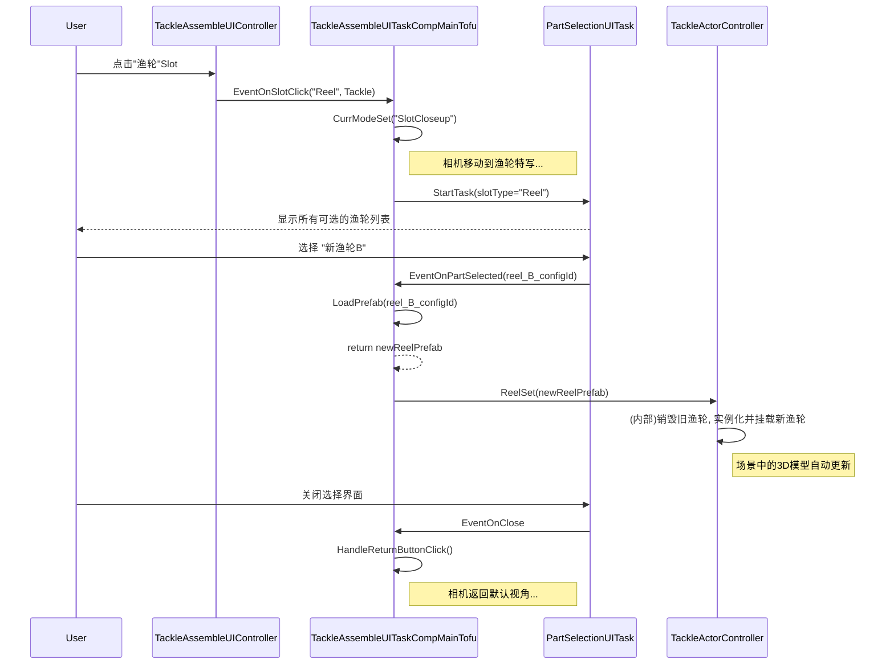

# 钓具组装完整流程 - 技术设计文档

## 1. 简介
本文档基于《钓具组装完整流程 - 功能需求文档》，提供实现UI系统与`TackleActorController`系统集成的详细技术方案。

## 2. 宏观集成架构

我们将复用已有的`TackleAssembleUITask`作为前端交互层，并将其与作为后端模型层的`TackleActorController`进行对接。

-   **`TackleAssembleUITaskCompMainTofu`**: 将扮演核心**适配器 (Adapter)** 的角色。它负责将UI事件（如“更换部件”按钮点击）翻译成对`TackleActorController`的API调用（如`ReelSet()`）。
-   **`TackleActorController`**: 作为聚合根，封装了所有关于钓具模型的操作。UI层**绝不**直接操作模型，所有操作都必须通过`TackleActorController`的接口。
-   **`StageActor`**: 我们之前创建的`IStageActor`实例，其`Instance`属性（即`GameObject`）上必须挂载有`TackleActorController`。`MainTofu`在初始化时需要获取并缓存这个Controller的引用。

## 3. 详细设计

### 3.1. 启动与初始化流程

1.  **`TackleAssembleUITaskCompUpdatePipeline`**:
    *   管线不再直接创建`StageActor`。它应该调用一个外部的**`TackleFactory.Create(tackleConfig)`**方法（假设存在）。
    *   这个工厂方法应返回一个已经组装好、且根节点上挂载了`TackleActorController`的`GameObject`。
    *   管线随后将这个`GameObject`包装成一个`IStageActor`，并启动`TackleAssembleTackleUITask`，将Actor注入。

2.  **`TackleAssembleUITaskCompMainTofu`**:
    *   在`OnActorReady`事件中，当`IStageActor`准备好后，`MainTofu`必须从`actor.Instance`上获取并缓存`TackleActorController`的引用。
        ```csharp
        private TackleActorController m_tackleActorController;

        private void OnActorReady(IStageActor actor)
        {
            // ... 其他逻辑 ...
            m_tackleActorController = actor.Instance.GetComponent<TackleActorController>();
            if (m_tackleActorController == null)
            {
                Debug.LogError("TackleActorController not found on the root of the stage actor!");
            }
        }
        ```

### 3.2. 部件更换技术流程 (FR-3.3 ~ FR-3.8)

这将是本次集成的核心。

1.  **打开部件选择UI**:
    *   当用户点击一个Slot（如渔轮）并进入特写状态后，`TackleAssembleUITaskCompMainTofu`需要启动一个新的**`PartSelectionUITask`**（假设存在）。
    *   这个`PartSelectionUITask`负责显示一个可供选择的部件列表，并提供一个选择完成的回调事件，如`EventOnPartSelected(partConfigId)`。

2.  **处理部件选择**:
    *   `TackleAssembleUITaskCompMainTofu`监听`PartSelectionUITask`的`EventOnPartSelected`事件。
    *   在事件处理方法`OnPartSelected(partConfigId)`中，执行以下操作：
        1.  根据`partConfigId`加载新的部件Prefab（这可能需要一个新的资源管理服务）。
        2.  调用`TackleActorController`的相应`Set`方法。

3.  **调用`TackleActorController`**:
    *   `MainTofu`中将包含类似如下的逻辑：
        ```csharp
        private void OnPartSelected(string slotName, int newPartConfigId)
        {
            // 1. 加载新部件资源
            GameObject newPartPrefab = LoadPartPrefab(newPartConfigId); // 伪代码

            if (newPartPrefab == null) return;

            // 2. 调用TackleActorController的接口
            if (m_tackleActorController != null)
            {
                switch (slotName) // 或根据SlotType
                {
                    case "Reel":
                        m_tackleActorController.ReelSet(newPartPrefab);
                        break;
                    case "Rod":
                        m_tackleActorController.RodWithHandleSet(newPartPrefab);
                        break;
                    case "LureRig":
                        m_tackleActorController.LureRigSet(newPartPrefab);
                        // FR-3.7: 如果是钓组，需要额外刷新放大镜
                        RefreshBaitGroupView(); 
                        break;
                }
            }
        }
        ```

### 3.3. 视图刷新机制

-   根据`TackleActorController`的分析，它的`Set`方法会直接在场景中替换`GameObject`。由于我们的`TackleAssembleTackleUITask`和`TackleAssembleBaitGroupUITask`共享同一个场景和Actor，**主视图和放大镜视图中的模型将自动更新**，无需额外操作。
-   唯一需要手动触发的是`RefreshBaitGroupView()`，当更换钓组时，需要调用它来重新定位放大镜相机，确保它对准新的钓组模型。

### 4. 序列图 (部件更换流程)



---
*文档版本: 1.0*
*创建日期: 2025-09-29*