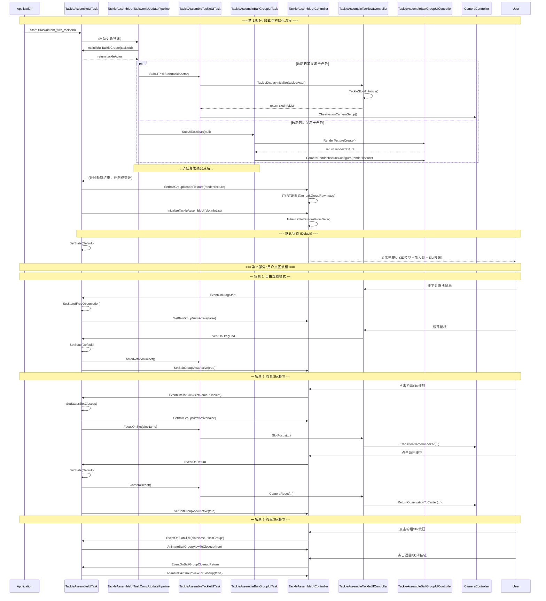

# 钓具组装界面交互优化 - 功能设计文档

## 1. 简介

本文档基于《钓具组装界面交互优化 - 功能需求文档》(v1.2)，提供为实现这些需求所需的技术设计方案。文档将详细描述需要修改的类、新增的成员和方法，以及组件间的交互流程。

## 2. 交互流程总览 (时序图)



## 3. 详细设计

### 3.1. 状态机实现 (FR-D1, FR-D2, FR-D3, FR-D4)

- **文件**: `GameProject/Scripts/Runtime/GameView/UI/TackleAssembleUITask/TackleAssembleUITask.cs`
- **修改**:
    1.  **新增 `ViewState` 枚举**:
        ```csharp
        public enum ViewState
        {
            Default,
            FreeObservation,
            SlotCloseup
        }
        ```
    2.  **新增成员变量**:
        ```csharp
        private ViewState m_currentViewState;
        ```
    3.  **新增状态管理方法**:
        ```csharp
        private void SetViewState(ViewState newState)
        {
            if (m_currentViewState == newState) return;

            // 处理退出当前状态的逻辑
            OnViewStateExit(m_currentViewState);

            m_currentViewState = newState;

            // 处理进入新状态的逻辑
            OnViewStateEnter(m_currentViewState);
        }

        private void OnViewStateEnter(ViewState state)
        {
            switch (state)
            {
                case ViewState.Default:
                    // FR-FO6: 显示放大镜
                    m_compMainTofu.GetUIController().SetBaitGroupViewActive(true); 
                    break;
                case ViewState.FreeObservation:
                    // FR-FO1: 隐藏放大镜
                    m_compMainTofu.GetUIController().SetBaitGroupViewActive(false);
                    break;
                case ViewState.SlotCloseup:
                    // FR-SC2: 隐藏放大镜
                    m_compMainTofu.GetUIController().SetBaitGroupViewActive(false);
                    break;
            }
        }

        private void OnViewStateExit(ViewState state)
        {
            // 可选：用于处理退出状态时的清理工作
        }
        ```

### 3.2. “自由观察”模式实现 (FR-FO1 ~ FR-FO6)

1.  **文件**: `GameProject/Scripts/Runtime/GameView/UI/TackleAssembleTackleUITask/TackleAssembleTackleUIController.cs`
    - **修改**:
        1.  **新增事件**:
            ```csharp
            public event Action EventOnDragStart;
            public event Action EventOnDragEnd;
            ```
        2.  **修改 `RotationInputHandle`**:
            ```csharp
            private void RotationInputHandle()
            {
                if (InputManager.GetButtonDown(InputCmdId4PrimaryAction))
                {
                    m_isDragging = true;
                    m_lastMousePosition = Input.mousePosition;
                    EventOnDragStart?.Invoke(); // 触发开始拖拽事件
                }

                if (InputManager.GetButtonUp(InputCmdId4PrimaryAction))
                {
                    if (m_isDragging)
                    {
                        m_isDragging = false;
                        EventOnDragEnd?.Invoke(); // 触发结束拖拽事件
                    }
                }
                // ...
            }
            ```
        3.  **修改 `DragRotationHandle` (FR-FO2, FR-FO3)**:
            - 分离水平和垂直输入。
            - 水平输入用于旋转Actor，并增加角度限制。
            - 垂直输入用于旋转相机。
            ```csharp
            // (伪代码)
            private void DragRotationHandle()
            {
                // ... 计算 mouseDelta ...
                
                // FR-FO2: 水平拖拽旋转Actor
                float horizontalDelta = mouseDelta.x * m_rotationSensitivity;
                // m_currentTackleActor.transform.Rotate(Vector3.up, horizontalDelta, Space.World);
                // TODO: 在此加入角度限制逻辑 (FR-FO3)

                // FR-FO2: 垂直拖拽旋转相机
                float verticalDelta = -mouseDelta.y * m_rotationSensitivity;
                m_cameraController.GetObservationCameraMode()?.CameraRotate(new Vector2(0, verticalDelta));

                m_lastMousePosition = currentMousePosition;
            }
            ```
        4.  **新增 `ActorRotationReset` 方法 (FR-FO5)**:
            - 该方法将被 `TackleAssembleUITask` 调用，用于将Actor平滑转回初始姿态。

2.  **文件**: `GameProject/Scripts/Runtime/GameView/UI/TackleAssembleUITask/TackleAssembleUITask.cs`
    - **修改**:
        - 在 `CompMainTofu` 的初始化或事件绑定部分，监听 `TackleAssembleTackleUIController` 的 `EventOnDragStart` 和 `EventOnDragEnd` 事件，并用它们来调用 `SetViewState`。

3.  **文件**: `GameProject/Scripts/Runtime/GameView/UI/TackleAssembleUITask/TackleAssembleUIController.cs`
    - **修改**:
        1.  **新增 `SetBaitGroupViewActive` 方法**:
            ```csharp
            public void SetBaitGroupViewActive(bool isActive)
            {
                if (m_baitGroupRawImage != null)
                {
                    m_baitGroupRawImage.gameObject.SetActive(isActive);
                }
            }
            ```

### 3.3. “配件槽特写”模式实现 (FR-SC1, FR-SC2, FR-SC3)

1.  **数据层修改 (FR-SC1)**
    - **文件**: `GameProject/Scripts/Runtime/GameView/UI/TackleModUITask/Comp/TackleSlot.cs` (或 `SlotInfo` 定义处)
    - **修改**:
        1.  **新增 `SlotType` 枚举**:
            ```csharp
            public enum ESlotType { Tackle, BaitGroup }
            ```
        2.  **在 `TackleSlot` 或 `SlotInfo` 中增加字段**:
            ```csharp
            public ESlotType m_slotType;
            ```
    - **数据填充**: 需要在 `TackleSlotList` 组件或相关配置中为每个Slot指定正确的 `ESlotType`。

2.  **UI层修改**
    - **文件**: `GameProject/Scripts/Runtime/GameView/UI/TackleAssembleUITask/TackleAssembleUIController.cs`
    - **修改**:
        1.  **修改 `EventOnSlotButtonClick` 事件签名**:
            ```csharp
            public event Action<string, ESlotType> EventOnSlotButtonClick;
            ```
        2.  **修改 `OnSlotButtonClick` 调用**:
            - 在触发事件时，传递 `SlotType`。

3.  **逻辑层修改**
    - **文件**: `GameProject/Scripts/Runtime/GameView/UI/TackleAssembleUITask/TackleAssembleUITask.cs`
    - **修改**:
        1.  **修改 `OnSlotButtonClick` 事件处理方法**:
            ```csharp
            private void OnSlotButtonClick(string slotName, ESlotType slotType)
            {
                if (slotType == ESlotType.Tackle)
                {
                    // FR-SC2: 处理钓具Slot点击
                    SetViewState(ViewState.SlotCloseup);
                    m_compMainTofu.SlotFocus(slotName); 
                }
                else if (slotType == ESlotType.BaitGroup)
                {
                    // FR-SC3: 处理钓组Slot点击
                    m_compMainTofu.GetUIController().AnimateBaitGroupViewToCloseup(true);
                }
            }
            ```

4.  **UI动画实现 (FR-SC3)**
    - **文件**: `GameProject/Scripts/Runtime/GameView/UI/TackleAssembleUITask/TackleAssembleUIController.cs`
    - **修改**:
        1.  **新增 `AnimateBaitGroupViewToCloseup` 方法**:
            - 该方法将使用 `DOTween` 或 `Animator` 来实现 `m_baitGroupRawImage` 的 `RectTransform` 的放大和居中动画。
            - 需要一个对应的“返回”按钮来调用 `AnimateBaitGroupViewToCloseup(false)`。

---
*文档版本: 1.1*
*创建日期: 2025-09-28*