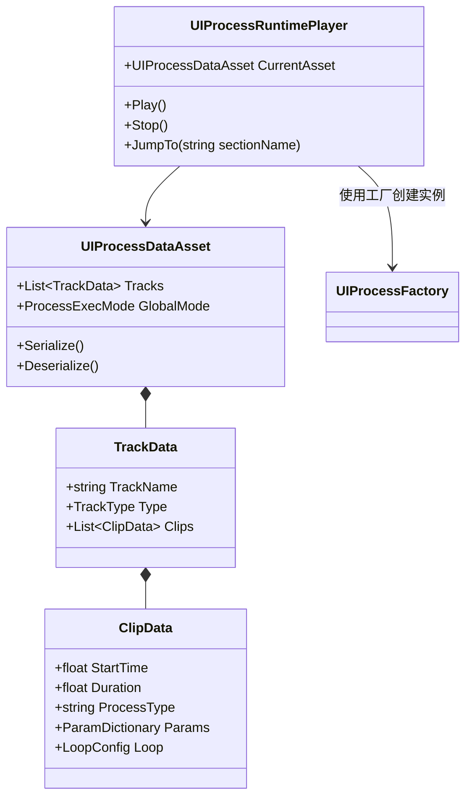

# 功能设计文档：UIProcess 可视化编辑器与数据驱动系统

## 1. 系统架构设计

本系统借鉴 Unity Timeline 和 UE Montage 的设计思想，将 `UIProcess` 从硬编码模式升级为“配置定义 + 运行时解析”模式。

### 1.1 核心组件关系 (Class Diagram)

---

## 2. 数据模型层设计 (Data Model)

### 2.1 UIProcessDataAsset (ScriptableObject)
存储完整的编排数据。支持以 `.asset` 格式保存，并可导出为 `JSON` 用于热更新。

### 2.2 轨道类型 (Track Types)
-   **StateTrack (状态轨道)**：关联 `AdvancedUIStateController`，Clip 代表一个具体的 UI 状态。
-   **LogicTrack (逻辑轨道)**：关联 `ExecutorProcess`，Clip 代表一个 C# 委托或预定义的逻辑类。
-   **AudioTrack (音频轨道)**：播放 UI 音效。
-   **ControlTrack (控制轨道)**：处理循环 (Loop)、跳转 (Jump)、等待 (Wait)。

### 2.3 循环与跳转逻辑 (Looping & Sections)
引入 **Section (区间)** 概念：
-   用户可以在时间轴上定义命名的 Section。
-   **LoopClip**：指定循环起始 Section 和结束 Section，以及循环次数（或无限循环）。
-   **JumpClip**：在执行到该点时，强制将播放头跳转到指定 Section。

---

## 3. 编辑器层设计 (Visual Editor)

### 3.1 界面布局
-   **Toolbar**：播放、暂停、停止、保存、设置。
-   **Track List**：左侧显示轨道名称、锁定、隐藏按钮。
-   **Timeline View**：右侧显示时间轴、刻度、播放头。
-   **Inspector**：右侧或独立窗口，显示 Clip 的详细参数。

### 3.2 交互功能
-   **拖拽支持**：支持从 Project 窗口拖入动画状态、音效到轨道自动生成 Clip。
-   **吸附功能**：Clip 移动时自动吸附到帧刻度或其他 Clip 边缘。
-   **实时预览**：在 Editor 模式下，通过 `ExecuteInEditMode` 驱动 UI 控制器切换状态，实现无需运行游戏的即时预览。

---

## 4. 运行时层设计 (Runtime Engine)

### 4.1 动态构建流程
运行时通过 `UIProcessFactory` 动态将配置转换为原生的 `UIProcess` 树：

1.  **解析 Asset**：读取轨道和 Clip 数据。
2.  **构建树结构**：
    -   `Parallel` 模式：将所有轨道作为子节点加入一个并行 `UIProcess`。
    -   `Serial` 模式：在轨道内部，按时间顺序将 Clip 转换为串行 `UIProcess`。
3.  **注入参数**：将配置中的 `ParamDictionary` 注入到 `ExecutorProcess` 或 `StateEffectProcess` 中。

### 4.2 中断机制
-   支持 `UIProcessManager.Stop(bool immediate)`。
-   在 Asset 中标记为 `Interruptible` 的区间，在收到输入信号时，播放头跳转到指定的 `Outro` 序列。

---

## 5. 典型案例：撕卡包流程设计

在编辑器中，该流程将被拆解为：

| 时间 (s) | 轨道 | Clip 内容 | 参数 |
| :--- | :--- | :--- | :--- |
| 0.0 - 1.0 | 状态轨道 | TearPackage | State: "Tear" |
| 1.0 - 1.5 | 逻辑轨道 | UpdateData | Method: "PopSticker" |
| 1.5 - 2.5 | 状态轨道 | ShowCard | State: "Show" |
| 2.5 - 3.0 | 控制轨道 | LoopPoint | Target: 1.0s (If count > 0) |

---

## 6. 扩展性设计

-   **自定义 Clip 扩展**：开发者可以通过继承 `ClipDataBase` 并标记 `[UIProcessClip(typeof(MyCustomProcess))]` 来快速扩展新的可视化控件。
-   **多语言/多平台参数**：Clip 参数支持根据平台（Mobile/PC）或语言进行重写。
