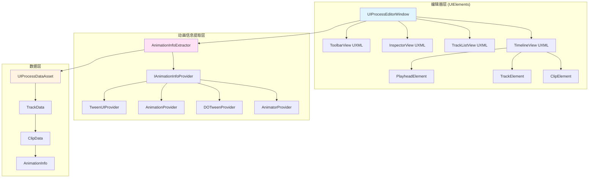

# UIProcess 可视化编辑器详细功能设计文档 v2

> **版本**: v2.0
> **日期**: 2025-12-22
> **基于**: BJFramework UITask/UIProcess 架构
> **更新**: 使用 UIElements 框架 + 深度动画信息提取

---

## 主要更新

### v2.0 更新内容

1. **编辑器框架**: 从 IMGUI 改为 **UIElements** 框架
2. **动画信息提取**: 新增 **AnimationInfoExtractor** 系统，深度分析 `AdvancedUIStateController` 的底层组件
3. **扩展性**: 支持 Animator、DOTween、Animation、自定义 TweenUI 等多种动画组件

---

## 目录

1. [系统概述](#1-系统概述)
2. [架构设计](#2-架构设计)
3. [动画信息提取系统](#3-动画信息提取系统)
4. [数据模型层](#4-数据模型层)
5. [编辑器层 (UIElements)](#5-编辑器层-uielements)
6. [运行时层](#6-运行时层)
7. [与现有系统集成](#7-与现有系统集成)
8. [开发计划](#8-开发计划)

---

## 1. 系统概述

### 1.1 设计目标

基于 BJFramework 现有的 `UIProcess` 系统，构建一套完整的可视化编辑和数据驱动机制，实现：

- **可视化编排**: 美术/策划通过图形化界面编排 UI 动画流程
- **智能动画检测**: 自动分析 `AdvancedUIStateController` 的底层动画组件，提取真实时长
- **数据驱动**: 运行时通过配置文件加载和播放 UIProcess
- **现代化编辑器**: 使用 UIElements 框架，提供流畅的编辑体验

### 1.2 核心技术栈

| 技术 | 用途 | 说明 |
|------|------|------|
| **UIElements** | 编辑器 UI 框架 | Unity 推荐的现代编辑器框架 |
| **UXML** | UI 布局 | 声明式 UI 布局文件 |
| **USS** | 样式表 | CSS-like 样式系统 |
| **Reflection** | 动画信息提取 | 深度分析组件结构 |
| **ScriptableObject** | 数据存储 | 编辑器数据持久化 |
| **JSON** | 运行时加载 | 热更新支持 |

---

## 2. 架构设计

### 2.1 整体架构图



### 2.2 核心模块职责

#### 2.2.1 编辑器层 (UIElements)

| 模块 | 职责 | 实现技术 |
|------|------|----------|
| **UIProcessEditorWindow** | 主编辑器窗口 | EditorWindow + UIElements |
| **TimelineView** | 时间轴显示和交互 | UXML + USS + Manipulator |
| **TrackListView** | 轨道列表管理 | ListView (UIElements) |
| **InspectorView** | Clip 属性编辑 | BindableElement |
| **ClipElement** | 单个 Clip 的可视化元素 | VisualElement + USS |

#### 2.2.2 动画信息提取层

| 类名 | 职责 | 支持组件 |
|------|------|----------|
| **AnimationInfoExtractor** | 动画信息提取管理器 | 统一入口 |
| **IAnimationInfoProvider** | 动画信息提供者接口 | 扩展点 |
| **AnimatorProvider** | Animator 信息提取 | Animator + AnimationClip |
| **DOTweenProvider** | DOTween 信息提取 | DOTweenAnimation |
| **AnimationProvider** | Animation 信息提取 | Animation (Legacy) |
| **TweenUIProvider** | 自定义 TweenUI 信息提取 | 项目自定义组件 |

---

## 3. 动画信息提取系统

### 3.1 核心问题分析

#### 问题描述

`AdvancedUIStateController` 本身只是一个状态机，不直接包含动画信息。真实的动画信息存在于：

```
AdvancedUIStateController (状态机)
    ├── State "Show"
    │   ├── Animator (Unity Animator)
    │   │   └── AnimationClip "UI_Show" (duration: 0.5s)
    │   ├── DOTweenAnimation (DOTween)
    │   │   └── Tween (duration: 0.3s, delay: 0.2s)
    │   └── TweenUI (自定义)
    │       └── CustomTween (duration: 0.8s)
    └── State "Hide"
        └── ...
```

**需要解决的问题**:
1. 如何找到状态关联的所有底层组件？
2. 如何提取不同类型组件的动画时长？
3. 如何处理多个组件并行执行的情况？
4. 如何支持自定义动画组件的扩展？

### 3.2 解决方案：AnimationInfoExtractor

#### 3.2.1 核心接口设计

```csharp
/// <summary>
/// 动画信息
/// </summary>
[Serializable]
public class AnimationInfo
{
    /// <summary>
    /// 动画总时长（秒）
    /// </summary>
    public float Duration;

    /// <summary>
    /// 动画延迟（秒）
    /// </summary>
    public float Delay;

    /// <summary>
    /// 是否循环
    /// </summary>
    public bool IsLoop;

    /// <summary>
    /// 循环次数（-1 为无限循环）
    /// </summary>
    public int LoopCount = 1;

    /// <summary>
    /// 动画来源组件类型
    /// </summary>
    public string SourceComponentType;

    /// <summary>
    /// 详细信息（用于调试）
    /// </summary>
    public string DebugInfo;

    /// <summary>
    /// 计算实际总时长（包含延迟和循环）
    /// </summary>
    public float GetTotalDuration()
    {
        if (IsLoop && LoopCount == -1)
        {
            return float.PositiveInfinity;
        }

        return Delay + Duration * (IsLoop ? LoopCount : 1);
    }
}

/// <summary>
/// 动画信息提供者接口
/// </summary>
public interface IAnimationInfoProvider
{
    /// <summary>
    /// 是否可以处理该组件
    /// </summary>
    bool CanHandle(Component component);

    /// <summary>
    /// 提取动画信息
    /// </summary>
    AnimationInfo ExtractInfo(Component component, string stateName);

    /// <summary>
    /// 优先级（数值越大优先级越高）
    /// </summary>
    int Priority { get; }
}
```

#### 3.2.2 AnimationInfoExtractor 实现

```csharp
/// <summary>
/// 动画信息提取器
/// 负责从 AdvancedUIStateController 和其底层组件中提取动画信息
/// </summary>
public class AnimationInfoExtractor
{
    #region 单例

    private static AnimationInfoExtractor s_instance;
    public static AnimationInfoExtractor Instance
    {
        get
        {
            if (s_instance == null)
            {
                s_instance = new AnimationInfoExtractor();
            }
            return s_instance;
        }
    }

    #endregion

    #region 提供者注册

    private List<IAnimationInfoProvider> m_providers = new List<IAnimationInfoProvider>();

    private AnimationInfoExtractor()
    {
        // 注册内置提供者（按优先级排序）
        RegisterProvider(new AnimatorProvider());
        RegisterProvider(new DOTweenProvider());
        RegisterProvider(new AnimationProvider());
        RegisterProvider(new TweenUIProvider());

        // 允许通过反射自动注册自定义提供者
        RegisterCustomProviders();
    }

    /// <summary>
    /// 注册提供者
    /// </summary>
    public void RegisterProvider(IAnimationInfoProvider provider)
    {
        m_providers.Add(provider);
        m_providers.Sort((a, b) => b.Priority.CompareTo(a.Priority));
    }

    /// <summary>
    /// 自动注册自定义提供者
    /// </summary>
    private void RegisterCustomProviders()
    {
        var providerTypes = TypeCache.GetTypesDerivedFrom<IAnimationInfoProvider>();
        foreach (var type in providerTypes)
        {
            // 跳过内置类型
            if (type.Namespace != null && type.Namespace.StartsWith("BJFramework"))
                continue;

            try
            {
                var instance = Activator.CreateInstance(type) as IAnimationInfoProvider;
                if (instance != null)
                {
                    RegisterProvider(instance);
                }
            }
            catch (Exception e)
            {
                Debug.LogWarning($"无法创建自定义提供者: {type.Name}, 错误: {e.Message}");
            }
        }
    }

    #endregion

    #region 提取核心逻辑

    /// <summary>
    /// 从 AdvancedUIStateController 提取指定状态的动画信息
    /// </summary>
    public AnimationInfo ExtractFromStateController(AdvancedUIStateController controller, string stateName)
    {
        if (controller == null)
        {
            Debug.LogError("AnimationInfoExtractor: controller 为 null");
            return CreateDefaultInfo();
        }

        // 获取控制器所在的 GameObject 及其所有子对象
        var gameObject = controller.gameObject;

        // 收集所有可能的动画组件
        var allComponents = gameObject.GetComponentsInChildren<Component>(true);

        // 尝试提取动画信息
        var allInfos = new List<AnimationInfo>();

        foreach (var component in allComponents)
        {
            foreach (var provider in m_providers)
            {
                if (provider.CanHandle(component))
                {
                    try
                    {
                        var info = provider.ExtractInfo(component, stateName);
                        if (info != null && info.Duration > 0)
                        {
                            allInfos.Add(info);
                        }
                    }
                    catch (Exception e)
                    {
                        Debug.LogWarning($"提取动画信息失败: {component.GetType().Name}, 错误: {e.Message}");
                    }
                }
            }
        }

        // 合并多个动画信息
        return MergeAnimationInfos(allInfos, stateName);
    }

    /// <summary>
    /// 合并多个动画信息
    /// 策略：取最长时长，合并延迟和循环信息
    /// </summary>
    private AnimationInfo MergeAnimationInfos(List<AnimationInfo> infos, string stateName)
    {
        if (infos.Count == 0)
        {
            Debug.LogWarning($"未找到状态 '{stateName}' 的动画信息，使用默认时长");
            return CreateDefaultInfo();
        }

        if (infos.Count == 1)
        {
            return infos[0];
        }

        // 多个动画信息，取最长的总时长
        var mergedInfo = new AnimationInfo
        {
            Duration = 0f,
            Delay = 0f,
            IsLoop = false,
            LoopCount = 1,
            SourceComponentType = "Multiple",
            DebugInfo = $"合并自 {infos.Count} 个动画组件:\n"
        };

        float maxTotalDuration = 0f;
        AnimationInfo longestInfo = null;

        foreach (var info in infos)
        {
            float totalDuration = info.GetTotalDuration();
            if (totalDuration > maxTotalDuration)
            {
                maxTotalDuration = totalDuration;
                longestInfo = info;
            }

            mergedInfo.DebugInfo += $"- {info.SourceComponentType}: {info.GetTotalDuration():F2}s\n";
        }

        // 使用最长的动画信息
        if (longestInfo != null)
        {
            mergedInfo.Duration = longestInfo.Duration;
            mergedInfo.Delay = longestInfo.Delay;
            mergedInfo.IsLoop = longestInfo.IsLoop;
            mergedInfo.LoopCount = longestInfo.LoopCount;
        }

        return mergedInfo;
    }

    /// <summary>
    /// 创建默认动画信息
    /// </summary>
    private AnimationInfo CreateDefaultInfo()
    {
        return new AnimationInfo
        {
            Duration = 0.5f, // 默认 0.5 秒
            Delay = 0f,
            IsLoop = false,
            LoopCount = 1,
            SourceComponentType = "Default",
            DebugInfo = "未找到动画信息，使用默认时长"
        };
    }

    #endregion

    #region 快速提取方法

    /// <summary>
    /// 快速提取时长（仅返回总时长）
    /// </summary>
    public float QuickExtractDuration(AdvancedUIStateController controller, string stateName)
    {
        var info = ExtractFromStateController(controller, stateName);
        return info.GetTotalDuration();
    }

    #endregion
}
```

#### 3.2.3 内置提供者实现

##### AnimatorProvider

```csharp
/// <summary>
/// Animator 动画信息提供者
/// </summary>
public class AnimatorProvider : IAnimationInfoProvider
{
    public int Priority => 100;

    public bool CanHandle(Component component)
    {
        return component is Animator;
    }

    public AnimationInfo ExtractInfo(Component component, string stateName)
    {
        var animator = component as Animator;
        if (animator == null || animator.runtimeAnimatorController == null)
            return null;

        // 获取 AnimatorController
        var controller = animator.runtimeAnimatorController as UnityEditor.Animations.AnimatorController;
        if (controller == null)
            return null;

        // 查找状态
        foreach (var layer in controller.layers)
        {
            var state = FindStateByName(layer.stateMachine, stateName);
            if (state != null && state.motion is AnimationClip clip)
            {
                return new AnimationInfo
                {
                    Duration = clip.length,
                    Delay = 0f,
                    IsLoop = clip.isLooping,
                    LoopCount = clip.isLooping ? -1 : 1,
                    SourceComponentType = "Animator",
                    DebugInfo = $"AnimationClip: {clip.name}, Length: {clip.length:F2}s"
                };
            }
        }

        return null;
    }

    private UnityEditor.Animations.AnimatorState FindStateByName(
        UnityEditor.Animations.AnimatorStateMachine stateMachine, string name)
    {
        // 搜索当前层级
        foreach (var state in stateMachine.states)
        {
            if (state.state.name == name)
                return state.state;
        }

        // 递归搜索子状态机
        foreach (var subMachine in stateMachine.stateMachines)
        {
            var result = FindStateByName(subMachine.stateMachine, name);
            if (result != null)
                return result;
        }

        return null;
    }
}
```

##### DOTweenProvider

```csharp
/// <summary>
/// DOTween 动画信息提供者
/// </summary>
public class DOTweenProvider : IAnimationInfoProvider
{
    public int Priority => 90;

    public bool CanHandle(Component component)
    {
        // 检查是否是 DOTween 相关组件
        var typeName = component.GetType().Name;
        return typeName.Contains("DOTween");
    }

    public AnimationInfo ExtractInfo(Component component, string stateName)
    {
        // 使用反射获取 DOTween 参数
        var type = component.GetType();

        float duration = 1f;
        float delay = 0f;
        int loops = 0;

        // 尝试获取 duration 字段
        var durationField = type.GetField("duration",
            BindingFlags.Public | BindingFlags.NonPublic | BindingFlags.Instance);
        if (durationField != null)
        {
            duration = (float)durationField.GetValue(component);
        }

        // 尝试获取 delay 字段
        var delayField = type.GetField("delay",
            BindingFlags.Public | BindingFlags.NonPublic | BindingFlags.Instance);
        if (delayField != null)
        {
            delay = (float)delayField.GetValue(component);
        }

        // 尝试获取 loops 字段
        var loopsField = type.GetField("loops",
            BindingFlags.Public | BindingFlags.NonPublic | BindingFlags.Instance);
        if (loopsField != null)
        {
            loops = (int)loopsField.GetValue(component);
        }

        return new AnimationInfo
        {
            Duration = duration,
            Delay = delay,
            IsLoop = loops != 0,
            LoopCount = loops == -1 ? -1 : loops,
            SourceComponentType = "DOTween",
            DebugInfo = $"DOTween: duration={duration:F2}s, delay={delay:F2}s, loops={loops}"
        };
    }
}
```

##### TweenUIProvider

```csharp
/// <summary>
/// 自定义 TweenUI 动画信息提供者
/// </summary>
public class TweenUIProvider : IAnimationInfoProvider
{
    public int Priority => 80;

    public bool CanHandle(Component component)
    {
        // 检查是否是项目自定义的 TweenUI 组件
        var typeName = component.GetType().Name;
        return typeName.Contains("TweenUI") || typeName.Contains("UITween");
    }

    public AnimationInfo ExtractInfo(Component component, string stateName)
    {
        var type = component.GetType();

        // 尝试查找常见的时长字段名
        string[] durationFieldNames = { "duration", "Duration", "m_duration", "tweenDuration" };
        string[] delayFieldNames = { "delay", "Delay", "m_delay", "startDelay" };

        float duration = 0.5f; // 默认值
        float delay = 0f;

        foreach (var fieldName in durationFieldNames)
        {
            var field = type.GetField(fieldName,
                BindingFlags.Public | BindingFlags.NonPublic | BindingFlags.Instance);
            if (field != null && field.FieldType == typeof(float))
            {
                duration = (float)field.GetValue(component);
                break;
            }
        }

        foreach (var fieldName in delayFieldNames)
        {
            var field = type.GetField(fieldName,
                BindingFlags.Public | BindingFlags.NonPublic | BindingFlags.Instance);
            if (field != null && field.FieldType == typeof(float))
            {
                delay = (float)field.GetValue(component);
                break;
            }
        }

        return new AnimationInfo
        {
            Duration = duration,
            Delay = delay,
            IsLoop = false,
            LoopCount = 1,
            SourceComponentType = type.Name,
            DebugInfo = $"TweenUI: {type.Name}, duration={duration:F2}s, delay={delay:F2}s"
        };
    }
}
```

### 3.3 使用示例

#### 在编辑器中自动提取动画信息

```csharp
// 在创建 StateClip 时自动提取动画信息
public void CreateStateClip(AdvancedUIStateController controller, string stateName)
{
    var extractor = AnimationInfoExtractor.Instance;

    // 提取动画信息
    var animInfo = extractor.ExtractFromStateController(controller, stateName);

    // 创建 Clip
    var clip = new StateClipData
    {
        ClipName = stateName,
        StateName = stateName,
        StartTime = 0f,
        Duration = animInfo.GetTotalDuration(), // 自动设置时长
        WaitForCompletion = true
    };

    // 保存动画信息到 Clip（用于调试）
    clip.AnimationInfo = animInfo;

    // 显示提取结果
    Debug.Log($"提取动画信息: {stateName}\n{animInfo.DebugInfo}");
}
```

---

## 4. 数据模型层

### 4.1 ClipData 扩展（支持动画信息）

```csharp
/// <summary>
/// 状态 Clip (对应 CommonUIStateEffectProcess)
/// </summary>
[Serializable]
public class StateClipData : ClipData
{
    /// <summary>
    /// 目标状态名称
    /// </summary>
    public string StateName;

    /// <summary>
    /// 是否等待动画完成
    /// </summary>
    public bool WaitForCompletion = true;

    /// <summary>
    /// 关联的 UIController 名称
    /// </summary>
    public string TargetControllerName;

    /// <summary>
    /// 动画信息（编辑器提取）
    /// </summary>
    [NonSerialized]
    public AnimationInfo AnimationInfo;

    /// <summary>
    /// 手动时长覆盖（如果大于 0，则忽略自动提取的时长）
    /// </summary>
    public float ManualDurationOverride = 0f;

    public override UIProcess CreateProcess(UIProcessFactory factory)
    {
        return factory.CreateStateEffectProcess(StateName, WaitForCompletion);
    }

    /// <summary>
    /// 获取有效时长（优先使用手动覆盖）
    /// </summary>
    public float GetEffectiveDuration()
    {
        if (ManualDurationOverride > 0f)
            return ManualDurationOverride;

        if (AnimationInfo != null)
            return AnimationInfo.GetTotalDuration();

        return Duration;
    }
}
```

### 4.2 自动刷新机制

```csharp
/// <summary>
/// UIProcessDataAsset 扩展方法
/// </summary>
public partial class UIProcessDataAsset
{
    /// <summary>
    /// 刷新所有 StateClip 的动画信息
    /// </summary>
    public void RefreshAllAnimationInfos(Dictionary<string, AdvancedUIStateController> controllerMap)
    {
        var extractor = AnimationInfoExtractor.Instance;

        foreach (var track in Tracks)
        {
            if (track.Type != TrackType.State)
                continue;

            // 获取轨道关联的 Controller
            if (!controllerMap.TryGetValue(track.TargetControllerName, out var controller))
            {
                Debug.LogWarning($"未找到 Controller: {track.TargetControllerName}");
                continue;
            }

            // 刷新每个 Clip 的动画信息
            foreach (var clip in track.Clips)
            {
                if (clip is StateClipData stateClip)
                {
                    var animInfo = extractor.ExtractFromStateController(controller, stateClip.StateName);
                    stateClip.AnimationInfo = animInfo;

                    // 如果没有手动覆盖，自动更新 Duration
                    if (stateClip.ManualDurationOverride <= 0f)
                    {
                        stateClip.Duration = animInfo.GetTotalDuration();
                    }

                    Debug.Log($"刷新动画信息: {stateClip.StateName}, Duration={stateClip.Duration:F2}s");
                }
            }
        }

        RecalculateDuration();
    }
}
```

---

## 5. 编辑器层 (UIElements)

### 5.1 编辑器窗口架构 (UIElements)

#### 5.1.1 UXML 布局文件

```xml
<!-- UIProcessEditorWindow.uxml -->
<ui:UXML xmlns:ui="UnityEngine.UIElements" xmlns:uie="UnityEditor.UIElements">
    <ui:VisualElement name="root" style="flex-grow: 1;">

        <!-- Toolbar -->
        <ui:VisualElement name="toolbar" class="toolbar">
            <ui:Button name="btn-new" text="新建" />
            <ui:Button name="btn-open" text="打开" />
            <ui:Button name="btn-save" text="保存" />
            <ui:VisualElement style="flex-grow: 1;" />
            <ui:Button name="btn-play" text="▶ 播放" class="btn-play" />
            <ui:Button name="btn-refresh-anim" text="刷新动画信息" tooltip="重新提取所有 StateClip 的动画时长" />
        </ui:VisualElement>

        <!-- Main Content (Horizontal Split) -->
        <ui:TwoPaneSplitView orientation="Horizontal" fixed-pane-initial-dimension="200">

            <!-- Left: Track List -->
            <ui:VisualElement name="track-list-container" class="panel">
                <ui:Label text="轨道列表" class="panel-title" />
                <ui:ListView name="track-list" class="track-list" />
                <ui:Button name="btn-add-track" text="+ 添加轨道" class="btn-add" />
            </ui:VisualElement>

            <!-- Right: Timeline + Inspector -->
            <ui:TwoPaneSplitView orientation="Vertical" fixed-pane-initial-dimension="400">

                <!-- Top: Timeline -->
                <ui:VisualElement name="timeline-container" class="panel">
                    <ui:VisualElement name="timeline-ruler" class="timeline-ruler" />
                    <ui:ScrollView name="timeline-scroll" class="timeline-scroll">
                        <ui:VisualElement name="timeline-content" class="timeline-content" />
                    </ui:ScrollView>
                </ui:VisualElement>

                <!-- Bottom: Inspector -->
                <ui:VisualElement name="inspector-container" class="panel">
                    <ui:Label text="属性面板" class="panel-title" />
                    <ui:ScrollView name="inspector-scroll">
                        <ui:VisualElement name="inspector-content" class="inspector-content" />
                    </ui:ScrollView>
                </ui:VisualElement>

            </ui:TwoPaneSplitView>

        </ui:TwoPaneSplitView>

    </ui:VisualElement>
</ui:UXML>
```

#### 5.1.2 USS 样式文件

```css
/* UIProcessEditorWindow.uss */

.toolbar {
    flex-direction: row;
    background-color: rgb(60, 60, 60);
    border-bottom-width: 1px;
    border-bottom-color: rgb(30, 30, 30);
    padding: 4px;
    height: 30px;
}

.btn-play {
    background-color: rgb(80, 150, 80);
    color: white;
    font-size: 12px;
    -unity-font-style: bold;
}

.panel {
    background-color: rgb(50, 50, 50);
    border-width: 1px;
    border-color: rgb(30, 30, 30);
}

.panel-title {
    background-color: rgb(40, 40, 40);
    padding: 6px;
    font-size: 12px;
    -unity-font-style: bold;
    border-bottom-width: 1px;
    border-bottom-color: rgb(30, 30, 30);
}

.track-list {
    flex-grow: 1;
    background-color: rgb(45, 45, 45);
}

.timeline-ruler {
    height: 30px;
    background-color: rgb(40, 40, 40);
    border-bottom-width: 1px;
    border-bottom-color: rgb(30, 30, 30);
}

.timeline-scroll {
    flex-grow: 1;
    background-color: rgb(50, 50, 50);
}

.timeline-content {
    min-height: 500px;
}

.inspector-content {
    padding: 10px;
}

/* Clip 样式 */
.clip {
    position: absolute;
    background-color: rgb(80, 120, 200);
    border-width: 1px;
    border-color: rgb(60, 100, 180);
    border-radius: 4px;
    padding: 4px;
}

.clip:hover {
    background-color: rgb(100, 140, 220);
}

.clip-selected {
    border-width: 2px;
    border-color: rgb(255, 200, 0);
}

.clip-label {
    color: white;
    font-size: 10px;
    overflow: hidden;
    text-overflow: ellipsis;
}

/* Track 样式 */
.track {
    height: 60px;
    border-bottom-width: 1px;
    border-bottom-color: rgb(40, 40, 40);
    position: relative;
}

.track-state {
    background-color: rgba(80, 120, 200, 0.2);
}

.track-logic {
    background-color: rgba(200, 80, 80, 0.2);
}

.track-audio {
    background-color: rgba(80, 200, 120, 0.2);
}

.track-control {
    background-color: rgba(200, 200, 80, 0.2);
}
```

#### 5.1.3 UIProcessEditorWindow (UIElements 实现)

```csharp
using UnityEditor;
using UnityEngine;
using UnityEngine.UIElements;
using UnityEditor.UIElements;

/// <summary>
/// UIProcess 可视化编辑器主窗口 (UIElements 实现)
/// </summary>
public class UIProcessEditorWindow : EditorWindow
{
    #region 常量

    private const string UXML_PATH = "Assets/BJFramework/Editor/UIProcess/UIProcessEditorWindow.uxml";
    private const string USS_PATH = "Assets/BJFramework/Editor/UIProcess/UIProcessEditorWindow.uss";

    #endregion

    #region UI 元素引用

    private VisualElement m_root;
    private ListView m_trackList;
    private VisualElement m_timelineContent;
    private VisualElement m_timelineRuler;
    private VisualElement m_inspectorContent;
    private ScrollView m_timelineScroll;

    // 按钮
    private Button m_btnNew;
    private Button m_btnOpen;
    private Button m_btnSave;
    private Button m_btnPlay;
    private Button m_btnRefreshAnim;
    private Button m_btnAddTrack;

    #endregion

    #region 数据

    private UIProcessDataAsset m_currentAsset;
    private ClipElement m_selectedClip;
    private float m_timeScale = 100f; // 像素/秒
    private float m_playheadPosition = 0f;

    // Clip 元素缓存
    private Dictionary<ClipData, ClipElement> m_clipElementMap = new Dictionary<ClipData, ClipElement>();

    #endregion

    #region Unity 生命周期

    [MenuItem("BJFramework/UI/UIProcess Editor")]
    public static void OpenWindow()
    {
        var window = GetWindow<UIProcessEditorWindow>("UIProcess Editor");
        window.minSize = new Vector2(1200, 600);
        window.Show();
    }

    private void CreateGUI()
    {
        // 加载 UXML
        var visualTree = AssetDatabase.LoadAssetAtPath<VisualTreeAsset>(UXML_PATH);
        if (visualTree == null)
        {
            Debug.LogError($"无法加载 UXML: {UXML_PATH}");
            return;
        }

        m_root = visualTree.Instantiate();
        rootVisualElement.Add(m_root);

        // 加载 USS
        var styleSheet = AssetDatabase.LoadAssetAtPath<StyleSheet>(USS_PATH);
        if (styleSheet != null)
        {
            m_root.styleSheets.Add(styleSheet);
        }

        // 获取 UI 元素引用
        BindUIElements();

        // 注册事件
        RegisterEvents();

        // 初始化视图
        InitializeViews();
    }

    #endregion

    #region UI 绑定

    private void BindUIElements()
    {
        // 按钮
        m_btnNew = m_root.Q<Button>("btn-new");
        m_btnOpen = m_root.Q<Button>("btn-open");
        m_btnSave = m_root.Q<Button>("btn-save");
        m_btnPlay = m_root.Q<Button>("btn-play");
        m_btnRefreshAnim = m_root.Q<Button>("btn-refresh-anim");
        m_btnAddTrack = m_root.Q<Button>("btn-add-track");

        // 视图
        m_trackList = m_root.Q<ListView>("track-list");
        m_timelineContent = m_root.Q<VisualElement>("timeline-content");
        m_timelineRuler = m_root.Q<VisualElement>("timeline-ruler");
        m_inspectorContent = m_root.Q<VisualElement>("inspector-content");
        m_timelineScroll = m_root.Q<ScrollView>("timeline-scroll");
    }

    private void RegisterEvents()
    {
        // 按钮事件
        m_btnNew.clicked += OnNewAsset;
        m_btnOpen.clicked += OnOpenAsset;
        m_btnSave.clicked += OnSaveAsset;
        m_btnPlay.clicked += OnPlayPreview;
        m_btnRefreshAnim.clicked += OnRefreshAnimationInfo;
        m_btnAddTrack.clicked += OnAddTrack;

        // Timeline 滚动和缩放
        m_timelineScroll.RegisterCallback<WheelEvent>(OnTimelineWheel);
    }

    #endregion

    #region 视图初始化

    private void InitializeViews()
    {
        // 初始化轨道列表
        InitializeTrackList();

        // 初始化时间轴
        InitializeTimeline();
    }

    private void InitializeTrackList()
    {
        m_trackList.itemsSource = m_currentAsset?.Tracks;
        m_trackList.makeItem = MakeTrackItem;
        m_trackList.bindItem = BindTrackItem;
        m_trackList.selectionType = SelectionType.Single;
    }

    private VisualElement MakeTrackItem()
    {
        var container = new VisualElement();
        container.style.flexDirection = FlexDirection.Row;
        container.style.paddingLeft = 4;
        container.style.paddingRight = 4;
        container.style.paddingTop = 2;
        container.style.paddingBottom = 2;

        var label = new Label();
        label.name = "track-name";
        label.style.flexGrow = 1;

        var deleteBtn = new Button { text = "×" };
        deleteBtn.name = "btn-delete";
        deleteBtn.style.width = 20;

        container.Add(label);
        container.Add(deleteBtn);

        return container;
    }

    private void BindTrackItem(VisualElement element, int index)
    {
        if (m_currentAsset == null || index >= m_currentAsset.Tracks.Count)
            return;

        var track = m_currentAsset.Tracks[index];
        var label = element.Q<Label>("track-name");
        var deleteBtn = element.Q<Button>("btn-delete");

        label.text = $"{track.TrackName} ({track.Type})";

        deleteBtn.clicked += () => OnDeleteTrack(track);
    }

    private void InitializeTimeline()
    {
        // 清空现有内容
        m_timelineContent.Clear();
        m_clipElementMap.Clear();

        if (m_currentAsset == null)
            return;

        // 绘制刻度尺
        DrawTimelineRuler();

        // 绘制轨道和 Clip
        DrawTracks();
    }

    #endregion

    #region 时间轴绘制

    private void DrawTimelineRuler()
    {
        m_timelineRuler.Clear();

        if (m_currentAsset == null)
            return;

        // 绘制时间刻度
        float totalDuration = m_currentAsset.TotalDuration;
        int numMarkers = Mathf.CeilToInt(totalDuration);

        for (int i = 0; i <= numMarkers; i++)
        {
            float time = i;
            float posX = time * m_timeScale;

            var marker = new VisualElement();
            marker.style.position = Position.Absolute;
            marker.style.left = posX;
            marker.style.top = 0;
            marker.style.width = 1;
            marker.style.height = 30;
            marker.style.backgroundColor = new Color(0.3f, 0.3f, 0.3f);

            var label = new Label($"{time:F1}s");
            label.style.position = Position.Absolute;
            label.style.left = posX + 2;
            label.style.top = 5;
            label.style.fontSize = 10;
            label.style.color = Color.white;

            m_timelineRuler.Add(marker);
            m_timelineRuler.Add(label);
        }

        // 设置最小宽度
        m_timelineRuler.style.minWidth = totalDuration * m_timeScale + 100;
    }

    private void DrawTracks()
    {
        m_timelineContent.Clear();

        if (m_currentAsset == null)
            return;

        float trackHeight = 60f;
        float yOffset = 0f;

        foreach (var track in m_currentAsset.Tracks)
        {
            if (track.IsHidden)
                continue;

            // 创建轨道容器
            var trackElement = new VisualElement();
            trackElement.name = $"track-{track.TrackName}";
            trackElement.AddToClassList("track");
            trackElement.AddToClassList($"track-{track.Type.ToString().ToLower()}");
            trackElement.style.position = Position.Absolute;
            trackElement.style.left = 0;
            trackElement.style.top = yOffset;
            trackElement.style.width = Length.Percent(100);
            trackElement.style.height = trackHeight;

            // 绘制该轨道的所有 Clip
            foreach (var clip in track.Clips)
            {
                var clipElement = CreateClipElement(clip, trackElement);
                m_clipElementMap[clip] = clipElement;
            }

            m_timelineContent.Add(trackElement);
            yOffset += trackHeight;
        }

        // 设置时间轴内容的最小高度
        m_timelineContent.style.minHeight = yOffset;
        m_timelineContent.style.minWidth = m_currentAsset.TotalDuration * m_timeScale + 100;
    }

    #endregion

    #region Clip 元素创建

    private ClipElement CreateClipElement(ClipData clipData, VisualElement trackContainer)
    {
        var clipElement = new ClipElement(clipData, this);
        clipElement.UpdatePosition(m_timeScale);

        trackContainer.Add(clipElement);

        return clipElement;
    }

    #endregion

    #region 事件处理

    private void OnNewAsset()
    {
        var asset = CreateInstance<UIProcessDataAsset>();
        asset.AssetName = "New UIProcess";
        m_currentAsset = asset;

        RefreshAllViews();
    }

    private void OnOpenAsset()
    {
        string path = EditorUtility.OpenFilePanel("打开 UIProcess Asset", "Assets", "asset");
        if (string.IsNullOrEmpty(path))
            return;

        // 转换为相对路径
        path = FileUtil.GetProjectRelativePath(path);
        var asset = AssetDatabase.LoadAssetAtPath<UIProcessDataAsset>(path);

        if (asset != null)
        {
            m_currentAsset = asset;
            RefreshAllViews();
        }
    }

    private void OnSaveAsset()
    {
        if (m_currentAsset == null)
        {
            Debug.LogWarning("没有可保存的资源");
            return;
        }

        m_currentAsset.RecalculateDuration();
        EditorUtility.SetDirty(m_currentAsset);
        AssetDatabase.SaveAssets();

        Debug.Log($"UIProcess Asset 已保存: {m_currentAsset.name}");
    }

    private void OnPlayPreview()
    {
        // TODO: 实现预览逻辑
        Debug.Log("播放预览");
    }

    private void OnRefreshAnimationInfo()
    {
        if (m_currentAsset == null)
        {
            Debug.LogWarning("没有加载的资源");
            return;
        }

        // 构建 Controller 映射
        var controllerMap = BuildControllerMap();

        // 刷新所有动画信息
        m_currentAsset.RefreshAllAnimationInfos(controllerMap);

        // 刷新视图
        RefreshAllViews();

        Debug.Log("动画信息已刷新");
    }

    private void OnAddTrack()
    {
        if (m_currentAsset == null)
        {
            Debug.LogWarning("请先创建或打开一个资源");
            return;
        }

        var newTrack = new TrackData
        {
            TrackName = $"Track_{m_currentAsset.Tracks.Count + 1}",
            Type = TrackType.State,
            TrackColor = Color.cyan
        };

        m_currentAsset.Tracks.Add(newTrack);
        RefreshAllViews();
    }

    private void OnDeleteTrack(TrackData track)
    {
        if (m_currentAsset == null)
            return;

        m_currentAsset.Tracks.Remove(track);
        RefreshAllViews();
    }

    private void OnTimelineWheel(WheelEvent evt)
    {
        if (evt.ctrlKey)
        {
            // 缩放
            float delta = -evt.delta.y;
            m_timeScale *= (1f + delta * 0.001f);
            m_timeScale = Mathf.Clamp(m_timeScale, 10f, 500f);

            RefreshTimeline();
            evt.StopPropagation();
        }
    }

    #endregion

    #region 辅助方法

    private void RefreshAllViews()
    {
        InitializeTrackList();
        InitializeTimeline();
        m_trackList.Rebuild();
    }

    private void RefreshTimeline()
    {
        DrawTimelineRuler();

        // 更新所有 Clip 元素的位置
        foreach (var pair in m_clipElementMap)
        {
            pair.Value.UpdatePosition(m_timeScale);
        }
    }

    /// <summary>
    /// 构建 Controller 映射（需要从场景中查找）
    /// </summary>
    private Dictionary<string, AdvancedUIStateController> BuildControllerMap()
    {
        var map = new Dictionary<string, AdvancedUIStateController>();

        // 从场景中查找所有 AdvancedUIStateController
        var controllers = FindObjectsOfType<AdvancedUIStateController>();

        foreach (var controller in controllers)
        {
            string name = controller.gameObject.name;
            if (!map.ContainsKey(name))
            {
                map[name] = controller;
            }
        }

        return map;
    }

    #endregion
}
```

### 5.2 ClipElement (UIElements 自定义元素)

```csharp
using UnityEngine.UIElements;
using UnityEngine;

/// <summary>
/// Clip 可视化元素
/// </summary>
public class ClipElement : VisualElement
{
    private ClipData m_clipData;
    private UIProcessEditorWindow m_window;
    private Label m_label;

    // 拖拽相关
    private ClipManipulator m_manipulator;

    public ClipData ClipData => m_clipData;

    public ClipElement(ClipData clipData, UIProcessEditorWindow window)
    {
        m_clipData = clipData;
        m_window = window;

        // 设置类名
        AddToClassList("clip");

        // 创建标签
        m_label = new Label(clipData.ClipName);
        m_label.AddToClassList("clip-label");
        Add(m_label);

        // 设置颜色
        style.backgroundColor = clipData.ClipColor;

        // 添加拖拽操作
        m_manipulator = new ClipManipulator(this, window);
        this.AddManipulator(m_manipulator);

        // 点击选中
        RegisterCallback<MouseDownEvent>(OnMouseDown);
    }

    /// <summary>
    /// 更新位置和大小
    /// </summary>
    public void UpdatePosition(float timeScale)
    {
        float left = m_clipData.StartTime * timeScale;
        float width = m_clipData.Duration * timeScale;

        style.position = Position.Absolute;
        style.left = left;
        style.top = 5;
        style.width = width;
        style.height = 50;
    }

    private void OnMouseDown(MouseDownEvent evt)
    {
        // 选中该 Clip
        m_window.SelectClip(this);
        evt.StopPropagation();
    }

    public void SetSelected(bool selected)
    {
        if (selected)
        {
            AddToClassList("clip-selected");
        }
        else
        {
            RemoveFromClassList("clip-selected");
        }
    }
}

/// <summary>
/// Clip 拖拽操作器
/// </summary>
public class ClipManipulator : Manipulator
{
    private ClipElement m_clipElement;
    private UIProcessEditorWindow m_window;

    private bool m_isDragging;
    private Vector2 m_dragStartPos;
    private float m_originalStartTime;

    public ClipManipulator(ClipElement clipElement, UIProcessEditorWindow window)
    {
        m_clipElement = clipElement;
        m_window = window;
    }

    protected override void RegisterCallbacksOnTarget()
    {
        target.RegisterCallback<MouseDownEvent>(OnMouseDown);
        target.RegisterCallback<MouseMoveEvent>(OnMouseMove);
        target.RegisterCallback<MouseUpEvent>(OnMouseUp);
    }

    protected override void UnregisterCallbacksFromTarget()
    {
        target.UnregisterCallback<MouseDownEvent>(OnMouseDown);
        target.UnregisterCallback<MouseMoveEvent>(OnMouseMove);
        target.UnregisterCallback<MouseUpEvent>(OnMouseUp);
    }

    private void OnMouseDown(MouseDownEvent evt)
    {
        if (evt.button == 0) // 左键
        {
            m_isDragging = true;
            m_dragStartPos = evt.mousePosition;
            m_originalStartTime = m_clipElement.ClipData.StartTime;

            target.CaptureMouse();
            evt.StopPropagation();
        }
    }

    private void OnMouseMove(MouseMoveEvent evt)
    {
        if (m_isDragging)
        {
            float deltaX = evt.mousePosition.x - m_dragStartPos.x;
            float deltaTime = deltaX / m_window.TimeScale;

            float newStartTime = Mathf.Max(0, m_originalStartTime + deltaTime);

            // 吸附到帧
            newStartTime = SnapToFrame(newStartTime);

            m_clipElement.ClipData.StartTime = newStartTime;
            m_clipElement.UpdatePosition(m_window.TimeScale);

            evt.StopPropagation();
        }
    }

    private void OnMouseUp(MouseUpEvent evt)
    {
        if (m_isDragging)
        {
            m_isDragging = false;
            target.ReleaseMouse();

            // 保存修改
            m_window.MarkDirty();

            evt.StopPropagation();
        }
    }

    private float SnapToFrame(float time)
    {
        int frameRate = 60; // TODO: 从 Asset 获取
        float frameDuration = 1f / frameRate;
        return Mathf.Round(time / frameDuration) * frameDuration;
    }
}
```

---

## 6. 运行时层

运行时层保持与 v1.0 版本一致，无需修改。详见原设计文档。

---

## 7. 与现有系统集成

### 7.1 在 UITask 中使用（带动画信息提取）

```csharp
/// <summary>
/// 在 UITask 的 MainTofu 中使用 UIProcessRuntimePlayer
/// </summary>
public class SomeUITaskCompMainTofu : UITaskCompTofuBase
{
    private UIProcessRuntimePlayer m_processPlayer;

    public override void ViewUpdate(IUITaskUpdatePipelineController pipelineCtrl)
    {
        base.ViewUpdate(pipelineCtrl);

        // 创建播放器
        m_processPlayer = new UIProcessRuntimePlayer();

        // 加载数据资源
        string assetPath = "UIProcess/SomeAnimation";
        var asset = Resources.Load<UIProcessDataAsset>(assetPath);

        // 如果是首次加载，可以刷新动画信息
        if (asset != null && NeedRefreshAnimationInfo(asset))
        {
            var controllerMap = BuildControllerMap();
            asset.RefreshAllAnimationInfos(controllerMap);
        }

        m_processPlayer.LoadAsset(asset);

        // 注册事件回调
        m_processPlayer.RegisterEventCallback("OnAnimationComplete", OnAnimationComplete);

        // 播放
        var processManager = m_owner.CompUIProcessManagerGet();
        m_processPlayer.Play(processManager);
    }

    private bool NeedRefreshAnimationInfo(UIProcessDataAsset asset)
    {
        // 检查是否需要刷新（例如，首次加载或版本变化）
        return true;
    }

    private Dictionary<string, AdvancedUIStateController> BuildControllerMap()
    {
        // 从当前 UITask 的 UIController 中收集 AdvancedUIStateController
        var map = new Dictionary<string, AdvancedUIStateController>();

        // 示例：假设有一个主 Controller
        var mainCtrl = m_owner.CompUIControllerManagerGet()
            .UIControllerGet<SomeUIController>("MainController");

        if (mainCtrl != null)
        {
            var stateController = mainCtrl.GetComponent<AdvancedUIStateController>();
            if (stateController != null)
            {
                map["MainController"] = stateController;
            }
        }

        return map;
    }

    private void OnAnimationComplete(string eventParams)
    {
        Debug.Log("动画播放完成");
    }
}
```

---

## 8. 开发计划

### 8.1 Phase 1: 核心数据层 + 动画信息提取 (2 周)

**目标**: 完成数据模型和动画信息提取系统

- [ ] `UIProcessDataAsset` ScriptableObject 实现
- [ ] `TrackData` / `ClipData` / `SectionData` / `EventMarkerData` 实现
- [ ] `AnimationInfo` 和 `IAnimationInfoProvider` 接口设计
- [ ] `AnimationInfoExtractor` 核心实现
- [ ] 内置提供者实现（Animator/DOTween/Animation/TweenUI）
- [ ] 自动注册自定义提供者机制
- [ ] JSON 序列化/反序列化支持
- [ ] 单元测试（提取逻辑）

**验收标准**:
- 可以正确提取 Animator 的动画时长
- 可以正确提取 DOTween 的动画时长
- 支持自定义提供者扩展
- 可以合并多个动画信息

### 8.2 Phase 2: UIElements 编辑器基础框架 (2 周)

**目标**: 完成 UXML/USS 和基础窗口

- [ ] UXML 布局文件编写
- [ ] USS 样式文件编写
- [ ] `UIProcessEditorWindow` 主窗口实现
- [ ] 轨道列表视图（ListView）
- [ ] 时间轴视图（ScrollView + VisualElement）
- [ ] 属性面板（Inspector）
- [ ] 工具栏（Toolbar）

**验收标准**:
- 可以打开编辑器窗口
- 可以加载并显示现有的 `UIProcessDataAsset`
- UI 布局合理，样式美观

### 8.3 Phase 3: Clip 可视化和交互 (2 周)

**目标**: 实现 Clip 的拖拽和编辑

- [ ] `ClipElement` 自定义元素实现
- [ ] `ClipManipulator` 拖拽操作器
- [ ] Clip 选择和高亮
- [ ] Clip 拖拽移动（吸附功能）
- [ ] Clip 缩放（调整 Duration）
- [ ] 时间轴缩放和平移（滚轮）

**验收标准**:
- 可以通过鼠标拖拽调整 Clip 位置
- 有帧吸附效果
- 操作流畅，无明显卡顿

### 8.4 Phase 4: 动画信息自动刷新 (1 周)

**目标**: 集成动画信息提取到编辑器

- [ ] "刷新动画信息"按钮实现
- [ ] 从场景中自动查找 AdvancedUIStateController
- [ ] 自动更新 StateClip 的 Duration
- [ ] 显示动画信息详情（Inspector）
- [ ] 手动时长覆盖功能

**验收标准**:
- 点击"刷新动画信息"后，所有 StateClip 的时长自动更新
- 可以在 Inspector 中查看提取的详细信息
- 支持手动覆盖时长

### 8.5 Phase 5: 高级编辑功能 (1 周)

**目标**: 支持 Section、事件标记、资源拖入

- [ ] Section 创建和编辑
- [ ] EventMarker 创建和编辑
- [ ] 从 Project 窗口拖入资源
- [ ] Clip 复制/粘贴
- [ ] 多选和批量操作
- [ ] 撤销/重做（利用 Unity Undo 系统）

**验收标准**:
- 可以创建和编辑 Section
- 可以从 Project 拖入资源自动创建 Clip
- 支持 Clip 的复制粘贴
- 支持 Ctrl+Z 撤销

### 8.6 Phase 6: 实时预览 (1 周)

**目标**: 支持编辑器内实时预览

- [ ] `PreviewController` 实现
- [ ] 播放/暂停/停止控制
- [ ] 播放头实时移动
- [ ] 在场景中实时驱动 UIController

**验收标准**:
- 可以在编辑器中点击播放预览动画
- 播放头实时移动
- UI 状态实时变化

### 8.7 Phase 7: 运行时系统 (2 周)

**目标**: 完成运行时播放器和构建器

- [ ] `UIProcessRuntimePlayer` 实现
- [ ] `UIProcessBuilder` 实现
- [ ] `UIProcessFactory` 扩展方法
- [ ] 新增控制 Process（Delay/Loop/Jump）
- [ ] 事件触发机制
- [ ] 性能优化

**验收标准**:
- 可以在运行时加载 JSON 并播放
- 串行/并行模式正确执行
- 支持循环和跳转
- 性能无明显瓶颈

### 8.8 Phase 8: 集成测试和文档 (2 周)

**目标**: 与现有系统集成测试

- [ ] 在实际 UITask 中集成测试
- [ ] 复杂案例测试（撕卡包、鱼市、背包等）
- [ ] 热更新流程测试
- [ ] 边界情况测试
- [ ] Bug 修复
- [ ] 用户手册编写
- [ ] 开发者手册编写
- [ ] 团队培训

**验收标准**:
- 现有 UI 流程可以无缝迁移到新系统
- 热更新流程正常工作
- 无重大 Bug
- 文档完整且易懂

---

## 9. 总结

### 9.1 核心改进

#### v2.0 相比 v1.0 的主要改进：

1. **编辑器框架升级**: 从 IMGUI 升级到 **UIElements**
   - 更现代化的 UI 框架
   - 声明式布局（UXML）
   - CSS-like 样式（USS）
   - 更好的性能和可维护性

2. **动画信息自动提取**: 新增 **AnimationInfoExtractor** 系统
   - 深度分析 `AdvancedUIStateController` 的底层组件
   - 自动提取真实动画时长
   - 支持 Animator、DOTween、Animation、TweenUI 等多种组件
   - 可扩展的提供者机制

3. **智能刷新**: 一键刷新所有 Clip 的动画信息
   - 从场景中自动查找 Controller
   - 自动更新 Clip Duration
   - 显示详细的提取信息

### 9.2 开发周期

总计约 **13 周**（比 v1.0 增加 3 周，主要用于动画信息提取系统和 UIElements 学习）

### 9.3 技术优势

| 技术点 | 优势 |
|--------|------|
| **UIElements** | 现代化、高性能、易维护 |
| **AnimationInfoExtractor** | 自动化、可扩展、准确 |
| **UXML/USS** | 声明式、可复用、样式分离 |
| **反射机制** | 深度分析、灵活适配 |

---

**文档版本**: v2.0
**最后更新**: 2025-12-22
**负责人**: BJFramework 团队
