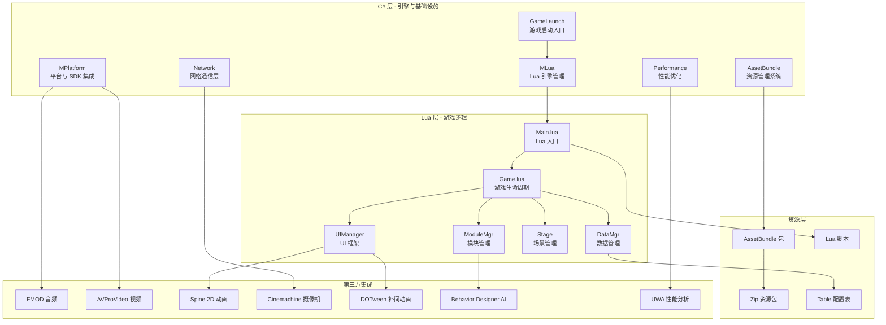

本项目是基于 Unity3D 引擎开发的仙境传说（Ragnarok Online，简称 RO）移动端 MMORPG 游戏客户端。项目采用 **C# 与 Lua 混合开发模式**，通过 ToLua 框架实现跨语言交互，将游戏逻辑与引擎核心分离，提供灵活的快速迭代能力和热更新支持。项目支持 Android、iOS、Windows、WebGL 等多平台发布，集成了丰富的第三方中间件和完善的工具链，是一个成熟的大型商业手游项目。

Sources: [config.json](Resources/config.json#L1-L33), [GameLaunch.cs](Scripts/Launch/GameLaunch.cs#L1-L50), [MLua.cs](Scripts/LuaEngine/MLua.cs#L1-L100)

## 项目架构

项目采用分层架构设计，从底层引擎到上层游戏逻辑形成清晰的层次结构。C# 层负责引擎封装、性能优化、平台适配和第三方库集成；Lua 层负责业务逻辑实现，包括 UI 系统、战斗系统、社交系统等核心玩法。两层通过 ToLua 桥接进行高效通信，实现优势互补。



Sources: [MLua.cs](Scripts/LuaEngine/MLua.cs#L1-L100), [Game.lua](Scripts/Lua/Game.lua#L1-L100), [UIManager.lua](Scripts/Lua/Framework/UIManager/UIManager.lua#L1-L100)

## 技术栈概览

项目整合了业界成熟的开发工具和框架，涵盖游戏开发的各个方面。下表列出了核心技术栈及其主要用途。

| 技术分类 | 技术名称 | 版本/说明 | 主要用途 |
|---------|---------|----------|---------|
| **游戏引擎** | Unity3D | - | 核心渲染、物理、音频系统 |
| **脚本引擎** | ToLua | - | C# 与 Lua 交互桥接 |
| **网络通信** | Protobuf | pb_new | 二进制协议序列化 |
| **UI 框架** | TextMesh Pro | - | 高性能文本渲染 |
| **2D 动画** | Spine | - | 骨骼动画系统 |
| **音频系统** | FMOD Studio | - | 专业音频引擎 |
| **视频播放** | AVProVideo | - | 高性能视频播放 |
| **摄像机** | Cinemachine | - | 智能摄像机控制 |
| **补间动画** | DOTween | - | 动画过渡效果 |
| **AI 系统** | Behavior Designer | - | 可视化行为树编辑 |
| **性能分析** | UWA | - | 性能监控与优化 |
| **自动测试** | Poco-SDK | - | UI 自动化测试 |

Sources: [Plugins 目录结构](Plugins), [config.json](Resources/config.json#L1-L33), [Main.lua](Scripts/Lua/Main.lua#L1-L200)

## 项目目录结构

项目遵循 Unity 标准目录规范，同时根据业务需求进行了合理的模块划分。以下为核心目录及其职责说明。

```
Assets/
├── Scripts/                    # C# 脚本目录
│   ├── Launch/                 # 游戏启动相关
│   ├── LuaEngine/              # Lua 引擎封装（MLua.cs）
│   ├── Bridge/                 # C#-Lua 桥接层
│   ├── FMod/                   # FMOD 音频封装
│   ├── AVPro/                  # 视频播放封装
│   ├── Cinemachine/            # 摄像机系统封装
│   └── Lua/                    # Lua 脚本目录
│       ├── Main.lua            # Lua 入口文件
│       ├── Game.lua            # 游戏主逻辑类
│       ├── Framework/          # Lua 框架层
│       │   └── UIManager/      # UI 框架
│       ├── ModuleMgr/          # 模块管理器
│       ├── Network/            # 网络层
│       ├── UI/                 # UI 逻辑
│       └── Stage/              # 场景管理
├── Resources/                  # Resources 资源目录
│   ├── config.json             # 主配置文件
│   ├── SDKConfig/              # SDK 配置
│   ├── Shader/                 # 着色器资源
│   └── ZipList.json            # Zip 资源列表
├── Plugins/                    # 原生插件
│   ├── Android/                # Android 插件
│   ├── iOS/                    # iOS 插件
│   ├── FMOD/                   # FMOD 原生库
│   ├── GameLibs/               # 游戏核心库（.dll）
│   └── x86_64/                 # PC 平台插件
├── artres/                     # 美术资源
│   ├── Editor/                 # 编辑器工具
│   ├── Resources/              # 资源目录
│   ├── _UI/                    # UI 预制体
│   ├── _Creature/              # 角色资源
│   └── _Scene/                 # 场景资源
├── _Scenes/                    # Unity 场景
│   └── GameEntry.unity         # 游戏入口场景
└── ThirdParty/                 # 第三方集成
    ├── AVProVideo/             # 视频播放插件
    └── UWA/                    # 性能分析工具
```

Sources: [项目目录结构](.), [Main.lua](Scripts/Lua/Main.lua#L1-L200), [config.json](Resources/config.json#L1-L33), [GameEntry.unity](_Scenes/GameEntry.unity#L1-L50)

## 核心系统概述

项目包含多个核心子系统，共同构成完整的游戏运行环境。了解这些系统对于项目开发至关重要。

### 游戏启动流程

游戏启动由 C# 层的 `GameLaunch.cs` 接管，完成性能测试、Logo 展示、视频播放等初始化步骤后，激活 Lua 虚拟机并加载 `Main.lua`。Lua 层的 `Game` 类接管后续的游戏生命周期管理，包括网络初始化、UI 管理器初始化、场景切换等核心功能。启动流程包含设备性能分级检测，根据设备性能自动调整画质设置，确保流畅的游戏体验。

Sources: [GameLaunch.cs](Scripts/Launch/GameLaunch.cs#L1-L160), [MLua.cs](Scripts/LuaEngine/MLua.cs#L1-L100), [Game.lua](Scripts/Lua/Game.lua#L1-L100)

### UI 框架系统

项目实现了基于组（Group）和面板（Panel）的 UI 管理框架，采用 Ctrl/Handler/Panel/Template 四层架构。UIManager 负责界面栈管理、组切换、动画过渡等功能，支持界面的打开、关闭、显示、隐藏等操作，并能够处理界面之间的层级关系和遮挡关系。框架内置了调试工具，方便开发过程中查看 UI 状态和调试问题。

Sources: [UIManager.lua](Scripts/Lua/Framework/UIManager/UIManager.lua#L1-L100), [UIManager 目录结构](Scripts/Lua/Framework/UIManager)

### 网络通信系统

网络层基于 Protobuf 实现二进制协议通信，Lua 层封装了消息编码、解码、发送、接收等操作。网络模块采用消息号分发机制，将服务器返回的数据自动路由到对应的处理函数。系统支持消息池优化，减少 GC 压力，并内置了重连机制和心跳保活功能，确保网络连接的稳定性。

Sources: [Network_Pb.lua](Scripts/Lua/Network/Network_Pb.lua#L1-L62), [Game.lua](Scripts/Lua/Game.lua#L1-L100)

### 资源管理系统

项目采用 AssetBundle + Zip 的双重资源管理方案。AssetBundle 用于 Unity 原生资源的打包和热更新，Zip 文件用于配置表、Lua 脚本、音频 Bank 等小文件的打包。资源系统支持分包加载、按需加载、资源引用计数和自动释放，有效控制内存占用。热更新服务器通过版本检查机制，支持完整包更新和增量更新两种模式。

Sources: [config.json](Resources/config.json#L1-L33), [ZipList.json](Resources/ZipList.json#L1-L23)

## 开发模式特点

本项目的 C# 与 Lua 混合开发模式具有显著优势。C# 层负责引擎层封装、性能敏感模块、第三方库集成和平台适配，利用 C# 的高性能特性和类型安全保障。Lua 层负责游戏业务逻辑，利用 Lua 的动态特性和快速迭代优势，实现游戏逻辑的热更新和快速调试。ToLua 框架提供了高效的 C#-Lua 交互机制，支持类型安全的 API 导出和回调绑定，使两层协作更加便捷。

Sources: [MLua.cs](Scripts/LuaEngine/MLua.cs#L1-L100), [MoonClientBridge.cs](Scripts/Bridge/MoonClientBridge.cs), [Main.lua](Scripts/Lua/Main.lua#L1-L200)

## 平台与 SDK 集成

项目通过 `MPlatform` 系统实现了多平台的统一抽象，集成腾讯 MSDK、GCloud、GEM 等多个第三方 SDK，支持登录、支付、分享、统计等平台功能。SDK 配置通过 JSON 文件管理，支持不同渠道的差异化配置。平台层提供了统一的接口供 Lua 层调用，屏蔽了底层平台差异，简化了跨平台开发流程。

Sources: [MPlatform.cs](Scripts/MPlatform.cs#L1-L100), [SDKConfig 目录](Resources/SDKConfig), [config.json](Resources/config.json#L1-L33)

## 下一步学习路径

建议按照以下顺序阅读文档，逐步深入了解项目的各个模块：

1. **[快速启动](2-kuai-su-qi-dong)** - 了解如何配置开发环境并运行项目
2. **[开发环境配置](3-kai-fa-huan-jing-pei-zhi)** - 详细的开发工具和依赖库安装说明
3. **[项目架构总览](5-xiang-mu-jia-gou-zong-lan)** - 深入理解项目架构设计原则和分层思想
4. **[C#与Lua混合开发模式](6-c-yu-luahun-he-kai-fa-mo-shi)** - 掌握跨语言交互的核心机制
5. **[ToLua框架配置与使用](7-toluakuang-jia-pei-zhi-yu-shi-yong)** - 学习 ToLua 框架的详细使用方法
6. **[UI框架设计（Ctrl/Handler/Panel/Template）](12-uikuang-jia-she-ji-ctrl-handler-panel-template)** - 深入理解 UI 系统架构
7. **[AssetBundle系统架构](14-assetbundlexi-tong-jia-gou)** - 了解资源管理的底层实现