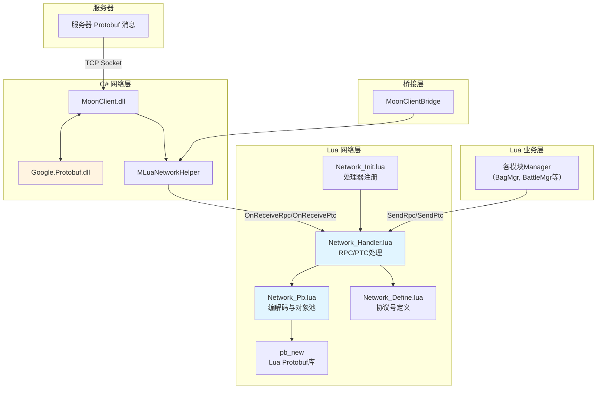
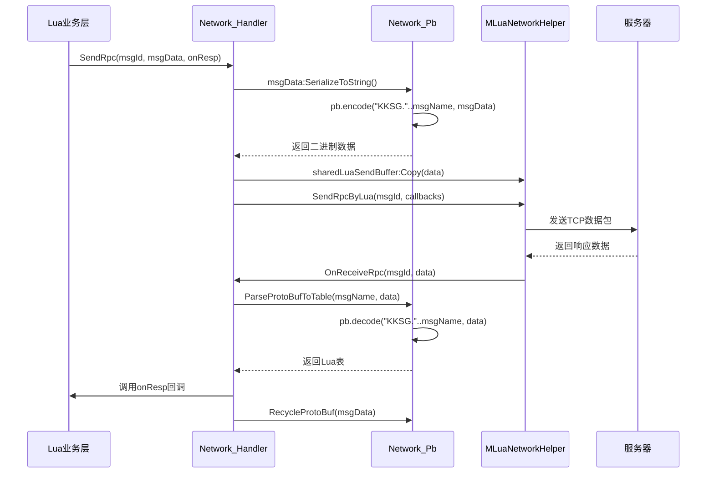
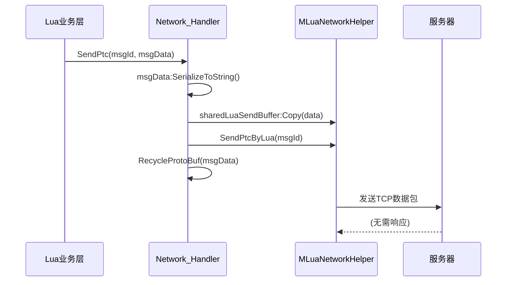

本页面详细介绍项目中Google Protocol Buffers（Protobuf）的集成架构与使用方法，涵盖从底层库到Lua层应用的完整链路。Protobuf作为高效的二进制序列化协议，在本项目中用于客户端与服务器之间的数据通信，提供更小的数据体积和更快的解析速度，相比JSON等文本格式具有显著优势。

## 架构概览

项目的Protobuf集成采用**分层架构**，将C#底层网络通信与Lua业务逻辑解耦，通过桥接层实现无缝对接。核心设计思想是将Protobuf编解码操作下沉到Lua层，减少C#与Lua之间的数据拷贝开销，同时提供对象池机制优化内存使用。



## 核心组件

### 底层库支持

项目使用Google官方的**Google.Protobuf.dll**作为C#层的Protobuf基础库，该库被放置在Plugins/GameLibs目录下，作为核心依赖提供跨平台的序列化能力。此外，iOS平台通过libprotobuf-lite.a静态库提供原生支持，确保在移动端的高性能表现。

Sources: [Plugins/GameLibs](Plugins/GameLibs/Google.Protobuf.dll.meta) [Plugins/iOS](Plugins/iOS/libprotobuf-lite.a.meta)

### Lua Protobuf库

Lua层通过**pb_new**模块实现Protobuf编解码，该模块在Network_Pb.lua中被引入并配置。关键配置选项包括：

- `enum_as_value`：将枚举值作为数字处理而非字符串，减少传输和内存开销
- `int64_as_string`：将int64类型作为字符串处理，避免Lua中的精度丢失问题
- `use_default_values`：使用Protobuf默认值填充缺失字段

Protobuf定义文件通过`pb.loadfile(PathEx.GetBankPath("PB"))`从资源路径加载，所有消息类型都位于"KKSG."命名空间下。

Sources: [Scripts/Lua/Network/Network_Pb.lua](Scripts/Lua/Network/Network_Pb.lua#L3-L7)

### 桥接层

**MoonClientBridge**作为C#与Lua之间的唯一桥梁，通过单例模式获取IMoonClientBridge接口实现，该接口封装了底层网络通信的细节，为Lua层提供简洁的API。桥接层通过MInterfaceMgr管理器动态获取接口实现，支持模块化和可测试性。

Sources: [Scripts/Bridge/MoonClientBridge.cs](Scripts/Bridge/MoonClientBridge.cs#L6-L20)

## Protobuf操作

### 编码（序列化）

发送消息时，Lua层通过`GetProtoBufSendTable(msgName)`函数获取一个可复用的消息对象，该对象通过对象池缓存以减少GC压力。获取到的对象会添加`___MSG_NAME`字段存储消息名称，并设置发送用的元表，该元表提供`SerializeToString`方法进行编码：

```lua
local sendProtoBufMT = {
    SerializeToString = function(self)
        return pb.encode("KKSG." .. self.___MSG_NAME, self)
    end
}
```

编码后的二进制数据通过`MLuaNetworkHelper.sharedLuaSendBuffer:Copy()`拷贝到共享缓冲区，最终调用底层网络接口发送。使用对象池后，需要调用`RecycleProtoBuf(msgData)`将消息对象清空并归还池中，避免内存泄漏。

Sources: [Scripts/Lua/Network/Network_Pb.lua](Scripts/Lua/Network/Network_Pb.lua#L13-L62)

### 解码（反序列化）

接收消息时，通过`ParseProtoBufToTable(msgName, datas)`函数将二进制数据解码为Lua表。解码后的表会设置只读元表，禁止动态添加字段，并访问不存在的字段时会抛出错误，这是一种数据安全的保护机制：

```lua
local closeNewIndexMetaTable = {
    __newindex = function()
        error("you can't use newindex method in protobuf data")
    end,
    __index = function(self, filedName)
        local ret = rawget(self, filedName)
        if not rawget(self, filedName) then
            error("attempt is visit a not exit field:" .. tostring(filedName))
        end
        return ret
    end
}
```

这种设计防止了业务代码在消息对象上随意添加属性，保证了消息数据的纯净性和可预测性。

Sources: [Scripts/Lua/Network/Network_Pb.lua](Scripts/Lua/Network/Network_Pb.lua#L9-L30)

### 对象池机制

为了减少Lua表的创建和销毁开销，Network_Pb.lua实现了简单的对象池。`GetProtoBufSendTable`会优先从缓存中获取已清理的表，只有缓存为空时才创建新表；`RecycleProtoBuf`将使用完的表清空所有字段后放回缓存。这种机制在高频消息场景下（如战斗中的同步消息）能显著降低GC压力，提升性能。

Sources: [Scripts/Lua/Network/Network_Pb.lua](Scripts/Lua/Network/Network_Pb.lua#L45-L62)

## 消息处理流程

### RPC（远程过程调用）

RPC采用请求-响应模式，适用于需要服务器确认和返回结果的场景，如创建角色、登录等。发送RPC的流程如下：



Network_Handler.lua的`SendRpc`函数支持多种回调：`onResp`处理成功响应，`onErr`处理错误（如缓冲区溢出、RPC处理中），`onTimeout`处理超时，`onSendSuccess`处理发送成功。这种细粒度的回调设计让业务代码能灵活应对各种网络状况。

Sources: [Scripts/Lua/Network/Network_Handler.lua](Scripts/Lua/Network/Network_Handler.lua#L11-L44)

### PTC（推送消息）

PTC是服务器主动推送的单向消息，不需要客户端响应，如战斗伤害同步、聊天消息等。发送PTC的流程与RPC类似，但不需要回调处理：



接收PTC时，Network_Handler.lua的`OnReceivePtcMsg`函数会截取有效数据长度（因为底层缓冲区固定为65536字节），避免解析空字节导致卡顿，然后根据msgId查找对应的处理函数执行。

Sources: [Scripts/Lua/Network/Network_Handler.lua](Scripts/Lua/Network/Network_Handler.lua#L51-L90)

## 协议号定义与注册

### 协议号定义

所有RPC和PTC协议号在**Network_Define.lua**中集中定义，采用表结构组织，便于查找和维护。协议号使用大整数（如1128786457）避免冲突，同时提供清晰的注释说明协议用途：

```lua
Rpc = {
    ResolveItem = 1128786457,  --- 请求分解道具
    ChangeChatTag = 1128791615, --- 请求更换聊天标签
    -- ... 更多协议
}
```

这种集中管理的方式使得添加新协议、查看协议使用情况变得简单，也便于生成协议文档。

Sources: [Scripts/Lua/Network/Network_Define.lua](Scripts/Lua/Network/Network_Define.lua#L1-L100)

### 协议处理器注册

**Network_Init.lua**负责注册所有Lua层的协议处理器，采用模块化设计，每个协议可以指定处理函数和是否覆盖C#层处理器。`override`标志为true时，Lua处理器会优先于C#处理器执行，实现协议的Lua化接管：

```lua
local l_rpcHandlers = {
    [Network.Define.Rpc.ResolveItem] = {
        func = function(msg)
            MgrMgr:GetMgr("ItemResolveMgr").OnResolveRsp(msg)
        end,
        override = true
    },
    [Network.Define.Rpc.SyncTime] = {
        func = function(msg)
            MgrMgr:GetMgr("RoleInfoMgr").OnReceiveSyncTime(msg)
        end,
        override = false
    }
}
```

这种设计允许逐步将协议从C#迁移到Lua，无需一次性重构，降低了系统升级的风险。

Sources: [Scripts/Lua/Network/Network_Init.lua](Scripts/Lua/Network/Network_Init.lua#L1-L100)

## 网络辅助接口

**MLuaNetworkHelper**是C#提供的网络辅助类，封装了底层网络通信的细节，为Lua层提供简洁的API。核心接口包括：

| 接口 | 说明 |
|------|------|
| `SetLuaOverrideDispatchers(protoIds)` | 注册Lua层需要处理的协议ID列表 |
| `SendRpcByLua(protoId, onResp, onErr, onTimeout, onSendSuccess)` | 发送RPC消息 |
| `SendPtcByLua(protoId, onSendSuccess)` | 发送PTC消息 |
| `OnReceiveRpc(protoId, bytes, length)` | C#层回调，通知Lua处理RPC响应 |
| `OnReceivePtc(protoId, bytes, length)` | C#层回调，通知Lua处理PTC消息 |

该类还维护了`sharedLuaSendBuffer`和`sharedLuaReceivedBuffer`两个共享缓冲区，避免了频繁的内存分配。`Deprecated`字段用于标记旧接口，帮助开发者迁移到新API。

Sources: [Scripts/Lua/UnityLuaAPI/MLuaNetworkHelper.lua](Scripts/Lua/UnityLuaAPI/MLuaNetworkHelper.lua#L1-L32)

## 数据类型处理

Protobuf的int64/uint64类型在Lua中存在精度限制，项目通过`int64_as_string`配置将其作为字符串处理，并提供了int64和uint64的辅助类（在pb_custom.lua中定义）。这些类提供了`new()`、`tostring()`、`tonum2()`等方法，支持大整数的各种操作：

```lua
---@class int64
int64 = {}

---@return int64
function int64.new() end

---@return string
function int64:tostring() end

---@return number,number
function int64:tonum2() end
```

`tonum2()`方法返回两个32位数字，用于需要数值计算的场景；`tostring()`方法则返回字符串表示，适合作为字典键或持久化存储。

Sources: [Scripts/Lua/UnityLuaAPI/pb_custom.lua](Scripts/Lua/UnityLuaAPI/pb_custom.lua#L1-L50)

## 网络事件处理

Network_Handler.lua不仅处理协议消息，还提供了丰富的网络事件回调，让业务层能响应各种网络状态变化：

| 事件 | 回调函数 | 用途 |
|------|----------|------|
| 连接成功 | `OnConnected()` | 场景特定的连接后初始化 |
| 连接失败 | `OnConnectFailed()` | 重连逻辑或错误提示 |
| 重连成功 | `OnReconnected(msg)` | 恢复游戏状态 |
| 重连失败 | `OnReconnectFailed()` | 提示用户检查网络 |
| 连接断开 | `OnClosed(errCode)` | 区分正常关闭和异常断开 |
| 被踢下线 | `OnKickout(errorCode, banInfo)` | 显示封号或异地登录提示 |
| 切场景失败 | `OnSwitchSceneFailed(errorCode)` | 回退到上一个场景 |

这些回调通过`OnConnectedHandlers`等字典按场景或状态存储，实现不同阶段的不同处理逻辑。例如，登录场景的连接成功回调可能是发送登录请求，而战斗场景的连接成功回调可能是同步战斗数据。

Sources: [Scripts/Lua/Network/Network_Handler.lua](Scripts/Lua/Network/Network_Handler.lua#L101-L215)

## 使用示例

### 发送RPC请求

以下代码演示如何发送一个请求分解道具的RPC：

```lua
-- 获取消息对象
local msgData = GetProtoBufSendTable("ResolveItemReq")
msgData.item_id = 12345
msgData.count = 1

-- 发送请求
Network.Handler.SendRpc(
    Network.Define.Rpc.ResolveItem,
    msgData,
    nil,  -- 自定义数据
    function(response)  -- 成功回调
        local result = ParseProtoBufToTable("ResolveItemRes", response)
        logGreen("分解成功，获得金币：" .. result.gold)
    end,
    function(errCode)  -- 错误回调
        logError("分解失败，错误码：" .. errCode)
    end
)
-- 注意：msgData会被Network.Handler内部回收，无需手动调用RecycleProtoBuf
```

### 处理PTC推送

注册PTC处理器的方式与RPC类似，在Network_Init.lua中添加：

```lua
PtcHandlers = {
    [Network.Define.Ptc.ChatMessage] = {
        func = function(msg)
            local data = ParseProtoBufToTable("ChatMessageNtf", msg)
            MgrMgr:GetMgr("ChatMgr").OnReceiveMessage(data)
        end
    }
}
```

### 调试支持

Network_Handler.lua提供了`printRpc`和`printPtc`开关，开启后会打印所有接收到的协议名称，便于开发时追踪网络请求。此外，`g_Globals.DEBUG_NETWORK`标志启用时会调用`GmMgr.OnTestReceiveRpc/Ptc`进行协议调试。

Sources: [Scripts/Lua/Network/Network_Handler.lua](Scripts/Lua/Network/Network_Handler.lua#L1-L100)

## 性能优化要点

1. **对象池复用**：始终使用`GetProtoBufSendTable`和`RecycleProtoBuf`避免频繁创建销毁Lua表
2. **字符串截取**：接收消息时使用`string.sub(luaBuffer, 1, msgLen)`截取有效长度，避免解析空字节
3. **共享缓冲区**：使用`MLuaNetworkHelper.sharedLuaSendBuffer`减少内存分配
4. **枚举值配置**：启用`enum_as_value`减少字符串操作开销
5. **协议覆盖**：将高频协议（如SyncTime）设置为Lua层处理，减少跨语言调用

通过以上优化措施，项目的Protobuf集成在保持代码可读性的同时，达到了生产环境的性能要求，支持大规模并发场景下的稳定运行。

## 下一步学习

理解Protobuf协议集成后，建议继续学习网络层架构的完整设计，包括连接管理、重连机制、消息队列等更高级的主题。参考[网络层架构与消息处理](11-wang-luo-ceng-jia-gou-yu-xiao-xi-chu-li)页面深入了解网络通信的完整链路。同时，[C#与Lua混合开发模式](6-c-yu-luahun-he-kai-fa-mo-shi)页面可以帮助理解两种语言的协同工作原理。